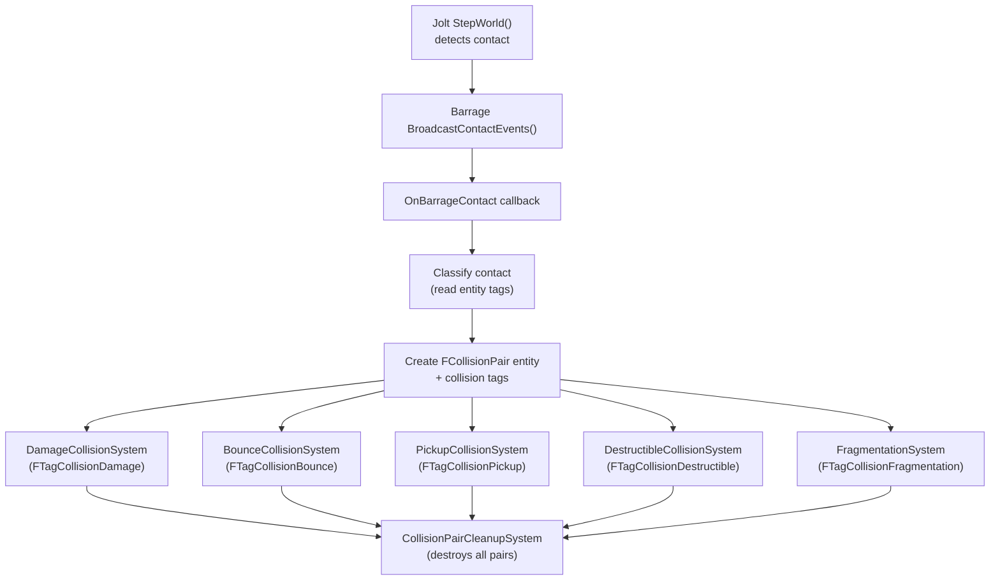

# Collision Pipeline

> Every physics contact in FatumGame flows through a unified pipeline: Jolt detects the contact, Barrage broadcasts it, the subsystem creates a Flecs collision pair entity with classification tags, domain systems process it, and a cleanup system destroys the pair at the end of the tick.

---

## Pipeline Overview



---

## Step 1: Contact Detection (Jolt)

During `StepWorld(DilatedDT)`, Jolt's narrow phase detects body-to-body contacts. Barrage registers a `ContactListener` that captures:

- `Body1` and `Body2` IDs
- Contact world position and normal
- Estimated separation or penetration depth

After `StepWorld` completes, `BroadcastContactEvents()` iterates all buffered contacts and fires the registered callback.

---

## Step 2: OnBarrageContact Callback

`UFlecsArtillerySubsystem::OnBarrageContact()` runs on the simulation thread. For each contact:

1. **Resolve Flecs entities** — Read `FBarragePrimitive::GetFlecsEntity()` (atomic uint64) for both bodies. If either returns 0, the contact is discarded (physics body exists but hasn't been bound to an ECS entity yet — race condition protection).

2. **Create collision pair** — A new Flecs entity is created with `FCollisionPair { EntityA, EntityB }`.

3. **Classify and tag** — The callback reads tags on both entities to determine the collision type:

```cpp
// Pseudocode — actual classification logic
if (A.has<FTagProjectile>() && B.has<FHealthStatic>())
{
    Pair.add<FTagCollisionDamage>();

    if (A.get<FProjectileStatic>()->MaxBounces > 0)
        Pair.add<FTagCollisionBounce>();

    if (B.has<FTagDestructible>())
    {
        Pair.add<FTagCollisionDestructible>();
        if (B.has<FDestructibleStatic>())
        {
            Pair.add<FTagCollisionFragmentation>();
            // Store impact data for FragmentationSystem
            FFragmentationData Data;
            Data.ImpactPoint = ContactPosition;
            Data.ImpactDirection = ContactNormal;
            Data.ImpactImpulse = EstimatedImpulse;
            Pair.set<FFragmentationData>(Data);
        }
    }
}
else if (A.has<FTagCharacter>() && B.has<FTagPickupable>())
{
    Pair.add<FTagCollisionPickup>();
}
```

4. **Fast-path kill** — Non-bouncing projectiles (`MaxBounces == 0`) that hit a valid target get `FTagDead` added immediately in the callback, skipping the full system pipeline. This prevents the projectile from generating additional contacts on the next tick.

!!! note
    A single collision pair can have **multiple tags**. For example, a projectile hitting a destructible wall gets both `FTagCollisionDamage` and `FTagCollisionFragmentation`.

---

## Step 3: Domain Systems Process Pairs

During `world.progress()`, each domain system queries for collision pairs with its specific tag:

### DamageCollisionSystem

**Tag:** `FTagCollisionDamage`

```
Read FDamageStatic from projectile (prefab inheritance)
Read FEquippedBy.OwnerEntityId from projectile
Skip if OwnerEntityId == TargetEntityId (self-damage prevention)
Target.obtain<FPendingDamage>().AddHit({Damage, DamageType})
Target.modified<FPendingDamage>()  → triggers DamageObserver
If !bBouncing: Projectile.add<FTagDead>()
```

### BounceCollisionSystem

**Tag:** `FTagCollisionBounce`

```
Increment FProjectileInstance.BounceCount
If BounceCount >= FProjectileStatic.MaxBounces:
    Projectile.add<FTagDead>()
```

!!! info
    Bounce grace period was removed from BounceCollisionSystem. The owner check in DamageCollisionSystem is sufficient to prevent self-damage. Grace period remains only in `ProjectileLifetimeSystem` for minimum-velocity protection.

### PickupCollisionSystem

**Tag:** `FTagCollisionPickup`

```
Identify character (FTagCharacter) and item (FTagPickupable)
Check FWorldItemInstance.CanBePickedUp() (grace timer must be 0)
Call PickupWorldItem(CharacterEntity, ItemEntity)
  → Routes to AddItemToContainerDirect
  → On success: Item.add<FTagDead>()
```

### DestructibleCollisionSystem

**Tag:** `FTagCollisionDestructible`

```
Target.add<FTagDead>()
```

Simple pass — the real work happens in FragmentationSystem.

### FragmentationSystem

**Tag:** `FTagCollisionFragmentation`

```
Read FFragmentationData (impact point, direction, impulse)
Invalidate FDestructibleStatic.Profile (prevent re-entry)
SetBodyObjectLayer(DEBRIS) immediately on intact body
For each fragment in DestructibleGeometry:
    Acquire body from FDebrisPool
    SetBodyPositionDirect(fragment world position)
    SetBodyObjectLayer(MOVING)
    Create Jolt FixedConstraint per adjacency edge
    If bAnchorToWorld: bottom fragments → constraint to Body::sFixedToWorld
Enqueue FPendingFragmentSpawn per fragment (sim→game for ISM)
```

---

## Step 4: Cleanup

`CollisionPairCleanupSystem` runs **last** in every tick. It queries all entities with `FCollisionPair` and calls `entity.destruct()` on each. This ensures:

- All domain systems see all pairs for the current tick
- No pairs leak across tick boundaries
- Pair entities don't accumulate in the Flecs world

---

## Collision Tags Reference

| Tag | Created When | Processed By | Action |
|-----|-------------|-------------|--------|
| `FTagCollisionDamage` | Projectile hits entity with health | DamageCollisionSystem | Queue damage, kill non-bouncing projectile |
| `FTagCollisionBounce` | Projectile hits surface, MaxBounces > 0 | BounceCollisionSystem | Increment bounce count, kill if over limit |
| `FTagCollisionPickup` | Character contacts pickupable item | PickupCollisionSystem | Transfer item to character's container |
| `FTagCollisionDestructible` | Projectile hits destructible entity | DestructibleCollisionSystem | Mark for death |
| `FTagCollisionFragmentation` | Projectile hits entity with FDestructibleStatic | FragmentationSystem | Spawn fragments, create constraints |
| `FTagCollisionCharacter` | Generic character-to-character contact | (unused — reserved) | — |

---

## Safety Mechanisms

### Self-Damage Prevention

DamageCollisionSystem checks `FEquippedBy.OwnerEntityId` on the projectile against the target entity ID. Projectiles never damage their owner.

### Spawn Race Protection

A projectile's physics body is created before its Flecs entity. During the 1-tick gap, Jolt may report contacts for a body with no ECS binding. `OnBarrageContact` checks `FBarragePrimitive::GetFlecsEntity() != 0` and discards contacts where either body has no Flecs entity.

### Re-Entry Protection

FragmentationSystem immediately nullifies `FDestructibleStatic.Profile` and moves the body to DEBRIS layer. This prevents multiple contacts on the same destructible from triggering fragmentation twice.

### Collision Layer Filtering

Aim raycasts use `FastExcludeObjectLayerFilter({PROJECTILE, ENEMYPROJECTILE, DEBRIS})` to prevent projectiles and dead bodies from blocking the player's aim.

---

## Rationale

**Why collision pairs as entities?**

Using a Flecs entity per contact decouples detection from resolution. Jolt contacts arrive in physics order, but gameplay processing needs deterministic ECS system order. The pair-entity pattern lets each domain system independently query and process its relevant contacts without caring about when they were detected.

Alternative approaches considered:

| Approach | Problem |
|----------|---------|
| Direct callback dispatch | Domain systems called in Jolt contact order, not ECS order. No deterministic replay. |
| Shared contact buffer (TArray) | All systems iterate the full buffer. No per-domain filtering. |
| Event queue per domain | More complex, more allocation, harder to handle multi-tag contacts. |

The entity-per-pair approach naturally supports multi-tag contacts (one pair can be both damage and fragmentation), uses Flecs' native query system for filtering, and is automatically cleaned up by a single cleanup system.
