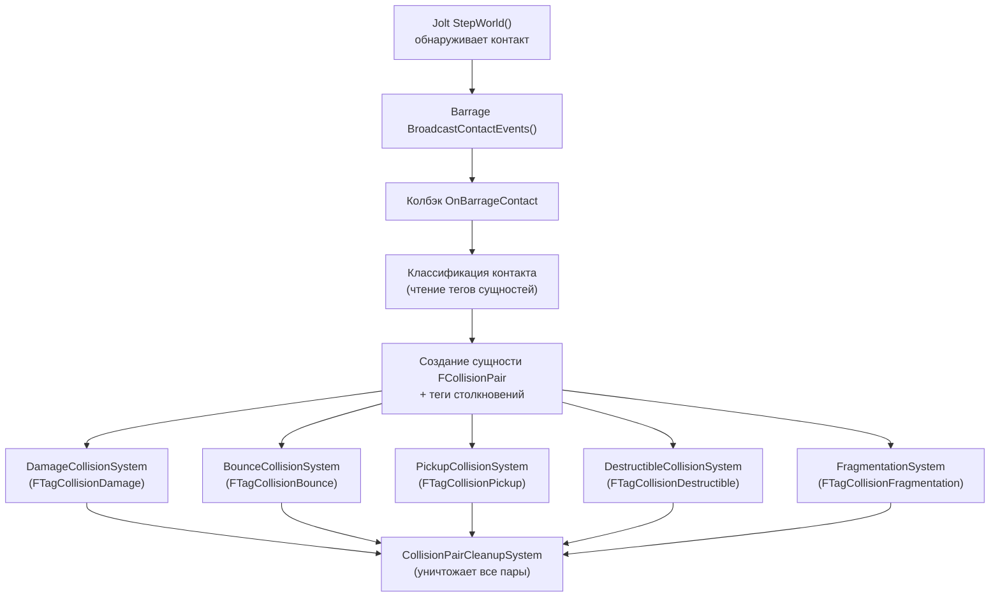

# Конвейер столкновений

> Каждый физический контакт в FatumGame проходит через единый конвейер: Jolt обнаруживает контакт, Barrage рассылает его, подсистема создаёт Flecs-сущность пары столкновений с тегами классификации, доменные системы обрабатывают пару, и система очистки уничтожает пару в конце тика.

---

## Обзор конвейера



---

## Шаг 1: Обнаружение контакта (Jolt)

Во время `StepWorld(DilatedDT)` узкая фаза Jolt обнаруживает контакты тело-к-телу. Barrage регистрирует `ContactListener`, который фиксирует:

- ID `Body1` и `Body2`
- Мировую позицию и нормаль контакта
- Оценочную глубину проникновения или разделения

После завершения `StepWorld`, `BroadcastContactEvents()` перебирает все буферизованные контакты и вызывает зарегистрированный колбэк.

---

## Шаг 2: Колбэк OnBarrageContact

`UFlecsArtillerySubsystem::OnBarrageContact()` выполняется в потоке симуляции. Для каждого контакта:

1. **Определение Flecs-сущностей** — Считывание `FBarragePrimitive::GetFlecsEntity()` (atomic uint64) для обоих тел. Если любое из них возвращает 0, контакт отбрасывается (физическое тело существует, но ещё не привязано к ECS-сущности — защита от race condition).

2. **Создание пары столкновений** — Создаётся новая Flecs-сущность с `FCollisionPair { EntityA, EntityB }`.

3. **Классификация и теги** — Колбэк считывает теги обеих сущностей для определения типа столкновения:

```cpp
// Псевдокод — фактическая логика классификации
if (A.has<FTagProjectile>() && B.has<FHealthStatic>())
{
    Pair.add<FTagCollisionDamage>();

    if (A.get<FProjectileStatic>()->MaxBounces > 0)
        Pair.add<FTagCollisionBounce>();

    if (B.has<FTagDestructible>())
    {
        Pair.add<FTagCollisionDestructible>();
        if (B.has<FDestructibleStatic>())
        {
            Pair.add<FTagCollisionFragmentation>();
            // Сохранение данных удара для FragmentationSystem
            FFragmentationData Data;
            Data.ImpactPoint = ContactPosition;
            Data.ImpactDirection = ContactNormal;
            Data.ImpactImpulse = EstimatedImpulse;
            Pair.set<FFragmentationData>(Data);
        }
    }
}
else if (A.has<FTagCharacter>() && B.has<FTagPickupable>())
{
    Pair.add<FTagCollisionPickup>();
}
```

4. **Быстрое уничтожение** — Неотскакивающие снаряды (`MaxBounces == 0`), попавшие в валидную цель, получают `FTagDead` немедленно в колбэке, минуя полный конвейер систем. Это предотвращает генерацию дополнительных контактов снарядом на следующем тике.

!!! note "Примечание"
    Одна пара столкновений может иметь **несколько тегов**. Например, снаряд, попавший в разрушаемую стену, получает и `FTagCollisionDamage`, и `FTagCollisionFragmentation`.

---

## Шаг 3: Доменные системы обрабатывают пары

Во время `world.progress()` каждая доменная система запрашивает пары столкновений со своим конкретным тегом:

### DamageCollisionSystem

**Тег:** `FTagCollisionDamage`

```
Чтение FDamageStatic из снаряда (наследование prefab)
Чтение FEquippedBy.OwnerEntityId из снаряда
Пропуск, если OwnerEntityId == TargetEntityId (предотвращение самоповреждения)
Target.obtain<FPendingDamage>().AddHit({Damage, DamageType})
Target.modified<FPendingDamage>()  → запускает DamageObserver
Если !bBouncing: Projectile.add<FTagDead>()
```

### BounceCollisionSystem

**Тег:** `FTagCollisionBounce`

```
Увеличение FProjectileInstance.BounceCount
Если BounceCount >= FProjectileStatic.MaxBounces:
    Projectile.add<FTagDead>()
```

!!! info "Информация"
    Грейс-период отскока был удалён из BounceCollisionSystem. Проверки владельца в DamageCollisionSystem достаточно для предотвращения самоповреждения. Грейс-период остаётся только в `ProjectileLifetimeSystem` для защиты от минимальной скорости.

### PickupCollisionSystem

**Тег:** `FTagCollisionPickup`

```
Определение персонажа (FTagCharacter) и предмета (FTagPickupable)
Проверка FWorldItemInstance.CanBePickedUp() (таймер грейса должен быть 0)
Вызов PickupWorldItem(CharacterEntity, ItemEntity)
  → Маршрутизация в AddItemToContainerDirect
  → При успехе: Item.add<FTagDead>()
```

### DestructibleCollisionSystem

**Тег:** `FTagCollisionDestructible`

```
Target.add<FTagDead>()
```

Простой проход — основная работа происходит в FragmentationSystem.

### FragmentationSystem

**Тег:** `FTagCollisionFragmentation`

```
Чтение FFragmentationData (точка удара, направление, импульс)
Обнуление FDestructibleStatic.Profile (предотвращение повторного входа)
Немедленно SetBodyObjectLayer(DEBRIS) на целом теле
Для каждого фрагмента в DestructibleGeometry:
    Получение тела из FDebrisPool
    SetBodyPositionDirect(мировая позиция фрагмента)
    SetBodyObjectLayer(MOVING)
    Создание Jolt FixedConstraint на каждое ребро смежности
    Если bAnchorToWorld: нижние фрагменты → ограничение к Body::sFixedToWorld
Постановка FPendingFragmentSpawn на каждый фрагмент (sim→game для ISM)
```

---

## Шаг 4: Очистка

`CollisionPairCleanupSystem` выполняется **последним** в каждом тике. Он запрашивает все сущности с `FCollisionPair` и вызывает `entity.destruct()` на каждой. Это гарантирует:

- Все доменные системы видят все пары текущего тика
- Пары не просачиваются через границы тиков
- Сущности пар не накапливаются в Flecs world

---

## Справочник тегов столкновений

| Тег | Создаётся когда | Обрабатывается | Действие |
|-----|-----------------|---------------|----------|
| `FTagCollisionDamage` | Снаряд попадает в сущность со здоровьем | DamageCollisionSystem | Поставить урон в очередь, убить неотскакивающий снаряд |
| `FTagCollisionBounce` | Снаряд попадает в поверхность, MaxBounces > 0 | BounceCollisionSystem | Увеличить счётчик отскоков, убить при превышении лимита |
| `FTagCollisionPickup` | Персонаж касается подбираемого предмета | PickupCollisionSystem | Передать предмет в контейнер персонажа |
| `FTagCollisionDestructible` | Снаряд попадает в разрушаемую сущность | DestructibleCollisionSystem | Пометить для уничтожения |
| `FTagCollisionFragmentation` | Снаряд попадает в сущность с FDestructibleStatic | FragmentationSystem | Заспавнить фрагменты, создать ограничения |
| `FTagCollisionCharacter` | Общий контакт персонаж-к-персонажу | (не используется — зарезервирован) | — |

---

## Механизмы безопасности

### Предотвращение самоповреждения

DamageCollisionSystem проверяет `FEquippedBy.OwnerEntityId` на снаряде против ID целевой сущности. Снаряды никогда не наносят урон своему владельцу.

### Защита от race condition при спавне

Физическое тело снаряда создаётся до его Flecs-сущности. Во время промежутка в 1 тик Jolt может сообщать о контактах для тела без ECS-привязки. `OnBarrageContact` проверяет `FBarragePrimitive::GetFlecsEntity() != 0` и отбрасывает контакты, где любое из тел не имеет Flecs-сущности.

### Защита от повторного входа

FragmentationSystem немедленно обнуляет `FDestructibleStatic.Profile` и перемещает тело в слой DEBRIS. Это предотвращает многократную активацию фрагментации от множественных контактов с одним и тем же разрушаемым объектом.

### Фильтрация слоёв столкновений

Рейкасты прицеливания используют `FastExcludeObjectLayerFilter({PROJECTILE, ENEMYPROJECTILE, DEBRIS})`, чтобы снаряды и мёртвые тела не блокировали прицел игрока.

---

## Обоснование

**Зачем пары столкновений как сущности?**

Использование Flecs-сущности на каждый контакт отделяет обнаружение от обработки. Контакты Jolt поступают в порядке физики, но игровая обработка требует детерминированного порядка ECS-систем. Паттерн сущностей-пар позволяет каждой доменной системе независимо запрашивать и обрабатывать относящиеся к ней контакты, не заботясь о том, когда они были обнаружены.

Рассмотренные альтернативы:

| Подход | Проблема |
|--------|----------|
| Прямая диспетчеризация колбэков | Доменные системы вызываются в порядке контактов Jolt, а не ECS. Нет детерминированного воспроизведения. |
| Общий буфер контактов (TArray) | Все системы итерируют полный буфер. Нет фильтрации по доменам. |
| Очередь событий на домен | Сложнее, больше аллокаций, труднее обрабатывать контакты с множественными тегами. |

Подход «сущность на пару» естественно поддерживает контакты с множественными тегами (одна пара может быть одновременно и уроном, и фрагментацией), использует нативную систему запросов Flecs для фильтрации и автоматически очищается одной системой очистки.
