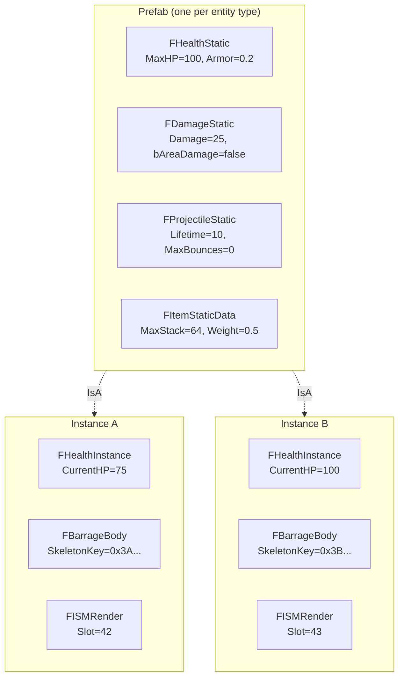

# ECS Patterns

> FatumGame uses Flecs for all gameplay data — health, damage, items, weapons, movement. This page covers the core ECS patterns: prefab inheritance, Static/Instance split, tags, observers, and the critical pitfalls of deferred operations.

---

## Prefab Inheritance (Static/Instance)

Every entity type has a **prefab** (shared static data) and **instances** (per-entity mutable data). Instances inherit from the prefab via Flecs `IsA` relationship.



**Why this pattern:**

- Static data (max HP, damage values, mesh reference) is stored once per entity type, not per instance
- Flecs `IsA` inheritance means instances automatically see all prefab components without copying them
- Instance components (current HP, physics body key) are stored per-entity and override or supplement prefab data
- Changing a prefab value instantly affects all instances that haven't overridden it

### Prefab Creation

Prefabs are created lazily on first spawn of each entity type:

```cpp
// Inside GetOrCreateEntityPrefab() — sim thread only
flecs::entity Prefab = World.prefab()
    .set<FHealthStatic>({ Def->HealthProfile->MaxHealth, Def->HealthProfile->Armor, ... })
    .set<FDamageStatic>({ Def->DamageProfile->Damage, ... })
    .set<FProjectileStatic>({ Def->ProjectileProfile->Lifetime, ... });

// Stored in TMap<UFlecsEntityDefinition*, flecs::entity> EntityPrefabs
```

### Instance Creation

```cpp
// Inside EnqueueCommand callback — sim thread
flecs::entity Entity = World.entity()
    .is_a(Prefab)                    // Inherit all static components
    .set<FBarrageBody>({ BarrageKey })
    .set<FISMRender>({ Mesh, Slot })
    .add<FTagProjectile>();          // Zero-size tag

// Instance-specific mutable data
FHealthInstance Health;
Health.CurrentHP = MaxHP;
Entity.set<FHealthInstance>(Health);
```

---

## Component Categories

### Static Components (Prefab-Level)

Read-only shared data. Set once on the prefab, inherited by all instances.

| Component | Domain | Key Fields |
|-----------|--------|-----------|
| `FHealthStatic` | Health | MaxHP, Armor, RegenPerSecond, bDestroyOnDeath |
| `FDamageStatic` | Damage | Damage, DamageType, bAreaDamage, AreaRadius, bDestroyOnHit |
| `FProjectileStatic` | Projectile | MaxLifetime, MaxBounces, GracePeriodFrames, MinVelocity |
| `FWeaponStatic` | Weapon | FireRate, MagCapacity, ReloadTime, MuzzleOffset, BloomDecay |
| `FItemStaticData` | Item | TypeId, MaxStack, Weight, GridSize, EntityDefinition* |
| `FContainerStatic` | Container | Type, GridWidth, GridHeight, MaxItems, MaxWeight |
| `FInteractionStatic` | Interaction | MaxRange, bSingleUse, InteractionType |
| `FDestructibleStatic` | Destructible | Profile*, ConstraintBreakForce, bAnchorToWorld |
| `FDoorStatic` | Door | HingeOffset, OpenAngle, CloseAngle, AngularDamping |
| `FExplosionStatic` | Explosion | Radius, BaseDamage, ImpulseStrength, DamageFalloff, ImpulseFalloff, VerticalBias |
| `FMovementStatic` | Movement | WalkSpeed, SprintSpeed, JumpVelocity, GravityScale |

### Instance Components (Per-Entity)

Mutable data unique to each entity. Created when the entity spawns.

| Component | Domain | Key Fields |
|-----------|--------|-----------|
| `FHealthInstance` | Health | CurrentHP, RegenAccumulator |
| `FProjectileInstance` | Projectile | LifetimeRemaining, BounceCount, GraceFramesRemaining |
| `FWeaponInstance` | Weapon | CurrentMag, CurrentReserve, FireCooldown, bReloading, CurrentBloom |
| `FItemInstance` | Item | Count |
| `FContainerInstance` | Container | CurrentWeight, CurrentCount, OwnerEntityId |
| `FContainerGridInstance` | Container | OccupancyMask (bit-packed 2D grid) |
| `FDoorInstance` | Door | CurrentAngle, AngularVelocity, DoorState, AutoCloseTimer |
| `FWorldItemInstance` | Item | DespawnTimer, PickupGraceTimer |
| `FDebrisInstance` | Destructible | LifetimeRemaining, PoolSlotIndex, FreeMassKg |
| `FBarrageBody` | Binding | SkeletonKey (forward link to physics body) |
| `FISMRender` | Rendering | Mesh, Material, ISM slot index |

### Binding Components

Link the entity to external systems (physics, rendering):

| Component | Links To | Access Pattern |
|-----------|----------|---------------|
| `FBarrageBody` | Jolt physics body | `entity.get<FBarrageBody>()->SkeletonKey` |
| `FISMRender` | ISM instance slot | Used by `UFlecsRenderManager` |
| `FEquippedBy` | Owner entity | `OwnerEntityId` for self-damage prevention |
| `FContainedIn` | Parent container | `ContainerEntityId`, `GridPosition`, `SlotIndex` |
| `FAimDirection` | Camera aim state | Written by `FLateSyncBridge`, read by `WeaponFireSystem` |
| `FEntityDefinitionRef` | Data asset | For runtime profile lookups (interaction prompt text) |

### Tags (Zero-Size Components)

Tags are empty structs used for filtering and classification. They cost zero memory per entity.

| Tag | Purpose |
|-----|---------|
| `FTagProjectile` | Entity is a projectile |
| `FTagCharacter` | Entity is a character |
| `FTagItem` | Entity is an item |
| `FTagDroppedItem` | Item was dropped by a player |
| `FTagContainer` | Entity is a container |
| `FTagPickupable` | Item can be picked up |
| `FTagInteractable` | Entity supports interaction |
| `FTagDestructible` | Entity can be destroyed by damage |
| `FTagDead` | Entity is marked for cleanup |
| `FTagHasLoot` | Entity has a loot table |
| `FTagEquipment` | Item is equippable |
| `FTagConsumable` | Item is consumable |
| `FTagDebrisFragment` | Entity is a debris fragment from destruction |
| `FTagWeapon` | Entity is a weapon |
| `FTagDoor` | Entity is a door |
| `FTagDoorTrigger` | Entity is a door trigger |
| `FTagTelekinesisHeld` | Entity is held by telekinesis |
| `FTagStealthLight` | Entity is a stealth light source |
| `FTagNoiseZone` | Entity is a noise zone |
| `FTagDetonate` | Projectile marked for detonation (ExplosionSystem) |

### Collision Tags

Temporary tags placed on `FCollisionPair` entities to route them to the correct domain system:

| Tag | Routed To |
|-----|-----------|
| `FTagCollisionDamage` | DamageCollisionSystem |
| `FTagCollisionBounce` | BounceCollisionSystem |
| `FTagCollisionPickup` | PickupCollisionSystem |
| `FTagCollisionDestructible` | DestructibleCollisionSystem |
| `FTagCollisionFragmentation` | FragmentationSystem |
| `FTagCollisionCharacter` | Generic character contact |

---

## Systems vs Observers

### Systems (Scheduled)

Systems run every tick during `world.progress()` in registration order:

```cpp
// Registration in SetupFlecsSystems()
World.system<FProjectileInstance>("ProjectileLifetimeSystem")
    .with<FTagProjectile>()
    .each([](flecs::entity E, FProjectileInstance& Proj)
    {
        Proj.LifetimeRemaining -= E.delta_time();
        if (Proj.LifetimeRemaining <= 0.f)
            E.add<FTagDead>();
    });
```

### Observers (Reactive)

Observers fire immediately when a specific event occurs (component set, added, removed):

```cpp
// DamageObserver — fires when FPendingDamage is set or modified
World.observer<FPendingDamage>("DamageObserver")
    .event(flecs::OnSet)
    .each([](flecs::entity E, FPendingDamage& Pending)
    {
        auto* Health = E.try_get_mut<FHealthInstance>();
        if (!Health) return;

        for (const FDamageHit& Hit : Pending.Hits)
        {
            float Effective = Hit.Damage * (1.f - E.get<FHealthStatic>()->Armor);
            Health->CurrentHP -= Effective;
        }
        E.remove<FPendingDamage>();
    });
```

!!! note
    `DamageObserver` is the only observer in the project. All other gameplay logic uses scheduled systems. Observers are reserved for cases where immediate reaction is essential (damage must be applied before `DeathCheckSystem` runs in the same tick).

### `.run()` vs `.each()` Systems

| Pattern | Use When | Auto-Drain |
|---------|----------|------------|
| `.each(callback)` | Simple per-entity iteration | Yes (Flecs handles iterator) |
| `.run(callback)` with query terms | Manual iteration, early exit needed | **No** — you MUST drain or `fini()` |
| `.run(callback)` without query terms | Singleton logic, no matching entities | Yes (MatchNothing auto-fini) |

!!! danger "Iterator Leak"
    `.run()` systems **with query terms** must either drain the iterator (`while (It.next()) { ... }`) or call `It.fini()` on early exit. Failing to do so leaks Flecs stack memory and triggers `ECS_LEAK_DETECTED` on PIE exit.

---

## USTRUCT Rules

All ECS components are `USTRUCT(BlueprintType)` with `GENERATED_BODY()`. This enables UE reflection but introduces constraints:

### No Aggregate Initialization

`GENERATED_BODY()` adds hidden members that break aggregate initialization:

```cpp
// WRONG — compiler error or undefined behavior
entity.set<FHealthInstance>({ 100.f });

// CORRECT — named field assignment
FHealthInstance Health;
Health.CurrentHP = 100.f;
entity.set<FHealthInstance>(Health);
```

### Component Registration Order

All components must be registered with Flecs **before** any system that references them:

```cpp
void RegisterFlecsComponents()
{
    World.component<FHealthStatic>();
    World.component<FHealthInstance>();
    World.component<FDamageStatic>();
    // ... ~50 components registered here
}

void SetupFlecsSystems()
{
    RegisterFlecsComponents();  // MUST come first
    // Now safe to reference components in system declarations
}
```

---

## Deferred Operations — Three Critical Cases

Flecs defers mutations (add, set, remove) during system execution and applies them at merge points between phases. This creates three subtle bugs:

### Case 1: Between `.run()` Systems

`.run()` systems don't declare component access, so Flecs skips the merge between them. A `set<T>()` in System A is invisible to System B in the same tick.

```cpp
// System A (.run)
entity.set<FMyData>({ 42 });

// System B (.run) — same tick
auto* Data = entity.try_get<FMyData>();
// Data is nullptr! The set is still deferred.
```

**Fix:** Use a direct subsystem buffer (`TArray` member variable) instead of Flecs components for inter-system data passing.

### Case 2: Within the Same System

`entity.obtain<T>()` writes to deferred staging, but `entity.try_get<T>()` reads committed storage:

```cpp
// Inside one system callback
entity.obtain<FPendingDamage>().Hits.Add(Hit);  // Deferred write
auto* Pending = entity.try_get<FPendingDamage>(); // Reads committed
// Pending is nullptr if FPendingDamage didn't exist before!
```

**Fix:** Track state in local variables instead of re-reading from Flecs.

### Case 3: Cross-Entity Tags

Adding a tag to a *different* entity inside `.each()` is deferred. If the writing system doesn't declare access to that tag, Flecs won't merge before the next system that queries it:

```cpp
// FragmentationSystem
IntactEntity.add<FTagDead>();  // Deferred!

// DeadEntityCleanupSystem (runs later, same tick)
// Query: .with<FTagDead>()
// Result: IntactEntity is NOT matched — tag is still deferred
```

**Fix:** Perform critical side effects immediately (e.g., `SetBodyObjectLayer(DEBRIS)`) rather than relying on a tag that a later system will read.

---

## Flecs API Quick Reference

| Method | Returns | If Missing | Thread Safety | Use When |
|--------|---------|------------|--------------|----------|
| `try_get<T>()` | `const T*` | `nullptr` | Read-only | Read, component might not exist |
| `get<T>()` | `const T&` | **ASSERT** | Read-only | Read, guaranteed to exist |
| `try_get_mut<T>()` | `T*` | `nullptr` | Read-write | Write, component might not exist |
| `get_mut<T>()` | `T&` | **ASSERT** | Read-write | Write, guaranteed to exist |
| `obtain<T>()` | `T&` | **Creates** | Read-write (deferred) | Write, create if missing |
| `set<T>(val)` | `entity&` | **Creates** | Write (deferred) | Set value, create if missing |
| `add<T>()` | `entity&` | No-op if exists | Write (deferred) | Add tag or empty component |
| `remove<T>()` | `entity&` | No-op if missing | Write (deferred) | Remove component |
| `has<T>()` | `bool` | `false` | Read-only | Check existence |

!!! tip "Tag Query Pattern"
    Never pass zero-size tags as typed `const T&` parameters to `World.each()`. Flecs will assert because tags have no data to reference. Instead, use the query builder:

    ```cpp
    // WRONG — crashes with ecs_field_w_size assertion
    World.each([](flecs::entity E, const FTagDead&) { ... });

    // CORRECT — filter by tag, access via entity
    World.query_builder()
        .with<FTagDead>()
        .build()
        .each([](flecs::entity E) {
            if (E.has<FTagProjectile>()) { /* ... */ }
        });
    ```
