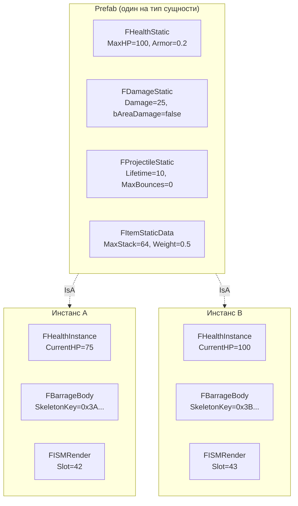

# Паттерны ECS

> FatumGame использует Flecs для всех игровых данных — здоровье, урон, предметы, оружие, движение. Эта страница описывает основные ECS-паттерны: наследование от prefab, разделение Static/Instance, теги, наблюдатели и критические подводные камни отложенных операций.

---

## Наследование от Prefab (Static/Instance)

Каждый тип сущности имеет **prefab** (общие статические данные) и **инстансы** (изменяемые данные для каждой сущности). Инстансы наследуют от prefab через отношение Flecs `IsA`.



**Зачем этот паттерн:**

- Статические данные (макс. HP, значения урона, ссылка на меш) хранятся один раз на тип сущности, а не на каждый инстанс
- Наследование Flecs `IsA` означает, что инстансы автоматически видят все компоненты prefab без их копирования
- Instance-компоненты (текущее HP, ключ физического тела) хранятся для каждой сущности и переопределяют или дополняют данные prefab
- Изменение значения в prefab мгновенно влияет на все инстансы, которые не переопределили его

### Создание Prefab

Prefab создаются лениво при первом спавне каждого типа сущности:

```cpp
// Внутри GetOrCreateEntityPrefab() — только поток симуляции
flecs::entity Prefab = World.prefab()
    .set<FHealthStatic>({ Def->HealthProfile->MaxHealth, Def->HealthProfile->Armor, ... })
    .set<FDamageStatic>({ Def->DamageProfile->Damage, ... })
    .set<FProjectileStatic>({ Def->ProjectileProfile->Lifetime, ... });

// Сохраняется в TMap<UFlecsEntityDefinition*, flecs::entity> EntityPrefabs
```

### Создание инстанса

```cpp
// Внутри колбэка EnqueueCommand — поток симуляции
flecs::entity Entity = World.entity()
    .is_a(Prefab)                    // Наследование всех статических компонентов
    .set<FBarrageBody>({ BarrageKey })
    .set<FISMRender>({ Mesh, Slot })
    .add<FTagProjectile>();          // Тег нулевого размера

// Мутабельные данные конкретного инстанса
FHealthInstance Health;
Health.CurrentHP = MaxHP;
Entity.set<FHealthInstance>(Health);
```

---

## Категории компонентов

### Статические компоненты (уровень Prefab)

Общие данные только для чтения. Задаются один раз на prefab, наследуются всеми инстансами.

| Компонент | Домен | Ключевые поля |
|-----------|-------|--------------|
| `FHealthStatic` | Здоровье | MaxHP, Armor, RegenPerSecond, bDestroyOnDeath |
| `FDamageStatic` | Урон | Damage, DamageType, bAreaDamage, AreaRadius, bDestroyOnHit |
| `FProjectileStatic` | Снаряд | MaxLifetime, MaxBounces, GracePeriodFrames, MinVelocity |
| `FWeaponStatic` | Оружие | FireRate, MagCapacity, ReloadTime, MuzzleOffset, BloomDecay |
| `FItemStaticData` | Предмет | TypeId, MaxStack, Weight, GridSize, EntityDefinition* |
| `FContainerStatic` | Контейнер | Type, GridWidth, GridHeight, MaxItems, MaxWeight |
| `FInteractionStatic` | Взаимодействие | MaxRange, bSingleUse, InteractionType |
| `FDestructibleStatic` | Разрушаемый | Profile*, ConstraintBreakForce, bAnchorToWorld |
| `FDoorStatic` | Дверь | HingeOffset, OpenAngle, CloseAngle, AngularDamping |
| `FExplosionStatic` | Взрыв | Radius, BaseDamage, ImpulseStrength, DamageFalloff, ImpulseFalloff, VerticalBias |
| `FMovementStatic` | Движение | WalkSpeed, SprintSpeed, JumpVelocity, GravityScale |

### Instance-компоненты (для каждой сущности)

Мутабельные данные, уникальные для каждой сущности. Создаются при спавне.

| Компонент | Домен | Ключевые поля |
|-----------|-------|--------------|
| `FHealthInstance` | Здоровье | CurrentHP, RegenAccumulator |
| `FProjectileInstance` | Снаряд | LifetimeRemaining, BounceCount, GraceFramesRemaining |
| `FWeaponInstance` | Оружие | CurrentMag, CurrentReserve, FireCooldown, bReloading, CurrentBloom |
| `FItemInstance` | Предмет | Count |
| `FContainerInstance` | Контейнер | CurrentWeight, CurrentCount, OwnerEntityId |
| `FContainerGridInstance` | Контейнер | OccupancyMask (бит-упакованная 2D сетка) |
| `FDoorInstance` | Дверь | CurrentAngle, AngularVelocity, DoorState, AutoCloseTimer |
| `FWorldItemInstance` | Предмет | DespawnTimer, PickupGraceTimer |
| `FDebrisInstance` | Разрушаемый | LifetimeRemaining, PoolSlotIndex, FreeMassKg |
| `FBarrageBody` | Привязка | SkeletonKey (прямая ссылка на физическое тело) |
| `FISMRender` | Рендеринг | Mesh, Material, индекс ISM-слота |

### Компоненты привязки

Связывают сущность с внешними системами (физика, рендеринг):

| Компонент | Связан с | Паттерн доступа |
|-----------|---------|----------------|
| `FBarrageBody` | Физическое тело Jolt | `entity.get<FBarrageBody>()->SkeletonKey` |
| `FISMRender` | ISM-инстанс | Используется `UFlecsRenderManager` |
| `FEquippedBy` | Сущность-владелец | `OwnerEntityId` для предотвращения самоповреждения |
| `FContainedIn` | Родительский контейнер | `ContainerEntityId`, `GridPosition`, `SlotIndex` |
| `FAimDirection` | Состояние прицеливания камеры | Записывается `FLateSyncBridge`, считывается `WeaponFireSystem` |
| `FEntityDefinitionRef` | Data Asset | Для поиска профилей в рантайме (текст подсказки взаимодействия) |

### Теги (компоненты нулевого размера)

Теги — пустые структуры, используемые для фильтрации и классификации. Занимают ноль памяти на сущность.

| Тег | Назначение |
|-----|-----------|
| `FTagProjectile` | Сущность является снарядом |
| `FTagCharacter` | Сущность является персонажем |
| `FTagItem` | Сущность является предметом |
| `FTagDroppedItem` | Предмет был выброшен игроком |
| `FTagContainer` | Сущность является контейнером |
| `FTagPickupable` | Предмет можно подобрать |
| `FTagInteractable` | Сущность поддерживает взаимодействие |
| `FTagDestructible` | Сущность может быть уничтожена уроном |
| `FTagDead` | Сущность помечена для очистки |
| `FTagHasLoot` | Сущность имеет таблицу лута |
| `FTagEquipment` | Предмет можно экипировать |
| `FTagConsumable` | Предмет расходуемый |
| `FTagDebrisFragment` | Сущность — фрагмент обломков после разрушения |
| `FTagWeapon` | Сущность является оружием |
| `FTagDoor` | Сущность является дверью |
| `FTagDoorTrigger` | Сущность является триггером двери |
| `FTagTelekinesisHeld` | Сущность удерживается телекинезом |
| `FTagStealthLight` | Сущность — источник света для стелса |
| `FTagNoiseZone` | Сущность — зона шума |
| `FTagDetonate` | Снаряд помечен для детонации (ExplosionSystem) |

### Теги столкновений

Временные теги, размещаемые на сущностях `FCollisionPair` для маршрутизации к правильной доменной системе:

| Тег | Обрабатывается |
|-----|---------------|
| `FTagCollisionDamage` | DamageCollisionSystem |
| `FTagCollisionBounce` | BounceCollisionSystem |
| `FTagCollisionPickup` | PickupCollisionSystem |
| `FTagCollisionDestructible` | DestructibleCollisionSystem |
| `FTagCollisionFragmentation` | FragmentationSystem |
| `FTagCollisionCharacter` | Общий контакт персонажей |

---

## Системы и наблюдатели

### Системы (запланированные)

Системы выполняются каждый тик во время `world.progress()` в порядке регистрации:

```cpp
// Регистрация в SetupFlecsSystems()
World.system<FProjectileInstance>("ProjectileLifetimeSystem")
    .with<FTagProjectile>()
    .each([](flecs::entity E, FProjectileInstance& Proj)
    {
        Proj.LifetimeRemaining -= E.delta_time();
        if (Proj.LifetimeRemaining <= 0.f)
            E.add<FTagDead>();
    });
```

### Наблюдатели (реактивные)

Наблюдатели срабатывают немедленно при возникновении определённого события (установка, добавление, удаление компонента):

```cpp
// DamageObserver — срабатывает при установке или изменении FPendingDamage
World.observer<FPendingDamage>("DamageObserver")
    .event(flecs::OnSet)
    .each([](flecs::entity E, FPendingDamage& Pending)
    {
        auto* Health = E.try_get_mut<FHealthInstance>();
        if (!Health) return;

        for (const FDamageHit& Hit : Pending.Hits)
        {
            float Effective = Hit.Damage * (1.f - E.get<FHealthStatic>()->Armor);
            Health->CurrentHP -= Effective;
        }
        E.remove<FPendingDamage>();
    });
```

!!! note "Примечание"
    `DamageObserver` — единственный наблюдатель в проекте. Вся остальная игровая логика использует запланированные системы. Наблюдатели зарезервированы для случаев, когда необходима немедленная реакция (урон должен быть применён до того, как `DeathCheckSystem` выполнится в том же тике).

### Системы `.run()` и `.each()`

| Паттерн | Когда использовать | Автоматический drain |
|---------|-------------------|---------------------|
| `.each(callback)` | Простая итерация по сущностям | Да (Flecs управляет итератором) |
| `.run(callback)` с query terms | Ручная итерация, нужен ранний выход | **Нет** — вы ОБЯЗАНЫ drain или вызвать `fini()` |
| `.run(callback)` без query terms | Синглтон-логика, без совпадающих сущностей | Да (MatchNothing auto-fini) |

!!! danger "Утечка итератора"
    Системы `.run()` **с query terms** должны либо полностью пройти итератор (`while (It.next()) { ... }`), либо вызвать `It.fini()` при раннем выходе. Иначе происходит утечка стековой памяти Flecs и срабатывает `ECS_LEAK_DETECTED` при выходе из PIE.

---

## Правила USTRUCT

Все ECS-компоненты — это `USTRUCT(BlueprintType)` с `GENERATED_BODY()`. Это включает рефлексию UE, но вводит ограничения:

### Нет агрегатной инициализации

`GENERATED_BODY()` добавляет скрытые члены, которые ломают агрегатную инициализацию:

```cpp
// НЕПРАВИЛЬНО — ошибка компиляции или неопределённое поведение
entity.set<FHealthInstance>({ 100.f });

// ПРАВИЛЬНО — именованное присваивание полей
FHealthInstance Health;
Health.CurrentHP = 100.f;
entity.set<FHealthInstance>(Health);
```

### Порядок регистрации компонентов

Все компоненты должны быть зарегистрированы в Flecs **до** любой системы, которая на них ссылается:

```cpp
void RegisterFlecsComponents()
{
    World.component<FHealthStatic>();
    World.component<FHealthInstance>();
    World.component<FDamageStatic>();
    // ... ~50 компонентов регистрируются здесь
}

void SetupFlecsSystems()
{
    RegisterFlecsComponents();  // ОБЯЗАТЕЛЬНО первым
    // Теперь безопасно ссылаться на компоненты в объявлениях систем
}
```

---

## Отложенные операции — три критических случая

Flecs откладывает мутации (add, set, remove) во время выполнения систем и применяет их в точках слияния между фазами. Это создаёт три тонких бага:

### Случай 1: Между системами `.run()`

Системы `.run()` не объявляют доступ к компонентам, поэтому Flecs пропускает слияние между ними. `set<T>()` в Системе A невидим для Системы B в том же тике.

```cpp
// Система A (.run)
entity.set<FMyData>({ 42 });

// Система B (.run) — тот же тик
auto* Data = entity.try_get<FMyData>();
// Data == nullptr! Операция set всё ещё отложена.
```

**Решение:** Используйте прямой буфер подсистемы (переменная-член `TArray`) вместо Flecs-компонентов для передачи данных между системами.

### Случай 2: Внутри одной системы

`entity.obtain<T>()` записывает в промежуточное хранилище, а `entity.try_get<T>()` читает из зафиксированного:

```cpp
// Внутри одного колбэка системы
entity.obtain<FPendingDamage>().Hits.Add(Hit);  // Отложенная запись
auto* Pending = entity.try_get<FPendingDamage>(); // Чтение зафиксированного
// Pending == nullptr, если FPendingDamage не существовал ранее!
```

**Решение:** Отслеживайте состояние в локальных переменных вместо повторного чтения из Flecs.

### Случай 3: Кросс-сущностные теги

Добавление тега на *другую* сущность внутри `.each()` откладывается. Если записывающая система не объявляет доступ к этому тегу, Flecs не выполнит слияние до следующей системы, которая его запрашивает:

```cpp
// FragmentationSystem
IntactEntity.add<FTagDead>();  // Отложено!

// DeadEntityCleanupSystem (выполняется позже, тот же тик)
// Запрос: .with<FTagDead>()
// Результат: IntactEntity НЕ совпадает — тег всё ещё отложен
```

**Решение:** Выполняйте критические побочные эффекты немедленно (например, `SetBodyObjectLayer(DEBRIS)`) вместо того, чтобы полагаться на тег, который прочитает более поздняя система.

---

## Краткий справочник Flecs API

| Метод | Возвращает | Если нет | Потокобезопасность | Когда использовать |
|-------|-----------|---------|-------------------|-------------------|
| `try_get<T>()` | `const T*` | `nullptr` | Только чтение | Чтение, компонент может не существовать |
| `get<T>()` | `const T&` | **ASSERT** | Только чтение | Чтение, гарантированно существует |
| `try_get_mut<T>()` | `T*` | `nullptr` | Чтение-запись | Запись, компонент может не существовать |
| `get_mut<T>()` | `T&` | **ASSERT** | Чтение-запись | Запись, гарантированно существует |
| `obtain<T>()` | `T&` | **Создаёт** | Чтение-запись (отложенно) | Запись, создать если нет |
| `set<T>(val)` | `entity&` | **Создаёт** | Запись (отложенно) | Задать значение, создать если нет |
| `add<T>()` | `entity&` | Нет эффекта если есть | Запись (отложенно) | Добавить тег или пустой компонент |
| `remove<T>()` | `entity&` | Нет эффекта если нет | Запись (отложенно) | Удалить компонент |
| `has<T>()` | `bool` | `false` | Только чтение | Проверить наличие |

!!! tip "Паттерн запросов с тегами"
    Никогда не передавайте теги нулевого размера как типизированные параметры `const T&` в `World.each()`. Flecs выдаст assert, потому что у тегов нет данных для ссылки. Вместо этого используйте query builder:

    ```cpp
    // НЕПРАВИЛЬНО — крэш с assert ecs_field_w_size
    World.each([](flecs::entity E, const FTagDead&) { ... });

    // ПРАВИЛЬНО — фильтрация по тегу, доступ через сущность
    World.query_builder()
        .with<FTagDead>()
        .build()
        .each([](flecs::entity E) {
            if (E.has<FTagProjectile>()) { /* ... */ }
        });
    ```
