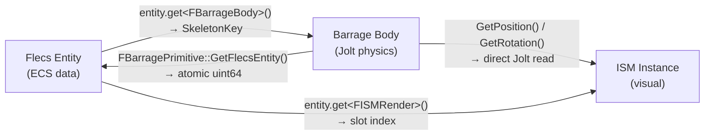
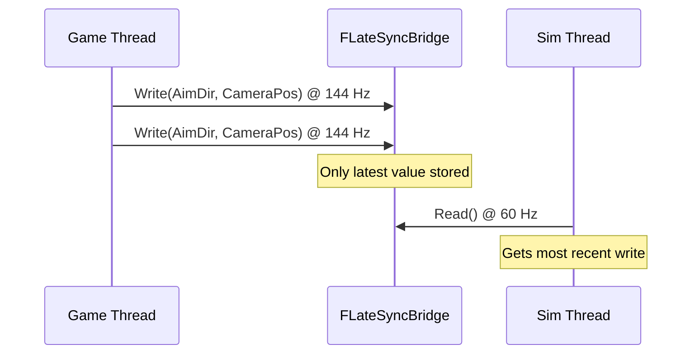
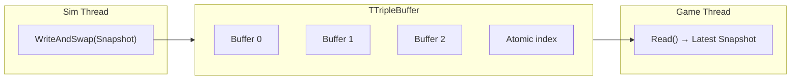

# Lock-Free Binding

> Every gameplay entity exists simultaneously in three systems: Flecs (ECS data), Barrage (physics body), and the Render Manager (ISM visual). This page describes the lock-free bidirectional binding that links them, plus the `FSimStateCache` and `FLateSyncBridge` for scalar data transfer.

---

## Entity ↔ Physics Binding



### Forward: Entity → Physics (O(1))

The Flecs entity holds an `FBarrageBody` component with the `SkeletonKey` of its Jolt physics body:

```cpp
FSkeletonKey PhysicsKey = entity.get<FBarrageBody>()->SkeletonKey;
TSharedPtr<FBarragePrimitive> Prim = BarrageDispatch->GetShapeRef(PhysicsKey);
```

### Reverse: Physics → Entity (O(1))

Each `FBarragePrimitive` stores the Flecs entity ID as an `std::atomic<uint64>`:

```cpp
// Set during binding (sim thread)
Prim->SetFlecsEntity(Entity.id());

// Read during collision callback (sim thread)
uint64 FlecsId = Prim->GetFlecsEntity();
if (FlecsId != 0)
{
    flecs::entity Entity = World.entity(FlecsId);
    // Process entity...
}
```

The atomic ensures safe reads from the collision callback thread while the sim thread may be writing during entity creation.

### Binding API

```cpp
// UFlecsArtillerySubsystem — sim thread only
void BindEntityToBarrage(flecs::entity Entity, FSkeletonKey BarrageKey);
void UnbindEntityFromBarrage(flecs::entity Entity);
flecs::entity GetEntityForBarrageKey(FSkeletonKey BarrageKey) const;
```

`BindEntityToBarrage` does three things:
1. Sets `FBarrageBody { BarrageKey }` on the Flecs entity
2. Stores entity ID in `FBarragePrimitive` via `SetFlecsEntity()`
3. Adds the mapping to `TranslationMapping` (SkeletonKey → Flecs entity)

`UnbindEntityFromBarrage` reverses all three operations, called during entity cleanup.

!!! warning "Two Lookup Paths"
    - `GetEntityForBarrageKey()` uses `TranslationMapping` (populated by `BindEntityToBarrage`)
    - `GetShapeRef()` uses Barrage's body tracking (populated by `CreatePrimitive`)

    **Pool bodies** (debris fragments) are created via `CreatePrimitive` but may not be in `TranslationMapping` until activated. Use `GetShapeRef(Key)->KeyIntoBarrage` for pool body lookups.

---

## SkeletonKey Type System

`FSkeletonKey` is a 64-bit integer with a nibble (4-bit) type tag in the most significant position:

```
┌──────┬──────────────────────────────────────────────────────────────┐
│ 0x3  │                    60-bit unique ID                         │  GUN_SHOT (projectile)
├──────┼──────────────────────────────────────────────────────────────┤
│ 0x4  │                    60-bit unique ID                         │  BAR_PRIM (generic body)
├──────┼──────────────────────────────────────────────────────────────┤
│ 0x5  │                    60-bit unique ID                         │  ART_ACTS (actor)
├──────┼──────────────────────────────────────────────────────────────┤
│ 0xC  │                    60-bit unique ID                         │  ITEM
└──────┴──────────────────────────────────────────────────────────────┘
```

The type nibble enables O(1) type dispatch without Flecs queries — the ISM tombstone cleanup path, for example, uses the nibble to determine whether to clean up projectile trails or generic ISM instances.

---

## FSimStateCache

A lock-free cache for delivering scalar gameplay state from the sim thread to the game thread (HUD display). Designed for zero-contention reads at high frequency.

### Architecture

```
┌──────────────────────────────────────────────────────────────────┐
│                     FSimStateCache (512 bytes)                   │
├─────────┬──────────────┬──────────────┬─────────────────────────┤
│  Slot   │ HealthPacked │ WeaponPacked │ ResourcePacked          │
│  (idx)  │ (uint64 atm) │ (uint64 atm) │ (uint64 atm)           │
├─────────┼──────────────┼──────────────┼─────────────────────────┤
│    0    │ HP|Max|Armor │ Ammo|Mag|Rsv │ Mana|Stam|Energy|Rage  │
│    1    │ HP|Max|Armor │ Ammo|Mag|Rsv │ Mana|Stam|Energy|Rage  │
│   ...   │     ...      │     ...      │       ...               │
│   15    │ HP|Max|Armor │ Ammo|Mag|Rsv │ Mana|Stam|Energy|Rage  │
└─────────┴──────────────┴──────────────┴─────────────────────────┘
```

Each slot is assigned to one character via `FindSlot(CharacterEntityId)`.

### Packing

Multiple values are bit-packed into a single `uint64` atomic for single-instruction read/write:

```cpp
namespace SimStatePacking
{
    // Health: 16-bit CurrentHP + 16-bit MaxHP + 16-bit Armor (×1000) + 16-bit reserved
    uint64 PackHealth(float CurrentHP, float MaxHP, float Armor)
    {
        uint64 Packed = 0;
        Packed |= static_cast<uint64>(FMath::Clamp(CurrentHP, 0.f, 65535.f)) & 0xFFFF;
        Packed |= (static_cast<uint64>(FMath::Clamp(MaxHP, 0.f, 65535.f)) & 0xFFFF) << 16;
        Packed |= (static_cast<uint64>(Armor * 1000.f) & 0xFFFF) << 32;
        return Packed;
    }

    FHealthSnapshot UnpackHealth(uint64 Packed)
    {
        return {
            .CurrentHP = static_cast<float>(Packed & 0xFFFF),
            .MaxHP = static_cast<float>((Packed >> 16) & 0xFFFF),
            .Armor = static_cast<float>((Packed >> 32) & 0xFFFF) / 1000.f
        };
    }
}
```

### Usage

```cpp
// Sim thread — inside a system or EnqueueCommand
StateCache.WriteHealth(SlotIndex, PackHealth(Health.CurrentHP, Static.MaxHP, Static.Armor));

// Game thread — HUD widget tick
FHealthSnapshot Snap = StateCache.ReadHealth(SlotIndex);
HealthBar->SetPercent(Snap.CurrentHP / Snap.MaxHP);
```

**Why not just read Flecs components from the game thread?** The Flecs world is owned by the sim thread. Reading components from the game thread would require synchronization. `FSimStateCache` eliminates this — the sim thread packs values into cache-line-aligned atomics that the game thread reads without any locking.

---

## FLateSyncBridge

A latest-value-wins bridge for data where only the most recent value matters:



### What It Carries

| Field | Type | Written By | Read By |
|-------|------|-----------|---------|
| Aim direction | `FVector` | `AFlecsCharacter::Tick()` | `ApplyLateSyncBuffers()` → `FAimDirection` |
| Camera world position | `FVector` | `AFlecsCharacter::Tick()` | `ApplyLateSyncBuffers()` → `FAimDirection` |
| Muzzle world position | `FVector` | `AFlecsCharacter::Tick()` | `ApplyLateSyncBuffers()` → `FAimDirection` |

### Why Not EnqueueCommand?

`EnqueueCommand` preserves all enqueued values in order. For aim direction, we don't want a queue of 2-3 stale aim positions from previous game frames — we want the single most recent aim. `FLateSyncBridge` provides exactly this: overwrite semantics with no allocation.

### Why Not Plain Atomics?

A single aim update involves three `FVector` values (9 floats). Writing them as individual atomics risks tearing — the sim thread could read aim direction from frame N but camera position from frame N+1. `FLateSyncBridge` uses a double-buffer with an atomic index swap to ensure all fields are consistent within a single read.

---

## Triple Buffer (UI Container State)

Container snapshots (inventory grid layouts) use a `TTripleBuffer` in `UFlecsUISubsystem`:



!!! danger "WriteAndSwap, NOT Write"
    `TTripleBuffer::Write()` does **not** set the dirty flag. Always use `WriteAndSwap()` — it writes the data AND atomically swaps the read index. Using `Write()` alone means the game thread will never see the update.

---

## Summary of Lock-Free Primitives

| Primitive | Direction | Semantics | Use Case |
|-----------|-----------|-----------|----------|
| MPSC Queue | Game → Sim | Ordered, all values preserved | Entity mutations (spawn, destroy, equip) |
| MPSC Queue | Sim → Game | Ordered, all values preserved | ISM spawn requests, VFX events |
| `FLateSyncBridge` | Game → Sim | Latest-value-wins, consistent multi-field | Aim direction, camera position |
| `FSimStateCache` | Sim → Game | Packed atomics, per-slot | Health, ammo, resources for HUD |
| `TTripleBuffer` | Sim → Game | Latest snapshot, zero-copy read | Container inventory state |
| Plain atomics | Bidirectional | Single scalar, latest value | Time dilation, sim timing, input state |
