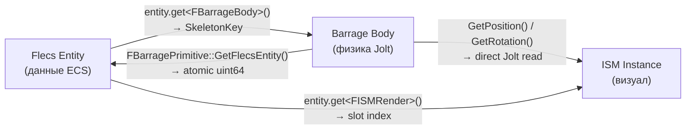
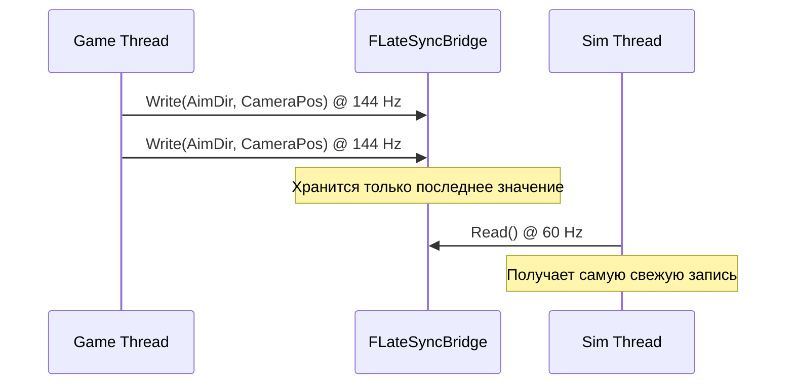
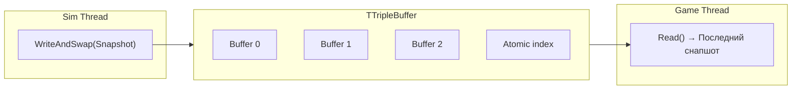

# Lock-Free привязка

> Каждая игровая сущность существует одновременно в трёх системах: Flecs (данные ECS), Barrage (физическое тело) и Render Manager (визуал ISM). Эта страница описывает lock-free двунаправленную привязку, связывающую их, а также `FSimStateCache` и `FLateSyncBridge` для передачи скалярных данных.

---

## Привязка Entity <-> Physics



### Прямая: Entity -> Physics (O(1))

Flecs-сущность содержит компонент `FBarrageBody` с `SkeletonKey` своего физического тела Jolt:

```cpp
FSkeletonKey PhysicsKey = entity.get<FBarrageBody>()->SkeletonKey;
TSharedPtr<FBarragePrimitive> Prim = BarrageDispatch->GetShapeRef(PhysicsKey);
```

### Обратная: Physics -> Entity (O(1))

Каждый `FBarragePrimitive` хранит ID Flecs-сущности как `std::atomic<uint64>`:

```cpp
// Установка при привязке (поток симуляции)
Prim->SetFlecsEntity(Entity.id());

// Чтение в колбэке столкновений (поток симуляции)
uint64 FlecsId = Prim->GetFlecsEntity();
if (FlecsId != 0)
{
    flecs::entity Entity = World.entity(FlecsId);
    // Обработка сущности...
}
```

Атомик обеспечивает безопасное чтение из потока колбэка столкновений, пока поток симуляции может выполнять запись во время создания сущности.

### API привязки

```cpp
// UFlecsArtillerySubsystem — только поток симуляции
void BindEntityToBarrage(flecs::entity Entity, FSkeletonKey BarrageKey);
void UnbindEntityFromBarrage(flecs::entity Entity);
flecs::entity GetEntityForBarrageKey(FSkeletonKey BarrageKey) const;
```

`BindEntityToBarrage` выполняет три действия:
1. Устанавливает `FBarrageBody { BarrageKey }` на Flecs-сущности
2. Сохраняет ID сущности в `FBarragePrimitive` через `SetFlecsEntity()`
3. Добавляет маппинг в `TranslationMapping` (SkeletonKey -> Flecs entity)

`UnbindEntityFromBarrage` отменяет все три операции, вызывается при очистке сущности.

!!! warning "Два пути поиска"
    - `GetEntityForBarrageKey()` использует `TranslationMapping` (заполняется `BindEntityToBarrage`)
    - `GetShapeRef()` использует отслеживание тел Barrage (заполняется `CreatePrimitive`)

    **Pool-тела** (фрагменты обломков) создаются через `CreatePrimitive`, но могут отсутствовать в `TranslationMapping` до активации. Используйте `GetShapeRef(Key)->KeyIntoBarrage` для поиска pool-тел.

---

## Типовая система SkeletonKey

`FSkeletonKey` — 64-битное целое число с типовым nibble (4 бита) в старшей позиции:

```
┌──────┬──────────────────────────────────────────────────────────────┐
│ 0x3  │                    60-bit unique ID                         │  GUN_SHOT (снаряд)
├──────┼──────────────────────────────────────────────────────────────┤
│ 0x4  │                    60-bit unique ID                         │  BAR_PRIM (общее тело)
├──────┼──────────────────────────────────────────────────────────────┤
│ 0x5  │                    60-bit unique ID                         │  ART_ACTS (актор)
├──────┼──────────────────────────────────────────────────────────────┤
│ 0xC  │                    60-bit unique ID                         │  ITEM
└──────┴──────────────────────────────────────────────────────────────┘
```

Типовой nibble обеспечивает O(1) диспетчеризацию по типу без запросов Flecs — например, путь очистки ISM при tombstone использует nibble для определения, нужно ли очищать трейлы снарядов или обычные ISM-инстансы.

---

## FSimStateCache

Lock-free кэш для доставки скалярного игрового состояния из потока симуляции в game thread (отображение HUD). Спроектирован для чтения без конкуренции на высокой частоте.

### Архитектура

```
┌──────────────────────────────────────────────────────────────────┐
│                     FSimStateCache (512 байт)                    │
├─────────┬──────────────┬──────────────┬─────────────────────────┤
│  Слот   │ HealthPacked │ WeaponPacked │ ResourcePacked          │
│  (idx)  │ (uint64 atm) │ (uint64 atm) │ (uint64 atm)           │
├─────────┼──────────────┼──────────────┼─────────────────────────┤
│    0    │ HP|Max|Armor │ Ammo|Mag|Rsv │ Mana|Stam|Energy|Rage  │
│    1    │ HP|Max|Armor │ Ammo|Mag|Rsv │ Mana|Stam|Energy|Rage  │
│   ...   │     ...      │     ...      │       ...               │
│   15    │ HP|Max|Armor │ Ammo|Mag|Rsv │ Mana|Stam|Energy|Rage  │
└─────────┴──────────────┴──────────────┴─────────────────────────┘
```

Каждый слот назначается одному персонажу через `FindSlot(CharacterEntityId)`.

### Упаковка

Несколько значений бит-упаковываются в один атомарный `uint64` для чтения/записи одной инструкцией:

```cpp
namespace SimStatePacking
{
    // Здоровье: 16-бит CurrentHP + 16-бит MaxHP + 16-бит Armor (×1000) + 16-бит резерв
    uint64 PackHealth(float CurrentHP, float MaxHP, float Armor)
    {
        uint64 Packed = 0;
        Packed |= static_cast<uint64>(FMath::Clamp(CurrentHP, 0.f, 65535.f)) & 0xFFFF;
        Packed |= (static_cast<uint64>(FMath::Clamp(MaxHP, 0.f, 65535.f)) & 0xFFFF) << 16;
        Packed |= (static_cast<uint64>(Armor * 1000.f) & 0xFFFF) << 32;
        return Packed;
    }

    FHealthSnapshot UnpackHealth(uint64 Packed)
    {
        return {
            .CurrentHP = static_cast<float>(Packed & 0xFFFF),
            .MaxHP = static_cast<float>((Packed >> 16) & 0xFFFF),
            .Armor = static_cast<float>((Packed >> 32) & 0xFFFF) / 1000.f
        };
    }
}
```

### Использование

```cpp
// Поток симуляции — внутри системы или EnqueueCommand
StateCache.WriteHealth(SlotIndex, PackHealth(Health.CurrentHP, Static.MaxHP, Static.Armor));

// Game thread — тик виджета HUD
FHealthSnapshot Snap = StateCache.ReadHealth(SlotIndex);
HealthBar->SetPercent(Snap.CurrentHP / Snap.MaxHP);
```

**Почему бы просто не читать компоненты Flecs из game thread?** Flecs world принадлежит потоку симуляции. Чтение компонентов из game thread потребовало бы синхронизации. `FSimStateCache` устраняет это — поток симуляции упаковывает значения в выровненные по cache line атомики, которые game thread читает без какой-либо блокировки.

---

## FLateSyncBridge

Мост с семантикой «побеждает последнее значение» для данных, где важно только самое свежее значение:



### Что он передаёт

| Поле | Тип | Кто записывает | Кто читает |
|------|-----|---------------|-----------|
| Направление прицеливания | `FVector` | `AFlecsCharacter::Tick()` | `ApplyLateSyncBuffers()` -> `FAimDirection` |
| Мировая позиция камеры | `FVector` | `AFlecsCharacter::Tick()` | `ApplyLateSyncBuffers()` -> `FAimDirection` |
| Мировая позиция дула | `FVector` | `AFlecsCharacter::Tick()` | `ApplyLateSyncBuffers()` -> `FAimDirection` |

### Почему не EnqueueCommand?

`EnqueueCommand` сохраняет все поставленные в очередь значения по порядку. Для направления прицеливания нам не нужна очередь из 2-3 устаревших позиций из предыдущих кадров — нужно единственное самое свежее значение. `FLateSyncBridge` обеспечивает именно это: семантику перезаписи без аллокаций.

### Почему не простые атомики?

Одно обновление прицеливания включает три значения `FVector` (9 float). Запись их как отдельных атомиков рискует «разрывом» — поток симуляции может прочитать направление прицеливания из кадра N, но позицию камеры из кадра N+1. `FLateSyncBridge` использует double-buffer с атомарной сменой индекса, чтобы все поля были согласованы в рамках одного чтения.

---

## Triple Buffer (состояние контейнеров UI)

Снапшоты контейнеров (раскладки сетки инвентаря) используют `TTripleBuffer` в `UFlecsUISubsystem`:



!!! danger "WriteAndSwap, а НЕ Write"
    `TTripleBuffer::Write()` **не** устанавливает dirty flag. Всегда используйте `WriteAndSwap()` — он записывает данные И атомарно переключает индекс чтения. Использование `Write()` в одиночку означает, что game thread никогда не увидит обновление.

---

## Сводка lock-free примитивов

| Примитив | Направление | Семантика | Сценарий использования |
|----------|------------|-----------|----------------------|
| MPSC-очередь | Game -> Sim | Упорядоченная, все значения сохраняются | Мутации сущностей (спавн, уничтожение, экипировка) |
| MPSC-очередь | Sim -> Game | Упорядоченная, все значения сохраняются | Запросы на ISM-спавн, VFX-события |
| `FLateSyncBridge` | Game -> Sim | Побеждает последнее значение, согласованность мульти-полей | Направление прицеливания, позиция камеры |
| `FSimStateCache` | Sim -> Game | Упакованные атомики, послотовая адресация | Здоровье, боеприпасы, ресурсы для HUD |
| `TTripleBuffer` | Sim -> Game | Последний снапшот, чтение без копирования | Состояние инвентаря контейнеров |
| Простые атомики | Двунаправленные | Одиночный скаляр, последнее значение | Замедление времени, тайминг симуляции, состояние ввода |
