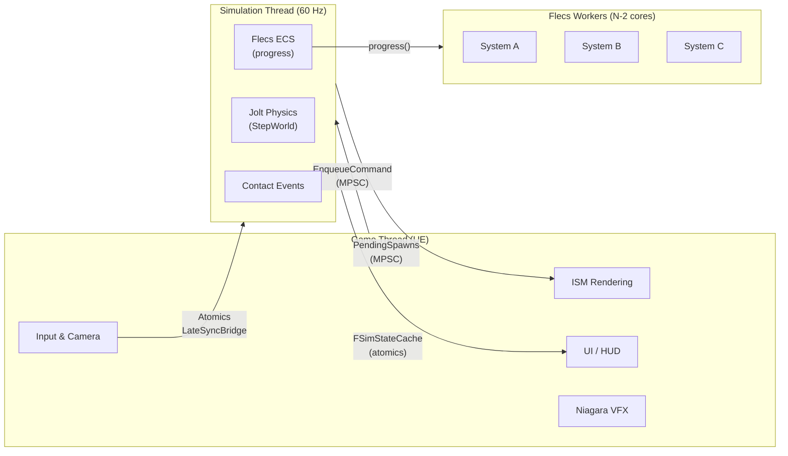
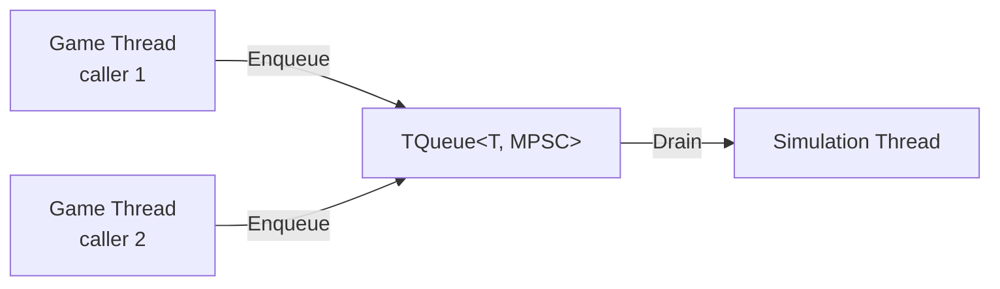
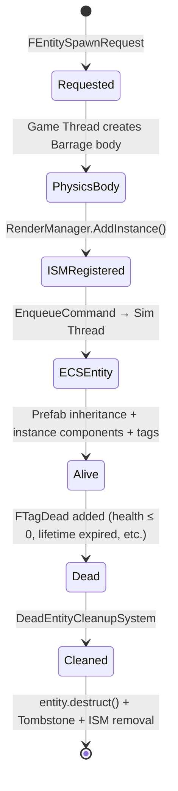
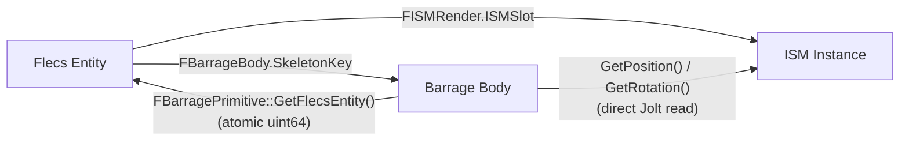
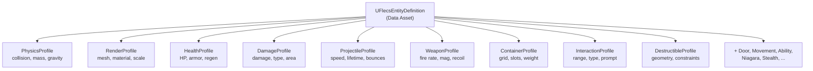

# Architecture Overview

> FatumGame splits gameplay into three cooperating layers: a **simulation thread** (physics + ECS), the **UE game thread** (rendering + input + UI), and **Flecs worker threads** (parallel system execution). They communicate exclusively through lock-free primitives.

---

## The Three-Layer Model



### Game Thread

The UE game thread handles everything visible to the player:

- **Input capture** — Enhanced Input actions are mapped to gameplay tags and written to `FCharacterInputAtomics` (atomic floats/bools)
- **Camera** — `AFlecsCharacter::Tick()` reads physics position directly from Jolt, applies VInterpTo smoothing, and updates the camera before `CameraManager` ticks
- **ISM rendering** — `UFlecsRenderManager::UpdateTransforms()` lerps entity positions between previous and current physics states using a sub-tick alpha
- **Niagara VFX** — `UFlecsNiagaraManager` positions attached effects at entity locations each frame
- **UI** — `UFlecsUISubsystem` reads triple-buffered container snapshots; `UFlecsHUDWidget` reads `FSimStateCache` for health/ammo

The game thread **never mutates Flecs world state directly**. All gameplay mutations are dispatched via `EnqueueCommand()`.

### Simulation Thread

`FSimulationWorker` is an `FRunnable` that ticks at ~60 Hz using `FPlatformTime::Seconds()` for wall-clock timing. Each tick:

| Step | What Happens |
|------|-------------|
| **DrainCommandQueue** | Executes all game-thread-enqueued lambdas (spawn, destroy, equip, etc.) |
| **PrepareCharacterStep** | Reads input atomics, computes locomotion, feeds Jolt character controller |
| **StackUp** | Jolt broad phase pre-step (internal) |
| **StepWorld(DilatedDT)** | Jolt physics integration — moves all bodies, detects contacts |
| **BroadcastContactEvents** | Creates `FCollisionPair` Flecs entities from Jolt contacts |
| **ApplyLateSyncBuffers** | Reads latest aim direction and camera position from `FLateSyncBridge` |
| **progress(DilatedDT)** | Runs all Flecs systems in registration order (may fan out to worker threads) |

The simulation thread owns the `flecs::world`. No other thread is allowed to call Flecs APIs directly.

### Flecs Worker Threads

During `world.progress()`, Flecs may execute systems in parallel across `N - 2` worker threads (where N = CPU core count). Any worker thread that touches Barrage (Jolt) APIs must first call `EnsureBarrageAccess()`, a `thread_local` guard that registers the thread with Jolt's `GrantClientFeed()`.

---

## Cross-Thread Communication

All inter-thread data flow uses one of four lock-free patterns:

### 1. MPSC Queues (Game → Sim, Sim → Game)



- **`CommandQueue`** (game → sim): `TQueue<TFunction<void()>>`. All Flecs world mutations (entity spawn, destroy, item add) are wrapped in lambdas and enqueued here. Drained at the start of each sim tick.
- **`PendingProjectileSpawns`** (sim → game): `TQueue<FPendingProjectileSpawn>`. WeaponFireSystem enqueues after creating the physics body + Flecs entity. Game thread drains to register ISM instances.
- **`PendingFragmentSpawns`** (sim → game): Same pattern for destructible fragments.
- **`PendingShotEvents`** (sim → game): Muzzle flash and audio trigger data.

### 2. Atomics (Bidirectional Scalars)

| Direction | Data | Type | Location |
|-----------|------|------|----------|
| Game → Sim | `DesiredTimeScale` | `std::atomic<float>` | `FSimulationWorker` |
| Game → Sim | `bPlayerFullSpeed` | `std::atomic<bool>` | `FSimulationWorker` |
| Game → Sim | `TransitionSpeed` | `std::atomic<float>` | `FSimulationWorker` |
| Game → Sim | Input state (DirX, DirZ, Jump, Crouch, Sprint, ...) | `FCharacterInputAtomics` | `FCharacterPhysBridge` |
| Sim → Game | `ActiveTimeScalePublished` | `std::atomic<float>` | `FSimulationWorker` |
| Sim → Game | `SimTickCount` | `std::atomic<uint64>` | `FSimulationWorker` |
| Sim → Game | `LastSimDeltaTime` | `std::atomic<float>` | `FSimulationWorker` |
| Sim → Game | `LastSimTickTimeSeconds` | `std::atomic<double>` | `FSimulationWorker` |

### 3. FLateSyncBridge (Latest-Value-Wins)

A specialized bridge for data where only the most recent value matters (aim direction, camera position). Each write overwrites the previous value — no queue, no ordering guarantees. The sim thread reads in `ApplyLateSyncBuffers()`.

### 4. FSimStateCache (Packed Atomic SoA)

A 16-slot cache where each slot holds packed health, weapon, and resource data for one character. Sim thread packs values into `uint64` atomics; game thread unpacks for HUD display. Zero contention, zero allocation.

---

## Entity Lifecycle

Every gameplay entity (projectile, item, destructible, door) follows this lifecycle:



1. **Request** — `FEntitySpawnRequest` created from a `UFlecsEntityDefinition` data asset
2. **Physics body** — Barrage creates a Jolt body (sphere, box, or capsule) on the game thread
3. **ISM registration** — Render manager allocates an ISM slot for the entity's mesh
4. **ECS entity** — Sim thread creates a Flecs entity inheriting from a prefab (static components) and adds instance components (`FBarrageBody`, `FISMRender`, `FHealthInstance`, etc.)
5. **Alive** — Entity participates in systems (collision, damage, lifetime, etc.)
6. **Dead** — `FTagDead` is added (by `DeathCheckSystem`, lifetime expiry, or direct kill)
7. **Cleanup** — `DeadEntityCleanupSystem` tombstones the physics body, removes ISM instance, triggers death VFX, and calls `entity.destruct()`

---

## Bidirectional Entity Binding

Every entity exists simultaneously in three systems — Flecs (ECS), Barrage (physics), and the Render Manager (ISM). A lock-free bidirectional binding keeps them in sync:



- **Forward** (Entity → Physics): `entity.get<FBarrageBody>()->SkeletonKey` — O(1) Flecs component lookup
- **Reverse** (Physics → Entity): `FBarragePrimitive::GetFlecsEntity()` — O(1) atomic read stored on the physics body
- **Render**: ISM position is computed each frame by reading the Jolt body position directly (no intermediate buffer)

See [Lock-Free Binding](lock-free-binding.md) for implementation details.

---

## System Execution

All Flecs systems run during `world.progress()` on the simulation thread. They execute in registration order (set in `SetupFlecsSystems()`):

```
WorldItemDespawnSystem → PickupGraceSystem → ProjectileLifetimeSystem
  → DamageCollisionSystem → BounceCollisionSystem → PickupCollisionSystem
    → DestructibleCollisionSystem → ConstraintBreakSystem → FragmentationSystem
      → TriggerUnlockSystem → DoorTickSystem
        → WeaponTickSystem → WeaponReloadSystem → WeaponFireSystem
          → DeathCheckSystem → DeadEntityCleanupSystem → CollisionPairCleanupSystem (LAST)
```

The `DamageObserver` is the only reactive system — it fires on `flecs::OnSet` of `FPendingDamage`, not on a phase slot.

`CollisionPairCleanupSystem` is always last, ensuring all domain systems have processed the current tick's collision pairs before they are destroyed.

See [System Execution Order](../systems/system-execution-order.md) for the complete table with per-system documentation.

---

## Data Asset Driven Design

All entity types are configured via `UFlecsEntityDefinition` data assets in the editor — no C++ required to create new entity types:



At spawn time, each profile is read once to populate the Flecs prefab (shared static data). Instance entities inherit from the prefab via Flecs `IsA` relationship, paying zero memory cost for static fields.

See [Data Assets & Profiles](../api/data-assets.md) for the complete profile reference.
