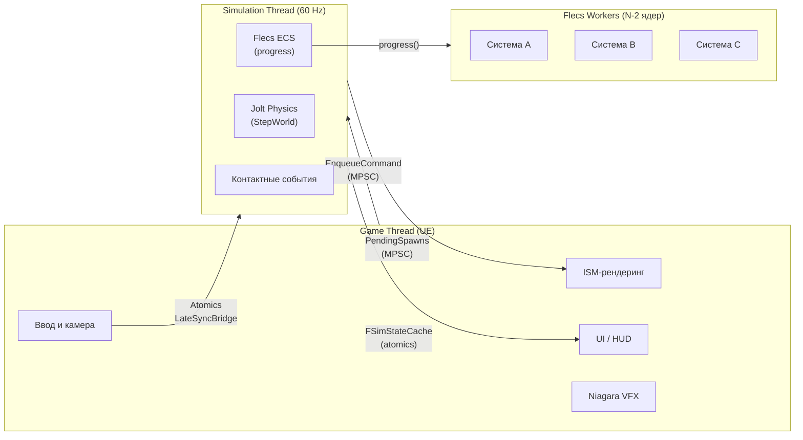
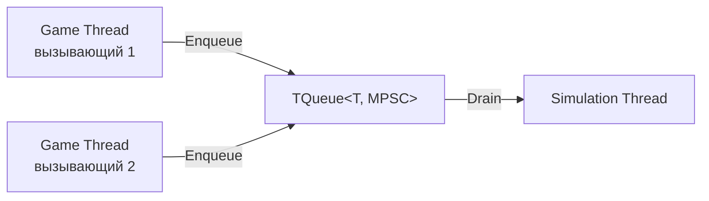
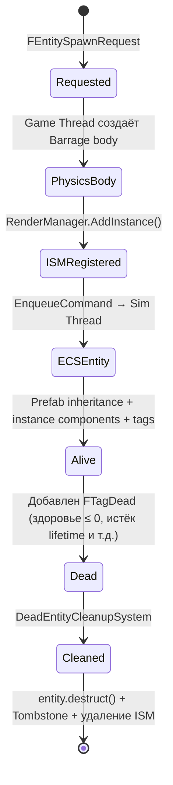
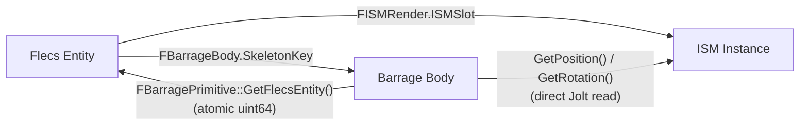
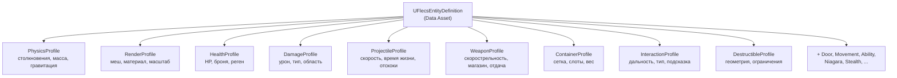

# Обзор архитектуры

> FatumGame разделяет геймплей на три взаимодействующих слоя: **поток симуляции** (физика + ECS), **game thread UE** (рендеринг + ввод + UI) и **рабочие потоки Flecs** (параллельное выполнение систем). Они общаются исключительно через lock-free примитивы.

---

## Трёхслойная модель



### Game Thread

Game thread UE отвечает за всё, что видит игрок:

- **Захват ввода** — Enhanced Input экшены маппятся на геймплей-теги и записываются в `FCharacterInputAtomics` (атомарные float/bool)
- **Камера** — `AFlecsCharacter::Tick()` считывает позицию физики напрямую из Jolt, применяет сглаживание VInterpTo и обновляет камеру до тика `CameraManager`
- **ISM-рендеринг** — `UFlecsRenderManager::UpdateTransforms()` интерполирует позиции сущностей между предыдущим и текущим состояниями физики с помощью sub-tick alpha
- **Niagara VFX** — `UFlecsNiagaraManager` позиционирует прикреплённые эффекты на местоположениях сущностей каждый кадр
- **UI** — `UFlecsUISubsystem` читает triple-buffered снапшоты контейнеров; `UFlecsHUDWidget` читает `FSimStateCache` для отображения здоровья/боеприпасов

Game thread **никогда не изменяет состояние Flecs world напрямую**. Все игровые мутации отправляются через `EnqueueCommand()`.

### Поток симуляции

`FSimulationWorker` — это `FRunnable`, который тикает на ~60 Гц, используя `FPlatformTime::Seconds()` для отсчёта реального времени. На каждом тике:

| Шаг | Что происходит |
|-----|---------------|
| **DrainCommandQueue** | Выполняет все лямбды, поставленные в очередь game thread'ом (спавн, уничтожение, экипировка и т.д.) |
| **PrepareCharacterStep** | Считывает атомики ввода, вычисляет локомоцию, передаёт данные контроллеру персонажа Jolt |
| **StackUp** | Предварительный этап Jolt broad phase (внутренний) |
| **StepWorld(DilatedDT)** | Интеграция физики Jolt — перемещает все тела, обнаруживает контакты |
| **BroadcastContactEvents** | Создаёт Flecs-сущности `FCollisionPair` из контактов Jolt |
| **ApplyLateSyncBuffers** | Считывает последнее направление прицеливания и позицию камеры из `FLateSyncBridge` |
| **progress(DilatedDT)** | Запускает все Flecs-системы в порядке регистрации (может распределяться на рабочие потоки) |

Поток симуляции владеет `flecs::world`. Никакой другой поток не имеет права вызывать Flecs API напрямую.

### Рабочие потоки Flecs

Во время `world.progress()` Flecs может выполнять системы параллельно на `N - 2` рабочих потоках (где N = количество ядер CPU). Любой рабочий поток, обращающийся к API Barrage (Jolt), должен сначала вызвать `EnsureBarrageAccess()` — `thread_local` guard, который регистрирует поток через `GrantClientFeed()`.

---

## Межпоточная коммуникация

Весь межпоточный поток данных использует один из четырёх lock-free паттернов:

### 1. MPSC-очереди (Game -> Sim, Sim -> Game)



- **`CommandQueue`** (game -> sim): `TQueue<TFunction<void()>>`. Все мутации Flecs world (спавн сущностей, уничтожение, добавление предметов) оборачиваются в лямбды и ставятся в эту очередь. Очередь опустошается в начале каждого тика симуляции.
- **`PendingProjectileSpawns`** (sim -> game): `TQueue<FPendingProjectileSpawn>`. WeaponFireSystem добавляет данные после создания физического тела + Flecs-сущности. Game thread опустошает очередь для регистрации ISM-инстансов.
- **`PendingFragmentSpawns`** (sim -> game): Тот же паттерн для фрагментов разрушаемых объектов.
- **`PendingShotEvents`** (sim -> game): Данные для вспышки дульного огня и звуковых триггеров.

### 2. Атомики (двунаправленные скаляры)

| Направление | Данные | Тип | Расположение |
|-------------|--------|-----|-------------|
| Game -> Sim | `DesiredTimeScale` | `std::atomic<float>` | `FSimulationWorker` |
| Game -> Sim | `bPlayerFullSpeed` | `std::atomic<bool>` | `FSimulationWorker` |
| Game -> Sim | `TransitionSpeed` | `std::atomic<float>` | `FSimulationWorker` |
| Game -> Sim | Состояние ввода (DirX, DirZ, Jump, Crouch, Sprint, ...) | `FCharacterInputAtomics` | `FCharacterPhysBridge` |
| Sim -> Game | `ActiveTimeScalePublished` | `std::atomic<float>` | `FSimulationWorker` |
| Sim -> Game | `SimTickCount` | `std::atomic<uint64>` | `FSimulationWorker` |
| Sim -> Game | `LastSimDeltaTime` | `std::atomic<float>` | `FSimulationWorker` |
| Sim -> Game | `LastSimTickTimeSeconds` | `std::atomic<double>` | `FSimulationWorker` |

### 3. FLateSyncBridge (побеждает последнее значение)

Специализированный мост для данных, где важно только самое последнее значение (направление прицеливания, позиция камеры). Каждая запись перезаписывает предыдущее значение — без очереди, без гарантий порядка. Поток симуляции считывает данные в `ApplyLateSyncBuffers()`.

### 4. FSimStateCache (упакованные атомарные SoA)

16-слотовый кэш, где каждый слот содержит упакованные данные здоровья, оружия и ресурсов для одного персонажа. Поток симуляции упаковывает значения в `uint64` атомики; game thread распаковывает их для отображения на HUD. Нулевая конкуренция, нулевые аллокации.

---

## Жизненный цикл сущности

Каждая игровая сущность (снаряд, предмет, разрушаемый объект, дверь) проходит через этот жизненный цикл:



1. **Запрос** — `FEntitySpawnRequest` создаётся из Data Asset `UFlecsEntityDefinition`
2. **Физическое тело** — Barrage создаёт Jolt-тело (сфера, бокс или капсула) на game thread
3. **Регистрация ISM** — Менеджер рендеринга выделяет ISM-слот для меша сущности
4. **ECS-сущность** — Поток симуляции создаёт Flecs-сущность, наследующую от prefab (статические компоненты), и добавляет instance-компоненты (`FBarrageBody`, `FISMRender`, `FHealthInstance` и т.д.)
5. **Жива** — Сущность участвует в системах (столкновения, урон, время жизни и т.д.)
6. **Мертва** — Добавляется `FTagDead` (через `DeathCheckSystem`, истечение lifetime или прямое убийство)
7. **Очистка** — `DeadEntityCleanupSystem` «замуровывает» физическое тело, удаляет ISM-инстанс, запускает VFX смерти и вызывает `entity.destruct()`

---

## Двунаправленная привязка сущностей

Каждая сущность существует одновременно в трёх системах — Flecs (ECS), Barrage (физика) и Render Manager (ISM). Lock-free двунаправленная привязка синхронизирует их:



- **Прямая** (Entity -> Physics): `entity.get<FBarrageBody>()->SkeletonKey` — O(1) поиск по компонентам Flecs
- **Обратная** (Physics -> Entity): `FBarragePrimitive::GetFlecsEntity()` — O(1) атомарное чтение, хранящееся на физическом теле
- **Рендеринг**: Позиция ISM вычисляется каждый кадр путём прямого чтения позиции Jolt-тела (без промежуточного буфера)

См. [Lock-Free привязка](lock-free-binding.md) для деталей реализации.

---

## Порядок выполнения систем

Все Flecs-системы выполняются во время `world.progress()` в потоке симуляции. Они выполняются в порядке регистрации (задаётся в `SetupFlecsSystems()`):

```
WorldItemDespawnSystem → PickupGraceSystem → ProjectileLifetimeSystem
  → DamageCollisionSystem → BounceCollisionSystem → PickupCollisionSystem
    → DestructibleCollisionSystem → ConstraintBreakSystem → FragmentationSystem
      → TriggerUnlockSystem → DoorTickSystem
        → WeaponTickSystem → WeaponReloadSystem → WeaponFireSystem
          → DeathCheckSystem → DeadEntityCleanupSystem → CollisionPairCleanupSystem (ПОСЛЕДНИЙ)
```

`DamageObserver` — единственная реактивная система: она срабатывает по `flecs::OnSet` компонента `FPendingDamage`, а не по фазовому слоту.

`CollisionPairCleanupSystem` всегда выполняется последним, гарантируя, что все доменные системы обработали пары столкновений текущего тика до их уничтожения.

См. [Порядок выполнения систем](../systems/system-execution-order.md) для полной таблицы с документацией по каждой системе.

---

## Дизайн на основе Data Assets

Все типы сущностей настраиваются через Data Assets `UFlecsEntityDefinition` в редакторе — для создания новых типов сущностей C++ не требуется:



При спавне каждый профиль считывается один раз для заполнения Flecs prefab (общие статические данные). Instance-сущности наследуют от prefab через отношение Flecs `IsA`, не тратя память на статические поля.

См. [Data Assets и профили](../api/data-assets.md) для полного справочника по профилям.
