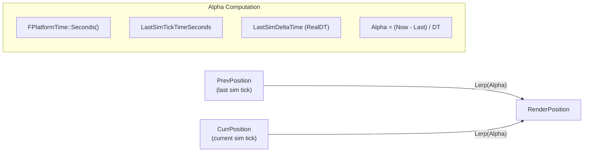
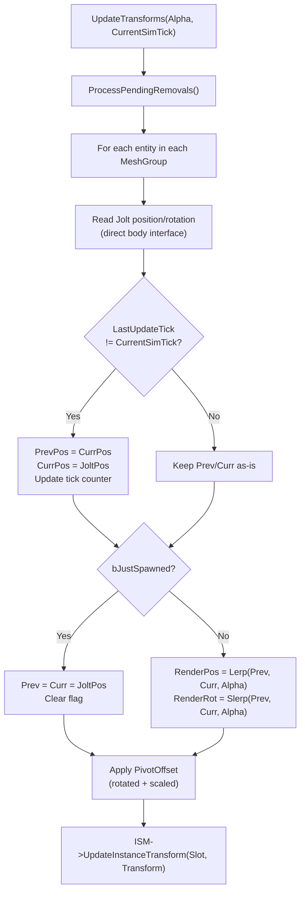
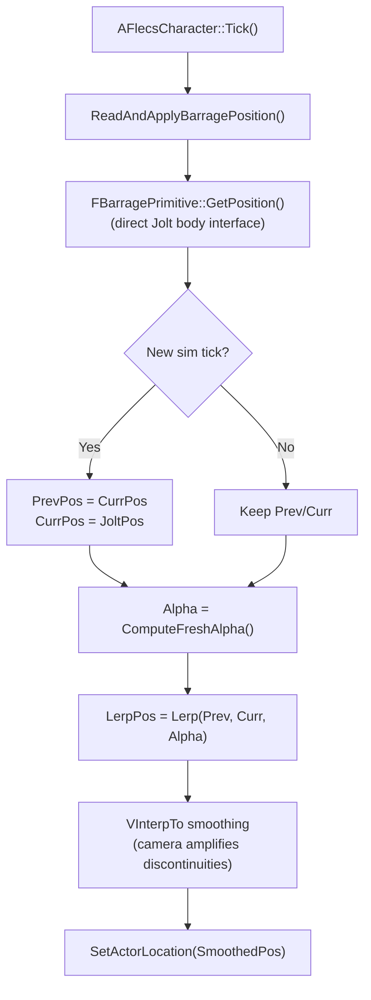

# Render Interpolation

> The simulation thread ticks at 60 Hz, but the game renders at the monitor's refresh rate (often 120+ FPS). Without interpolation, entities would visibly snap between physics positions every 16 ms. Render interpolation smoothly lerps ISM transforms between the previous and current sim tick positions.

---

## The Problem

```
Sim:   ─────T0──────────T1──────────T2──────
Render: ──F0──F1──F2──F3──F4──F5──F6──F7──
```

At 60 Hz sim / 120 Hz render, each sim tick spans two render frames. Without interpolation, all render frames within a sim tick show the same position — creating visible stuttering.

## The Solution



Each render frame computes an alpha value in `[0, 1]` representing how far between two sim ticks the current moment is. Entity positions are lerped between their previous and current physics positions.

---

## Alpha Computation

`ComputeFreshAlpha()` in `UFlecsArtillerySubsystem::Tick()`:

```cpp
float ComputeFreshAlpha()
{
    const double Now = FPlatformTime::Seconds();
    const double LastSimTime = SimWorker->LastSimTickTimeSeconds.load(std::memory_order_acquire);
    const float SimDT = SimWorker->LastSimDeltaTime.load(std::memory_order_acquire);

    if (SimDT <= 0.f) return 1.f;

    return FMath::Clamp(
        static_cast<float>((Now - LastSimTime) / SimDT),
        0.f, 1.f
    );
}
```

| Variable | Source | Meaning |
|----------|--------|---------|
| `Now` | `FPlatformTime::Seconds()` | Current wall-clock time |
| `LastSimTime` | `SimWorker->LastSimTickTimeSeconds` | When the last sim tick completed |
| `SimDT` | `SimWorker->LastSimDeltaTime` | Duration of the last sim tick (**RealDT**, not DilatedDT) |

!!! important "RealDT, Not DilatedDT"
    `LastSimDeltaTime` stores wall-clock delta time, not physics-dilated time. This is critical: render interpolation must progress at real-time speed. If we used DilatedDT, alpha would progress too slowly during slow-motion, causing visual stutter.

---

## Per-Entity Transform State

Each entity tracked by `UFlecsRenderManager` has an `FEntityTransformState`:

```cpp
struct FEntityTransformState
{
    FVector PrevPosition;
    FVector CurrPosition;
    FQuat PrevRotation;
    FQuat CurrRotation;
    uint64 LastUpdateTick;    // Sim tick when CurrPosition was last updated
    bool bJustSpawned;        // First frame — snap, no lerp
};
```

---

## UpdateTransforms Flow

Called every game tick from `UFlecsArtillerySubsystem::Tick()`:



### Key Details

**New sim tick detection:** When `CurrentSimTick > LastUpdateTick`, the entity has a new physics position. Previous becomes current, current becomes the fresh Jolt read. This ensures entities always interpolate between two temporally adjacent physics positions.

**bJustSpawned snap:** On the first frame after spawning, `Prev = Curr = JoltPosition`. This prevents the entity from lerping from the world origin (0,0,0) to its spawn position, which would cause a visible "fly-in" artifact.

**PivotOffset:** UE meshes may have their pivot at an offset from the bounding box center. `PivotOffset = -Mesh.Bounds.Origin` is computed once at ISM creation time and applied each frame:

```cpp
FVector RotatedPivot = RenderRotation.RotateVector(PivotOffset * EntityScale);
FinalPosition = RenderPosition + RotatedPivot;
```

---

## Character Position (Special Case)

`AFlecsCharacter` does **not** use the ISM render path. Instead, it reads position in `Tick()` at `TG_PrePhysics`:



### Why VInterpTo?

Even with lerp interpolation, the camera (attached to the character) amplifies tiny discontinuities at sim tick boundaries. `VInterpTo` provides additional smoothing:

```cpp
SmoothedPosition = FMath::VInterpTo(SmoothedPosition, LerpedPosition, DeltaTime, InterpSpeed);
```

!!! warning "Timing Matters"
    Character position must update in `TG_PrePhysics` — **before** `CameraManager` ticks. If it updated after, the camera would use the previous frame's position, causing 1-frame latency jitter. ISM entities update after `CameraManager` (no camera dependency), so this constraint doesn't apply to them.

### VInterpTo Under Time Dilation

When `bPlayerFullSpeed = true`, UE's `DeltaTime` is dilated but the character moves at real-time speed. VInterpTo must use undilated time:

```cpp
float EffectiveDT = DeltaTime;
if (bPlayerFullSpeed)
{
    float PublishedScale = SimWorker->ActiveTimeScalePublished.load();
    if (PublishedScale > SMALL_NUMBER)
        EffectiveDT = DeltaTime / PublishedScale;
}
SmoothedPosition = FMath::VInterpTo(SmoothedPosition, LerpedPosition, EffectiveDT, InterpSpeed);
```

---

## ISM Management

### Group-by-Mesh-Material

All entities sharing the same `(UStaticMesh*, UMaterialInterface*)` pair are rendered through a single `UInstancedStaticMeshComponent`:

```
TMap<FMeshMaterialKey, FMeshGroup> MeshGroups
```

Each `FMeshGroup` contains:
- `ISM*` — the actual ISM component
- `KeyToIndex` — `TMap<uint64, int32>` mapping BarrageKey to ISM slot
- `IndexToKey` — `TArray<uint64>` for O(1) swap-and-pop removal
- `TransformStates` — per-entity `FEntityTransformState`

### Instance Addition

```cpp
void AddInstance(FSkeletonKey Key, UStaticMesh* Mesh, UMaterialInterface* Material,
                 const FTransform& InitialTransform)
{
    FMeshGroup& Group = GetOrCreateGroup(Mesh, Material);
    int32 Slot = Group.ISM->AddInstance(InitialTransform);
    Group.KeyToIndex.Add(Key, Slot);
    Group.IndexToKey.Add(Key);
    Group.TransformStates.Add(Key, { InitialTransform.GetLocation(), ..., bJustSpawned=true });
}
```

### Instance Removal (Swap-and-Pop)

ISM doesn't support sparse removal efficiently. FatumGame uses swap-and-pop:

```
Before: [A, B, C, D, E]  — removing C (index 2)
1. Copy transform of last instance (E) to slot 2
2. ISM->RemoveInstance(4)  — removes last slot
3. Update KeyToIndex[E] = 2
4. Update IndexToKey[2] = E
After:  [A, B, E, D]
```

This maintains O(1) removal and contiguous ISM arrays.

---

## Niagara VFX

Niagara effects attached to entities (bullet tracers, muzzle effects) follow the same position readback pattern but use `UNiagaraComponent::SetWorldLocation()` instead of ISM transform updates:

```cpp
void UFlecsNiagaraManager::UpdatePositions()
{
    for (auto& [Key, NiagaraComp] : AttachedEffects)
    {
        FBarragePrimitive* Prim = GetPrimitive(Key);
        if (Prim)
        {
            FVector Pos = Prim->GetPosition();  // Direct Jolt read
            NiagaraComp->SetWorldLocation(Pos + AttachedOffset);
        }
    }
}
```

Niagara effects don't use prev/curr interpolation — they update at game thread rate using the latest Jolt position. This is acceptable because VFX are less sensitive to sub-tick positioning than mesh rendering.

---

## Performance Characteristics

| Metric | Value |
|--------|-------|
| Sim tick rate | 60 Hz (configurable) |
| Render rate | Monitor refresh rate (uncapped) |
| Position readback | Direct Jolt `body_interface` — no copy, no queue |
| Alpha computation | 3 atomic loads + 1 division |
| Per-entity cost | 1 Lerp + 1 Slerp + 1 PivotOffset rotation + 1 ISM update |
| Memory per entity | 80 bytes (`FEntityTransformState`) |
