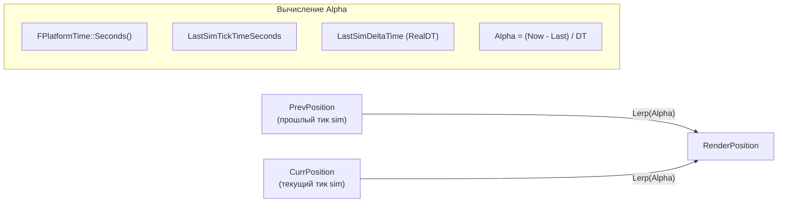
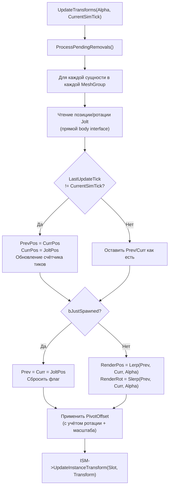
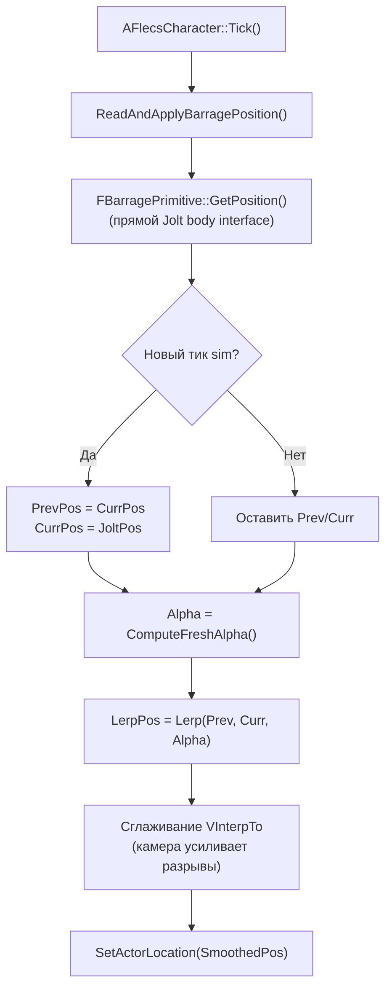

# Интерполяция рендеринга

> Поток симуляции тикает на 60 Гц, но игра рендерится на частоте обновления монитора (часто 120+ FPS). Без интерполяции сущности визуально «прыгали» бы между позициями физики каждые 16 мс. Интерполяция рендеринга плавно выполняет lerp ISM-трансформов между позициями предыдущего и текущего тика симуляции.

---

## Проблема

```
Sim:   ─────T0──────────T1──────────T2──────
Render: ──F0──F1──F2──F3──F4──F5──F6──F7──
```

При 60 Гц симуляции / 120 Гц рендеринга каждый тик симуляции охватывает два кадра рендеринга. Без интерполяции все кадры в пределах одного тика симуляции показывают одну и ту же позицию — создавая видимое подёргивание.

## Решение



Каждый кадр рендеринга вычисляет значение alpha в диапазоне `[0, 1]`, представляющее, как далеко между двумя тиками симуляции находится текущий момент. Позиции сущностей интерполируются между предыдущими и текущими позициями физики.

---

## Вычисление Alpha

`ComputeFreshAlpha()` в `UFlecsArtillerySubsystem::Tick()`:

```cpp
float ComputeFreshAlpha()
{
    const double Now = FPlatformTime::Seconds();
    const double LastSimTime = SimWorker->LastSimTickTimeSeconds.load(std::memory_order_acquire);
    const float SimDT = SimWorker->LastSimDeltaTime.load(std::memory_order_acquire);

    if (SimDT <= 0.f) return 1.f;

    return FMath::Clamp(
        static_cast<float>((Now - LastSimTime) / SimDT),
        0.f, 1.f
    );
}
```

| Переменная | Источник | Значение |
|-----------|----------|---------|
| `Now` | `FPlatformTime::Seconds()` | Текущее время настенных часов |
| `LastSimTime` | `SimWorker->LastSimTickTimeSeconds` | Когда завершился последний тик симуляции |
| `SimDT` | `SimWorker->LastSimDeltaTime` | Длительность последнего тика симуляции (**RealDT**, не DilatedDT) |

!!! important "RealDT, а не DilatedDT"
    `LastSimDeltaTime` хранит дельту реального времени (wall-clock), а не физического замедленного. Это критически важно: интерполяция рендеринга должна прогрессировать со скоростью реального времени. Если бы использовался DilatedDT, alpha прогрессировала бы слишком медленно во время замедления, вызывая визуальное подёргивание.

---

## Состояние трансформа для каждой сущности

Каждая сущность, отслеживаемая `UFlecsRenderManager`, имеет `FEntityTransformState`:

```cpp
struct FEntityTransformState
{
    FVector PrevPosition;
    FVector CurrPosition;
    FQuat PrevRotation;
    FQuat CurrRotation;
    uint64 LastUpdateTick;    // Тик sim, когда CurrPosition последний раз обновлялась
    bool bJustSpawned;        // Первый кадр — snap, без lerp
};
```

---

## Поток UpdateTransforms

Вызывается каждый game tick из `UFlecsArtillerySubsystem::Tick()`:



### Ключевые детали

**Обнаружение нового тика sim:** Когда `CurrentSimTick > LastUpdateTick`, у сущности есть новая позиция физики. Предыдущая становится текущей, текущая — свежим чтением из Jolt. Это гарантирует, что сущности всегда интерполируются между двумя временно смежными позициями физики.

**Snap при bJustSpawned:** На первом кадре после спавна `Prev = Curr = JoltPosition`. Это предотвращает lerp сущности из начала координат (0,0,0) к позиции спавна, что вызвало бы видимый артефакт «влетания».

**PivotOffset:** Меши UE могут иметь пивот со смещением от центра bounding box. `PivotOffset = -Mesh.Bounds.Origin` вычисляется один раз при создании ISM и применяется каждый кадр:

```cpp
FVector RotatedPivot = RenderRotation.RotateVector(PivotOffset * EntityScale);
FinalPosition = RenderPosition + RotatedPivot;
```

---

## Позиция персонажа (особый случай)

`AFlecsCharacter` **не** использует ISM-путь рендеринга. Вместо этого считывает позицию в `Tick()` в `TG_PrePhysics`:



### Зачем VInterpTo?

Даже с lerp-интерполяцией камера (привязанная к персонажу) усиливает мелкие разрывы на границах тиков симуляции. `VInterpTo` обеспечивает дополнительное сглаживание:

```cpp
SmoothedPosition = FMath::VInterpTo(SmoothedPosition, LerpedPosition, DeltaTime, InterpSpeed);
```

!!! warning "Тайминг имеет значение"
    Позиция персонажа должна обновляться в `TG_PrePhysics` — **до** тика `CameraManager`. Если обновить после, камера использовала бы позицию предыдущего кадра, вызывая джиттер с задержкой в 1 кадр. ISM-сущности обновляются после `CameraManager` (нет зависимости от камеры), поэтому это ограничение к ним не относится.

### VInterpTo при замедлении времени

Когда `bPlayerFullSpeed = true`, `DeltaTime` UE замедлен, но персонаж движется со скоростью реального времени. VInterpTo должен использовать незамедленное время:

```cpp
float EffectiveDT = DeltaTime;
if (bPlayerFullSpeed)
{
    float PublishedScale = SimWorker->ActiveTimeScalePublished.load();
    if (PublishedScale > SMALL_NUMBER)
        EffectiveDT = DeltaTime / PublishedScale;
}
SmoothedPosition = FMath::VInterpTo(SmoothedPosition, LerpedPosition, EffectiveDT, InterpSpeed);
```

---

## Управление ISM

### Группировка по Mesh-Material

Все сущности с одинаковой парой `(UStaticMesh*, UMaterialInterface*)` рендерятся через один `UInstancedStaticMeshComponent`:

```
TMap<FMeshMaterialKey, FMeshGroup> MeshGroups
```

Каждая `FMeshGroup` содержит:
- `ISM*` — собственно ISM-компонент
- `KeyToIndex` — `TMap<uint64, int32>`, маппинг BarrageKey на ISM-слот
- `IndexToKey` — `TArray<uint64>` для O(1) удаления swap-and-pop
- `TransformStates` — `FEntityTransformState` для каждой сущности

### Добавление инстанса

```cpp
void AddInstance(FSkeletonKey Key, UStaticMesh* Mesh, UMaterialInterface* Material,
                 const FTransform& InitialTransform)
{
    FMeshGroup& Group = GetOrCreateGroup(Mesh, Material);
    int32 Slot = Group.ISM->AddInstance(InitialTransform);
    Group.KeyToIndex.Add(Key, Slot);
    Group.IndexToKey.Add(Key);
    Group.TransformStates.Add(Key, { InitialTransform.GetLocation(), ..., bJustSpawned=true });
}
```

### Удаление инстанса (Swap-and-Pop)

ISM не поддерживает разреженное удаление эффективно. FatumGame использует swap-and-pop:

```
До: [A, B, C, D, E]  — удаление C (индекс 2)
1. Копирование трансформа последнего инстанса (E) в слот 2
2. ISM->RemoveInstance(4)  — удаление последнего слота
3. Обновление KeyToIndex[E] = 2
4. Обновление IndexToKey[2] = E
После: [A, B, E, D]
```

Это обеспечивает O(1) удаление и непрерывные массивы ISM.

---

## Niagara VFX

Niagara-эффекты, привязанные к сущностям (трассеры пуль, эффекты дульной вспышки), следуют тому же паттерну считывания позиций, но используют `UNiagaraComponent::SetWorldLocation()` вместо обновления ISM-трансформов:

```cpp
void UFlecsNiagaraManager::UpdatePositions()
{
    for (auto& [Key, NiagaraComp] : AttachedEffects)
    {
        FBarragePrimitive* Prim = GetPrimitive(Key);
        if (Prim)
        {
            FVector Pos = Prim->GetPosition();  // Прямое чтение Jolt
            NiagaraComp->SetWorldLocation(Pos + AttachedOffset);
        }
    }
}
```

Niagara-эффекты не используют интерполяцию prev/curr — они обновляются на частоте game thread, используя последнюю позицию Jolt. Это допустимо, потому что VFX менее чувствительны к sub-tick позиционированию, чем рендеринг мешей.

---

## Характеристики производительности

| Метрика | Значение |
|---------|---------|
| Частота тиков sim | 60 Гц (настраиваемо) |
| Частота рендеринга | Частота обновления монитора (без ограничений) |
| Считывание позиций | Прямой Jolt `body_interface` — без копирования, без очереди |
| Вычисление alpha | 3 атомарных чтения + 1 деление |
| Стоимость на сущность | 1 Lerp + 1 Slerp + 1 ротация PivotOffset + 1 обновление ISM |
| Память на сущность | 80 байт (`FEntityTransformState`) |
