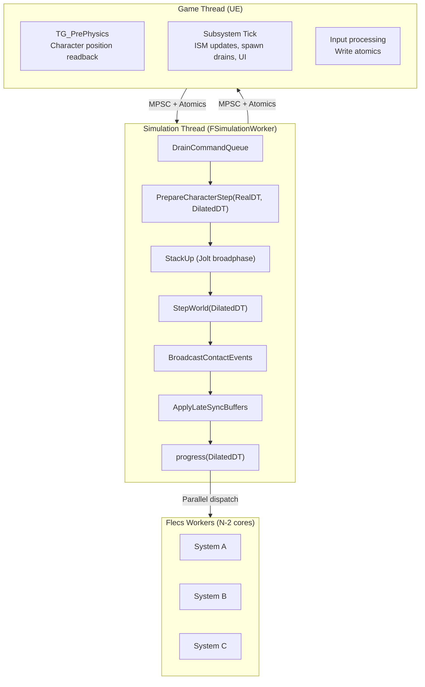
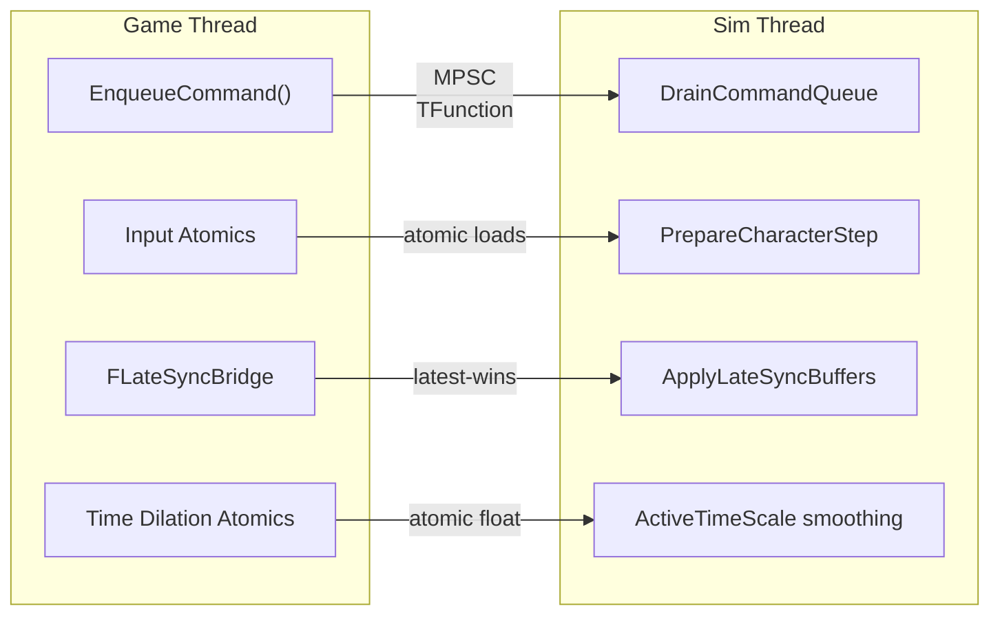
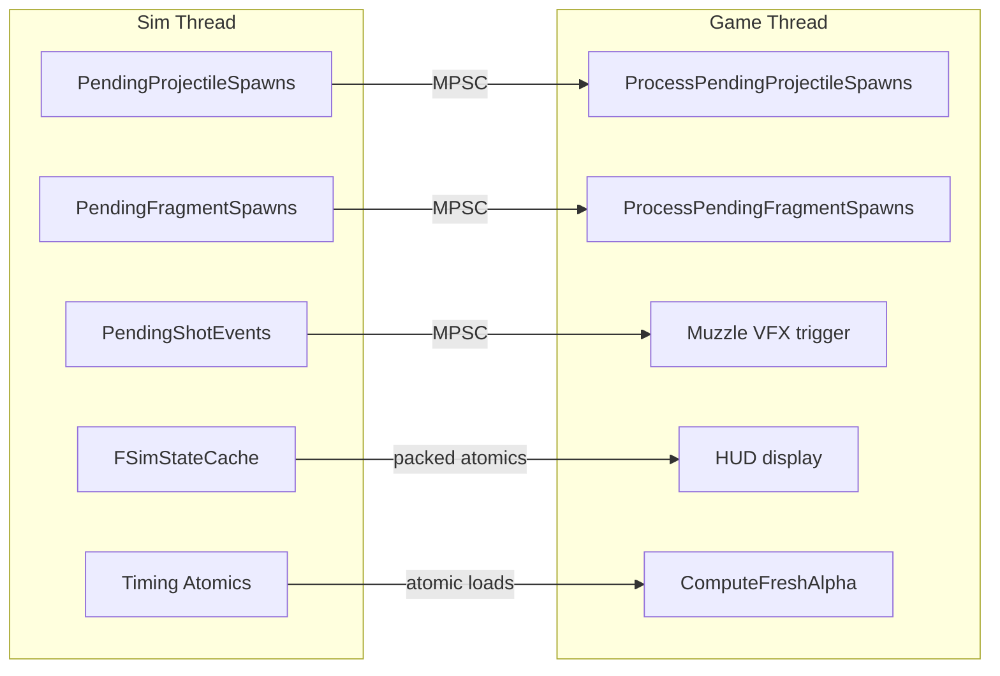
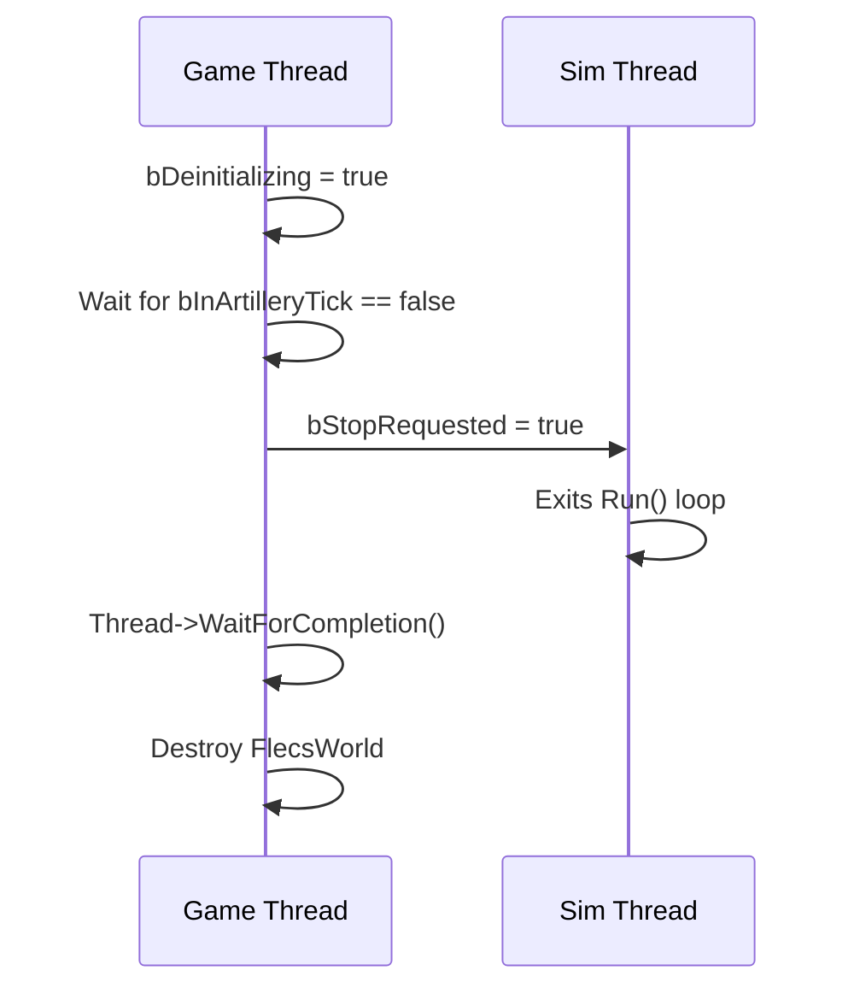

# Threading Model

> FatumGame runs gameplay on a dedicated 60 Hz simulation thread, completely decoupled from the UE game thread. Communication is entirely lock-free — no mutexes, no critical sections. This page describes the three thread tiers, their responsibilities, and every cross-thread data path.

---

## Thread Tiers



---

## Game Thread

The UE game thread runs at the monitor's refresh rate (or uncapped). It handles:

| Responsibility | Timing | Implementation |
|---------------|--------|----------------|
| Character position readback | `TG_PrePhysics` | `AFlecsCharacter::Tick()` → `ReadAndApplyBarragePosition()` |
| Camera update | After character position | UE `CameraManager` uses freshly-set actor location |
| ISM transform interpolation | Subsystem `Tick()` | `UFlecsRenderManager::UpdateTransforms(Alpha, SimTick)` |
| Niagara position updates | Subsystem `Tick()` | `UFlecsNiagaraManager::UpdatePositions()` |
| Pending spawn drain (projectiles) | Subsystem `Tick()` | `ProcessPendingProjectileSpawns()` |
| Pending spawn drain (fragments) | Subsystem `Tick()` | `ProcessPendingFragmentSpawns()` |
| Input → atomics | Each game tick | `FCharacterInputAtomics` writes |
| Aim → LateSyncBridge | Each game tick | `FLateSyncBridge::Write()` |
| Time dilation stack | Each game tick | `FTimeDilationStack::Tick()` → atomics |
| UI state reads | Each game tick | `FSimStateCache::UnpackHealth()` etc. |

!!! warning "Critical Timing"
    `AFlecsCharacter::Tick()` runs in `TG_PrePhysics` — **before** `CameraManager`. This ensures the camera always sees the current frame's interpolated position. The subsystem ISM update runs **after** `CameraManager`, which is fine because ISM entities don't have cameras attached.

### EnqueueCommand

The primary game → sim mutation path:

```cpp
// Game thread — safe to call from any game-thread context
ArtillerySubsystem->EnqueueCommand([=]()
{
    // This lambda executes on the sim thread, before physics step
    auto Entity = World.entity().is_a(Prefab);
    Entity.set<FHealthInstance>({ MaxHP });
    Entity.add<FTagItem>();
});
```

Internally uses `TQueue<TFunction<void()>, EQueueMode::Mpsc>` — multiple game-thread callers are safe. The sim thread drains the entire queue at the start of each tick via `DrainCommandQueue()`.

!!! note
    `EnqueueCommand` lambdas execute **before** `PrepareCharacterStep` and `StepWorld`. This means spawned entities participate in physics and ECS from the very next sim tick.

---

## Simulation Thread

`FSimulationWorker` extends `FRunnable`. It is started in `UFlecsArtillerySubsystem::OnWorldBeginPlay()` and stopped in `Deinitialize()`.

### Tick Loop

```cpp
void FSimulationWorker::Run()
{
    while (!bStopRequested)
    {
        const double Now = FPlatformTime::Seconds();
        const float RealDT = Now - LastTickTime;     // Wall-clock delta
        LastTickTime = Now;

        // Time dilation
        const float DesiredScale = DesiredTimeScale.load();
        ActiveTimeScale = FMath::FInterpTo(ActiveTimeScale, DesiredScale, RealDT, TransitionSpeed.load());
        const float DilatedDT = RealDT * ActiveTimeScale;

        // 1. Execute game-thread commands
        DrainCommandQueue();

        // 2. Character locomotion (reads input atomics)
        PrepareCharacterStep(RealDT, DilatedDT);

        // 3. Physics
        BarrageDispatch->StackUp();
        StepWorld(DilatedDT);

        // 4. Collision events → FCollisionPair entities
        BroadcastContactEvents();

        // 5. Latest-value sync (aim, camera)
        ApplyLateSyncBuffers();

        // 6. ECS systems
        World.progress(DilatedDT);

        // Publish timing for interpolation
        SimTickCount.fetch_add(1);
        LastSimDeltaTime.store(RealDT);  // Real, not dilated!
        LastSimTickTimeSeconds.store(Now);
        ActiveTimeScalePublished.store(ActiveTimeScale);

        // Rate limiting to ~60 Hz
        SleepIfNeeded(Now);
    }
}
```

### Two Delta Times

The simulation thread maintains two delta-time values:

| Variable | Source | Used By |
|----------|--------|---------|
| `RealDT` | `FPlatformTime::Seconds()` difference | Interpolation alpha, rate limiting, time dilation smoothing |
| `DilatedDT` | `RealDT × ActiveTimeScale` | `StepWorld()`, `world.progress()`, all ECS systems |

!!! important
    `LastSimDeltaTime` publishes **RealDT**, not DilatedDT. The game thread uses this for interpolation alpha computation, which must progress at wall-clock speed regardless of time dilation.

---

## Flecs Worker Threads

During `world.progress()`, Flecs may execute systems in parallel if they don't share write access to the same component types. The thread count is `UE core count - 2` (reserving cores for the game thread and simulation thread).

!!! warning "Barrage Thread Registration"
    Any Flecs worker thread that calls Barrage/Jolt APIs **must** first call `EnsureBarrageAccess()`. This is a `thread_local` guard that calls `GrantClientFeed()` once per thread. Without this, Jolt will assert on unregistered thread access.

```cpp
void EnsureBarrageAccess()
{
    thread_local bool bRegistered = false;
    if (!bRegistered)
    {
        BarrageDispatch->GrantClientFeed();
        bRegistered = true;
    }
}
```

---

## Cross-Thread Data Paths

### Game → Simulation



| Path | Mechanism | Semantics | Latency |
|------|-----------|-----------|---------|
| **EnqueueCommand** | MPSC queue of `TFunction<void()>` | Ordered, all-or-nothing per tick | 0–16 ms (next sim tick) |
| **Input Atomics** | `FCharacterInputAtomics` (atomic floats/bools) | Latest value wins | 0–16 ms |
| **FLateSyncBridge** | Atomic struct write/read | Latest value wins, no queue | 0–16 ms |
| **Time Dilation** | `DesiredTimeScale`, `bPlayerFullSpeed`, `TransitionSpeed` | Atomic floats | 0–16 ms |

### Simulation → Game



| Path | Mechanism | Data | Consumer |
|------|-----------|------|----------|
| **PendingProjectileSpawns** | MPSC queue | Mesh, position, direction, BarrageKey | ISM registration |
| **PendingFragmentSpawns** | MPSC queue | Fragment mesh, position, debris pool slot | ISM registration |
| **PendingShotEvents** | MPSC queue | Muzzle position, direction, weapon type | Niagara muzzle flash |
| **FSimStateCache** | Packed atomic uint64 (16 slots) | Health, weapon, resource snapshots | HUD widgets |
| **Timing Atomics** | `SimTickCount`, `LastSimDeltaTime`, `LastSimTickTimeSeconds` | Sim timing | Interpolation alpha |

---

## FSimStateCache

A lock-free, allocation-free cache for scalar gameplay state (health, ammo, resources):

```
┌─────────────────────────────────────────────────┐
│ FSimStateCache (16 slots × 3 channels × uint64) │
├─────────────────────────────────────────────────┤
│ Slot 0: │ HealthPacked │ WeaponPacked │ ResourcePacked │
│ Slot 1: │ HealthPacked │ WeaponPacked │ ResourcePacked │
│ ...     │              │              │                │
│ Slot 15: │ HealthPacked │ WeaponPacked │ ResourcePacked │
└─────────────────────────────────────────────────┘
```

- **Sim thread** packs values: `PackHealth(SlotIndex, CurrentHP, MaxHP, Armor)` → stores as atomic `uint64`
- **Game thread** unpacks: `UnpackHealth(SlotIndex)` → returns `FHealthSnapshot { CurrentHP, MaxHP, Armor }`
- Each slot is assigned to one character via `FindSlot(CharacterEntityId)`
- Cache-line aligned to prevent false sharing

---

## Shutdown Protocol

Shutdown must handle the sim thread potentially being inside `progress()` when `Deinitialize()` is called:



The `bDeinitializing` and `bInArtilleryTick` atomics form a cooperative barrier:

- Sim thread sets `bInArtilleryTick = true` before each tick, clears after
- Game thread sets `bDeinitializing = true`, then spins until `bInArtilleryTick == false`
- Once the sim thread sees `bStopRequested`, it exits cleanly
- Only then does the game thread destroy the Flecs world

!!! danger
    Without this barrier, `Deinitialize()` can destroy the Flecs world while the sim thread is inside `progress()`, causing a use-after-free crash on PIE exit.
