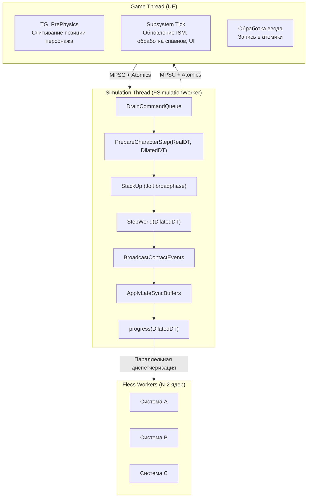
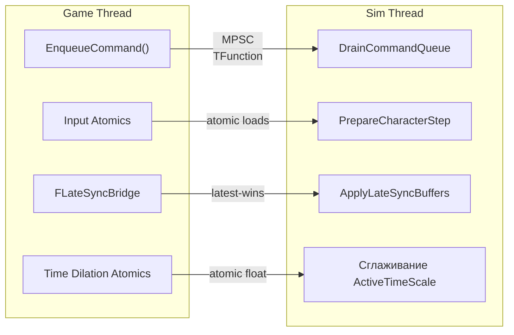
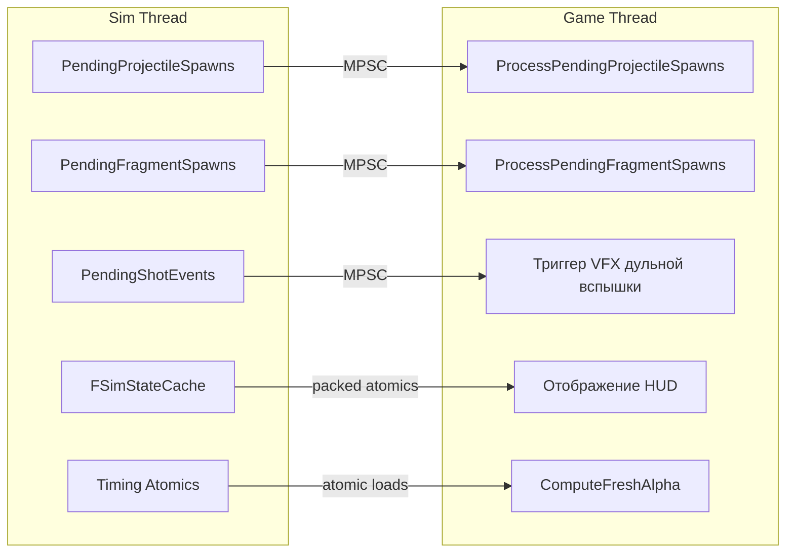
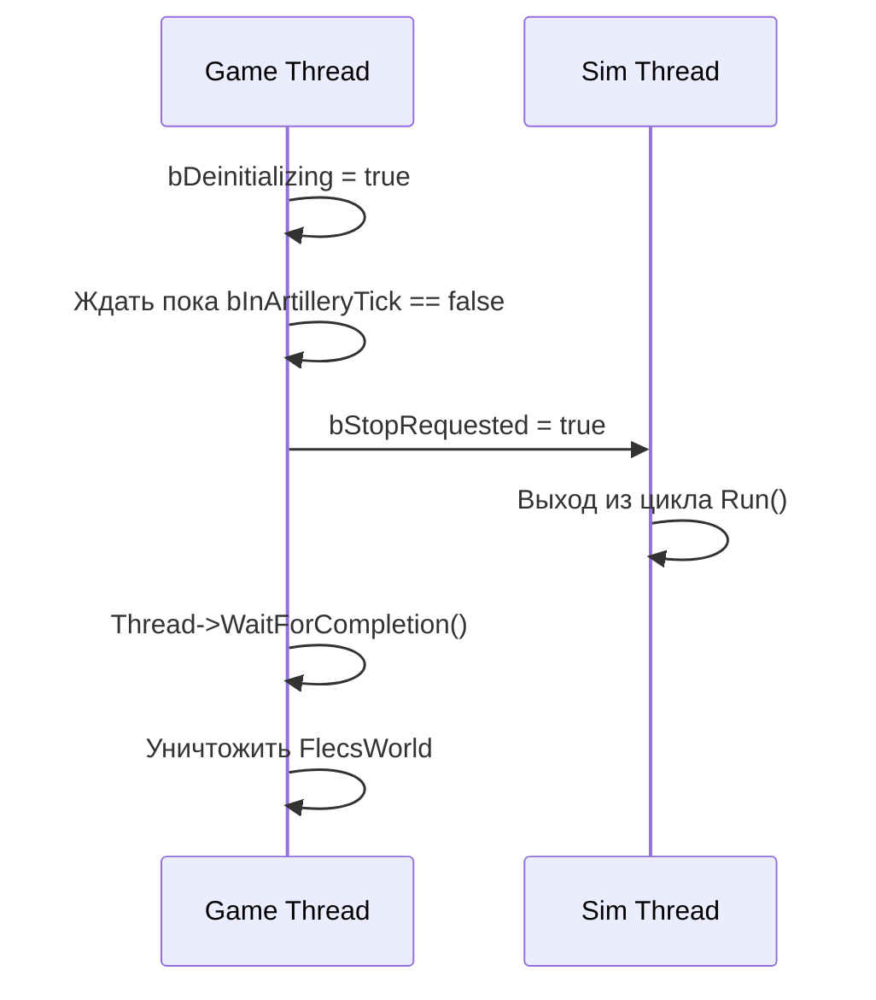

# Модель потоков

> FatumGame выполняет геймплей в выделенном потоке симуляции на 60 Гц, полностью отвязанном от game thread UE. Коммуникация полностью lock-free — без мьютексов, без критических секций. Эта страница описывает три уровня потоков, их обязанности и каждый межпоточный путь данных.

---

## Уровни потоков



---

## Game Thread

Game thread UE работает на частоте обновления монитора (или без ограничений). Он отвечает за:

| Обязанность | Тайминг | Реализация |
|-------------|---------|------------|
| Считывание позиции персонажа | `TG_PrePhysics` | `AFlecsCharacter::Tick()` -> `ReadAndApplyBarragePosition()` |
| Обновление камеры | После позиции персонажа | UE `CameraManager` использует только что установленную позицию актора |
| Интерполяция ISM-трансформов | Subsystem `Tick()` | `UFlecsRenderManager::UpdateTransforms(Alpha, SimTick)` |
| Обновление позиций Niagara | Subsystem `Tick()` | `UFlecsNiagaraManager::UpdatePositions()` |
| Обработка ожидающих спавнов (снаряды) | Subsystem `Tick()` | `ProcessPendingProjectileSpawns()` |
| Обработка ожидающих спавнов (фрагменты) | Subsystem `Tick()` | `ProcessPendingFragmentSpawns()` |
| Ввод -> атомики | Каждый game tick | Запись в `FCharacterInputAtomics` |
| Прицеливание -> LateSyncBridge | Каждый game tick | `FLateSyncBridge::Write()` |
| Стек замедления времени | Каждый game tick | `FTimeDilationStack::Tick()` -> атомики |
| Чтение состояния UI | Каждый game tick | `FSimStateCache::UnpackHealth()` и т.д. |

!!! warning "Критический тайминг"
    `AFlecsCharacter::Tick()` выполняется в `TG_PrePhysics` — **до** `CameraManager`. Это гарантирует, что камера всегда видит интерполированную позицию текущего кадра. Обновление ISM подсистемы выполняется **после** `CameraManager`, что допустимо, поскольку к ISM-сущностям камеры не привязаны.

### EnqueueCommand

Основной путь мутаций из game thread в поток симуляции:

```cpp
// Game thread — безопасно вызывать из любого контекста game thread
ArtillerySubsystem->EnqueueCommand([=]()
{
    // Эта лямбда выполняется в потоке симуляции, перед шагом физики
    auto Entity = World.entity().is_a(Prefab);
    Entity.set<FHealthInstance>({ MaxHP });
    Entity.add<FTagItem>();
});
```

Внутри используется `TQueue<TFunction<void()>, EQueueMode::Mpsc>` — множественные вызовы из game thread безопасны. Поток симуляции опустошает всю очередь в начале каждого тика через `DrainCommandQueue()`.

!!! note "Примечание"
    Лямбды `EnqueueCommand` выполняются **до** `PrepareCharacterStep` и `StepWorld`. Это значит, что заспавненные сущности участвуют в физике и ECS уже со следующего тика симуляции.

---

## Поток симуляции

`FSimulationWorker` наследует `FRunnable`. Запускается в `UFlecsArtillerySubsystem::OnWorldBeginPlay()`, останавливается в `Deinitialize()`.

### Цикл тика

```cpp
void FSimulationWorker::Run()
{
    while (!bStopRequested)
    {
        const double Now = FPlatformTime::Seconds();
        const float RealDT = Now - LastTickTime;     // Реальное время (wall-clock)
        LastTickTime = Now;

        // Замедление времени
        const float DesiredScale = DesiredTimeScale.load();
        ActiveTimeScale = FMath::FInterpTo(ActiveTimeScale, DesiredScale, RealDT, TransitionSpeed.load());
        const float DilatedDT = RealDT * ActiveTimeScale;

        // 1. Выполнение команд game thread
        DrainCommandQueue();

        // 2. Локомоция персонажа (чтение атомиков ввода)
        PrepareCharacterStep(RealDT, DilatedDT);

        // 3. Физика
        BarrageDispatch->StackUp();
        StepWorld(DilatedDT);

        // 4. Контактные события → сущности FCollisionPair
        BroadcastContactEvents();

        // 5. Синхронизация последних значений (прицеливание, камера)
        ApplyLateSyncBuffers();

        // 6. ECS-системы
        World.progress(DilatedDT);

        // Публикация тайминга для интерполяции
        SimTickCount.fetch_add(1);
        LastSimDeltaTime.store(RealDT);  // Реальное, не замедленное!
        LastSimTickTimeSeconds.store(Now);
        ActiveTimeScalePublished.store(ActiveTimeScale);

        // Ограничение частоты до ~60 Гц
        SleepIfNeeded(Now);
    }
}
```

### Два Delta Time

Поток симуляции поддерживает два значения delta-time:

| Переменная | Источник | Используется |
|-----------|----------|-------------|
| `RealDT` | Разница `FPlatformTime::Seconds()` | Альфа интерполяции, ограничение частоты, сглаживание замедления времени |
| `DilatedDT` | `RealDT × ActiveTimeScale` | `StepWorld()`, `world.progress()`, все ECS-системы |

!!! important "Важно"
    `LastSimDeltaTime` публикует **RealDT**, а не DilatedDT. Game thread использует это для вычисления альфы интерполяции, которая должна прогрессировать со скоростью реального времени вне зависимости от замедления.

---

## Рабочие потоки Flecs

Во время `world.progress()` Flecs может выполнять системы параллельно, если они не имеют общего доступа на запись к одним и тем же типам компонентов. Количество потоков — `количество ядер UE - 2` (резервируются ядра для game thread и потока симуляции).

!!! warning "Регистрация потоков Barrage"
    Любой рабочий поток Flecs, вызывающий API Barrage/Jolt, **обязан** сначала вызвать `EnsureBarrageAccess()`. Это `thread_local` guard, который вызывает `GrantClientFeed()` один раз на поток. Без этого Jolt выдаст assert при доступе из незарегистрированного потока.

```cpp
void EnsureBarrageAccess()
{
    thread_local bool bRegistered = false;
    if (!bRegistered)
    {
        BarrageDispatch->GrantClientFeed();
        bRegistered = true;
    }
}
```

---

## Межпоточные пути данных

### Game -> Simulation



| Путь | Механизм | Семантика | Задержка |
|------|----------|-----------|---------|
| **EnqueueCommand** | MPSC-очередь `TFunction<void()>` | Упорядоченный, всё-или-ничего за тик | 0–16 мс (следующий тик симуляции) |
| **Input Atomics** | `FCharacterInputAtomics` (атомарные float/bool) | Побеждает последнее значение | 0–16 мс |
| **FLateSyncBridge** | Атомарная запись/чтение структуры | Побеждает последнее значение, без очереди | 0–16 мс |
| **Time Dilation** | `DesiredTimeScale`, `bPlayerFullSpeed`, `TransitionSpeed` | Атомарные float | 0–16 мс |

### Simulation -> Game



| Путь | Механизм | Данные | Потребитель |
|------|----------|--------|-----------|
| **PendingProjectileSpawns** | MPSC-очередь | Меш, позиция, направление, BarrageKey | Регистрация ISM |
| **PendingFragmentSpawns** | MPSC-очередь | Меш фрагмента, позиция, слот пула обломков | Регистрация ISM |
| **PendingShotEvents** | MPSC-очередь | Позиция дула, направление, тип оружия | Дульная вспышка Niagara |
| **FSimStateCache** | Упакованные атомарные uint64 (16 слотов) | Снапшоты здоровья, оружия, ресурсов | Виджеты HUD |
| **Timing Atomics** | `SimTickCount`, `LastSimDeltaTime`, `LastSimTickTimeSeconds` | Тайминг симуляции | Альфа интерполяции |

---

## FSimStateCache

Lock-free кэш без аллокаций для скалярного игрового состояния (здоровье, боеприпасы, ресурсы):

```
┌─────────────────────────────────────────────────┐
│ FSimStateCache (16 slots × 3 channels × uint64) │
├─────────────────────────────────────────────────┤
│ Slot 0: │ HealthPacked │ WeaponPacked │ ResourcePacked │
│ Slot 1: │ HealthPacked │ WeaponPacked │ ResourcePacked │
│ ...     │              │              │                │
│ Slot 15: │ HealthPacked │ WeaponPacked │ ResourcePacked │
└─────────────────────────────────────────────────┘
```

- **Поток симуляции** упаковывает значения: `PackHealth(SlotIndex, CurrentHP, MaxHP, Armor)` -> сохраняет как атомарный `uint64`
- **Game thread** распаковывает: `UnpackHealth(SlotIndex)` -> возвращает `FHealthSnapshot { CurrentHP, MaxHP, Armor }`
- Каждый слот назначается одному персонажу через `FindSlot(CharacterEntityId)`
- Выравнивание по cache line для предотвращения false sharing

---

## Протокол завершения

Завершение должно учитывать, что поток симуляции может находиться внутри `progress()`, когда вызывается `Deinitialize()`:



Атомики `bDeinitializing` и `bInArtilleryTick` формируют кооперативный барьер:

- Поток симуляции устанавливает `bInArtilleryTick = true` перед каждым тиком, сбрасывает после
- Game thread устанавливает `bDeinitializing = true`, затем крутится в ожидании `bInArtilleryTick == false`
- Как только поток симуляции видит `bStopRequested`, он корректно завершается
- Только после этого game thread уничтожает Flecs world

!!! danger "Опасность"
    Без этого барьера `Deinitialize()` может уничтожить Flecs world, пока поток симуляции находится внутри `progress()`, вызывая use-after-free крэш при выходе из PIE.
