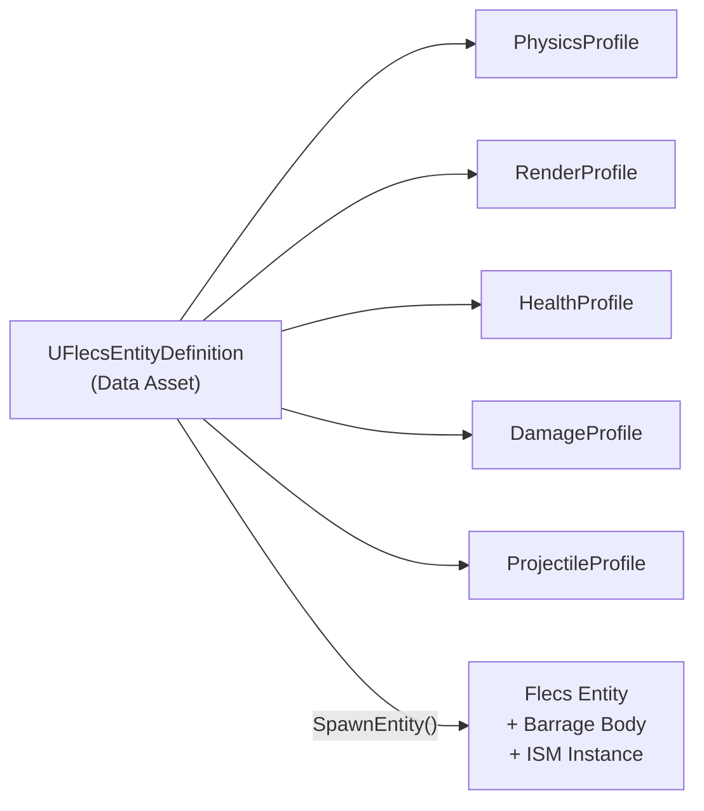

# Adding a New Entity

This guide walks through creating a new entity type in FatumGame, from data asset to playable in-editor. The example at the end creates a bouncing grenade.

---

## Overview

Every entity in FatumGame is defined by a **Data Asset** (`UFlecsEntityDefinition`) that references **profiles** -- modular configuration blocks for physics, rendering, health, damage, etc. The spawn system reads this definition and creates the corresponding Flecs prefab, entity, and Barrage physics body.



---

## Step 1: Create the Entity Definition

1. Open **Content Browser** in Unreal Editor
2. Right-click -> **Miscellaneous** -> **Data Asset**
3. Select **FlecsEntityDefinition** as the class
4. Name it with the `DA_` prefix (e.g., `DA_BouncingGrenade`)
5. Save it in `Content/FlecsDA/`

---

## Step 2: Configure Profiles

Open the Data Asset and configure the profiles relevant to your entity. You only need to fill in the profiles your entity requires -- leave others as `None`.

### Available Profiles

| Profile | Purpose | Required For |
|---------|---------|-------------|
| **PhysicsProfile** | Body shape, mass, gravity, collision layer | All entities with physics |
| **RenderProfile** | Static mesh, material, scale | All visible entities |
| **HealthProfile** | MaxHP, armor, regen, destroy-on-death | Damageable entities |
| **DamageProfile** | Damage amount, type, area damage, destroy-on-hit | Entities that deal damage |
| **ProjectileProfile** | Speed, lifetime, max bounces, grace period | Projectiles |
| **WeaponProfile** | Fire rate, magazine, reload time, spread | Weapons |
| **ContainerProfile** | Grid size, max items, max weight | Containers (chests, bags) |
| **InteractionProfile** | Interaction range, prompt text, single-use | Interactable entities |
| **DestructibleProfile** | Fragmentation settings, debris lifetime | Destructible objects |

!!! note "Profiles are also Data Assets"
    Each profile is its own Data Asset that you create separately and then reference from the Entity Definition. This allows profile reuse across multiple entity types.

### Profile Configuration Tips

**PhysicsProfile:**

- `CollisionRadius` -- radius of the sphere collider (in cm)
- `GravityFactor` -- 0 = no gravity (laser), 1 = normal gravity (grenade)
- `CollisionLayer` -- determines what this entity collides with
- `Mass` -- affects physics simulation (heavier = harder to push)

**RenderProfile:**

- `Mesh` -- the `UStaticMesh` to render via ISM
- `Scale` -- world scale (e.g., `(0.3, 0.3, 0.3)` for a small bullet)

**ProjectileProfile:**

- `MaxLifetime` -- seconds before auto-despawn
- `MaxBounces` -- 0 = destroy on first contact, N = bounce N times
- `GracePeriodFrames` -- frames of collision immunity after spawn (prevents self-damage)
- `MinVelocity` -- below this speed, projectile despawns (prevents rolling forever)

---

## Step 3: Place in Level or Spawn via Code

### Option A: Level Placement (AFlecsEntitySpawner)

1. In the level editor, **Place Actors** -> search for **FlecsEntitySpawner**
2. Drag it into the level
3. In the Details panel, set **EntityDefinition** to your Data Asset
4. Configure spawn properties:

| Property | Default | Description |
|----------|---------|-------------|
| `EntityDefinition` | -- | Your Data Asset (required) |
| `InitialVelocity` | (0,0,0) | Starting velocity |
| `bOverrideScale` | false | Override scale from RenderProfile |
| `ScaleOverride` | (1,1,1) | Custom scale (if override enabled) |
| `bSpawnOnBeginPlay` | true | Auto-spawn when game starts |
| `bDestroyAfterSpawn` | true | Remove spawner actor after spawn |
| `bShowPreview` | true | Show mesh preview in editor |

!!! note "Manual spawning"
    Set `bSpawnOnBeginPlay = false`, then call `SpawnEntity()` from Blueprint or C++ when you want the entity to appear.

### Option B: C++ Spawn API

```cpp
// Fluent API
FEntitySpawnRequest::FromDefinition(GrenadeDef, SpawnLocation)
    .WithVelocity(ThrowDirection * ThrowSpeed)
    .WithOwnerEntity(ThrowerId)
    .Spawn(WorldContext);

// Explicit API
FEntitySpawnRequest Request;
Request.EntityDefinition = GrenadeDef;
Request.Location = SpawnLocation;
Request.InitialVelocity = ThrowDirection * ThrowSpeed;
Request.OwnerEntityId = ThrowerId;
UFlecsEntityLibrary::SpawnEntity(World, Request);
```

### Option C: Blueprint Spawn

```
UFlecsSpawnLibrary::SpawnProjectileFromEntityDef(
    World,
    DA_BouncingGrenade,
    SpawnLocation,
    ThrowDirection,
    ThrowSpeed,
    OwnerEntityId
);
```

---

## Step 4: (Optional) Add Custom Systems

If your entity needs custom gameplay logic beyond what the existing systems provide, add a new system.

### When You Need a Custom System

- Custom tick logic (e.g., homing missiles, proximity mines)
- New collision behavior (new `FTagCollision*` type)
- Unique death behavior

### How to Add a System

1. **Register** the system in `FlecsArtillerySubsystem_Systems.cpp` (or a new `_Domain.cpp` file for a new domain)
2. **Place it** in the correct position in the execution order
3. **Follow** the existing system patterns (fail-fast, `EnsureBarrageAccess()`, iterator drain)

!!! warning "System ordering matters"
    New collision systems must run BEFORE `CollisionPairCleanupSystem` (always last). See [ECS Best Practices](ecs-best-practices.md#system-execution-order) for the full order.

---

## Step 5: Test

1. **PIE (Play In Editor):** Press Play and verify the entity spawns, renders, and behaves correctly
2. **Check physics:** Does it collide? Does it bounce (if configured)? Does gravity work?
3. **Check rendering:** Is the mesh correct? Is the scale right?
4. **Check gameplay:** Does it deal damage? Does it despawn on lifetime expiry? Does the owner check work?
5. **Check destruction:** If it has health, does it die correctly? Does the death VFX spawn at the right position?

---

## Example: Creating a Bouncing Grenade

This example creates a grenade that arcs through the air, bounces off surfaces up to 3 times, explodes on the 4th contact (or after 5 seconds), and deals area damage.

### 1. Create Profile Data Assets

**DA_GrenadePhysics** (`UFlecsPhysicsProfile`):

- `CollisionRadius` = 8
- `GravityFactor` = 1.0
- `Mass` = 2.0
- `CollisionLayer` = PROJECTILE

**DA_GrenadeRender** (`UFlecsRenderProfile`):

- `Mesh` = SM_Grenade (your grenade mesh)
- `Scale` = (0.5, 0.5, 0.5)

**DA_GrenadeDamage** (`UFlecsDamageProfile`):

- `Damage` = 75
- `DamageType` = Explosive
- `bAreaDamage` = true
- `AreaRadius` = 500
- `bDestroyOnHit` = true

**DA_GrenadeProjectile** (`UFlecsProjectileProfile`):

- `MaxLifetime` = 5.0
- `MaxBounces` = 3
- `GracePeriodFrames` = 5
- `MinVelocity` = 50

### 2. Create the Entity Definition

**DA_BouncingGrenade** (`UFlecsEntityDefinition`):

- `PhysicsProfile` = DA_GrenadePhysics
- `RenderProfile` = DA_GrenadeRender
- `DamageProfile` = DA_GrenadeDamage
- `ProjectileProfile` = DA_GrenadeProjectile
- `HealthProfile` = None (grenade has no health -- destroyed by bounce count or lifetime)

### 3. Spawn from Character

```cpp
// In AFlecsCharacter or weapon system
void ThrowGrenade(const FVector& AimDirection)
{
    FEntitySpawnRequest::FromDefinition(GrenadeDefinition, GetMuzzleLocation())
        .WithVelocity(AimDirection * 2000.f + FVector(0, 0, 500.f))  // Arc upward
        .WithOwnerEntity(GetEntityId())
        .Spawn(GetWorld());
}
```

### 4. How It Works (No Custom Systems Needed)

The existing systems handle everything:

| System | What It Does for the Grenade |
|--------|------------------------------|
| **BounceCollisionSystem** | Processes bounces, decrements `BounceCount` |
| **DamageCollisionSystem** | Deals area damage when `MaxBounces` exceeded and `bDestroyOnHit` triggers |
| **ProjectileLifetimeSystem** | Despawns after 5 seconds if bounces don't expire first |
| **DeathCheckSystem** | Marks entity as dead |
| **DeadEntityCleanupSystem** | Removes physics body, ISM, Flecs entity |

### Projectile Physics Type Reference

| Bouncing | Gravity | Body Type | Use Case |
|----------|---------|-----------|----------|
| No | 0 | Sensor | Laser -- flies straight, no physics interaction |
| No | > 0 | Dynamic | Rocket -- falls with gravity, explodes on contact |
| Yes | any | Dynamic | Grenade/ricochet -- bounces off surfaces |
