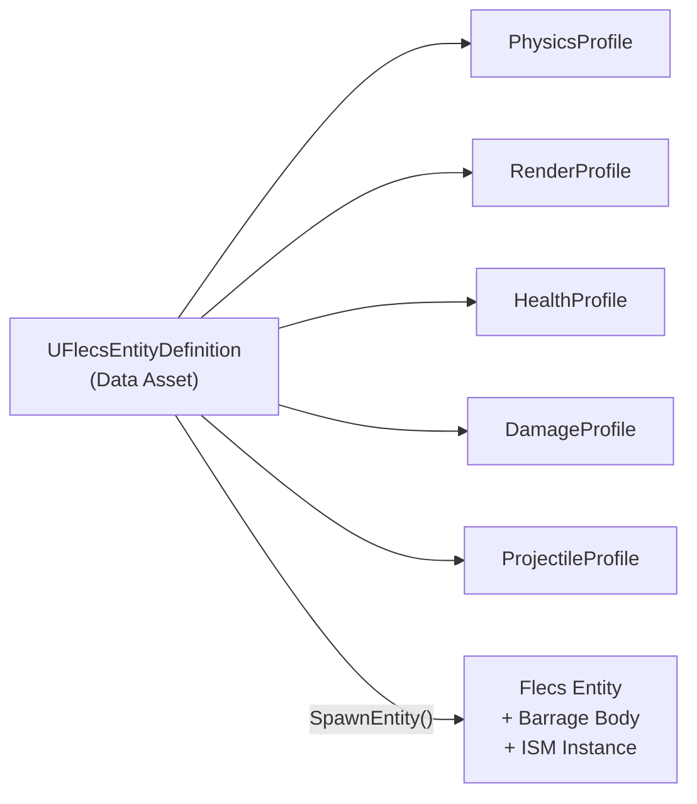

# Добавление новой сущности

Это руководство описывает создание нового типа сущности в FatumGame, от data asset до игры в редакторе. Пример в конце создаёт отскакивающую гранату.

---

## Обзор

Каждая сущность в FatumGame определяется **Data Asset** (`UFlecsEntityDefinition`), ссылающимся на **профили** -- модульные блоки конфигурации для физики, рендеринга, здоровья, урона и т.д. Система спавна читает это определение и создаёт соответствующий prefab Flecs, сущность и физическое тело Barrage.



---

## Шаг 1: Создание определения сущности

1. Откройте **Content Browser** в Unreal Editor
2. Правый клик -> **Miscellaneous** -> **Data Asset**
3. Выберите **FlecsEntityDefinition** как класс
4. Назовите с префиксом `DA_` (напр., `DA_BouncingGrenade`)
5. Сохраните в `Content/FlecsDA/`

---

## Шаг 2: Настройка профилей

Откройте Data Asset и настройте профили, относящиеся к вашей сущности. Заполнять нужно только необходимые профили -- остальные оставьте как `None`.

### Доступные профили

| Профиль | Назначение | Нужен для |
|---------|-----------|----------|
| **PhysicsProfile** | Форма тела, масса, гравитация, слой коллизии | Все сущности с физикой |
| **RenderProfile** | Статический меш, материал, масштаб | Все видимые сущности |
| **HealthProfile** | MaxHP, броня, реген, уничтожение при смерти | Повреждаемые сущности |
| **DamageProfile** | Количество урона, тип, площадной урон, уничтожение при попадании | Сущности, наносящие урон |
| **ProjectileProfile** | Скорость, время жизни, макс. отскоков, grace period | Снаряды |
| **WeaponProfile** | Скорострельность, магазин, время перезарядки, разброс | Оружие |
| **ContainerProfile** | Размер сетки, макс. предметов, макс. вес | Контейнеры (сундуки, сумки) |
| **InteractionProfile** | Дальность взаимодействия, текст подсказки, одноразовость | Интерактивные сущности |
| **DestructibleProfile** | Настройки фрагментации, время жизни обломков | Разрушаемые объекты |

!!! note "Профили тоже Data Assets"
    Каждый профиль -- отдельный Data Asset, который вы создаёте отдельно и затем ссылаетесь из определения сущности. Это позволяет переиспользовать профили между различными типами сущностей.

### Советы по настройке профилей

**PhysicsProfile:**

- `CollisionRadius` -- радиус сферического коллайдера (в см)
- `GravityFactor` -- 0 = без гравитации (лазер), 1 = нормальная гравитация (граната)
- `CollisionLayer` -- определяет, с чем сталкивается сущность
- `Mass` -- влияет на физическую симуляцию (тяжелее = труднее толкнуть)

**RenderProfile:**

- `Mesh` -- `UStaticMesh` для рендеринга через ISM
- `Scale` -- масштаб в мире (напр., `(0.3, 0.3, 0.3)` для маленькой пули)

**ProjectileProfile:**

- `MaxLifetime` -- секунды до автоисчезновения
- `MaxBounces` -- 0 = уничтожение при первом контакте, N = отскок N раз
- `GracePeriodFrames` -- кадры иммунитета к столкновениям после спавна (предотвращает самоповреждение)
- `MinVelocity` -- ниже этой скорости снаряд исчезает (предотвращает бесконечное качение)

---

## Шаг 3: Размещение на уровне или спавн через код

### Вариант A: Размещение на уровне (AFlecsEntitySpawner)

1. В редакторе уровня, **Place Actors** -> найдите **FlecsEntitySpawner**
2. Перетащите на уровень
3. В панели Details установите **EntityDefinition** на ваш Data Asset
4. Настройте свойства спавна:

| Свойство | По умолчанию | Описание |
|----------|-------------|----------|
| `EntityDefinition` | -- | Ваш Data Asset (обязательно) |
| `InitialVelocity` | (0,0,0) | Начальная скорость |
| `bOverrideScale` | false | Переопределить масштаб из RenderProfile |
| `ScaleOverride` | (1,1,1) | Пользовательский масштаб (если переопределение включено) |
| `bSpawnOnBeginPlay` | true | Автоспавн при начале игры |
| `bDestroyAfterSpawn` | true | Удалить актор-спаунер после спавна |
| `bShowPreview` | true | Показать превью меша в редакторе |

!!! note "Ручной спавн"
    Установите `bSpawnOnBeginPlay = false`, затем вызовите `SpawnEntity()` из Blueprint или C++, когда захотите появления сущности.

### Вариант B: C++ API спавна

```cpp
// Fluent API
FEntitySpawnRequest::FromDefinition(GrenadeDef, SpawnLocation)
    .WithVelocity(ThrowDirection * ThrowSpeed)
    .WithOwnerEntity(ThrowerId)
    .Spawn(WorldContext);

// Явный API
FEntitySpawnRequest Request;
Request.EntityDefinition = GrenadeDef;
Request.Location = SpawnLocation;
Request.InitialVelocity = ThrowDirection * ThrowSpeed;
Request.OwnerEntityId = ThrowerId;
UFlecsEntityLibrary::SpawnEntity(World, Request);
```

### Вариант C: Blueprint спавн

```
UFlecsSpawnLibrary::SpawnProjectileFromEntityDef(
    World,
    DA_BouncingGrenade,
    SpawnLocation,
    ThrowDirection,
    ThrowSpeed,
    OwnerEntityId
);
```

---

## Шаг 4: (Необязательно) Добавление пользовательских систем

Если вашей сущности нужна пользовательская игровая логика сверх того, что предоставляют существующие системы, добавьте новую систему.

### Когда нужна пользовательская система

- Пользовательская потиковая логика (напр., самонаводящиеся ракеты, мины приближения)
- Новое поведение столкновений (новый тип `FTagCollision*`)
- Уникальное поведение при смерти

### Как добавить систему

1. **Зарегистрируйте** систему в `FlecsArtillerySubsystem_Systems.cpp` (или новом файле `_Domain.cpp` для нового домена)
2. **Разместите** в правильной позиции порядка выполнения
3. **Следуйте** существующим паттернам систем (fail-fast, `EnsureBarrageAccess()`, дренирование итератора)

!!! warning "Порядок систем важен"
    Новые системы столкновений должны выполняться ДО `CollisionPairCleanupSystem` (всегда последняя). См. [Лучшие практики ECS](ecs-best-practices.md#system-execution-order) для полного порядка.

---

## Шаг 5: Тестирование

1. **PIE (Play In Editor):** Нажмите Play и проверьте, что сущность спавнится, рендерится и ведёт себя корректно
2. **Проверьте физику:** Сталкивается? Отскакивает (если настроено)? Работает гравитация?
3. **Проверьте рендеринг:** Меш правильный? Масштаб правильный?
4. **Проверьте геймплей:** Наносит урон? Исчезает по истечении времени жизни? Работает проверка владельца?
5. **Проверьте уничтожение:** Если есть здоровье, умирает корректно? VFX смерти спавнится в правильной позиции?

---

## Пример: создание отскакивающей гранаты

Этот пример создаёт гранату, летящую по дуге, отскакивающую от поверхностей до 3 раз, взрывающуюся при 4-м контакте (или через 5 секунд) и наносящую площадной урон.

### 1. Создание Data Assets профилей

**DA_GrenadePhysics** (`UFlecsPhysicsProfile`):

- `CollisionRadius` = 8
- `GravityFactor` = 1.0
- `Mass` = 2.0
- `CollisionLayer` = PROJECTILE

**DA_GrenadeRender** (`UFlecsRenderProfile`):

- `Mesh` = SM_Grenade (ваш меш гранаты)
- `Scale` = (0.5, 0.5, 0.5)

**DA_GrenadeDamage** (`UFlecsDamageProfile`):

- `Damage` = 75
- `DamageType` = Explosive
- `bAreaDamage` = true
- `AreaRadius` = 500
- `bDestroyOnHit` = true

**DA_GrenadeProjectile** (`UFlecsProjectileProfile`):

- `MaxLifetime` = 5.0
- `MaxBounces` = 3
- `GracePeriodFrames` = 5
- `MinVelocity` = 50

### 2. Создание определения сущности

**DA_BouncingGrenade** (`UFlecsEntityDefinition`):

- `PhysicsProfile` = DA_GrenadePhysics
- `RenderProfile` = DA_GrenadeRender
- `DamageProfile` = DA_GrenadeDamage
- `ProjectileProfile` = DA_GrenadeProjectile
- `HealthProfile` = None (у гранаты нет здоровья -- уничтожается по счётчику отскоков или времени жизни)

### 3. Спавн из персонажа

```cpp
// В AFlecsCharacter или системе оружия
void ThrowGrenade(const FVector& AimDirection)
{
    FEntitySpawnRequest::FromDefinition(GrenadeDefinition, GetMuzzleLocation())
        .WithVelocity(AimDirection * 2000.f + FVector(0, 0, 500.f))  // Дуга вверх
        .WithOwnerEntity(GetEntityId())
        .Spawn(GetWorld());
}
```

### 4. Как это работает (пользовательские системы не нужны)

Существующие системы обрабатывают всё:

| Система | Что делает для гранаты |
|---------|----------------------|
| **BounceCollisionSystem** | Обрабатывает отскоки, уменьшает `BounceCount` |
| **DamageCollisionSystem** | Наносит площадной урон, когда `MaxBounces` превышены и `bDestroyOnHit` срабатывает |
| **ProjectileLifetimeSystem** | Исчезает через 5 секунд, если отскоки не закончились раньше |
| **DeathCheckSystem** | Помечает сущность как мёртвую |
| **DeadEntityCleanupSystem** | Удаляет физическое тело, ISM, сущность Flecs |

### Справочник типов физики снарядов

| Отскок | Гравитация | Тип тела | Случай использования |
|--------|-----------|----------|---------------------|
| Нет | 0 | Sensor | Лазер -- летит прямо, без физического взаимодействия |
| Нет | > 0 | Dynamic | Ракета -- падает с гравитацией, взрывается при контакте |
| Да | любая | Dynamic | Граната/рикошет -- отскакивает от поверхностей |
