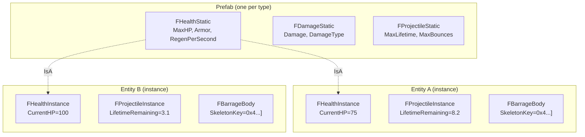

# ECS Best Practices

This document covers Flecs-specific patterns, pitfalls, and conventions used in FatumGame. Read this before writing any ECS code.

---

## The Prefab (Static/Instance) Pattern

Every entity type in FatumGame uses prefab inheritance to separate shared data from per-entity data.



**Static components** live on the prefab entity. They are shared (read-only) across all instances. This saves memory and ensures consistency.

**Instance components** live on each entity. They hold mutable, per-entity state.

| Component Type | Location | Mutability | Examples |
|----------------|----------|------------|---------|
| `FNameStatic` | Prefab | Read-only (shared) | `FHealthStatic`, `FWeaponStatic`, `FContainerStatic` |
| `FNameInstance` | Entity | Read-write (unique) | `FHealthInstance`, `FWeaponInstance`, `FContainerInstance` |
| `FTagName` | Entity | N/A (zero-size) | `FTagDead`, `FTagProjectile`, `FTagItem` |

```cpp
// Reading static data (inherited from prefab)
const auto& HealthStatic = Entity.get<FHealthStatic>();

// Reading/writing instance data (on the entity itself)
auto& HealthInstance = Entity.get_mut<FHealthInstance>();
HealthInstance.CurrentHP -= Damage;
```

!!! note "Prefab creation"
    Prefabs are created during entity spawn by the spawn system. The `UFlecsEntityDefinition` data asset determines which profiles (and therefore which static components) a prefab has.

---

## Deferred Operations: Three Critical Cases

Flecs defers component mutations during iteration to maintain archetype integrity. This causes three distinct bugs if you are not aware of it.

### Case 1: Between `.run()` Systems

`.run()` systems declare no component access in their signature, so Flecs cannot infer dependencies. It **skips the merge** between consecutive `.run()` systems.

```cpp
// System A (.run())
entity.set<FMyComponent>(Value);  // Deferred!

// System B (.run()) -- runs immediately after A
auto* Comp = entity.try_get<FMyComponent>();  // Returns STALE data or nullptr!
```

!!! danger "Fix"
    Do not pass data between `.run()` systems via Flecs components. Use a subsystem-owned buffer (e.g., `TArray` member on `UFlecsArtillerySubsystem`) instead.

### Case 2: Within the Same System

`obtain<T>()` and `set<T>()` write to the deferred staging area. `try_get<T>()` and `get<T>()` read from committed storage. Within the same callback, a component you just added is invisible.

```cpp
// Inside a system callback
entity.obtain<FMyComponent>().Value = 42;  // Writes to staging

auto* Comp = entity.try_get<FMyComponent>();  // Reads committed storage
// Comp is nullptr if FMyComponent didn't exist before this callback!
```

!!! danger "Fix"
    Track newly-set data in local variables. Do not re-read from Flecs what you just wrote in the same callback.

### Case 3: Cross-Entity Tags

Adding a tag to a **different** entity inside `.each()` is deferred. If the writing system does not declare access to that tag, Flecs will not merge before the next system that queries it.

```cpp
// FragmentationSystem: iterates fragments
TargetEntity.add<FTagDead>();  // Deferred! Not visible to DeadEntityCleanupSystem this tick

// DeadEntityCleanupSystem: queries FTagDead
// Sees nothing -- tag won't be committed until next progress()
```

!!! danger "Fix"
    Perform immediate side effects instead of relying on a later system to react to a deferred tag. For example, call `SetBodyObjectLayer(DEBRIS)` directly instead of expecting `DeadEntityCleanupSystem` to see `FTagDead` this tick.

---

## Iterator Drain Rules

### `.run()` with Query Terms: MUST Drain

When a system has query terms (`.with<T>()`, `system<T>()`, etc.), Flecs allocates iterator state that must be consumed.

```cpp
// This system has terms -- MUST drain the iterator
World.system<FHealthInstance>("DeathCheck")
    .with<FHealthStatic>()
    .run([](flecs::iter& It)
    {
        while (It.next())  // MUST iterate all matches
        {
            // ... process ...
        }
    });
```

!!! danger "Early exit requires `It.fini()`"
    If you need to exit early without draining, you MUST call `It.fini()` to clean up. Otherwise you get `ECS_LEAK_DETECTED` in `flecs_stack_fini()` on PIE exit.

    ```cpp
    .run([](flecs::iter& It)
    {
        if (ShouldSkip())
        {
            It.fini();  // REQUIRED -- prevent leak
            return;
        }
        while (It.next()) { /* ... */ }
    });
    ```

### `.run()` without Query Terms: Auto-Fini

When a system has no query terms (`system<>("")`), Flecs sets `EcsQueryMatchNothing` and auto-fini's after `run()`.

```cpp
// No terms -- Flecs auto-fini's
World.system<>("CollisionPairCleanup")
    .run([](flecs::iter& It)
    {
        // Do NOT call It.next() or It.fini()
        // Just do your work and return
        CleanupCollisionPairs();
    });
```

!!! danger "Do NOT call `It.fini()` on auto-fini iterators"
    Double-fini causes a crash at `flecs_query_iter_fini()`.

---

## Tag Query Pitfalls

### Never Pass Tags as `const T&` to `World.each()`

!!! danger "This crashes with `ecs_field_w_size` assertion"
    Flecs `iterable<>` preserves the reference qualifier. `is_empty_v<const T&>` evaluates to `false` even for zero-size tags, so Flecs tries to access a data column that doesn't exist.

```cpp
// WRONG: Tag as typed parameter -- CRASHES
World.each([](flecs::entity E, const FTagProjectile& Tag, FHealthInstance& Health)
{
    // ecs_field_w_size assertion failure!
});

// RIGHT: Use query builder with .with<Tag>()
World.query_builder<FHealthInstance>()
    .with<FTagProjectile>()
    .build()
    .each([](flecs::entity E, FHealthInstance& Health)
    {
        // Safe -- tag is a filter, not a data column
    });
```

!!! note "`system<T>().with<Tag>().each()` is fine"
    The system builder strips references from template parameters, so tags work correctly in system definitions. The crash only affects `World.each()` and `World.query_builder<Tag>()` with tags as template args.

### Preferred Pattern for Systems with Tags

```cpp
// CORRECT: Tags as .with<>() filters, data components as template args
World.system<FHealthInstance>("DeathCheckSystem")
    .with<FHealthStatic>()
    .without<FTagDead>()
    .kind(flecs::OnUpdate)
    .each([](flecs::entity E, FHealthInstance& Health)
    {
        const auto& Static = E.get<FHealthStatic>();  // Read from prefab
        if (Health.CurrentHP <= 0.f && Static.bDestroyOnDeath)
        {
            E.add<FTagDead>();
        }
    });
```

---

## Component Registration Order

!!! warning "Registration order matters"
    Flecs assigns component IDs in registration order. If two modules register components in different orders across PIE sessions, entity archetypes become inconsistent.

    Register all components in a deterministic order in the subsystem's `Initialize()` or a dedicated registration function. Do not register components lazily on first use.

---

## Observer vs System: When to Use Each

| Feature | System | Observer |
|---------|--------|----------|
| **Runs** | Every tick during `progress()` | When a specific event fires |
| **Ordered** | Yes (pipeline phases, `order_by`) | No (fires immediately on event) |
| **Deferred** | Yes (writes are staged) | Writes may be immediate (depends on context) |
| **Use for** | Per-tick logic (movement, lifetime, tick-based checks) | Reactive logic (on component add/remove, on entity creation) |

```cpp
// System: runs every tick, processes all entities with FProjectileInstance
World.system<FProjectileInstance>("ProjectileLifetime")
    .each([](flecs::entity E, FProjectileInstance& Proj)
    {
        Proj.LifetimeRemaining -= DT;
        if (Proj.LifetimeRemaining <= 0.f) { E.add<FTagDead>(); }
    });

// Observer: fires once when FPendingDamage is added to an entity
World.observer<FPendingDamage>("DamageObserver")
    .event(flecs::OnSet)
    .each([](flecs::entity E, FPendingDamage& Pending)
    {
        // Process damage hits immediately
        for (const auto& Hit : Pending.Hits) { /* ... */ }
        Pending.Hits.Reset();
    });
```

!!! note "Prefer systems for gameplay logic"
    Systems are deterministic (ordered pipeline), debuggable (Flecs explorer), and parallelizable. Use observers only for truly event-driven logic like damage processing or entity setup on spawn.

---

## Flecs API Quick Reference

| Method | Returns | If Missing | Use When |
|--------|---------|------------|----------|
| `try_get<T>()` | `const T*` | `nullptr` | Read, might be missing |
| `get<T>()` | `const T&` | **ASSERT** | Read, guaranteed exists |
| `try_get_mut<T>()` | `T*` | `nullptr` | Write, might be missing |
| `get_mut<T>()` | `T&` | **ASSERT** | Write, guaranteed exists |
| `obtain<T>()` | `T&` | **Creates default** | Write, create if missing |
| `set<T>(val)` | `entity&` | **Creates** | Assign value (creates if missing) |
| `add<T>()` | `entity&` | **Creates** | Add tag or default component |
| `has<T>()` | `bool` | `false` | Check presence |
| `remove<T>()` | `entity&` | No-op | Remove component/tag |

!!! warning "Use `get<T>()` only when you are CERTAIN the component exists"
    `get<T>()` asserts on missing components. If there is any chance the component might not be present, use `try_get<T>()` and handle the nullptr.

---

## System Execution Order

Systems execute in a deterministic order defined by pipeline phases and explicit ordering. The current order is:

1. WorldItemDespawnSystem
2. PickupGraceSystem
3. ProjectileLifetimeSystem
4. DamageCollisionSystem
5. BounceCollisionSystem
6. PickupCollisionSystem
7. DestructibleCollisionSystem
8. WeaponTickSystem
9. WeaponReloadSystem
10. WeaponFireSystem
11. DeathCheckSystem
12. DeadEntityCleanupSystem
13. **CollisionPairCleanupSystem** (ALWAYS LAST)

!!! danger "CollisionPairCleanupSystem must be last"
    This system destroys all `FCollisionPair` entities. If any system runs after it, collision data is gone. Every collision-processing system must run before cleanup.
