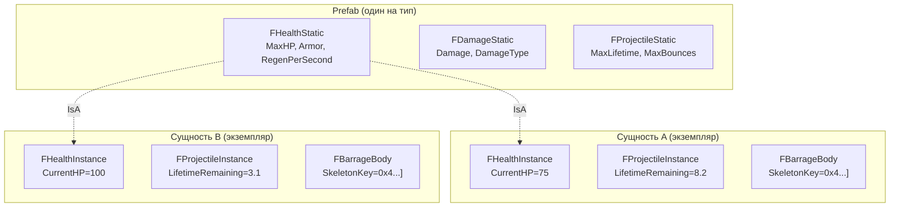

# Лучшие практики ECS

Этот документ охватывает Flecs-специфичные паттерны, подводные камни и конвенции, используемые в FatumGame. Прочтите это перед написанием любого ECS-кода.

---

## Паттерн Prefab (Static/Instance)

Каждый тип сущности в FatumGame использует наследование prefab для разделения общих данных от данных отдельных сущностей.



**Статические компоненты** хранятся на сущности prefab. Они общие (только для чтения) для всех экземпляров. Экономят память и обеспечивают консистентность.

**Компоненты экземпляра** хранятся на каждой сущности. Они содержат изменяемое состояние конкретной сущности.

| Тип компонента | Расположение | Изменяемость | Примеры |
|---------------|-------------|-------------|---------|
| `FNameStatic` | Prefab | Только чтение (общий) | `FHealthStatic`, `FWeaponStatic`, `FContainerStatic` |
| `FNameInstance` | Сущность | Чтение-запись (уникальный) | `FHealthInstance`, `FWeaponInstance`, `FContainerInstance` |
| `FTagName` | Сущность | Н/Д (нулевой размер) | `FTagDead`, `FTagProjectile`, `FTagItem` |

```cpp
// Чтение статических данных (унаследованных от prefab)
const auto& HealthStatic = Entity.get<FHealthStatic>();

// Чтение/запись данных экземпляра (на самой сущности)
auto& HealthInstance = Entity.get_mut<FHealthInstance>();
HealthInstance.CurrentHP -= Damage;
```

!!! note "Создание prefab"
    Prefab создаются во время спавна сущности системой спавна. Data asset `UFlecsEntityDefinition` определяет, какие профили (и, следовательно, какие статические компоненты) имеет prefab.

---

## Отложенные операции: три критических случая

Flecs откладывает мутации компонентов во время итерации для поддержания целостности архетипов. Это вызывает три различных бага, если вы не знаете об этом.

### Случай 1: Между `.run()` системами

`.run()` системы не объявляют доступ к компонентам в своей сигнатуре, поэтому Flecs не может определить зависимости. Он **пропускает слияние** между последовательными `.run()` системами.

```cpp
// Система A (.run())
entity.set<FMyComponent>(Value);  // Отложено!

// Система B (.run()) -- выполняется сразу после A
auto* Comp = entity.try_get<FMyComponent>();  // Возвращает УСТАРЕВШИЕ данные или nullptr!
```

!!! danger "Решение"
    Не передавайте данные между `.run()` системами через компоненты Flecs. Используйте буфер подсистемы (напр., `TArray`-член на `UFlecsArtillerySubsystem`).

### Случай 2: Внутри одной системы

`obtain<T>()` и `set<T>()` пишут в область отложенного staging. `try_get<T>()` и `get<T>()` читают из зафиксированного хранилища. Внутри одного callback добавленный компонент невидим.

```cpp
// Внутри callback системы
entity.obtain<FMyComponent>().Value = 42;  // Пишет в staging

auto* Comp = entity.try_get<FMyComponent>();  // Читает зафиксированное хранилище
// Comp будет nullptr, если FMyComponent не существовал до этого callback!
```

!!! danger "Решение"
    Отслеживайте вновь установленные данные в локальных переменных. Не перечитывайте из Flecs то, что только что записали в том же callback.

### Случай 3: Теги другой сущности

Добавление тега **другой** сущности внутри `.each()` откладывается. Если записывающая система не объявляет доступ к этому тегу, Flecs не выполнит слияние перед следующей системой, запрашивающей его.

```cpp
// FragmentationSystem: итерирует фрагменты
TargetEntity.add<FTagDead>();  // Отложено! Невидимо для DeadEntityCleanupSystem в этом тике

// DeadEntityCleanupSystem: запрашивает FTagDead
// Ничего не видит -- тег не будет зафиксирован до следующего progress()
```

!!! danger "Решение"
    Выполняйте немедленные побочные эффекты вместо полагания на позднюю систему для реакции на отложенный тег. Например, вызывайте `SetBodyObjectLayer(DEBRIS)` напрямую вместо ожидания, что `DeadEntityCleanupSystem` увидит `FTagDead` в этом тике.

---

## Правила дренирования итератора

### `.run()` с условиями запроса: ОБЯЗАТЕЛЬНО дренировать

Когда система имеет условия запроса (`.with<T>()`, `system<T>()` и т.д.), Flecs выделяет состояние итератора, которое должно быть потреблено.

```cpp
// Эта система имеет условия -- ОБЯЗАТЕЛЬНО дренировать итератор
World.system<FHealthInstance>("DeathCheck")
    .with<FHealthStatic>()
    .run([](flecs::iter& It)
    {
        while (It.next())  // ОБЯЗАТЕЛЬНО итерировать все совпадения
        {
            // ... обработка ...
        }
    });
```

!!! danger "Ранний выход требует `It.fini()`"
    Если нужно выйти досрочно без дренирования, ОБЯЗАТЕЛЬНО вызовите `It.fini()` для очистки. Иначе -- `ECS_LEAK_DETECTED` в `flecs_stack_fini()` при выходе из PIE.

    ```cpp
    .run([](flecs::iter& It)
    {
        if (ShouldSkip())
        {
            It.fini();  // ОБЯЗАТЕЛЬНО -- предотвращение утечки
            return;
        }
        while (It.next()) { /* ... */ }
    });
    ```

### `.run()` без условий запроса: автофинализация

Когда система не имеет условий запроса (`system<>("")`), Flecs устанавливает `EcsQueryMatchNothing` и автофинализирует после `run()`.

```cpp
// Без условий -- Flecs автофинализирует
World.system<>("CollisionPairCleanup")
    .run([](flecs::iter& It)
    {
        // НЕ вызывайте It.next() или It.fini()
        // Просто делайте свою работу и возвращайтесь
        CleanupCollisionPairs();
    });
```

!!! danger "НЕ вызывайте `It.fini()` на автофинализируемых итераторах"
    Двойная финализация вызывает краш в `flecs_query_iter_fini()`.

---

## Подводные камни запросов с тегами

### Никогда не передавайте теги как `const T&` в `World.each()`

!!! danger "Краш с assertion `ecs_field_w_size`"
    `iterable<>` Flecs сохраняет квалификатор ссылки. `is_empty_v<const T&>` возвращает `false` даже для тегов нулевого размера, поэтому Flecs пытается обратиться к столбцу данных, который не существует.

```cpp
// НЕПРАВИЛЬНО: Тег как типизированный параметр -- КРАШ
World.each([](flecs::entity E, const FTagProjectile& Tag, FHealthInstance& Health)
{
    // assertion ecs_field_w_size!
});

// ПРАВИЛЬНО: query builder с .with<Tag>()
World.query_builder<FHealthInstance>()
    .with<FTagProjectile>()
    .build()
    .each([](flecs::entity E, FHealthInstance& Health)
    {
        // Безопасно -- тег как фильтр, не столбец данных
    });
```

!!! note "`system<T>().with<Tag>().each()` безопасен"
    System builder убирает ссылки из параметров шаблона, поэтому теги корректно работают в определениях систем. Краш затрагивает только `World.each()` и `World.query_builder<Tag>()` с тегами как аргументами шаблона.

### Предпочтительный паттерн для систем с тегами

```cpp
// ПРАВИЛЬНО: Теги как .with<>() фильтры, компоненты данных как аргументы шаблона
World.system<FHealthInstance>("DeathCheckSystem")
    .with<FHealthStatic>()
    .without<FTagDead>()
    .kind(flecs::OnUpdate)
    .each([](flecs::entity E, FHealthInstance& Health)
    {
        const auto& Static = E.get<FHealthStatic>();  // Чтение из prefab
        if (Health.CurrentHP <= 0.f && Static.bDestroyOnDeath)
        {
            E.add<FTagDead>();
        }
    });
```

---

## Порядок регистрации компонентов

!!! warning "Порядок регистрации важен"
    Flecs назначает ID компонентов в порядке регистрации. Если два модуля регистрируют компоненты в разном порядке между сессиями PIE, архетипы сущностей становятся несогласованными.

    Регистрируйте все компоненты в детерминированном порядке в `Initialize()` подсистемы или в выделенной функции регистрации. Не регистрируйте компоненты лениво при первом использовании.

---

## Observer vs System: когда что использовать

| Характеристика | System | Observer |
|---------------|--------|----------|
| **Выполняется** | Каждый тик во время `progress()` | Когда срабатывает конкретное событие |
| **Упорядочен** | Да (фазы пайплайна, `order_by`) | Нет (срабатывает немедленно при событии) |
| **Отложен** | Да (записи staging) | Записи могут быть немедленными (зависит от контекста) |
| **Используйте для** | Потиковой логики (движение, время жизни, проверки) | Реактивной логики (при добавлении/удалении компонента, при создании сущности) |

```cpp
// System: выполняется каждый тик, обрабатывает все сущности с FProjectileInstance
World.system<FProjectileInstance>("ProjectileLifetime")
    .each([](flecs::entity E, FProjectileInstance& Proj)
    {
        Proj.LifetimeRemaining -= DT;
        if (Proj.LifetimeRemaining <= 0.f) { E.add<FTagDead>(); }
    });

// Observer: срабатывает один раз при добавлении FPendingDamage к сущности
World.observer<FPendingDamage>("DamageObserver")
    .event(flecs::OnSet)
    .each([](flecs::entity E, FPendingDamage& Pending)
    {
        // Обработать удары урона немедленно
        for (const auto& Hit : Pending.Hits) { /* ... */ }
        Pending.Hits.Reset();
    });
```

!!! note "Предпочитайте системы для игровой логики"
    Системы детерминированы (упорядоченный пайплайн), отлаживаемы (Flecs explorer) и параллелизуемы. Используйте observer только для действительно событийной логики, такой как обработка урона или настройка сущности при спавне.

---

## Краткий справочник Flecs API

| Метод | Возвращает | Если отсутствует | Когда использовать |
|-------|-----------|-----------------|-------------------|
| `try_get<T>()` | `const T*` | `nullptr` | Чтение, может отсутствовать |
| `get<T>()` | `const T&` | **ASSERT** | Чтение, гарантированно есть |
| `try_get_mut<T>()` | `T*` | `nullptr` | Запись, может отсутствовать |
| `get_mut<T>()` | `T&` | **ASSERT** | Запись, гарантированно есть |
| `obtain<T>()` | `T&` | **Создаёт по умолчанию** | Запись, создать если нет |
| `set<T>(val)` | `entity&` | **Создаёт** | Присвоить значение (создать если нет) |
| `add<T>()` | `entity&` | **Создаёт** | Добавить тег или компонент по умолчанию |
| `has<T>()` | `bool` | `false` | Проверить наличие |
| `remove<T>()` | `entity&` | Ничего | Удалить компонент/тег |

!!! warning "Используйте `get<T>()` только когда УВЕРЕНЫ, что компонент существует"
    `get<T>()` вызывает assert при отсутствии. Если есть хоть малейший шанс отсутствия, используйте `try_get<T>()` и обработайте nullptr.

---

## Порядок выполнения систем

Системы выполняются в детерминированном порядке, определяемом фазами пайплайна и явным упорядочением. Текущий порядок:

1. WorldItemDespawnSystem
2. PickupGraceSystem
3. ProjectileLifetimeSystem
4. DamageCollisionSystem
5. BounceCollisionSystem
6. PickupCollisionSystem
7. DestructibleCollisionSystem
8. WeaponTickSystem
9. WeaponReloadSystem
10. WeaponFireSystem
11. DeathCheckSystem
12. DeadEntityCleanupSystem
13. **CollisionPairCleanupSystem** (ВСЕГДА ПОСЛЕДНЯЯ)

!!! danger "CollisionPairCleanupSystem должна быть последней"
    Эта система уничтожает все сущности `FCollisionPair`. Если какая-либо система выполнится после неё, данные столкновений будут утрачены. Все системы обработки столкновений должны выполняться до очистки.
