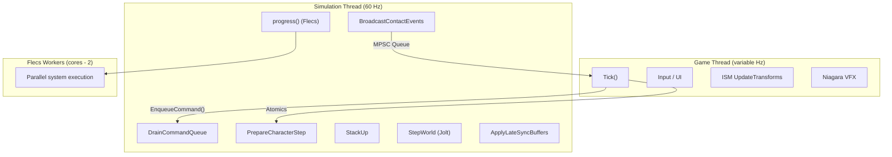
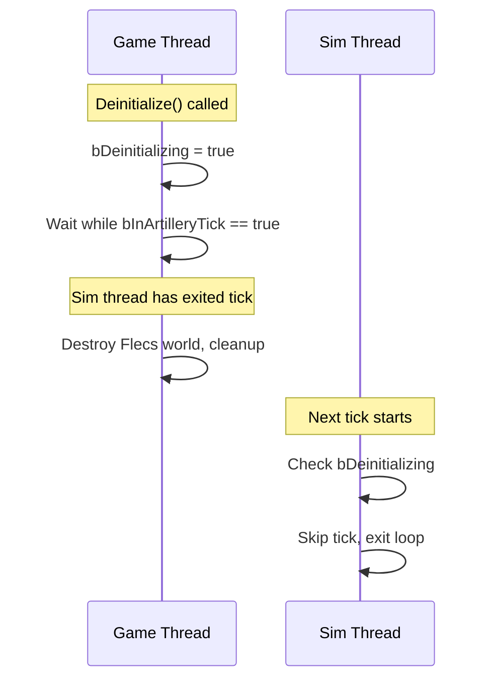

# Threading Rules

FatumGame runs a dedicated 60 Hz simulation thread alongside UE's game thread. Getting cross-thread communication wrong causes crashes, data races, or subtle desync. This document defines the rules.

---

## Thread Architecture



The simulation thread executes in this fixed order every tick:

1. **DrainCommandQueue** -- execute all enqueued lambdas from game thread
2. **PrepareCharacterStep** -- read atomics, compute character physics
3. **StackUp** -- kinematic body updates
4. **StepWorld** -- Jolt physics step (DilatedDT)
5. **BroadcastContactEvents** -- create FCollisionPair entities
6. **ApplyLateSyncBuffers** -- write FLateSyncBridge data to Flecs
7. **progress()** -- Flecs system execution (may spawn worker threads)

---

## The Cardinal Rule

!!! danger "NEVER mutate the Flecs world from the game thread"
    The Flecs world is owned by the simulation thread. Any direct mutation from the game thread is a data race. There are no exceptions.

    This includes: `entity.set<T>()`, `entity.add<T>()`, `entity.remove<T>()`, `entity.destruct()`, `world.entity()`, `world.each()`, and ANY Flecs API that writes.

---

## Communication Primitives

FatumGame uses five distinct patterns for cross-thread data flow. Each has a specific use case. Using the wrong one causes bugs.

### 1. EnqueueCommand (Game -> Sim)

**Use for:** Any mutation that must happen on the simulation thread.

```cpp
// Game thread
ArtillerySubsystem->EnqueueCommand([EntityId, Damage](UFlecsArtillerySubsystem* Sub)
{
    flecs::entity Entity = Sub->GetWorld().entity(EntityId);
    if (Entity.is_alive())
    {
        UFlecsDamageLibrary::QueueDamage(Entity, Damage);
    }
});
```

!!! note "Execution timing"
    Commands execute at the **start** of the next sim tick, during `DrainCommandQueue`, BEFORE `PrepareCharacterStep`. This means the command runs in the same tick as the physics step that follows it.

!!! warning "Capture rules"
    - Capture by **value**, never by reference (the game-thread stack frame is gone by execution time)
    - Never capture `this` of a game-thread object (may be GC'd)
    - Capture entity IDs (`uint64_t`), not `flecs::entity` handles (handle validity is thread-dependent)

### 2. Atomics (Bidirectional, Latest-Value-Wins)

**Use for:** Scalar values where only the latest value matters and intermediate values can be lost.

```cpp
// Game thread writes
SimWorker->DesiredTimeScale.store(0.5f, std::memory_order_relaxed);

// Sim thread reads
float Scale = DesiredTimeScale.load(std::memory_order_relaxed);
```

Examples in the codebase:

| Atomic | Direction | Purpose |
|--------|-----------|---------|
| `DesiredTimeScale` | Game -> Sim | Time dilation target |
| `bPlayerFullSpeed` | Game -> Sim | Player compensation flag |
| `TransitionSpeed` | Game -> Sim | Dilation transition speed |
| `ActiveTimeScalePublished` | Sim -> Game | Smoothed time scale for UE |
| `SimTickCount` | Sim -> Game | Current sim tick number |
| `LastSimDeltaTime` | Sim -> Game | Duration of last sim tick |
| `LastSimTickTimeSeconds` | Sim -> Game | Wall-clock time of last tick |
| Input atomics (MoveX, MoveY, etc.) | Game -> Sim | Player input |

!!! note "Memory ordering"
    Use `memory_order_relaxed` for independent values. Use `memory_order_release` / `memory_order_acquire` pairs when one atomic's value depends on another being visible first.

### 3. FLateSyncBridge (Game -> Sim, Multi-Field Consistent)

**Use for:** Groups of related fields that must be read as a consistent snapshot. A plain atomic per field would allow the sim thread to read field A from frame N and field B from frame N+1.

```cpp
// Game thread: write all fields, then publish
Bridge.AimDirectionX.store(Dir.X);
Bridge.AimDirectionY.store(Dir.Y);
Bridge.AimDirectionZ.store(Dir.Z);
Bridge.Publish();  // Atomic flag: "all fields are consistent now"

// Sim thread: read only after Publish
if (Bridge.HasNewData())
{
    FVector AimDir(Bridge.AimDirectionX.load(), ...);
}
```

### 4. MPSC Queues (Sim -> Game, Ordered)

**Use for:** Ordered sequences of events or spawn requests that must be processed in order on the game thread.

```cpp
// Sim thread: enqueue
PendingProjectileSpawns.Enqueue(FPendingProjectileSpawn{...});
PendingFragmentSpawns.Enqueue(FPendingFragmentSpawn{...});

// Game thread: drain
FPendingProjectileSpawn Spawn;
while (PendingProjectileSpawns.Dequeue(Spawn))
{
    // Create ISM instance, VFX, etc.
}
```

| Queue | Direction | Purpose |
|-------|-----------|---------|
| `PendingProjectileSpawns` | Sim -> Game | ISM instances for new projectiles |
| `PendingFragmentSpawns` | Sim -> Game | ISM instances for debris fragments |

### 5. FSimStateCache (Sim -> Game, Scalar Reads)

**Use for:** Game-thread code that needs to read simulation state (health, ammo, entity status) without touching Flecs.

```cpp
// Sim thread: cache writes happen in systems
SimStateCache->SetHealth(EntityId, CurrentHP, MaxHP);

// Game thread: UI reads cached values
float HP, MaxHP;
SimStateCache->GetHealth(EntityId, HP, MaxHP);
```

---

## Flecs Worker Thread Rules

During `progress()`, Flecs may spawn worker threads to execute systems in parallel.

!!! danger "Every Flecs worker thread must call `EnsureBarrageAccess()`"
    Any thread that touches Barrage (physics queries, body creation, position reads) MUST register with Jolt's thread system via `GrantClientFeed()`. The `EnsureBarrageAccess()` wrapper uses a `thread_local` guard to ensure this happens exactly once per thread.

```cpp
// Inside a Flecs system that touches Barrage
void MySystem(flecs::iter& It)
{
    EnsureBarrageAccess();  // thread_local guard, safe to call every tick

    while (It.next())
    {
        // ... use Barrage API ...
    }
}
```

---

## Deinitialize Safety

!!! danger "Deinitialize must wait for the sim thread"
    Game thread `Deinitialize()` can destroy the Flecs world while the sim thread is inside `progress()`. This causes a use-after-free crash.

The solution uses two atomic barriers:



```cpp
// Sim thread tick
bInArtilleryTick.store(true);
if (bDeinitializing.load())
{
    bInArtilleryTick.store(false);
    return;  // Exit cleanly
}
// ... do tick ...
bInArtilleryTick.store(false);

// Game thread deinitialize
bDeinitializing.store(true);
while (bInArtilleryTick.load())
{
    FPlatformProcess::Yield();  // Spin-wait for tick to finish
}
// Safe to destroy now
```

---

## SelfPtr Race Condition

`UBarrageDispatch::SelfPtr` is a static pointer accessed from Flecs worker threads. If `Deinitialize()` nulls it while a worker is mid-system, you get a use-after-free.

**Fix:** Cache the pointer as `CachedBarrageDispatch` at system registration time. Clear the cached pointer in `Deinitialize()` after the sim thread has stopped. Never access `SelfPtr` from worker threads.

---

## Summary Table

| Data Flow | Primitive | Direction | Ordering | Use Case |
|-----------|-----------|-----------|----------|----------|
| Mutations | `EnqueueCommand` | Game -> Sim | FIFO | Entity creation, damage, state changes |
| Scalars | `std::atomic` | Either | Latest wins | Input, time dilation, tick counters |
| Multi-field | `FLateSyncBridge` | Game -> Sim | Consistent snapshot | Aim direction, muzzle position |
| Ordered events | MPSC queue | Sim -> Game | FIFO | Spawn requests (ISM, VFX) |
| State reads | `FSimStateCache` | Sim -> Game | Latest wins | UI health/ammo display |
