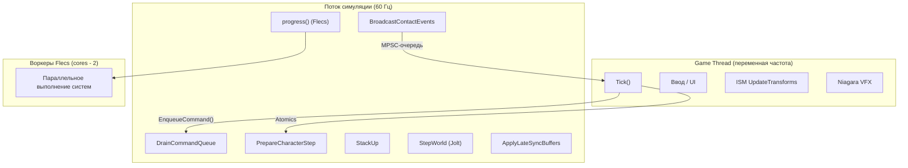
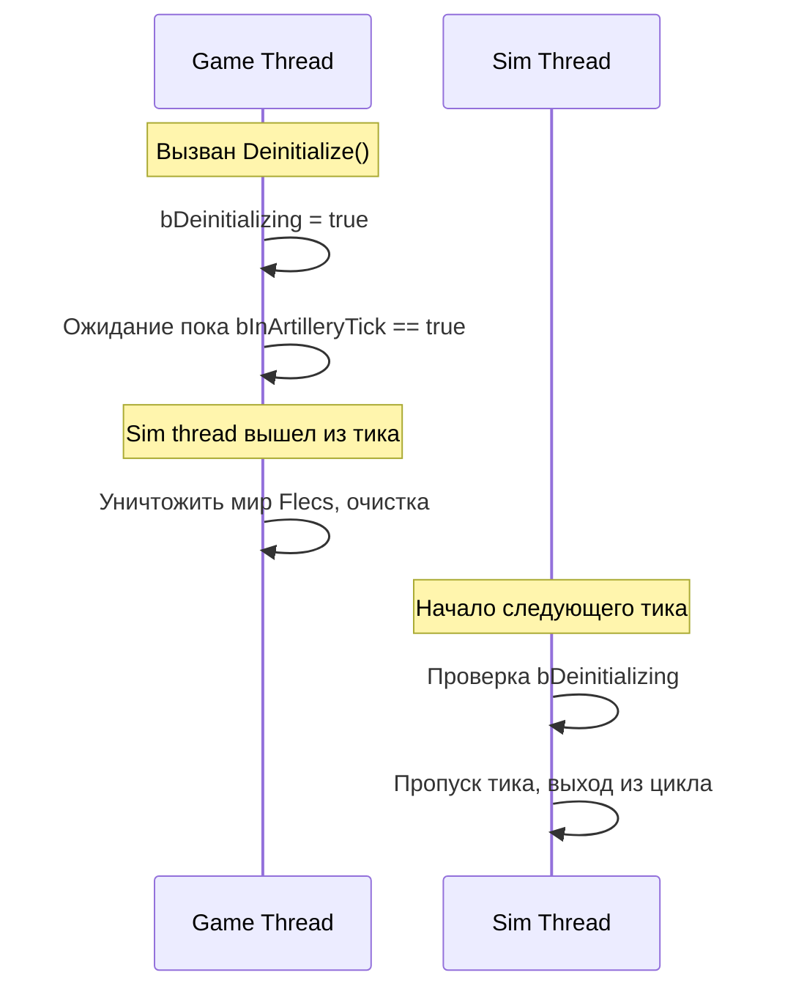

# Правила потоков

FatumGame запускает выделенный поток симуляции на 60 Гц параллельно с game thread UE. Неправильная межпоточная коммуникация вызывает краши, гонки данных или тонкую рассинхронизацию. Этот документ определяет правила.

---

## Архитектура потоков



Поток симуляции выполняется в этом фиксированном порядке каждый тик:

1. **DrainCommandQueue** -- выполнение всех поставленных в очередь лямбд с game thread
2. **PrepareCharacterStep** -- чтение atomics, расчёт физики персонажа
3. **StackUp** -- обновление кинематических тел
4. **StepWorld** -- шаг физики Jolt (DilatedDT)
5. **BroadcastContactEvents** -- создание сущностей FCollisionPair
6. **ApplyLateSyncBuffers** -- запись данных FLateSyncBridge в Flecs
7. **progress()** -- выполнение систем Flecs (может порождать рабочие потоки)

---

## Кардинальное правило

!!! danger "НИКОГДА не мутируйте мир Flecs с game thread"
    Мир Flecs принадлежит потоку симуляции. Любая прямая мутация с game thread -- это гонка данных. Исключений нет.

    Это включает: `entity.set<T>()`, `entity.add<T>()`, `entity.remove<T>()`, `entity.destruct()`, `world.entity()`, `world.each()` и ЛЮБОЙ Flecs API, который пишет.

---

## Примитивы коммуникации

FatumGame использует пять различных паттернов для межпоточного потока данных. У каждого свой конкретный случай использования. Использование неправильного вызывает баги.

### 1. EnqueueCommand (Game -> Sim)

**Используется для:** Любой мутации, которая должна произойти на потоке симуляции.

```cpp
// Game thread
ArtillerySubsystem->EnqueueCommand([EntityId, Damage](UFlecsArtillerySubsystem* Sub)
{
    flecs::entity Entity = Sub->GetWorld().entity(EntityId);
    if (Entity.is_alive())
    {
        UFlecsDamageLibrary::QueueDamage(Entity, Damage);
    }
});
```

!!! note "Момент выполнения"
    Команды выполняются в **начале** следующего тика симуляции, во время `DrainCommandQueue`, ДО `PrepareCharacterStep`. Это значит, что команда выполняется в том же тике, что и следующий за ней физический шаг.

!!! warning "Правила захвата"
    - Захватывайте по **значению**, никогда по ссылке (стек game thread уже не существует к моменту выполнения)
    - Никогда не захватывайте `this` объекта game thread (может быть собран GC)
    - Захватывайте entity ID (`uint64_t`), не `flecs::entity` хендлы (валидность хендла зависит от потока)

### 2. Atomics (двунаправленные, побеждает последнее значение)

**Используется для:** Скалярных значений, где важно только последнее значение и промежуточные могут быть потеряны.

```cpp
// Game thread пишет
SimWorker->DesiredTimeScale.store(0.5f, std::memory_order_relaxed);

// Sim thread читает
float Scale = DesiredTimeScale.load(std::memory_order_relaxed);
```

Примеры в кодовой базе:

| Atomic | Направление | Назначение |
|--------|------------|-----------|
| `DesiredTimeScale` | Game -> Sim | Целевое замедление времени |
| `bPlayerFullSpeed` | Game -> Sim | Флаг компенсации игрока |
| `TransitionSpeed` | Game -> Sim | Скорость перехода замедления |
| `ActiveTimeScalePublished` | Sim -> Game | Сглаженный масштаб времени для UE |
| `SimTickCount` | Sim -> Game | Номер текущего тика симуляции |
| `LastSimDeltaTime` | Sim -> Game | Длительность последнего тика симуляции |
| `LastSimTickTimeSeconds` | Sim -> Game | Wall-clock время последнего тика |
| Atomics ввода (MoveX, MoveY и т.д.) | Game -> Sim | Ввод игрока |

!!! note "Упорядочение памяти"
    Используйте `memory_order_relaxed` для независимых значений. Используйте пары `memory_order_release` / `memory_order_acquire`, когда значение одного atomic зависит от видимости другого.

### 3. FLateSyncBridge (Game -> Sim, консистентность множества полей)

**Используется для:** Групп связанных полей, которые должны читаться как консистентный снимок. Отдельный atomic на поле позволил бы sim thread прочитать поле A из кадра N, а поле B из кадра N+1.

```cpp
// Game thread: записать все поля, затем опубликовать
Bridge.AimDirectionX.store(Dir.X);
Bridge.AimDirectionY.store(Dir.Y);
Bridge.AimDirectionZ.store(Dir.Z);
Bridge.Publish();  // Атомарный флаг: "все поля консистентны"

// Sim thread: читать только после Publish
if (Bridge.HasNewData())
{
    FVector AimDir(Bridge.AimDirectionX.load(), ...);
}
```

### 4. MPSC-очереди (Sim -> Game, упорядоченные)

**Используется для:** Упорядоченных последовательностей событий или запросов на спавн, которые должны обрабатываться по порядку на game thread.

```cpp
// Sim thread: поставить в очередь
PendingProjectileSpawns.Enqueue(FPendingProjectileSpawn{...});
PendingFragmentSpawns.Enqueue(FPendingFragmentSpawn{...});

// Game thread: дренировать
FPendingProjectileSpawn Spawn;
while (PendingProjectileSpawns.Dequeue(Spawn))
{
    // Создать ISM-экземпляр, VFX и т.д.
}
```

| Очередь | Направление | Назначение |
|---------|------------|-----------|
| `PendingProjectileSpawns` | Sim -> Game | ISM-экземпляры для новых снарядов |
| `PendingFragmentSpawns` | Sim -> Game | ISM-экземпляры для фрагментов обломков |

### 5. FSimStateCache (Sim -> Game, скалярные чтения)

**Используется для:** Кода game thread, которому нужно читать состояние симуляции (здоровье, боезапас, статус сущности) без обращения к Flecs.

```cpp
// Sim thread: запись кеша в системах
SimStateCache->SetHealth(EntityId, CurrentHP, MaxHP);

// Game thread: UI читает кешированные значения
float HP, MaxHP;
SimStateCache->GetHealth(EntityId, HP, MaxHP);
```

---

## Правила рабочих потоков Flecs

Во время `progress()` Flecs может порождать рабочие потоки для параллельного выполнения систем.

!!! danger "Каждый рабочий поток Flecs должен вызвать `EnsureBarrageAccess()`"
    Любой поток, обращающийся к Barrage (физические запросы, создание тел, чтение позиций), ОБЯЗАН зарегистрироваться в потоковой системе Jolt через `GrantClientFeed()`. Обёртка `EnsureBarrageAccess()` использует guard `thread_local` для однократной регистрации каждого потока.

```cpp
// Внутри системы Flecs, обращающейся к Barrage
void MySystem(flecs::iter& It)
{
    EnsureBarrageAccess();  // thread_local guard, безопасно вызывать каждый тик

    while (It.next())
    {
        // ... использование Barrage API ...
    }
}
```

---

## Безопасность деинициализации

!!! danger "Deinitialize должен дождаться sim thread"
    `Deinitialize()` game thread может уничтожить мир Flecs, пока sim thread находится внутри `progress()`. Это вызывает краш use-after-free.

Решение использует два атомарных барьера:



```cpp
// Тик sim thread
bInArtilleryTick.store(true);
if (bDeinitializing.load())
{
    bInArtilleryTick.store(false);
    return;  // Чистый выход
}
// ... выполнение тика ...
bInArtilleryTick.store(false);

// Deinitialize game thread
bDeinitializing.store(true);
while (bInArtilleryTick.load())
{
    FPlatformProcess::Yield();  // Spin-wait до завершения тика
}
// Теперь безопасно уничтожать
```

---

## Гонка SelfPtr

`UBarrageDispatch::SelfPtr` -- статический указатель, к которому обращаются рабочие потоки Flecs. Если `Deinitialize()` обнулит его, пока воркер находится внутри системы, возникает use-after-free.

**Решение:** Кешировать указатель как `CachedBarrageDispatch` при регистрации систем. Очищать кешированный указатель в `Deinitialize()` после остановки sim thread. Никогда не обращаться к `SelfPtr` из рабочих потоков.

---

## Сводная таблица

| Поток данных | Примитив | Направление | Упорядочение | Случай использования |
|-------------|----------|------------|-------------|---------------------|
| Мутации | `EnqueueCommand` | Game -> Sim | FIFO | Создание сущностей, урон, изменения состояния |
| Скаляры | `std::atomic` | Любое | Побеждает последнее | Ввод, замедление времени, счётчики тиков |
| Множество полей | `FLateSyncBridge` | Game -> Sim | Консистентный снимок | Направление прицеливания, позиция дульного среза |
| Упорядоченные события | MPSC-очередь | Sim -> Game | FIFO | Запросы спавна (ISM, VFX) |
| Чтения состояния | `FSimStateCache` | Sim -> Game | Побеждает последнее | Отображение здоровья/боезапаса в UI |
