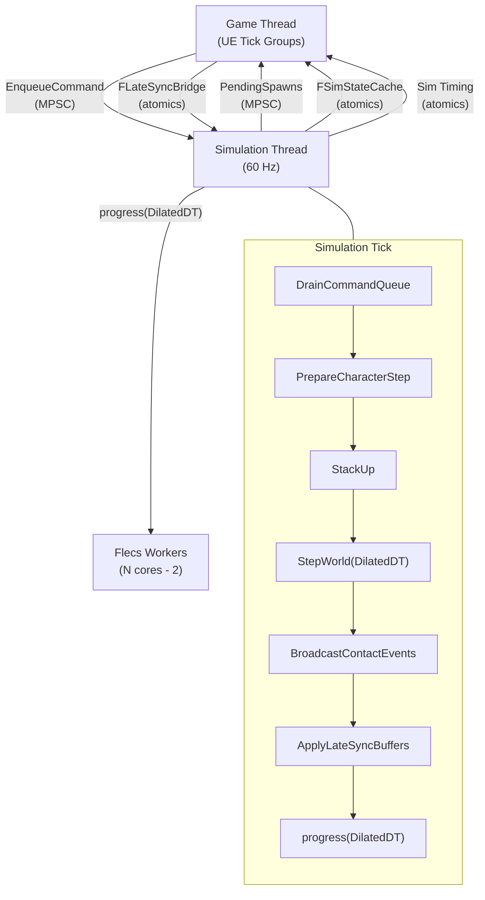

# FatumGame

**A high-performance UE5 game built on Flecs ECS, Jolt Physics (Barrage), and lock-free multithreading.**

FatumGame is an Unreal Engine 5.7 project that bypasses the traditional UE actor/component model for gameplay entities. Instead, it uses a dedicated 60 Hz simulation thread running [Flecs](https://github.com/SanderMertens/flecs) (Entity Component System) and [Jolt Physics](https://github.com/jrouwe/JoltPhysics) (via the Barrage plugin) to drive thousands of entities — projectiles, items, destructibles, doors — with deterministic tick rate and lock-free data flow.

UE remains the host: it provides rendering, input, UI (via CommonUI), and the editor. The game thread reads physics state directly from Jolt and interpolates ISM (Instanced Static Mesh) transforms for smooth visuals at any framerate.

---

## Tech Stack

| Layer | Technology | Role |
|-------|-----------|------|
| **Engine** | Unreal Engine 5.7 | Host runtime, rendering, editor, input |
| **ECS** | Flecs | Gameplay data and systems (health, damage, items, weapons) |
| **Physics** | Jolt (Barrage plugin) | Simulation, collision detection, raycasts, constraints |
| **Identity** | SkeletonKey | Nibble-typed 64-bit entity IDs across all subsystems |
| **UI** | FlecsUI plugin + CommonUI | Model/View panels, lock-free triple-buffer sync |
| **Rendering** | ISM + Niagara | Instanced meshes for ECS entities, Array DI for VFX |

## Core Architecture at a Glance

## Key Design Decisions

- **Separate simulation thread** — Decouples gameplay tick rate (60 Hz) from render framerate. Physics and ECS run deterministically regardless of GPU load. See [Why Simulation Thread](rationale/why-simulation-thread.md).

- **ECS over Actors for entities** — Projectiles, items, destructibles, and doors are Flecs entities rendered via ISM, not UE Actors. This eliminates per-entity GC overhead and enables O(1) archetype queries. See [Why ECS + Physics](rationale/why-ecs-plus-physics.md).

- **Lock-free communication** — Game and simulation threads never share a mutex. All cross-thread data flows through MPSC queues, atomics, or latest-value-wins bridges. See [Why Lock-Free](rationale/why-lock-free.md).

- **Collision pairs as entities** — Each physics contact spawns a temporary Flecs entity with classification tags. Domain systems process pairs in deterministic order. See [Why Collision Pairs](rationale/why-collision-pairs.md).

- **ISM rendering with interpolation** — Entities don't have UE scene proxies. The render manager lerps between previous and current physics positions using a sub-tick alpha. See [Why ISM Rendering](rationale/why-ism-rendering.md).

## Documentation Map

| Section | What You'll Find |
|---------|-----------------|
| [Architecture](architecture/overview.md) | High-level design, threading, ECS patterns, collision pipeline, rendering |
| [Systems](systems/spawn-pipeline.md) | Per-domain deep dives — spawning, damage, weapons, movement, items, interaction, destructibles |
| [API Reference](api/blueprint-libraries.md) | Blueprint libraries, data assets, ECS components, subsystems, actors |
| [Plugins](plugins/barrage.md) | Barrage (Jolt), Flecs integration, FlecsBarrage bridge, FlecsUI, SkeletonKey |
| [UI](ui/overview.md) | HUD, inventory, loot panel, model/view architecture |
| [Guidelines](guidelines/coding-standards.md) | Coding standards, threading rules, ECS pitfalls, step-by-step guides |
| [Rationale](rationale/why-ecs-plus-physics.md) | Why each major architectural decision was made |
| [Project](project/folder-structure.md) | Folder map, build setup, glossary |
