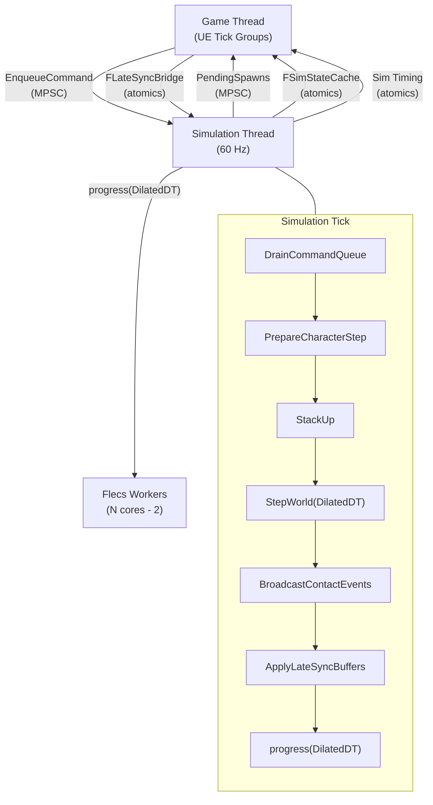

# FatumGame

**Высокопроизводительная игра на UE5, построенная на Flecs ECS, Jolt Physics (Barrage) и lock-free многопоточности.**

FatumGame — проект на Unreal Engine 5.7, который обходит традиционную модель акторов/компонентов UE для игровых сущностей. Вместо этого используется выделенный поток симуляции на 60 Гц, запускающий [Flecs](https://github.com/SanderMertens/flecs) (Entity Component System) и [Jolt Physics](https://github.com/jrouwe/JoltPhysics) (через плагин Barrage) для управления тысячами сущностей — снарядами, предметами, разрушаемыми объектами, дверями — с детерминированной частотой тиков и lock-free потоком данных.

UE остаётся хост-средой: предоставляет рендеринг, ввод, UI (через CommonUI) и редактор. Game thread напрямую считывает состояние физики из Jolt и интерполирует ISM-трансформы (Instanced Static Mesh) для плавной визуализации на любой частоте кадров.

---

## Технологический стек

| Слой | Технология | Роль |
|------|-----------|------|
| **Движок** | Unreal Engine 5.7 | Хост-рантайм, рендеринг, редактор, ввод |
| **ECS** | Flecs | Игровые данные и системы (здоровье, урон, предметы, оружие) |
| **Физика** | Jolt (плагин Barrage) | Симуляция, обнаружение столкновений, рейкасты, ограничения |
| **Идентификация** | SkeletonKey | 64-битные ID сущностей с типовым nibble для всех подсистем |
| **UI** | Плагин FlecsUI + CommonUI | Model/View панели, lock-free синхронизация через triple-buffer |
| **Рендеринг** | ISM + Niagara | Инстансированные меши для ECS-сущностей, Array DI для VFX |

## Архитектура на верхнем уровне

## Ключевые проектные решения

- **Отдельный поток симуляции** — Отвязывает частоту игрового тика (60 Гц) от частоты рендеринга. Физика и ECS работают детерминированно вне зависимости от нагрузки GPU. См. [Зачем поток симуляции](rationale/why-simulation-thread.md).

- **ECS вместо акторов для сущностей** — Снаряды, предметы, разрушаемые объекты и двери — это Flecs-сущности, отображаемые через ISM, а не UE-акторы. Это устраняет накладные расходы GC на каждую сущность и обеспечивает O(1) запросы по архетипам. См. [Зачем ECS + Физика](rationale/why-ecs-plus-physics.md).

- **Lock-free коммуникация** — Game thread и поток симуляции никогда не используют общий мьютекс. Весь межпоточный поток данных проходит через MPSC-очереди, атомики или bridge с семантикой «побеждает последнее значение». См. [Зачем Lock-Free](rationale/why-lock-free.md).

- **Пары столкновений как сущности** — Каждый физический контакт порождает временную Flecs-сущность с тегами классификации. Доменные системы обрабатывают пары в детерминированном порядке. См. [Зачем пары столкновений](rationale/why-collision-pairs.md).

- **ISM-рендеринг с интерполяцией** — У сущностей нет UE scene proxy. Менеджер рендеринга выполняет lerp между предыдущей и текущей позициями физики, используя sub-tick alpha. См. [Зачем ISM-рендеринг](rationale/why-ism-rendering.md).

## Карта документации

| Раздел | Что вы найдёте |
|--------|---------------|
| [Архитектура](architecture/overview.md) | Общий дизайн, потоки, ECS-паттерны, конвейер столкновений, рендеринг |
| [Системы](systems/spawn-pipeline.md) | Глубокий разбор по доменам — спавн, урон, оружие, движение, предметы, взаимодействие, разрушаемые объекты |
| [Справочник API](api/blueprint-libraries.md) | Blueprint-библиотеки, Data Assets, ECS-компоненты, подсистемы, акторы |
| [Плагины](plugins/barrage.md) | Barrage (Jolt), интеграция Flecs, мост FlecsBarrage, FlecsUI, SkeletonKey |
| [UI](ui/overview.md) | HUD, инвентарь, панель лута, архитектура Model/View |
| [Руководства](guidelines/coding-standards.md) | Стандарты кодирования, правила потоков, подводные камни ECS, пошаговые инструкции |
| [Обоснования](rationale/why-ecs-plus-physics.md) | Почему было принято каждое крупное архитектурное решение |
| [Проект](project/folder-structure.md) | Карта папок, настройка сборки, глоссарий |
