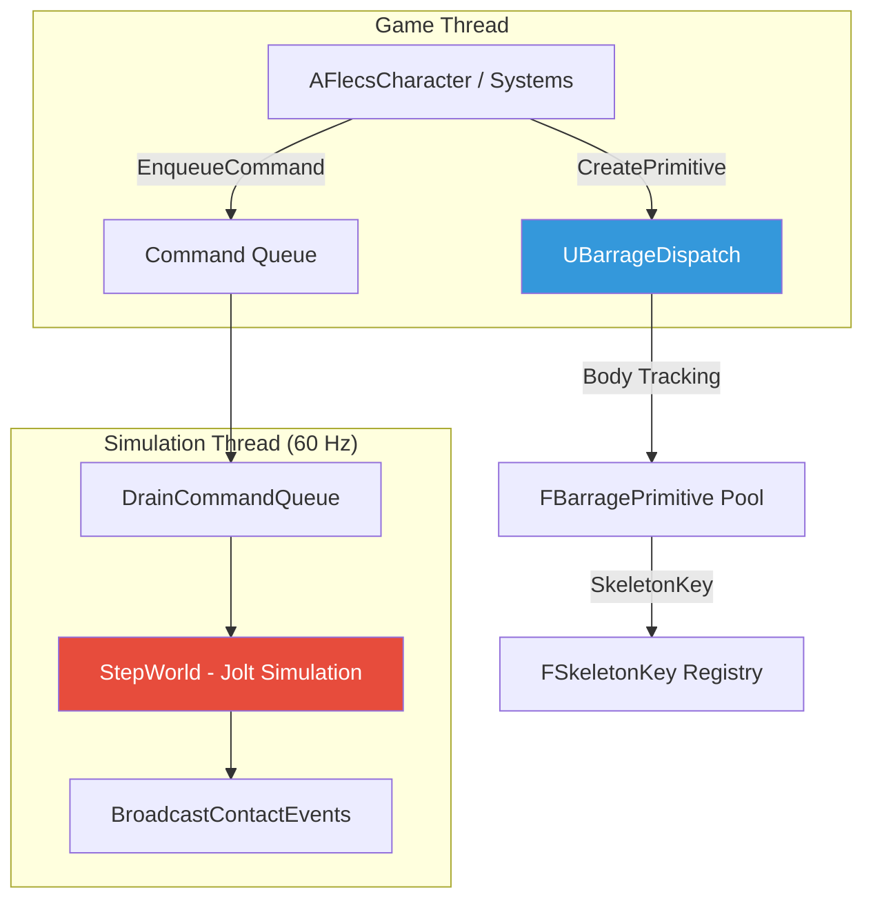
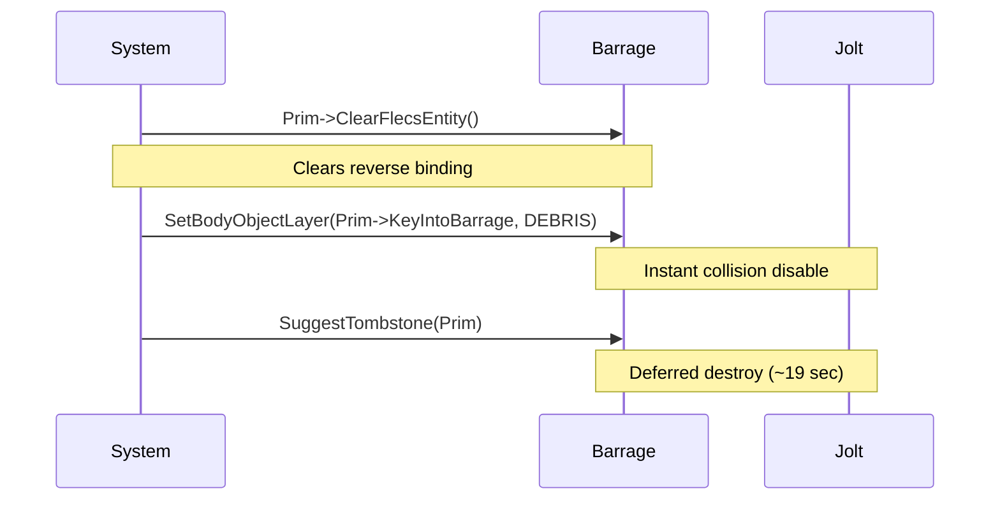

# Barrage (Jolt Physics) Plugin

Barrage is FatumGame's physics layer — a thin UE wrapper around **Jolt Physics** that replaces PhysX/Chaos entirely. It runs on a dedicated simulation thread at 60 Hz and provides body management, raycasting, constraints, and collision detection through a lock-free, thread-safe API.

## Architecture Overview



## UBarrageDispatch Subsystem

`UBarrageDispatch` is a **UWorldSubsystem** and the central entry point for all physics operations. It owns the Jolt `PhysicsSystem`, manages body lifecycles, and provides the API for raycasts, body creation, and constraint management.

```cpp
// Access from any game-thread code
UBarrageDispatch* Barrage = GetWorld()->GetSubsystem<UBarrageDispatch>();
```

### Initialization Order

!!! warning "Subsystem Dependencies"
    Any subsystem that uses Barrage **must** declare the dependency in `Initialize()` **before** calling `Super::Initialize()`:

    ```cpp
    void UMySubsystem::Initialize(FSubsystemCollectionBase& Collection)
    {
        Collection.InitializeDependency<UBarrageDispatch>();
        Super::Initialize(Collection);
    }
    ```

### Key Members

| Member | Purpose |
|--------|---------|
| `PhysicsSystem` | Jolt physics world |
| `SelfPtr` | Cached pointer for cross-thread access |
| `TranslationMapping` | SkeletonKey to FBarragePrimitive map (for bound entities) |
| `BodyTracking` | All bodies created via CreatePrimitive |

---

## FBarragePrimitive

`FBarragePrimitive` is the C++ representation of a Jolt physics body. It holds the `SkeletonKey` (typed 64-bit ID), the Jolt `BodyID`, and an atomic back-pointer to the Flecs entity.

```cpp
struct FBarragePrimitive
{
    FSkeletonKey KeyIntoBarrage;  // Unique ID
    JPH::BodyID JoltBodyID;       // Jolt handle
    std::atomic<uint64_t> FlecsEntityId;  // Lock-free reverse binding

    flecs::entity GetFlecsEntity() const;
    void ClearFlecsEntity();
};
```

### Forward and Reverse Binding


| Direction | Lookup | Complexity |
|-----------|--------|------------|
| Entity to BarrageKey | `entity.get<FBarrageBody>()->BarrageKey` | O(1) via Flecs |
| BarrageKey to Entity | `FBLet->GetFlecsEntity()` | O(1) via atomic |

!!! danger "Two Lookup Tables"
    - **`GetBarrageKeyFromSkeletonKey()`** uses `TranslationMapping` (populated by `BindEntityToBarrage`)
    - **`GetShapeRef()`** uses body tracking (populated by `CreatePrimitive`)

    **Pool bodies** (e.g., debris) are in body tracking but NOT TranslationMapping. For pool bodies, use `GetShapeRef(Key)->KeyIntoBarrage`.

---

## Object Layers

Jolt uses object layers to control which bodies collide with which. Barrage defines the following layers:

| Layer | Value | Description | Collides With |
|-------|-------|-------------|---------------|
| `MOVING` | 0 | Dynamic gameplay objects | MOVING, NON_MOVING, SENSOR |
| `NON_MOVING` | 1 | Static world geometry | MOVING, PROJECTILE, CHARACTER |
| `PROJECTILE` | 2 | Player projectiles | NON_MOVING, CHARACTER, ENEMYPROJECTILE |
| `ENEMYPROJECTILE` | 3 | Enemy projectiles | NON_MOVING, CHARACTER, PROJECTILE |
| `DEBRIS` | 4 | Dead/dying objects | Nothing (collision disabled) |
| `CHARACTER` | 5 | Player/NPC capsules | MOVING, NON_MOVING, PROJECTILE, ENEMYPROJECTILE |
| `SENSOR` | 6 | Trigger volumes (no physics response) | CHARACTER, MOVING |
| `CAST_QUERY` | 7 | Raycast-only layer | All except DEBRIS |

!!! tip "DEBRIS as Kill Switch"
    Setting a body to the `DEBRIS` layer **instantly** disables all collisions. This is the first step in the tombstone destruction pattern (see below).

---

## Body Creation

### CreatePrimitive

The general-purpose body factory. Returns an `FBarragePrimitive*` tracked by Barrage.

```cpp
FBarragePrimitive* Prim = Barrage->CreatePrimitive(
    ShapeSettings,      // Jolt shape (sphere, box, capsule, etc.)
    Position,           // Initial position (Jolt coordinates)
    Rotation,           // Initial rotation
    MotionType,         // Static, Kinematic, or Dynamic
    ObjectLayer,        // MOVING, PROJECTILE, etc.
    SkeletonKey         // Pre-generated typed key
);
```

### CreateBouncingSphere

Convenience method for projectiles that need bounce behavior:

```cpp
FBarragePrimitive* Prim = Barrage->CreateBouncingSphere(
    Radius,
    Position,
    Velocity,
    Restitution,        // Bounciness (0-1)
    ObjectLayer,        // PROJECTILE or ENEMYPROJECTILE
    SkeletonKey
);
```

### FBCharacterBase

Character bodies use a specialized capsule with custom movement integration:

```cpp
FBCharacterBase* CharBody = Barrage->CreateCharacterBody(
    CapsuleHalfHeight,
    CapsuleRadius,
    Position,
    SkeletonKey
);
```

!!! warning "Static Bodies and MotionProperties"
    Bodies created as `EMotionType::Static` / `NON_MOVING` do **NOT** allocate Jolt `MotionProperties`. Changing to `Dynamic` later only flips a flag — it does NOT retroactively allocate MotionProperties. Calling `GetMotionProperties()` returns **nullptr** and crashes.

    **Fix:** Always create bodies as `Dynamic`/`MOVING` from the start if you need mass, damping, or constraint control.

---

## Raycasts

Barrage provides raycasting through Jolt's query system. UE line traces cannot see ECS entities (they are ISM-rendered with no UE actors), so all gameplay raycasts go through Barrage.

### CastRay

```cpp
FBarrageRayResult Result;
bool bHit = Barrage->CastRay(
    Origin,             // Start point (Jolt coordinates)
    Direction * Distance, // Direction * distance (NOT unit vector!)
    Result,
    LayerFilter         // Which layers to test against
);
```

!!! danger "CastRay Direction Parameter"
    The direction parameter is `direction * distance`, **NOT** a unit vector. Passing a unit vector gives you a 1-meter ray.

### SphereCast

Used for interaction detection (wider area than a ray):

```cpp
FBarrageRayResult Result;
bool bHit = Barrage->SphereCast(
    Origin,
    Radius,
    Direction * Distance,
    Result,
    LayerFilter
);
```

### Filter Patterns

```cpp
// Exclude specific layers from raycast
FastExcludeObjectLayerFilter Filter({
    Layers::PROJECTILE,
    Layers::ENEMYPROJECTILE,
    Layers::DEBRIS
});
Barrage->CastRay(Origin, Dir, Result, Filter);
```

!!! warning "Aim Raycast Hitting Projectiles"
    `CAST_QUERY` collides with `PROJECTILE` layer by default. For aim raycasts, always exclude `PROJECTILE`, `ENEMYPROJECTILE`, and `DEBRIS` layers.

!!! bug "JPH Non-Copyable Filter"
    Never use a ternary operator with `IgnoreSingleBodyFilter` — Jolt filters are non-copyable (C2280 compiler error). Use if/else blocks instead.

---

## Constraints

Barrage wraps Jolt's constraint system through `FBarrageConstraintSystem`. Supported constraint types:

### Fixed Constraint

Rigidly locks two bodies together (or a body to the world):

```cpp
FBarrageConstraintHandle Handle = Barrage->CreateFixedConstraint(
    BodyKeyA,
    BodyKeyB,           // Invalid key (KeyIntoBarrage == 0) = fixed to world
    BreakForce,
    BreakTorque
);
```

### Hinge Constraint

Rotation around a single axis (doors, hinged panels):

```cpp
FBarrageConstraintHandle Handle = Barrage->CreateHingeConstraint(
    BodyKeyA,
    BodyKeyB,
    HingeAxis,
    MinAngle,
    MaxAngle
);
```

### Distance Constraint

Spring-like connection maintaining distance between two points:

```cpp
FBarrageConstraintHandle Handle = Barrage->CreateDistanceConstraint(
    BodyKeyA,
    BodyKeyB,
    MinDistance,
    MaxDistance,
    Frequency,          // Spring frequency in Hz
    Damping
);
```

!!! tip "World Anchors"
    To anchor a body to the world (e.g., bottom fragments of destructible objects), pass an `FBarrageKey` with `KeyIntoBarrage == 0` as Body2. Barrage auto-uses `Body::sFixedToWorld`.

!!! warning "Constraint Anchor Positioning"
    `SetBodyPositionDirect()` teleports a body but leaves velocity at zero. The Jolt constraint solver applies only Baumgarte stabilization (~5%/tick), causing massive lag when driving a constraint anchor.

    **Fix:** Use `MoveKinematicBody(Key, TargetPos, DT)` which calls `body_interface->MoveKinematic()` and sets velocity = `(target - current) / dt`.

### Force Coordinate Gotcha

!!! danger "FromJoltCoordinatesD is for POSITIONS, Not Forces"
    `CoordinateUtils::FromJoltCoordinatesD()` multiplies by 100 (meters to centimeters). Forces in Newtons need only the axis swap (Y swapped with Z), **NOT** the x100 scaling. Using `FromJoltCoordinatesD` for constraint forces inflates values 100x, causing instant constraint breaks.

---

## Tombstone Pattern (Entity Destruction)

The safe pattern for destroying physics bodies in Barrage:



```cpp
// CORRECT destruction sequence
Prim->ClearFlecsEntity();
CachedBarrageDispatch->SetBodyObjectLayer(
    Prim->KeyIntoBarrage, Layers::DEBRIS
);
CachedBarrageDispatch->SuggestTombstone(Prim);
```

!!! danger "NEVER use FinalizeReleasePrimitive()"
    `FinalizeReleasePrimitive()` corrupts Jolt state and causes crashes on PIE exit (`BodyManager::DestroyBodies`). Always use the DEBRIS layer + tombstone pattern instead.

### Why Two Steps?

1. **SetBodyObjectLayer(DEBRIS)** — Instantly removes the body from all collision pairs. No more contact events.
2. **SuggestTombstone()** — Schedules the body for safe deferred destruction (~19 seconds later), allowing any in-flight references to expire naturally.

---

## Thread Safety

### GrantClientFeed / EnsureBarrageAccess

!!! danger "Thread Registration Required"
    **Any thread** that touches Barrage APIs **must** register itself first. Failure to register causes undefined behavior or crashes in Jolt.

```cpp
// For known threads (sim thread, game thread)
Barrage->GrantClientFeed(ThreadId);

// For Flecs worker threads (uses thread_local guard)
EnsureBarrageAccess();
```

The `EnsureBarrageAccess()` pattern uses a `thread_local bool` to ensure registration happens exactly once per thread:

```cpp
void EnsureBarrageAccess()
{
    thread_local bool bRegistered = false;
    if (!bRegistered)
    {
        Barrage->GrantClientFeed(/* current thread */);
        bRegistered = true;
    }
}
```

### SetPosition is QUEUED

!!! warning "SetPosition is Not Synchronous"
    `FBarragePrimitive::SetPosition()` and `ApplyRotation()` **enqueue** to `ThreadAcc.Queue` and are applied next tick during `DrainCommandQueue`. They are NOT immediate.

    For cases where position must be committed immediately (e.g., before constraint `bAutoDetectAnchor`), use:

    - `SetBodyPositionDirect()` — via Jolt `body_interface`
    - `SetBodyRotationDirect()` — via Jolt `body_interface`

### Command Queue Pattern

Game thread code that needs to run on the simulation thread uses `EnqueueCommand()`:

```cpp
ArtillerySubsystem->EnqueueCommand([](/* captured state */)
{
    // This runs on the sim thread before StepWorld
    // Safe to access Barrage directly here
});
```

---

## Coordinate System

Jolt uses meters with Y-up. Unreal uses centimeters with Z-up. Barrage provides conversion utilities:

| Conversion | Function | Notes |
|-----------|----------|-------|
| UE to Jolt position | `ToJoltCoordinates()` | cm to m, swap Y/Z |
| Jolt to UE position | `FromJoltCoordinatesD()` | m to cm, swap Y/Z |
| Jolt force to UE | Axis swap only | Do NOT multiply by 100 |

---

## Summary of Critical Rules

| Rule | Consequence of Violation |
|------|------------------------|
| Never use `FinalizeReleasePrimitive()` | Crash on PIE exit |
| Always register threads with `GrantClientFeed()` | Undefined behavior / crash |
| Use DEBRIS + Tombstone for destruction | Ghost collisions |
| `CastRay` direction = dir * distance | 1-meter ray |
| Create Dynamic if you need MotionProperties | nullptr crash |
| `SetPosition` is queued, not immediate | Stale position for 1 tick |
| Forces need axis swap only, not x100 | 100x force inflation |
