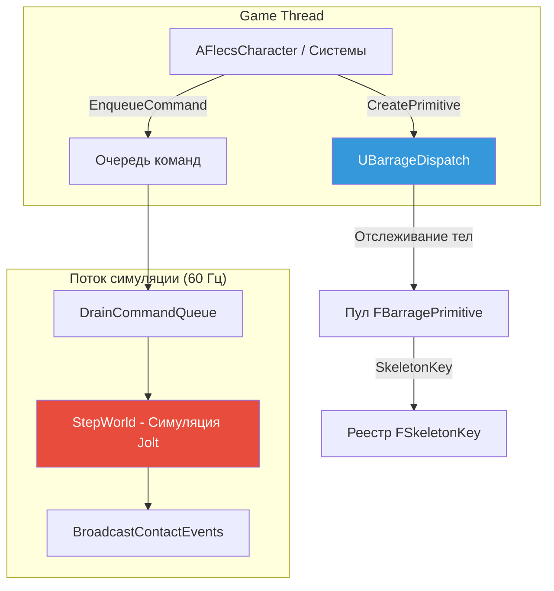
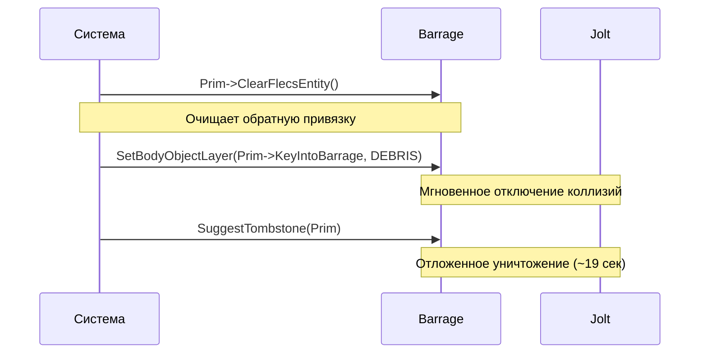

# Плагин Barrage (Jolt Physics)

Barrage -- физический слой FatumGame, тонкая UE-обёртка над **Jolt Physics**, полностью заменяющая PhysX/Chaos. Работает на выделенном потоке симуляции с частотой 60 Гц и обеспечивает управление телами, рейкасты, констрейнты и обнаружение столкновений через lock-free, потокобезопасный API.

## Обзор архитектуры



## Подсистема UBarrageDispatch

`UBarrageDispatch` -- это **UWorldSubsystem** и центральная точка входа для всех физических операций. Владеет `PhysicsSystem` Jolt, управляет жизненным циклом тел и предоставляет API для рейкастов, создания тел и управления констрейнтами.

```cpp
// Доступ из любого кода game thread
UBarrageDispatch* Barrage = GetWorld()->GetSubsystem<UBarrageDispatch>();
```

### Порядок инициализации

!!! warning "Зависимости подсистем"
    Любая подсистема, использующая Barrage, **должна** объявить зависимость в `Initialize()` **до** вызова `Super::Initialize()`:

    ```cpp
    void UMySubsystem::Initialize(FSubsystemCollectionBase& Collection)
    {
        Collection.InitializeDependency<UBarrageDispatch>();
        Super::Initialize(Collection);
    }
    ```

### Ключевые члены

| Член | Назначение |
|------|-----------|
| `PhysicsSystem` | Физический мир Jolt |
| `SelfPtr` | Кешированный указатель для межпоточного доступа |
| `TranslationMapping` | Карта SkeletonKey -> FBarragePrimitive (для привязанных сущностей) |
| `BodyTracking` | Все тела, созданные через CreatePrimitive |

---

## FBarragePrimitive

`FBarragePrimitive` -- C++-представление физического тела Jolt. Хранит `SkeletonKey` (типизированный 64-битный ID), `BodyID` Jolt и атомарный обратный указатель на сущность Flecs.

```cpp
struct FBarragePrimitive
{
    FSkeletonKey KeyIntoBarrage;  // Уникальный ID
    JPH::BodyID JoltBodyID;       // Хендл Jolt
    std::atomic<uint64_t> FlecsEntityId;  // Lock-free обратная привязка

    flecs::entity GetFlecsEntity() const;
    void ClearFlecsEntity();
};
```

### Прямая и обратная привязка


| Направление | Поиск | Сложность |
|-------------|-------|-----------|
| Сущность -> BarrageKey | `entity.get<FBarrageBody>()->BarrageKey` | O(1) через Flecs |
| BarrageKey -> Сущность | `FBLet->GetFlecsEntity()` | O(1) через atomic |

!!! danger "Две таблицы поиска"
    - **`GetBarrageKeyFromSkeletonKey()`** использует `TranslationMapping` (заполняется через `BindEntityToBarrage`)
    - **`GetShapeRef()`** использует отслеживание тел (заполняется через `CreatePrimitive`)

    **Тела пула** (например, обломки) находятся в отслеживании тел, но НЕ в TranslationMapping. Для тел пула используйте `GetShapeRef(Key)->KeyIntoBarrage`.

---

## Слои объектов

Jolt использует слои объектов для управления тем, какие тела сталкиваются друг с другом. Barrage определяет следующие слои:

| Слой | Значение | Описание | Сталкивается с |
|------|----------|----------|---------------|
| `MOVING` | 0 | Динамические игровые объекты | MOVING, NON_MOVING, SENSOR |
| `NON_MOVING` | 1 | Статическая геометрия мира | MOVING, PROJECTILE, CHARACTER |
| `PROJECTILE` | 2 | Снаряды игрока | NON_MOVING, CHARACTER, ENEMYPROJECTILE |
| `ENEMYPROJECTILE` | 3 | Снаряды врагов | NON_MOVING, CHARACTER, PROJECTILE |
| `DEBRIS` | 4 | Мёртвые/умирающие объекты | Ничего (коллизии отключены) |
| `CHARACTER` | 5 | Капсулы игрока/NPC | MOVING, NON_MOVING, PROJECTILE, ENEMYPROJECTILE |
| `SENSOR` | 6 | Триггерные объёмы (без физической реакции) | CHARACTER, MOVING |
| `CAST_QUERY` | 7 | Слой только для рейкастов | Все кроме DEBRIS |

!!! tip "DEBRIS как выключатель"
    Установка тела на слой `DEBRIS` **мгновенно** отключает все коллизии. Это первый шаг в паттерне уничтожения tombstone (см. ниже).

---

## Создание тел

### CreatePrimitive

Универсальная фабрика тел. Возвращает `FBarragePrimitive*`, отслеживаемый Barrage.

```cpp
FBarragePrimitive* Prim = Barrage->CreatePrimitive(
    ShapeSettings,      // Форма Jolt (сфера, бокс, капсула и т.д.)
    Position,           // Начальная позиция (координаты Jolt)
    Rotation,           // Начальный поворот
    MotionType,         // Static, Kinematic или Dynamic
    ObjectLayer,        // MOVING, PROJECTILE и т.д.
    SkeletonKey         // Предгенерированный типизированный ключ
);
```

### CreateBouncingSphere

Удобный метод для снарядов с поведением отскока:

```cpp
FBarragePrimitive* Prim = Barrage->CreateBouncingSphere(
    Radius,
    Position,
    Velocity,
    Restitution,        // Упругость (0-1)
    ObjectLayer,        // PROJECTILE или ENEMYPROJECTILE
    SkeletonKey
);
```

### FBCharacterBase

Тела персонажей используют специализированную капсулу с пользовательской интеграцией движения:

```cpp
FBCharacterBase* CharBody = Barrage->CreateCharacterBody(
    CapsuleHalfHeight,
    CapsuleRadius,
    Position,
    SkeletonKey
);
```

!!! warning "Статические тела и MotionProperties"
    Тела, созданные как `EMotionType::Static` / `NON_MOVING`, **НЕ** выделяют `MotionProperties` Jolt. Смена на `Dynamic` позже только меняет флаг -- НЕ выделяет MotionProperties ретроактивно. Вызов `GetMotionProperties()` возвращает **nullptr** и приводит к крашу.

    **Решение:** Всегда создавайте тела как `Dynamic`/`MOVING` с самого начала, если вам нужен контроль массы, демпфирования или констрейнтов.

---

## Рейкасты

Barrage предоставляет рейкасты через систему запросов Jolt. UE line traces не видят ECS-сущности (они рендерятся через ISM без UE-акторов), поэтому все игровые рейкасты идут через Barrage.

### CastRay

```cpp
FBarrageRayResult Result;
bool bHit = Barrage->CastRay(
    Origin,             // Начальная точка (координаты Jolt)
    Direction * Distance, // Направление * дистанция (НЕ единичный вектор!)
    Result,
    LayerFilter         // Какие слои тестировать
);
```

!!! danger "Параметр направления CastRay"
    Параметр направления -- это `direction * distance`, **НЕ** единичный вектор. Передача единичного вектора даст вам луч длиной 1 метр.

### SphereCast

Используется для обнаружения взаимодействия (более широкая область, чем луч):

```cpp
FBarrageRayResult Result;
bool bHit = Barrage->SphereCast(
    Origin,
    Radius,
    Direction * Distance,
    Result,
    LayerFilter
);
```

### Паттерны фильтров

```cpp
// Исключить конкретные слои из рейкаста
FastExcludeObjectLayerFilter Filter({
    Layers::PROJECTILE,
    Layers::ENEMYPROJECTILE,
    Layers::DEBRIS
});
Barrage->CastRay(Origin, Dir, Result, Filter);
```

!!! warning "Рейкаст прицеливания попадает в снаряды"
    `CAST_QUERY` по умолчанию сталкивается со слоем `PROJECTILE`. Для рейкастов прицеливания всегда исключайте слои `PROJECTILE`, `ENEMYPROJECTILE` и `DEBRIS`.

!!! bug "JPH Non-Copyable Filter"
    Никогда не используйте тернарный оператор с `IgnoreSingleBodyFilter` -- фильтры Jolt некопируемы (ошибка компилятора C2280). Используйте блоки if/else.

---

## Констрейнты

Barrage оборачивает систему констрейнтов Jolt через `FBarrageConstraintSystem`. Поддерживаемые типы констрейнтов:

### Фиксированный констрейнт

Жёстко блокирует два тела вместе (или тело к миру):

```cpp
FBarrageConstraintHandle Handle = Barrage->CreateFixedConstraint(
    BodyKeyA,
    BodyKeyB,           // Невалидный ключ (KeyIntoBarrage == 0) = фиксация к миру
    BreakForce,
    BreakTorque
);
```

### Шарнирный констрейнт

Вращение вокруг одной оси (двери, шарнирные панели):

```cpp
FBarrageConstraintHandle Handle = Barrage->CreateHingeConstraint(
    BodyKeyA,
    BodyKeyB,
    HingeAxis,
    MinAngle,
    MaxAngle
);
```

### Дистанционный констрейнт

Пружинное соединение, поддерживающее дистанцию между двумя точками:

```cpp
FBarrageConstraintHandle Handle = Barrage->CreateDistanceConstraint(
    BodyKeyA,
    BodyKeyB,
    MinDistance,
    MaxDistance,
    Frequency,          // Частота пружины в Гц
    Damping
);
```

!!! tip "Якоря к миру"
    Для привязки тела к миру (например, нижние фрагменты разрушаемых объектов) передайте `FBarrageKey` с `KeyIntoBarrage == 0` как Body2. Barrage автоматически использует `Body::sFixedToWorld`.

!!! warning "Позиционирование якоря констрейнта"
    `SetBodyPositionDirect()` телепортирует тело, но оставляет скорость равной нулю. Солвер констрейнтов Jolt применяет только стабилизацию Baumgarte (~5%/тик), вызывая большое отставание при управлении якорем констрейнта.

    **Решение:** Используйте `MoveKinematicBody(Key, TargetPos, DT)`, который вызывает `body_interface->MoveKinematic()` и устанавливает скорость = `(target - current) / dt`.

### Подводный камень координат сил

!!! danger "FromJoltCoordinatesD для ПОЗИЦИЙ, не для сил"
    `CoordinateUtils::FromJoltCoordinatesD()` умножает на 100 (метры в сантиметры). Силы в Ньютонах нуждаются только в обмене осей (Y меняется с Z), **НЕ** в умножении на 100. Использование `FromJoltCoordinatesD` для сил констрейнтов раздувает значения в 100 раз, вызывая мгновенные разрывы констрейнтов.

---

## Паттерн Tombstone (уничтожение сущностей)

Безопасный паттерн уничтожения физических тел в Barrage:



```cpp
// ПРАВИЛЬНАЯ последовательность уничтожения
Prim->ClearFlecsEntity();
CachedBarrageDispatch->SetBodyObjectLayer(
    Prim->KeyIntoBarrage, Layers::DEBRIS
);
CachedBarrageDispatch->SuggestTombstone(Prim);
```

!!! danger "НИКОГДА не используйте FinalizeReleasePrimitive()"
    `FinalizeReleasePrimitive()` повреждает состояние Jolt и вызывает краши при выходе из PIE (`BodyManager::DestroyBodies`). Всегда используйте паттерн DEBRIS layer + tombstone.

### Почему два шага?

1. **SetBodyObjectLayer(DEBRIS)** -- мгновенно удаляет тело из всех пар столкновений. Больше никаких контактных событий.
2. **SuggestTombstone()** -- планирует безопасное отложенное уничтожение тела (~19 секунд спустя), позволяя всем текущим ссылкам естественно истечь.

---

## Потокобезопасность

### GrantClientFeed / EnsureBarrageAccess

!!! danger "Требуется регистрация потока"
    **Любой поток**, обращающийся к API Barrage, **должен** сначала зарегистрироваться. Отсутствие регистрации вызывает неопределённое поведение или краши в Jolt.

```cpp
// Для известных потоков (sim thread, game thread)
Barrage->GrantClientFeed(ThreadId);

// Для рабочих потоков Flecs (использует thread_local guard)
EnsureBarrageAccess();
```

Паттерн `EnsureBarrageAccess()` использует `thread_local bool` для гарантии однократной регистрации каждого потока:

```cpp
void EnsureBarrageAccess()
{
    thread_local bool bRegistered = false;
    if (!bRegistered)
    {
        Barrage->GrantClientFeed(/* current thread */);
        bRegistered = true;
    }
}
```

### SetPosition -- это ОЧЕРЕДЬ

!!! warning "SetPosition не синхронный"
    `FBarragePrimitive::SetPosition()` и `ApplyRotation()` **ставятся в очередь** `ThreadAcc.Queue` и применяются на следующем тике во время `DrainCommandQueue`. Они НЕ мгновенные.

    Когда позиция должна быть зафиксирована немедленно (например, перед `bAutoDetectAnchor` констрейнта), используйте:

    - `SetBodyPositionDirect()` -- через `body_interface` Jolt
    - `SetBodyRotationDirect()` -- через `body_interface` Jolt

### Паттерн очереди команд

Код game thread, который должен выполниться на потоке симуляции, использует `EnqueueCommand()`:

```cpp
ArtillerySubsystem->EnqueueCommand([](/* captured state */)
{
    // Выполняется на sim thread перед StepWorld
    // Безопасно обращаться к Barrage напрямую
});
```

---

## Система координат

Jolt использует метры с осью Y вверх. Unreal использует сантиметры с осью Z вверх. Barrage предоставляет утилиты конвертации:

| Конвертация | Функция | Примечания |
|-------------|---------|-----------|
| UE -> Jolt позиция | `ToJoltCoordinates()` | см -> м, обмен Y/Z |
| Jolt -> UE позиция | `FromJoltCoordinatesD()` | м -> см, обмен Y/Z |
| Сила Jolt -> UE | Только обмен осей | НЕ умножать на 100 |

---

## Сводка критических правил

| Правило | Последствия нарушения |
|---------|----------------------|
| Никогда не использовать `FinalizeReleasePrimitive()` | Краш при выходе из PIE |
| Всегда регистрировать потоки через `GrantClientFeed()` | Неопределённое поведение / краш |
| Использовать DEBRIS + Tombstone для уничтожения | Призрачные коллизии |
| Направление `CastRay` = dir * distance | Луч длиной 1 метр |
| Создавать Dynamic, если нужны MotionProperties | nullptr краш |
| `SetPosition` -- очередь, не мгновенный | Устаревшая позиция на 1 тик |
| Силы -- только обмен осей, не x100 | Раздувание силы в 100 раз |
