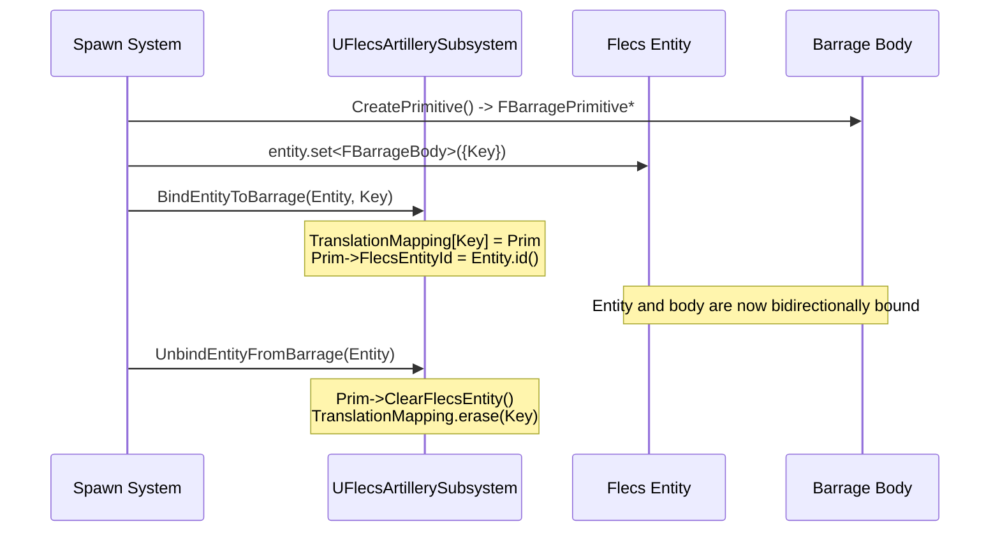
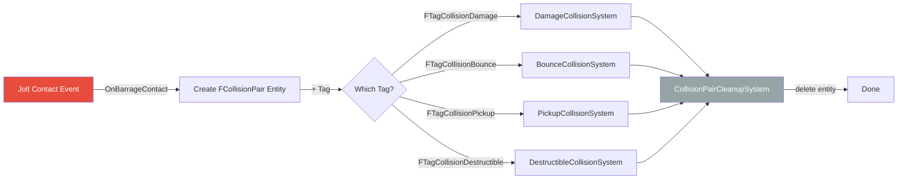
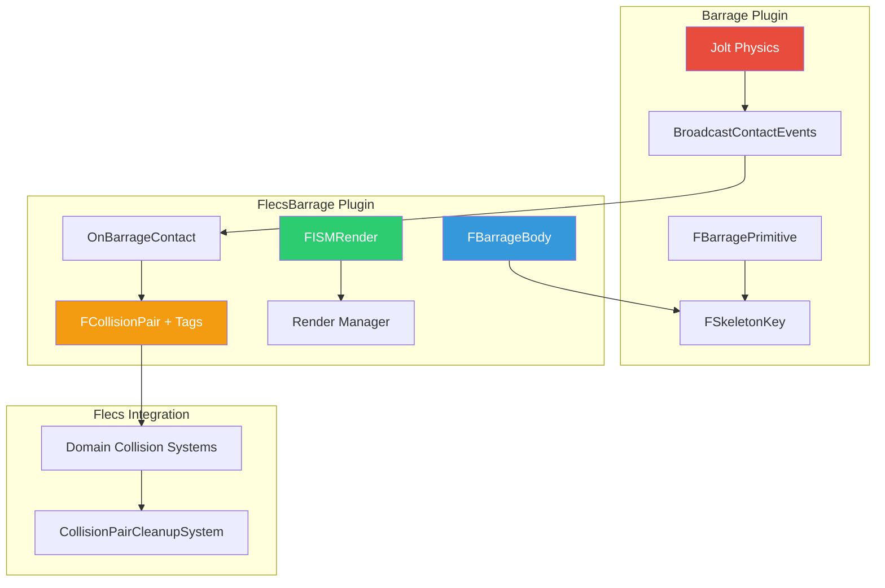

# FlecsBarrage Bridge Plugin

The **FlecsBarrage** plugin is the bridge between Flecs ECS and Barrage physics. It defines the components and patterns that connect Flecs entities to Jolt physics bodies, handle rendering via Instanced Static Meshes, and route collision events into the ECS.

## Plugin Location

```
Plugins/FlecsBarrage/
    Source/
        FlecsBarrageComponents.h   -- All bridge components and tags
```

---

## FBarrageBody Component (Forward Binding)

`FBarrageBody` is the Flecs component that links an entity to its Jolt physics body. It stores the `FSkeletonKey` which is the unique identifier into the Barrage physics system.

```cpp
USTRUCT(BlueprintType)
struct FBarrageBody
{
    GENERATED_BODY()

    UPROPERTY()
    FSkeletonKey BarrageKey;
};
```

### Binding Lifecycle



### Lookup API

```cpp
// Forward: Entity -> BarrageKey (O(1))
FSkeletonKey Key = entity.get<FBarrageBody>()->BarrageKey;

// Reverse: BarrageKey -> Entity (O(1))
flecs::entity E = Subsystem->GetEntityForBarrageKey(Key);
```

!!! info "Binding is Required for Reverse Lookup"
    `BindEntityToBarrage()` populates the `TranslationMapping` hash map. Without it, `GetEntityForBarrageKey()` returns an invalid entity. The forward lookup (`get<FBarrageBody>()`) always works as long as the component was set.

---

## FISMRender Component

`FISMRender` controls how an entity is visually represented via Unreal's Instanced Static Mesh (ISM) system. Entities with this component are rendered without individual UE actors.

```cpp
USTRUCT(BlueprintType)
struct FISMRender
{
    GENERATED_BODY()

    UPROPERTY(EditAnywhere, BlueprintReadOnly)
    UStaticMesh* Mesh = nullptr;

    UPROPERTY(EditAnywhere, BlueprintReadOnly)
    FVector Scale = FVector::OneVector;
};
```

The render manager reads `FISMRender` from entities and manages ISM instance transforms, syncing positions from Barrage physics each frame with interpolation.

### ISM Orphan Cleanup

!!! warning "Tombstone Must Clean ISM"
    When `TombstonePrimitive()` destroys a physics body, it **must also** remove the corresponding ISM instance. Failure to do so leaves an orphaned ISM — a visible mesh with no physics body, stuck at the last known position.

    This cleanup is handled in `TombstonePrimitive()` for `SFIX_BAR_PRIM` and `SFIX_GUN_SHOT` skeleton key types.

---

## FCollisionPair Entity Pattern

Collision events from Jolt are routed into Flecs as **collision pair entities**. Each contact event creates a temporary entity with an `FCollisionPair` component and one or more collision tags. Domain-specific systems then process these pairs.

```cpp
USTRUCT()
struct FCollisionPair
{
    GENERATED_BODY()

    UPROPERTY()
    FSkeletonKey BodyA;

    UPROPERTY()
    FSkeletonKey BodyB;

    // Additional contact data (normal, position, etc.)
};
```

### Collision Pipeline



### How OnBarrageContact Creates Pairs

When Jolt reports a contact event, `OnBarrageContact` (called from `BroadcastContactEvents` on the simulation thread):

1. Resolves both `BodyID`s to `FSkeletonKey`s
2. Looks up the Flecs entities for both keys
3. **Validates** that both Flecs entities exist (`FlecsId != 0`) — skips if not
4. Determines which collision tag(s) to apply based on entity components
5. Creates a new Flecs entity with `FCollisionPair` + appropriate tag(s)

!!! danger "Spawn Race Condition"
    A physics body can collide **before** its Flecs entity is fully created (the body is created first during spawn). The `FlecsId != 0` check in `OnBarrageContact` prevents processing collisions with entities that don't exist yet in Flecs.

---

## Collision Tags

All collision tags are zero-size USTRUCTs used to classify collision pair entities for processing by the appropriate system:

| Tag | System | Description |
|-----|--------|-------------|
| `FTagCollisionDamage` | `DamageCollisionSystem` | Projectile hits a damageable entity |
| `FTagCollisionBounce` | `BounceCollisionSystem` | Projectile bounces off a surface |
| `FTagCollisionPickup` | `PickupCollisionSystem` | Character touches a pickupable item |
| `FTagCollisionDestructible` | `DestructibleCollisionSystem` | Impact on a destructible object |
| `FTagCollisionFragmentation` | `FragmentationSystem` | Force check on destructible fragments |

### Tag Assignment Logic

The tag is determined by inspecting the components of the colliding entities:

```cpp
// Pseudocode for tag assignment in OnBarrageContact
if (EntityA.has<FTagProjectile>() && EntityB.has<FHealthStatic>())
    -> FTagCollisionDamage

if (EntityA.has<FTagProjectile>() && EntityB is static geometry)
    -> FTagCollisionBounce  // if projectile has bounce capability

if (EntityA.has<FTagCharacter>() && EntityB.has<FTagPickupable>())
    -> FTagCollisionPickup

if (EntityA.has<FDestructibleStatic>())
    -> FTagCollisionDestructible
```

!!! note "Destructible Detection"
    Destructible collision uses the `FDestructibleStatic` **component** for detection, NOT the `FTagDestructible` tag. This is because the static component carries the data needed for fragmentation calculations.

---

## System Processing Rules

### Owner Check

!!! warning "Self-Collision Prevention"
    Both `DamageCollisionSystem` and `BounceCollisionSystem` **must** skip collisions where one body is the owner of the other (e.g., a projectile hitting its shooter). This is checked via the `OwnerEntityId` field.

### Processing Order

Collision systems run in this order, all before cleanup:

```
4. DamageCollisionSystem
5. BounceCollisionSystem
6. PickupCollisionSystem
7. DestructibleCollisionSystem
   ...
13. CollisionPairCleanupSystem  (LAST - destroys all pair entities)
```

!!! danger "CollisionPairCleanupSystem Must Be Last"
    This system destroys all remaining `FCollisionPair` entities. If any collision processing system runs after it, the pairs will already be gone. Always register `CollisionPairCleanupSystem` as the last system in the pipeline.

---

## Integration Diagram



## Summary

| Component/Tag | Purpose | Location |
|---------------|---------|----------|
| `FBarrageBody` | Links entity to Jolt body via SkeletonKey | On every physics entity |
| `FISMRender` | Mesh + scale for ISM rendering | On every visible entity |
| `FCollisionPair` | Temporary entity carrying contact data | Created per contact event |
| `FTagCollisionDamage` | Routes pair to DamageCollisionSystem | On collision pair entity |
| `FTagCollisionBounce` | Routes pair to BounceCollisionSystem | On collision pair entity |
| `FTagCollisionPickup` | Routes pair to PickupCollisionSystem | On collision pair entity |
| `FTagCollisionDestructible` | Routes pair to DestructibleCollisionSystem | On collision pair entity |
| `FTagCollisionFragmentation` | Routes pair to FragmentationSystem | On collision pair entity |
