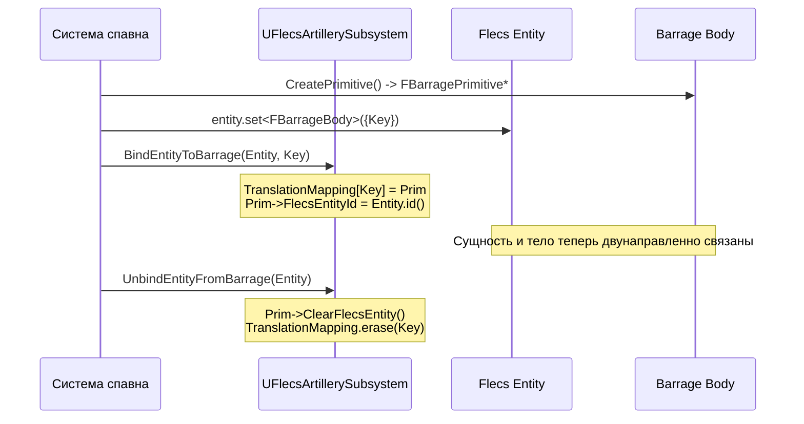
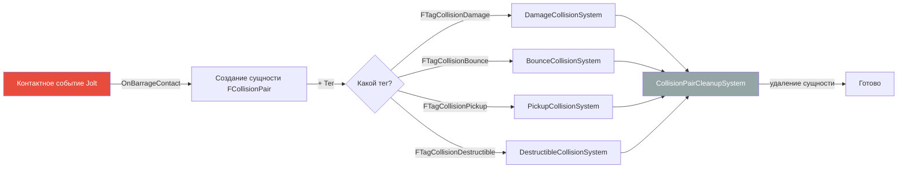
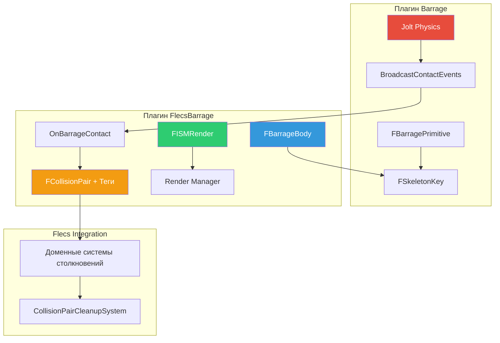

# Плагин-мост FlecsBarrage

Плагин **FlecsBarrage** -- мост между Flecs ECS и физикой Barrage. Он определяет компоненты и паттерны, связывающие сущности Flecs с физическими телами Jolt, обеспечивает рендеринг через Instanced Static Meshes и маршрутизирует события столкновений в ECS.

## Расположение плагина

```
Plugins/FlecsBarrage/
    Source/
        FlecsBarrageComponents.h   -- Все компоненты и теги моста
```

---

## Компонент FBarrageBody (прямая привязка)

`FBarrageBody` -- компонент Flecs, связывающий сущность с её физическим телом Jolt. Хранит `FSkeletonKey` -- уникальный идентификатор в системе физики Barrage.

```cpp
USTRUCT(BlueprintType)
struct FBarrageBody
{
    GENERATED_BODY()

    UPROPERTY()
    FSkeletonKey BarrageKey;
};
```

### Жизненный цикл привязки



### API поиска

```cpp
// Прямой: Entity -> BarrageKey (O(1))
FSkeletonKey Key = entity.get<FBarrageBody>()->BarrageKey;

// Обратный: BarrageKey -> Entity (O(1))
flecs::entity E = Subsystem->GetEntityForBarrageKey(Key);
```

!!! info "Привязка необходима для обратного поиска"
    `BindEntityToBarrage()` заполняет хеш-карту `TranslationMapping`. Без неё `GetEntityForBarrageKey()` возвращает невалидную сущность. Прямой поиск (`get<FBarrageBody>()`) всегда работает, пока компонент был установлен.

---

## Компонент FISMRender

`FISMRender` управляет визуальным представлением сущности через систему Instanced Static Mesh (ISM) Unreal. Сущности с этим компонентом рендерятся без отдельных UE-акторов.

```cpp
USTRUCT(BlueprintType)
struct FISMRender
{
    GENERATED_BODY()

    UPROPERTY(EditAnywhere, BlueprintReadOnly)
    UStaticMesh* Mesh = nullptr;

    UPROPERTY(EditAnywhere, BlueprintReadOnly)
    FVector Scale = FVector::OneVector;
};
```

Менеджер рендера считывает `FISMRender` из сущностей и управляет трансформами ISM-экземпляров, синхронизируя позиции из физики Barrage каждый кадр с интерполяцией.

### Очистка осиротевших ISM

!!! warning "Tombstone должен очистить ISM"
    Когда `TombstonePrimitive()` уничтожает физическое тело, он **должен также** удалить соответствующий ISM-экземпляр. Иначе остаётся осиротевший ISM -- видимый меш без физического тела, застрявший на последней известной позиции.

    Эта очистка выполняется в `TombstonePrimitive()` для типов skeleton key `SFIX_BAR_PRIM` и `SFIX_GUN_SHOT`.

---

## Паттерн сущностей FCollisionPair

Столкновения из Jolt маршрутизируются в Flecs как **сущности пар столкновений**. Каждое контактное событие создаёт временную сущность с компонентом `FCollisionPair` и одним или несколькими тегами столкновений. Доменно-специфичные системы затем обрабатывают эти пары.

```cpp
USTRUCT()
struct FCollisionPair
{
    GENERATED_BODY()

    UPROPERTY()
    FSkeletonKey BodyA;

    UPROPERTY()
    FSkeletonKey BodyB;

    // Дополнительные данные контакта (нормаль, позиция и т.д.)
};
```

### Пайплайн столкновений



### Как OnBarrageContact создаёт пары

Когда Jolt сообщает о контактном событии, `OnBarrageContact` (вызывается из `BroadcastContactEvents` на потоке симуляции):

1. Разрешает оба `BodyID` в `FSkeletonKey`
2. Находит сущности Flecs для обоих ключей
3. **Проверяет**, что обе сущности Flecs существуют (`FlecsId != 0`) -- пропускает если нет
4. Определяет, какие теги столкновений применить на основе компонентов сущностей
5. Создаёт новую сущность Flecs с `FCollisionPair` + соответствующими тегами

!!! danger "Состояние гонки при спавне"
    Физическое тело может столкнуться **до** полного создания сущности Flecs (тело создаётся первым при спавне). Проверка `FlecsId != 0` в `OnBarrageContact` предотвращает обработку столкновений с сущностями, которые ещё не существуют в Flecs.

---

## Теги столкновений

Все теги столкновений -- USTRUCT нулевого размера для классификации сущностей пар столкновений для обработки соответствующей системой:

| Тег | Система | Описание |
|-----|---------|----------|
| `FTagCollisionDamage` | `DamageCollisionSystem` | Снаряд попал в повреждаемую сущность |
| `FTagCollisionBounce` | `BounceCollisionSystem` | Снаряд отскочил от поверхности |
| `FTagCollisionPickup` | `PickupCollisionSystem` | Персонаж коснулся подбираемого предмета |
| `FTagCollisionDestructible` | `DestructibleCollisionSystem` | Удар по разрушаемому объекту |
| `FTagCollisionFragmentation` | `FragmentationSystem` | Проверка силы на фрагментах разрушаемых |

### Логика назначения тегов

Тег определяется проверкой компонентов сталкивающихся сущностей:

```cpp
// Псевдокод назначения тегов в OnBarrageContact
if (EntityA.has<FTagProjectile>() && EntityB.has<FHealthStatic>())
    -> FTagCollisionDamage

if (EntityA.has<FTagProjectile>() && EntityB is static geometry)
    -> FTagCollisionBounce  // если у снаряда есть возможность отскока

if (EntityA.has<FTagCharacter>() && EntityB.has<FTagPickupable>())
    -> FTagCollisionPickup

if (EntityA.has<FDestructibleStatic>())
    -> FTagCollisionDestructible
```

!!! note "Обнаружение разрушаемых"
    Столкновение с разрушаемыми использует **компонент** `FDestructibleStatic` для обнаружения, НЕ тег `FTagDestructible`. Это потому, что статический компонент содержит данные, необходимые для расчётов фрагментации.

---

## Правила обработки систем

### Проверка владельца

!!! warning "Предотвращение самостолкновений"
    И `DamageCollisionSystem`, и `BounceCollisionSystem` **должны** пропускать столкновения, где одно тело является владельцем другого (например, снаряд попадает в своего стрелка). Проверяется через поле `OwnerEntityId`.

### Порядок обработки

Системы столкновений выполняются в следующем порядке, все перед очисткой:

```
4. DamageCollisionSystem
5. BounceCollisionSystem
6. PickupCollisionSystem
7. DestructibleCollisionSystem
   ...
13. CollisionPairCleanupSystem  (ПОСЛЕДНЯЯ - уничтожает все сущности пар)
```

!!! danger "CollisionPairCleanupSystem должна быть последней"
    Эта система уничтожает все оставшиеся сущности `FCollisionPair`. Если любая система обработки столкновений выполнится после неё, пары уже будут уничтожены. Всегда регистрируйте `CollisionPairCleanupSystem` последней в пайплайне.

---

## Диаграмма интеграции



## Сводка

| Компонент/тег | Назначение | Расположение |
|---------------|-----------|-------------|
| `FBarrageBody` | Связывает сущность с телом Jolt через SkeletonKey | На каждой физической сущности |
| `FISMRender` | Меш + масштаб для ISM-рендеринга | На каждой видимой сущности |
| `FCollisionPair` | Временная сущность с данными контакта | Создаётся для каждого контактного события |
| `FTagCollisionDamage` | Маршрутизирует пару в DamageCollisionSystem | На сущности пары столкновений |
| `FTagCollisionBounce` | Маршрутизирует пару в BounceCollisionSystem | На сущности пары столкновений |
| `FTagCollisionPickup` | Маршрутизирует пару в PickupCollisionSystem | На сущности пары столкновений |
| `FTagCollisionDestructible` | Маршрутизирует пару в DestructibleCollisionSystem | На сущности пары столкновений |
| `FTagCollisionFragmentation` | Маршрутизирует пару в FragmentationSystem | На сущности пары столкновений |
