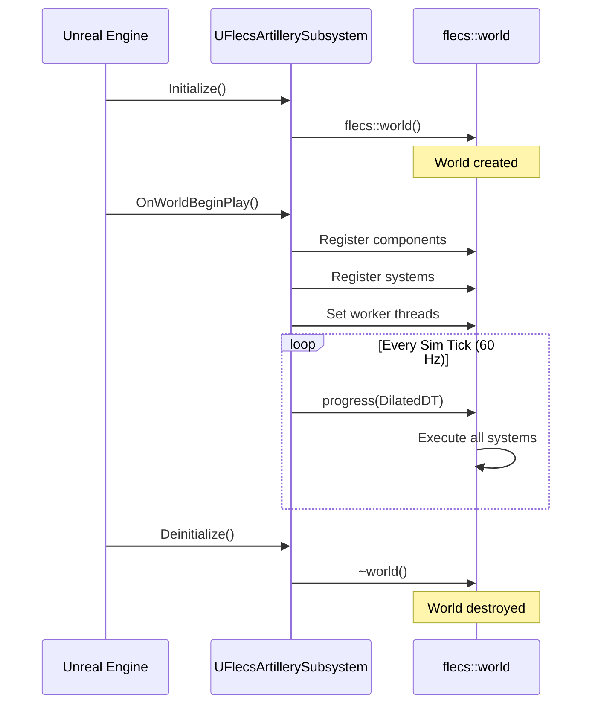
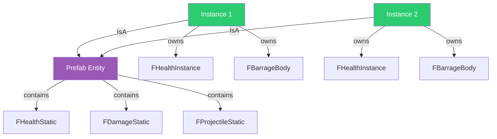
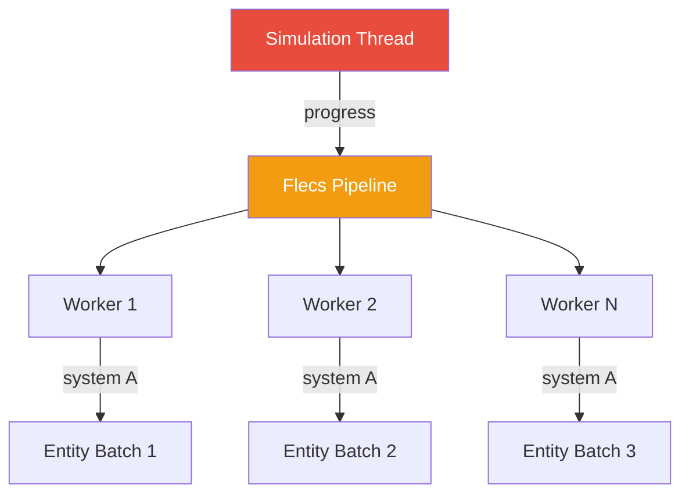

# Flecs ECS Integration Plugin

The **FlecsIntegration** plugin wraps the [Flecs](https://github.com/SanderMertens/flecs) Entity Component System for use within Unreal Engine 5.7. It replaces UE's actor/component model with a data-oriented architecture: archetypes, prefab inheritance (IsA), and parallel system execution.

## Plugin Structure

```
Plugins/FlecsIntegration/
    Source/
        UnrealFlecs/        -- Core Flecs C library + UE wrapper
        FlecsLibrary/       -- Blueprint-exposed utilities
```

The plugin provides two modules:

| Module | Purpose |
|--------|---------|
| `UnrealFlecs` | Core Flecs library compiled for UE, world management, USTRUCT component registration |
| `FlecsLibrary` | Blueprint function libraries for common ECS operations |

---

## How Flecs is Wrapped for UE

### USTRUCT Components

All Flecs components in FatumGame are standard UE `USTRUCT` types. This allows them to work with UE's reflection system, appear in editor details panels, and be used in Blueprints when needed.

```cpp
USTRUCT(BlueprintType)
struct FHealthStatic
{
    GENERATED_BODY()

    UPROPERTY(EditAnywhere, BlueprintReadOnly)
    float MaxHP = 100.f;

    UPROPERTY(EditAnywhere, BlueprintReadOnly)
    float Armor = 0.f;

    UPROPERTY(EditAnywhere, BlueprintReadOnly)
    float RegenPerSecond = 0.f;

    UPROPERTY(EditAnywhere, BlueprintReadOnly)
    bool bDestroyOnDeath = true;
};
```

!!! danger "USTRUCT Aggregate Initialization"
    **NEVER** use aggregate initialization with USTRUCTs that have `GENERATED_BODY()`:

    ```cpp
    // WRONG: Crashes or undefined behavior
    entity.set<FItemInstance>({ 5 });

    // CORRECT: Use named field initialization
    FItemInstance Instance;
    Instance.Count = 5;
    entity.set<FItemInstance>(Instance);
    ```

    `GENERATED_BODY()` injects hidden members that break aggregate initialization ordering.

### Zero-Size Tags

Tags are empty USTRUCTs used purely for entity classification:

```cpp
USTRUCT()
struct FTagProjectile
{
    GENERATED_BODY()
};

USTRUCT()
struct FTagCharacter
{
    GENERATED_BODY()
};
```

!!! danger "World.each() with Tags Crashes"
    **NEVER** pass zero-size tags as typed `const T&` parameters to `World.each()`. The Flecs `iterable<>` template preserves the reference, `is_empty_v<const T&>` evaluates to false, and Flecs attempts to access a tag column that doesn't exist — triggering an `ecs_field_w_size` assertion.

    ```cpp
    // WRONG: Crashes with ecs_field_w_size assertion
    World.each([](flecs::entity E, const FTagProjectile& Tag) { ... });

    // CORRECT: Use query builder with .with<>()
    World.query_builder()
        .with<FTagProjectile>()
        .build()
        .each([](flecs::entity E) {
            // Access tags via E.has<T>() if needed
        });
    ```

    **Exception:** `system<T>(...).each()` is fine because the system builder strips references from template parameters.

---

## World Creation and Lifecycle

The Flecs world is created and owned by `UFlecsArtillerySubsystem` (the main game subsystem). It persists for the duration of the play session.



### Deinitialize Race Condition

!!! warning "Use-After-Free on Shutdown"
    The game thread can call `Deinitialize()` while the simulation thread is inside `progress()`. This causes a use-after-free crash.

    **Fix:** Atomic barriers `bDeinitializing` and `bInArtilleryTick`. Deinitialize sets `bDeinitializing` and busy-waits until `bInArtilleryTick` clears, ensuring the simulation tick completes before world destruction.

---

## Component Registration

Components are registered with the Flecs world at startup. The plugin handles mapping between UE's `USTRUCT` reflection and Flecs component descriptors.

```cpp
// Components are registered during OnWorldBeginPlay
// The world automatically handles component storage and archetype management
flecs::world& World = GetFlecsWorld();

// Components with data
World.component<FHealthStatic>();
World.component<FHealthInstance>();

// Tags (zero-size)
World.component<FTagProjectile>();
World.component<FTagDead>();
```

---

## System Registration Patterns

Systems are registered in `FlecsArtillerySubsystem_Systems.cpp` using domain-specific setup methods. Each domain registers its own systems:

```cpp
void UFlecsArtillerySubsystem::SetupAllSystems()
{
    SetupDamageCollisionSystems();
    SetupPickupCollisionSystems();
    SetupDestructibleCollisionSystems();
    SetupWeaponSystems();
    SetupDeathSystems();
    // ... etc.
}
```

### System Types

#### Query-based Systems (`.each()`)

Process every entity matching a component query:

```cpp
World.system<FHealthInstance, const FHealthStatic>("RegenSystem")
    .each([](flecs::entity E, FHealthInstance& Health, const FHealthStatic& Static)
    {
        Health.CurrentHP = FMath::Min(
            Health.CurrentHP + Static.RegenPerSecond * DT,
            Static.MaxHP
        );
    });
```

#### Run-based Systems (`.run()`)

Manual iteration with access to the full iterator:

```cpp
World.system<>("MyCustomSystem")
    .with<FTagProjectile>()
    .with<FProjectileInstance>()
    .run([](flecs::iter& It)
    {
        while (It.next())
        {
            // Process entities
        }
    });
```

!!! danger "Iterator Drain Rules"
    **With query terms** (`.with<X>()`, `.system<T>()`): Flecs does NOT auto-finalize. The callback **MUST** drain the iterator (`while (It.next())`) or call `It.fini()` on early exit. Failure causes `ECS_LEAK_DETECTED` in `flecs_stack_fini()` on PIE exit.

    **Without query terms** (`.system<>("")`): `EcsQueryMatchNothing` — Flecs auto-finalizes after `run()`. Do **NOT** call `It.fini()` (double-finalize causes crash at `flecs_query_iter_fini()`). Early `return` is safe.

### System Ordering

Systems execute in registration order within their pipeline phase. FatumGame uses explicit ordering:

```
1. WorldItemDespawnSystem
2. PickupGraceSystem
3. ProjectileLifetimeSystem
4. DamageCollisionSystem
5. BounceCollisionSystem
6. PickupCollisionSystem
7. DestructibleCollisionSystem
8. WeaponTickSystem
9. WeaponReloadSystem
10. WeaponFireSystem
11. DeathCheckSystem
12. DeadEntityCleanupSystem
13. CollisionPairCleanupSystem  <-- ALWAYS LAST
```

!!! info "CollisionPairCleanupSystem Must Be Last"
    Collision pair entities are created by `OnBarrageContact` and consumed by various collision systems. The cleanup system destroys all remaining pairs at the end of the tick. It must always run last.

---

## Prefab Inheritance (IsA)

Flecs prefab inheritance is the foundation of FatumGame's **Static/Instance** pattern. A prefab entity holds shared (static) data, and instances inherit from it via `IsA`:



- **Static components** (on prefab): Shared data, read-only for instances. `FHealthStatic`, `FDamageStatic`, `FProjectileStatic`, etc.
- **Instance components** (on each entity): Per-entity mutable state. `FHealthInstance`, `FProjectileInstance`, `FBarrageBody`, etc.

Instances automatically inherit all static components from their prefab without copying. Changes to the prefab propagate to all instances.

---

## Parallel Execution

Flecs supports parallel system execution using worker threads. FatumGame configures `cores - 2` worker threads for the ECS:



### Thread Safety for Workers

!!! warning "Barrage Thread Registration"
    Every Flecs worker thread that touches Barrage APIs must call `EnsureBarrageAccess()`. This uses a `thread_local bool` guard to register each thread exactly once:

    ```cpp
    // At the start of any system that calls Barrage
    EnsureBarrageAccess();
    ```

### Deferred Operations

Flecs defers component mutations during system execution and merges them between systems (pipeline merge points). This has three critical implications:

!!! danger "Deferred Ops — Three Gotchas"

    **1. Between `.run()` systems:** `.run()` systems declare no component access, so Flecs skips merge points between them. `set<T>()` in system A is invisible to system B in the same tick.

    **Fix:** Use a direct TArray member on the subsystem for inter-system data passing.

    **2. Within the SAME system:** `entity.obtain<T>()` writes to deferred staging, but `entity.try_get<T>()` reads committed storage. Returns `nullptr` for components added via `obtain()` in the same callback.

    **Fix:** Track data in local variables instead of re-reading from Flecs.

    **3. Cross-entity tag in `.each()`:** `TargetEntity.add<FTag>()` on a DIFFERENT entity is deferred. If the writing system doesn't declare FTag access, Flecs won't merge before the next system that queries FTag.

    **Fix:** Perform side effects immediately (e.g., `SetBodyObjectLayer(DEBRIS)`) rather than relying on a later system to react to the deferred tag.

---

## Flecs API Quick Reference

| Method | Returns | If Missing | Use When |
|--------|---------|------------|----------|
| `try_get<T>()` | `const T*` | `nullptr` | Read, might be missing |
| `get<T>()` | `const T&` | **ASSERT** | Read, guaranteed exists |
| `try_get_mut<T>()` | `T*` | `nullptr` | Write, might be missing |
| `get_mut<T>()` | `T&` | **ASSERT** | Write, guaranteed exists |
| `obtain<T>()` | `T&` | **Creates** | Write, create if missing |
| `set<T>(val)` | `entity&` | **Creates** | Set value |
| `add<T>()` | `entity&` | **Creates** | Add tag/component |
| `has<T>()` | `bool` | `false` | Check existence |
| `remove<T>()` | `entity&` | No-op | Remove component/tag |

!!! tip "get() vs try_get()"
    Use `get<T>()` (asserts) when you **know** the component exists — the system query guarantees it. Use `try_get<T>()` when the component might be absent and you need to branch on its presence.
