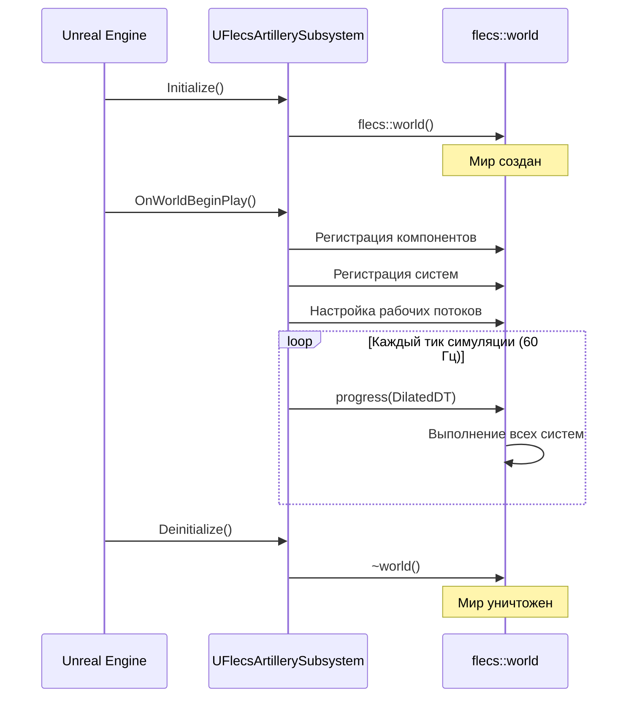
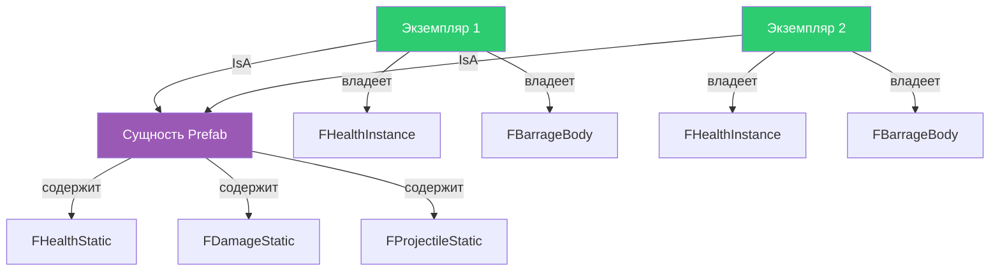
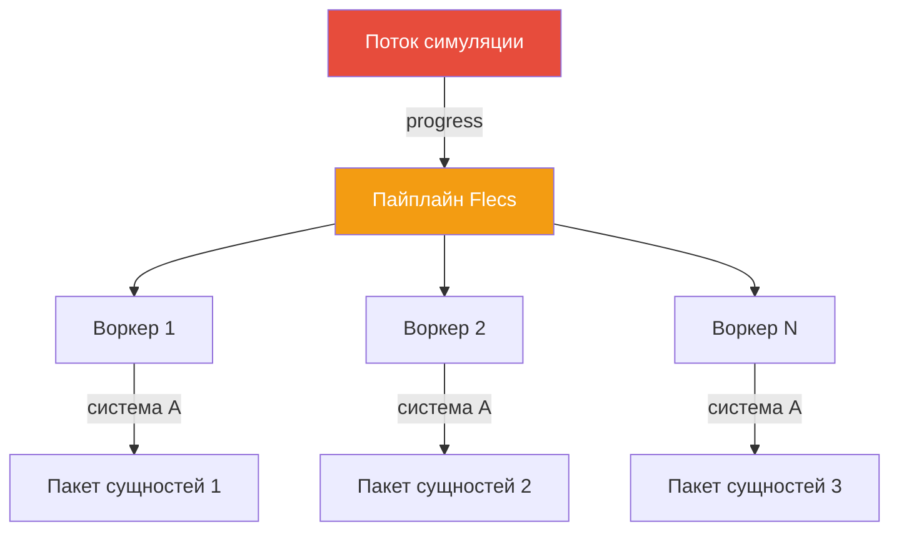

# Плагин Flecs ECS Integration

Плагин **FlecsIntegration** оборачивает [Flecs](https://github.com/SanderMertens/flecs) Entity Component System для использования в Unreal Engine 5.7. Он заменяет модель акторов/компонентов UE на data-ориентированную архитектуру: архетипы, наследование prefab (IsA) и параллельное выполнение систем.

## Структура плагина

```
Plugins/FlecsIntegration/
    Source/
        UnrealFlecs/        -- Ядро Flecs C-библиотека + UE-обёртка
        FlecsLibrary/       -- Blueprint-доступные утилиты
```

Плагин предоставляет два модуля:

| Модуль | Назначение |
|--------|-----------|
| `UnrealFlecs` | Ядро библиотеки Flecs, скомпилированное для UE, управление миром, регистрация USTRUCT-компонентов |
| `FlecsLibrary` | Blueprint-библиотеки функций для типовых ECS-операций |

---

## Как Flecs обёрнут для UE

### USTRUCT-компоненты

Все компоненты Flecs в FatumGame -- стандартные UE-типы `USTRUCT`. Это позволяет им работать с системой рефлексии UE, отображаться в панелях Details редактора и при необходимости использоваться в Blueprints.

```cpp
USTRUCT(BlueprintType)
struct FHealthStatic
{
    GENERATED_BODY()

    UPROPERTY(EditAnywhere, BlueprintReadOnly)
    float MaxHP = 100.f;

    UPROPERTY(EditAnywhere, BlueprintReadOnly)
    float Armor = 0.f;

    UPROPERTY(EditAnywhere, BlueprintReadOnly)
    float RegenPerSecond = 0.f;

    UPROPERTY(EditAnywhere, BlueprintReadOnly)
    bool bDestroyOnDeath = true;
};
```

!!! danger "Агрегатная инициализация USTRUCT"
    **НИКОГДА** не используйте агрегатную инициализацию с USTRUCT, содержащими `GENERATED_BODY()`:

    ```cpp
    // НЕПРАВИЛЬНО: Краш или неопределённое поведение
    entity.set<FItemInstance>({ 5 });

    // ПРАВИЛЬНО: Инициализация по именованным полям
    FItemInstance Instance;
    Instance.Count = 5;
    entity.set<FItemInstance>(Instance);
    ```

    `GENERATED_BODY()` внедряет скрытые члены, нарушающие порядок агрегатной инициализации.

### Теги нулевого размера

Теги -- пустые USTRUCT, используемые исключительно для классификации сущностей:

```cpp
USTRUCT()
struct FTagProjectile
{
    GENERATED_BODY()
};

USTRUCT()
struct FTagCharacter
{
    GENERATED_BODY()
};
```

!!! danger "World.each() с тегами вызывает краш"
    **НИКОГДА** не передавайте теги нулевого размера как типизированные параметры `const T&` в `World.each()`. Шаблон `iterable<>` Flecs сохраняет ссылку, `is_empty_v<const T&>` возвращает false, и Flecs пытается обратиться к столбцу тега, который не существует -- срабатывает assertion `ecs_field_w_size`.

    ```cpp
    // НЕПРАВИЛЬНО: Краш с assertion ecs_field_w_size
    World.each([](flecs::entity E, const FTagProjectile& Tag) { ... });

    // ПРАВИЛЬНО: Используйте query builder с .with<>()
    World.query_builder()
        .with<FTagProjectile>()
        .build()
        .each([](flecs::entity E) {
            // Обращайтесь к тегам через E.has<T>() при необходимости
        });
    ```

    **Исключение:** `system<T>(...).each()` безопасен, потому что system builder убирает ссылки из параметров шаблона.

---

## Создание и жизненный цикл мира

Мир Flecs создаётся и принадлежит `UFlecsArtillerySubsystem` (основная игровая подсистема). Он существует на протяжении всей игровой сессии.



### Состояние гонки при деинициализации

!!! warning "Use-After-Free при завершении"
    Game thread может вызвать `Deinitialize()`, пока поток симуляции находится внутри `progress()`. Это вызывает краш use-after-free.

    **Решение:** Атомарные барьеры `bDeinitializing` и `bInArtilleryTick`. Deinitialize устанавливает `bDeinitializing` и ожидает в цикле, пока `bInArtilleryTick` не сбросится, гарантируя завершение тика симуляции перед уничтожением мира.

---

## Регистрация компонентов

Компоненты регистрируются в мире Flecs при запуске. Плагин обеспечивает маппинг между рефлексией `USTRUCT` UE и дескрипторами компонентов Flecs.

```cpp
// Компоненты регистрируются во время OnWorldBeginPlay
// Мир автоматически управляет хранением компонентов и архетипами
flecs::world& World = GetFlecsWorld();

// Компоненты с данными
World.component<FHealthStatic>();
World.component<FHealthInstance>();

// Теги (нулевого размера)
World.component<FTagProjectile>();
World.component<FTagDead>();
```

---

## Паттерны регистрации систем

Системы регистрируются в `FlecsArtillerySubsystem_Systems.cpp` через доменно-специфичные методы настройки. Каждый домен регистрирует свои системы:

```cpp
void UFlecsArtillerySubsystem::SetupAllSystems()
{
    SetupDamageCollisionSystems();
    SetupPickupCollisionSystems();
    SetupDestructibleCollisionSystems();
    SetupWeaponSystems();
    SetupDeathSystems();
    // ... и т.д.
}
```

### Типы систем

#### Системы на основе запросов (`.each()`)

Обрабатывают каждую сущность, совпадающую с запросом по компонентам:

```cpp
World.system<FHealthInstance, const FHealthStatic>("RegenSystem")
    .each([](flecs::entity E, FHealthInstance& Health, const FHealthStatic& Static)
    {
        Health.CurrentHP = FMath::Min(
            Health.CurrentHP + Static.RegenPerSecond * DT,
            Static.MaxHP
        );
    });
```

#### Системы на основе Run (`.run()`)

Ручная итерация с доступом к полному итератору:

```cpp
World.system<>("MyCustomSystem")
    .with<FTagProjectile>()
    .with<FProjectileInstance>()
    .run([](flecs::iter& It)
    {
        while (It.next())
        {
            // Обработка сущностей
        }
    });
```

!!! danger "Правила дренирования итератора"
    **С условиями запроса** (`.with<X>()`, `.system<T>()`): Flecs НЕ финализирует автоматически. Callback **ОБЯЗАН** дренировать итератор (`while (It.next())`) или вызвать `It.fini()` при раннем выходе. Иначе -- `ECS_LEAK_DETECTED` в `flecs_stack_fini()` при выходе из PIE.

    **Без условий запроса** (`.system<>("")`): `EcsQueryMatchNothing` -- Flecs автоматически финализирует после `run()`. **НЕ** вызывайте `It.fini()` (двойная финализация -- краш в `flecs_query_iter_fini()`). Ранний `return` безопасен.

### Порядок выполнения систем

Системы выполняются в порядке регистрации в рамках фазы пайплайна. FatumGame использует явный порядок:

```
1. WorldItemDespawnSystem
2. PickupGraceSystem
3. ProjectileLifetimeSystem
4. DamageCollisionSystem
5. BounceCollisionSystem
6. PickupCollisionSystem
7. DestructibleCollisionSystem
8. WeaponTickSystem
9. WeaponReloadSystem
10. WeaponFireSystem
11. DeathCheckSystem
12. DeadEntityCleanupSystem
13. CollisionPairCleanupSystem  <-- ВСЕГДА ПОСЛЕДНЯЯ
```

!!! info "CollisionPairCleanupSystem должна быть последней"
    Сущности пар столкновений создаются `OnBarrageContact` и потребляются различными системами столкновений. Система очистки уничтожает все оставшиеся пары в конце тика. Она всегда должна выполняться последней.

---

## Наследование Prefab (IsA)

Наследование prefab Flecs -- основа паттерна **Static/Instance** в FatumGame. Сущность prefab хранит общие (статические) данные, а экземпляры наследуют от неё через `IsA`:



- **Статические компоненты** (на prefab): Общие данные, только для чтения экземплярами. `FHealthStatic`, `FDamageStatic`, `FProjectileStatic` и т.д.
- **Компоненты экземпляра** (на каждой сущности): Изменяемое состояние для каждой сущности. `FHealthInstance`, `FProjectileInstance`, `FBarrageBody` и т.д.

Экземпляры автоматически наследуют все статические компоненты от своего prefab без копирования. Изменения prefab распространяются на все экземпляры.

---

## Параллельное выполнение

Flecs поддерживает параллельное выполнение систем через рабочие потоки. FatumGame настраивает `cores - 2` рабочих потоков для ECS:



### Потокобезопасность для воркеров

!!! warning "Регистрация потоков Barrage"
    Каждый рабочий поток Flecs, обращающийся к API Barrage, должен вызвать `EnsureBarrageAccess()`. Это использует guard `thread_local bool` для однократной регистрации каждого потока:

    ```cpp
    // В начале любой системы, вызывающей Barrage
    EnsureBarrageAccess();
    ```

### Отложенные операции

Flecs откладывает мутации компонентов во время выполнения систем и объединяет их между системами (точки слияния пайплайна). Это имеет три критических последствия:

!!! danger "Отложенные операции -- три подводных камня"

    **1. Между `.run()` системами:** `.run()` системы не объявляют доступ к компонентам, поэтому Flecs пропускает точки слияния между ними. `set<T>()` в системе A невидим для системы B в том же тике.

    **Решение:** Используйте `TArray`-член подсистемы для передачи данных между системами.

    **2. Внутри ОДНОЙ системы:** `entity.obtain<T>()` пишет в отложенный staging, но `entity.try_get<T>()` читает зафиксированное хранилище. Возвращает `nullptr` для компонентов, добавленных через `obtain()` в том же callback.

    **Решение:** Отслеживайте данные в локальных переменных вместо повторного чтения из Flecs.

    **3. Тег другой сущности в `.each()`:** `TargetEntity.add<FTag>()` на ДРУГОЙ сущности -- отложен. Если записывающая система не объявляет доступ к FTag, Flecs не выполнит слияние перед следующей системой, запрашивающей FTag.

    **Решение:** Выполняйте побочные эффекты немедленно (например, `SetBodyObjectLayer(DEBRIS)`) вместо того, чтобы полагаться на позднюю систему для реакции на отложенный тег.

---

## Краткий справочник Flecs API

| Метод | Возвращает | Если отсутствует | Когда использовать |
|-------|-----------|-----------------|-------------------|
| `try_get<T>()` | `const T*` | `nullptr` | Чтение, может отсутствовать |
| `get<T>()` | `const T&` | **ASSERT** | Чтение, гарантированно есть |
| `try_get_mut<T>()` | `T*` | `nullptr` | Запись, может отсутствовать |
| `get_mut<T>()` | `T&` | **ASSERT** | Запись, гарантированно есть |
| `obtain<T>()` | `T&` | **Создаёт** | Запись, создать если нет |
| `set<T>(val)` | `entity&` | **Создаёт** | Установить значение |
| `add<T>()` | `entity&` | **Создаёт** | Добавить тег/компонент |
| `has<T>()` | `bool` | `false` | Проверить наличие |
| `remove<T>()` | `entity&` | Ничего | Удалить компонент/тег |

!!! tip "get() vs try_get()"
    Используйте `get<T>()` (assert), когда вы **знаете**, что компонент существует -- запрос системы это гарантирует. Используйте `try_get<T>()`, когда компонент может отсутствовать и нужно ветвление по его наличию.
