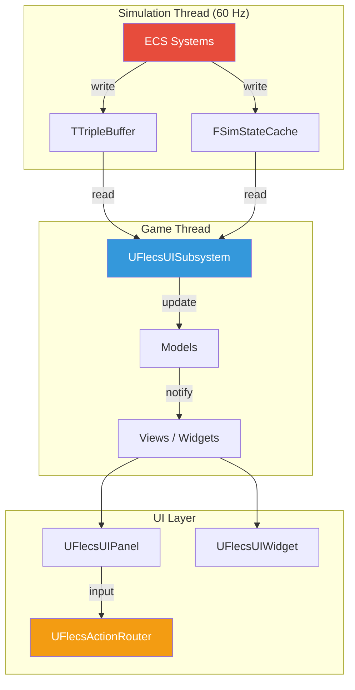
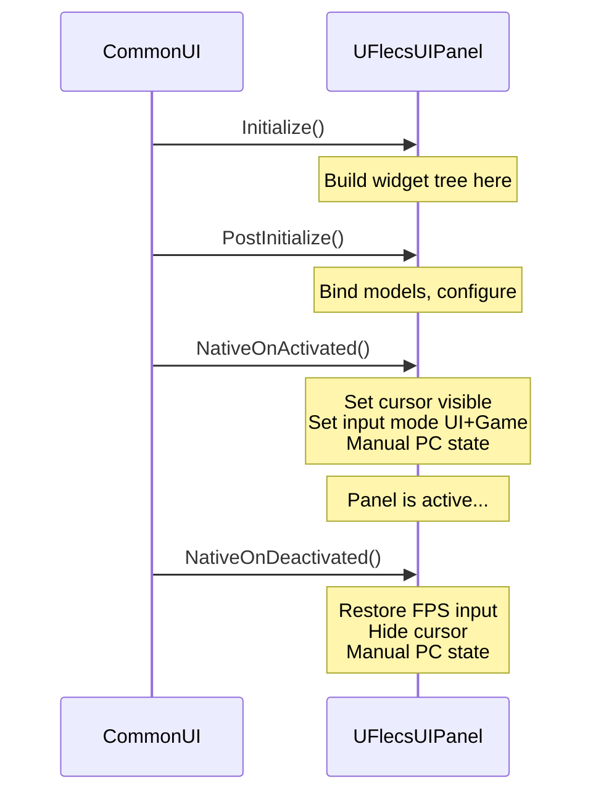
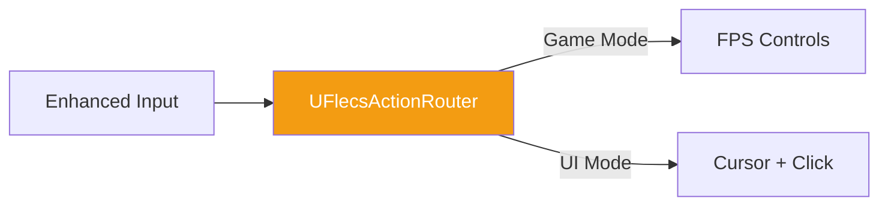
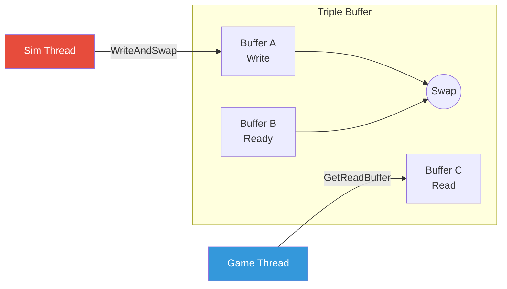
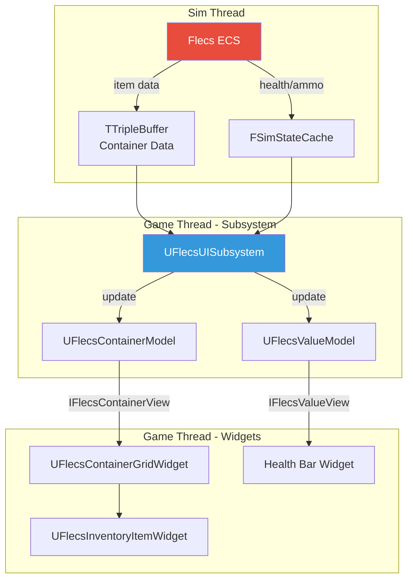

# FlecsUI Framework Plugin

The **FlecsUI** plugin provides the base classes and infrastructure for building lock-free, data-driven UI in FatumGame. It sits between CommonUI and the game's widget implementations, handling Model/View separation, input routing, and thread-safe data synchronization.

## Plugin Location

```
Plugins/FlecsUI/
    Source/
        Panels/     -- UFlecsUIPanel (UCommonActivatableWidget base)
        Widgets/    -- UFlecsUIWidget (UUserWidget base)
        Models/     -- UFlecsContainerModel, UFlecsValueModel
        Views/      -- IFlecsContainerView, IFlecsValueView
        Input/      -- UFlecsActionRouter
        Sync/       -- TTripleBuffer
```

---

## Architecture Overview



---

## UFlecsUIPanel (Activatable Panel)

`UFlecsUIPanel` extends `UCommonActivatableWidget` and is the base for full-screen or overlay panels (inventory, loot, pause menus). It integrates with CommonUI's activation stack for input routing.

### Lifecycle



### Key Methods

| Method | Purpose | Override? |
|--------|---------|-----------|
| `BuildDefaultWidgetTree()` | Create child widgets programmatically | Yes |
| `PostInitialize()` | Bind models to views after tree is built | Yes |
| `NativeOnActivated()` | Panel becomes active — set UI input state | Yes |
| `NativeOnDeactivated()` | Panel deactivates — restore game input state | Yes |

!!! danger "Build Widget Tree in Initialize(), NOT NativeConstruct()"
    Widget tree construction **must** happen in `Initialize()` / `BuildDefaultWidgetTree()`. By the time `NativeConstruct()` fires, CommonUI may have already attempted to activate the panel. Building the tree late causes null child widget references and missed activation callbacks.

### CommonUI Input Quirks

!!! warning "Manual PC State in BOTH Activated AND Deactivated"
    CommonUI has two quirks that require manual player controller state management:

    **1. Deactivation:** Without an `ActionDomainTable`, CommonUI doesn't reset the input config on deactivation. The cursor stays visible and input remains in UI mode. You must manually restore FPS input state.

    **2. Re-activation:** `UFlecsActionRouter`'s `ActiveInputConfig` persists across widget activation cycles. If the stale config matches the new panel's config, `ApplyUIInputConfig` is silently skipped. You must manually apply panel input state.

    ```cpp
    void UMyPanel::NativeOnActivated()
    {
        Super::NativeOnActivated();
        // MUST set input state manually
        if (APlayerController* PC = GetOwningPlayer())
        {
            PC->SetShowMouseCursor(true);
            PC->SetInputMode(FInputModeUIOnly());
        }
    }

    void UMyPanel::NativeOnDeactivated()
    {
        Super::NativeOnDeactivated();
        // MUST restore FPS state manually
        if (APlayerController* PC = GetOwningPlayer())
        {
            PC->SetShowMouseCursor(false);
            PC->SetInputMode(FInputModeGameOnly());
        }
    }
    ```

---

## UFlecsUIWidget (Base Widget)

`UFlecsUIWidget` extends `UUserWidget` and is the base for sub-widgets that live inside panels or the HUD (inventory slots, health bars, item tiles). It follows the same Initialize-first pattern.

### Lifecycle

| Method | Purpose |
|--------|---------|
| `Initialize()` | Build child widget tree, cache references |
| `PostInitialize()` | Bind models, subscribe to updates |
| `NativeConstruct()` | Widget is added to viewport (do NOT build tree here) |
| `NativeDestruct()` | Widget is removed — unbind models, clean up |

---

## Model/View Pattern

FlecsUI uses a strict Model/View separation. Models hold data and notify views of changes. Views are interfaces implemented by widgets.

### Models

#### UFlecsContainerModel

Represents the contents of an inventory container. Holds a list of item entries with grid positions and counts.

```cpp
UCLASS()
class UFlecsContainerModel : public UObject
{
    // Item data synchronized from ECS
    TArray<FContainerItemEntry> Items;

    // Notify views of changes
    void NotifyItemAdded(int32 Index);
    void NotifyItemRemoved(int32 Index);
    void NotifyFullRefresh();
};
```

#### UFlecsValueModel

A single-value model for scalar data (health, ammo count, cooldown progress):

```cpp
UCLASS()
class UFlecsValueModel : public UObject
{
    float Value;
    float MaxValue;

    void SetValue(float NewValue);
    // Notifies bound view on change
};
```

### Views (Interfaces)

#### IFlecsContainerView

```cpp
class IFlecsContainerView
{
    virtual void OnContainerUpdated(UFlecsContainerModel* Model) = 0;
    virtual void OnItemAdded(int32 Index) = 0;
    virtual void OnItemRemoved(int32 Index) = 0;
};
```

#### IFlecsValueView

```cpp
class IFlecsValueView
{
    virtual void OnValueChanged(float NewValue, float MaxValue) = 0;
};
```

!!! info "Models are UObjects for GC"
    Models derive from `UObject` so they participate in Unreal's garbage collection. When models are stored in plain C++ structs (not UPROPERTY), they must be explicitly rooted to prevent GC collection.

---

## UFlecsActionRouter

The custom input router that manages cursor visibility, mouse capture, and input blocking between game and UI layers.



### Responsibilities

| Feature | Description |
|---------|-------------|
| Cursor toggle | Shows/hides system cursor based on active panel |
| Mouse capture | Captures/releases mouse for FPS camera control |
| Input blocking | Blocks game input when UI panels are active |
| Config persistence | Tracks `ActiveInputConfig` across widget cycles |

### Integration with CommonUI

`UFlecsActionRouter` works with `CommonGameViewportClient` and provides `GetDesiredInputConfig()` for panels to declare their input requirements.

---

## TTripleBuffer (Lock-Free Sync)

`TTripleBuffer<T>` is a lock-free triple buffer for passing data from the simulation thread to the game thread without locks or contention.

### Usage

```cpp
// Simulation thread: write and swap
TTripleBuffer<FMyData> Buffer;
FMyData& WriteSlot = Buffer.GetWriteBuffer();
WriteSlot.Value = 42;
Buffer.WriteAndSwap();  // MUST use WriteAndSwap!

// Game thread: read latest
const FMyData& ReadSlot = Buffer.GetReadBuffer();
float Val = ReadSlot.Value;
```

!!! danger "MUST Use WriteAndSwap(), NOT Write()"
    `TTripleBuffer` has two write methods:

    - **`WriteAndSwap()`** — Writes data AND sets the dirty flag, making the new buffer available to the reader. **Always use this.**
    - **`Write()`** — Writes data but does NOT set the dirty flag. The reader never sees the update.

    Using `Write()` instead of `WriteAndSwap()` is a silent data loss bug — the game thread reads stale data indefinitely with no errors.

### How It Works



Three buffers rotate roles:
- **Write buffer** — simulation thread writes here
- **Ready buffer** — most recently completed write, waiting for reader
- **Read buffer** — game thread reads from here

`WriteAndSwap()` atomically swaps the write and ready buffers. `GetReadBuffer()` swaps the ready and read buffers if dirty.

---

## Garbage Collection (GC Roots)

!!! danger "Models in Structs Need Manual GC Roots"
    When `UObject`-derived models (like `UFlecsContainerModel`) are stored in plain C++ structs (not in a `UPROPERTY()` field on a `UObject`), Unreal's garbage collector cannot see them. They will be collected while still in use, causing crashes.

    **Fix:** Maintain a `UPROPERTY() TArray<TObjectPtr<UObject>> GCRoots` on the owning UObject (typically the subsystem or panel) and add all models to it:

    ```cpp
    UCLASS()
    class UMySubsystem : public UWorldSubsystem
    {
        GENERATED_BODY()

        // Prevents GC from collecting models stored in non-UPROPERTY structs
        UPROPERTY()
        TArray<TObjectPtr<UObject>> GCRoots;

        void CreateModel()
        {
            UFlecsContainerModel* Model = NewObject<UFlecsContainerModel>();
            GCRoots.Add(Model);
            // Now safe to store Model in a plain struct
        }
    };
    ```

---

## Widget Tree Construction

### Correct Pattern

```cpp
void UMyPanel::Initialize()
{
    Super::Initialize();

    // Build widget tree HERE
    GridWidget = CreateWidget<UFlecsContainerGridWidget>(GetOwningPlayer());
    check(GridWidget);
    MainSlot->AddChild(GridWidget);
}

void UMyPanel::PostInitialize()
{
    // Bind models to views AFTER tree is built
    GridWidget->BindModel(ContainerModel);
}
```

### Incorrect Pattern

```cpp
// WRONG: Too late! CommonUI may have already activated.
void UMyPanel::NativeConstruct()
{
    Super::NativeConstruct();
    GridWidget = CreateWidget<UFlecsContainerGridWidget>(...);  // TOO LATE
}
```

---

## Data Flow Summary



## Plugin Dependencies

| Depends On | Why |
|-----------|-----|
| CommonUI | `UCommonActivatableWidget` base class for panels |
| EnhancedInput | Input action routing |
| UMG | Base widget classes |
