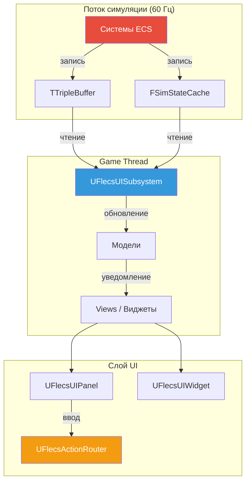
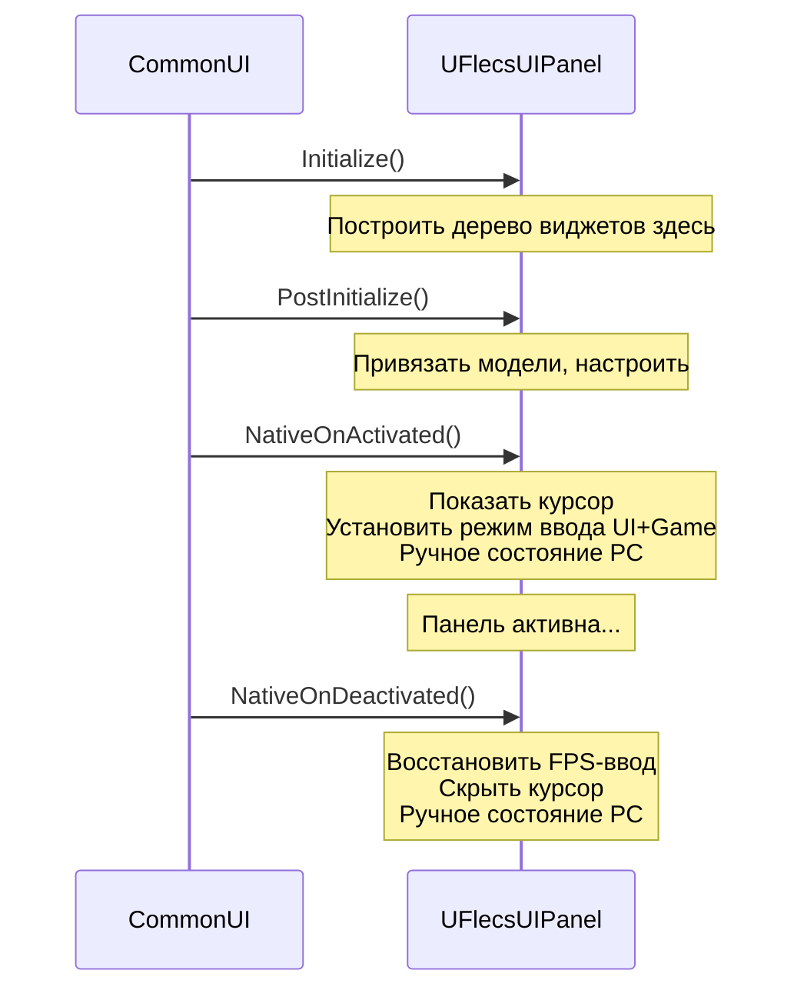
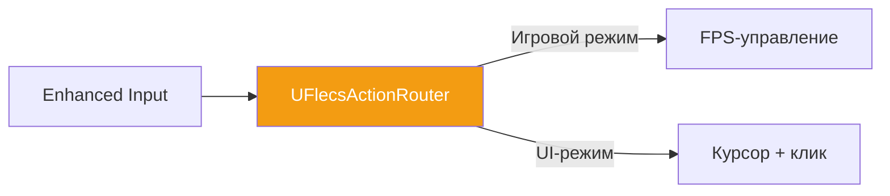
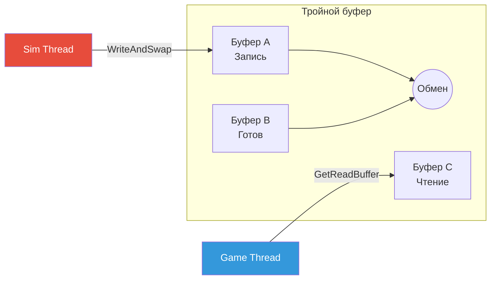
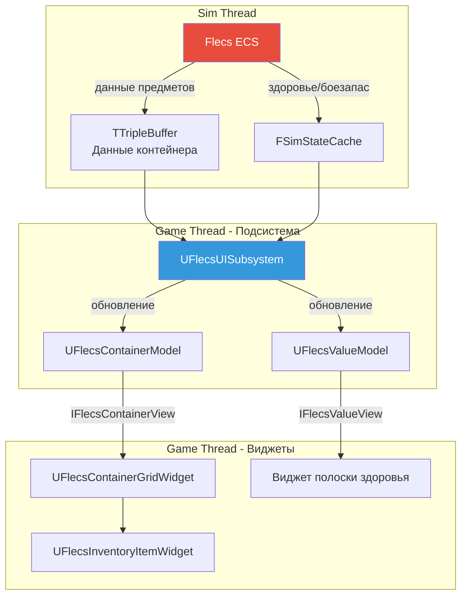

# Плагин FlecsUI Framework

Плагин **FlecsUI** предоставляет базовые классы и инфраструктуру для построения lock-free, data-driven UI в FatumGame. Он находится между CommonUI и игровыми реализациями виджетов, обеспечивая разделение Model/View, маршрутизацию ввода и потокобезопасную синхронизацию данных.

## Расположение плагина

```
Plugins/FlecsUI/
    Source/
        Panels/     -- UFlecsUIPanel (базовый класс UCommonActivatableWidget)
        Widgets/    -- UFlecsUIWidget (базовый класс UUserWidget)
        Models/     -- UFlecsContainerModel, UFlecsValueModel
        Views/      -- IFlecsContainerView, IFlecsValueView
        Input/      -- UFlecsActionRouter
        Sync/       -- TTripleBuffer
```

---

## Обзор архитектуры



---

## UFlecsUIPanel (активируемая панель)

`UFlecsUIPanel` расширяет `UCommonActivatableWidget` и является базой для полноэкранных или оверлейных панелей (инвентарь, лут, меню паузы). Интегрируется со стеком активации CommonUI для маршрутизации ввода.

### Жизненный цикл



### Ключевые методы

| Метод | Назначение | Переопределять? |
|-------|-----------|----------------|
| `BuildDefaultWidgetTree()` | Программно создать дочерние виджеты | Да |
| `PostInitialize()` | Привязать модели к views после построения дерева | Да |
| `NativeOnActivated()` | Панель становится активной -- установить состояние UI-ввода | Да |
| `NativeOnDeactivated()` | Панель деактивируется -- восстановить состояние игрового ввода | Да |

!!! danger "Строить дерево виджетов в Initialize(), НЕ в NativeConstruct()"
    Построение дерева виджетов **должно** происходить в `Initialize()` / `BuildDefaultWidgetTree()`. К моменту вызова `NativeConstruct()` CommonUI может уже попытаться активировать панель. Позднее построение дерева вызывает нулевые ссылки на дочерние виджеты и пропущенные callback-и активации.

### Особенности ввода CommonUI

!!! warning "Ручное состояние PC в ОБОИХ Activated И Deactivated"
    CommonUI имеет две особенности, требующие ручного управления состоянием контроллера игрока:

    **1. Деактивация:** Без `ActionDomainTable` CommonUI не сбрасывает конфигурацию ввода при деактивации. Курсор остаётся видимым и ввод остаётся в режиме UI. Необходимо вручную восстановить состояние FPS-ввода.

    **2. Повторная активация:** `ActiveInputConfig` в `UFlecsActionRouter` сохраняется между циклами активации виджетов. Если устаревшая конфигурация совпадает с конфигурацией новой панели, `ApplyUIInputConfig` молча пропускается. Необходимо вручную применить состояние ввода панели.

    ```cpp
    void UMyPanel::NativeOnActivated()
    {
        Super::NativeOnActivated();
        // ОБЯЗАТЕЛЬНО установить состояние ввода вручную
        if (APlayerController* PC = GetOwningPlayer())
        {
            PC->SetShowMouseCursor(true);
            PC->SetInputMode(FInputModeUIOnly());
        }
    }

    void UMyPanel::NativeOnDeactivated()
    {
        Super::NativeOnDeactivated();
        // ОБЯЗАТЕЛЬНО восстановить FPS-состояние вручную
        if (APlayerController* PC = GetOwningPlayer())
        {
            PC->SetShowMouseCursor(false);
            PC->SetInputMode(FInputModeGameOnly());
        }
    }
    ```

---

## UFlecsUIWidget (базовый виджет)

`UFlecsUIWidget` расширяет `UUserWidget` и является базой для подвиджетов внутри панелей или HUD (слоты инвентаря, полоски здоровья, плитки предметов). Следует тому же паттерну Initialize-first.

### Жизненный цикл

| Метод | Назначение |
|-------|-----------|
| `Initialize()` | Построить дерево дочерних виджетов, кешировать ссылки |
| `PostInitialize()` | Привязать модели, подписаться на обновления |
| `NativeConstruct()` | Виджет добавлен во viewport (НЕ строить дерево здесь) |
| `NativeDestruct()` | Виджет удалён -- отвязать модели, очистить |

---

## Паттерн Model/View

FlecsUI использует строгое разделение Model/View. Модели хранят данные и уведомляют views об изменениях. Views -- интерфейсы, реализуемые виджетами.

### Модели

#### UFlecsContainerModel

Представляет содержимое контейнера инвентаря. Хранит список записей предметов с позициями в сетке и количествами.

```cpp
UCLASS()
class UFlecsContainerModel : public UObject
{
    // Данные предметов, синхронизированные из ECS
    TArray<FContainerItemEntry> Items;

    // Уведомление views об изменениях
    void NotifyItemAdded(int32 Index);
    void NotifyItemRemoved(int32 Index);
    void NotifyFullRefresh();
};
```

#### UFlecsValueModel

Модель одного значения для скалярных данных (здоровье, количество патронов, прогресс кулдауна):

```cpp
UCLASS()
class UFlecsValueModel : public UObject
{
    float Value;
    float MaxValue;

    void SetValue(float NewValue);
    // Уведомляет привязанный view при изменении
};
```

### Views (интерфейсы)

#### IFlecsContainerView

```cpp
class IFlecsContainerView
{
    virtual void OnContainerUpdated(UFlecsContainerModel* Model) = 0;
    virtual void OnItemAdded(int32 Index) = 0;
    virtual void OnItemRemoved(int32 Index) = 0;
};
```

#### IFlecsValueView

```cpp
class IFlecsValueView
{
    virtual void OnValueChanged(float NewValue, float MaxValue) = 0;
};
```

!!! info "Модели -- UObject для GC"
    Модели наследуются от `UObject`, чтобы участвовать в сборке мусора Unreal. Когда модели хранятся в обычных C++-структурах (не UPROPERTY), их необходимо явно зарутить для предотвращения GC.

---

## UFlecsActionRouter

Пользовательский маршрутизатор ввода, управляющий видимостью курсора, захватом мыши и блокировкой ввода между игровым и UI-слоями.



### Обязанности

| Функция | Описание |
|---------|----------|
| Переключение курсора | Показывает/скрывает системный курсор в зависимости от активной панели |
| Захват мыши | Захватывает/освобождает мышь для FPS-управления камерой |
| Блокировка ввода | Блокирует игровой ввод при активных UI-панелях |
| Сохранение конфигурации | Отслеживает `ActiveInputConfig` между циклами виджетов |

### Интеграция с CommonUI

`UFlecsActionRouter` работает с `CommonGameViewportClient` и предоставляет `GetDesiredInputConfig()` для панелей, объявляющих свои требования к вводу.

---

## TTripleBuffer (lock-free синхронизация)

`TTripleBuffer<T>` -- lock-free тройной буфер для передачи данных из потока симуляции в game thread без блокировок и конкуренции.

### Использование

```cpp
// Поток симуляции: запись и обмен
TTripleBuffer<FMyData> Buffer;
FMyData& WriteSlot = Buffer.GetWriteBuffer();
WriteSlot.Value = 42;
Buffer.WriteAndSwap();  // ОБЯЗАТЕЛЬНО использовать WriteAndSwap!

// Game thread: чтение последних данных
const FMyData& ReadSlot = Buffer.GetReadBuffer();
float Val = ReadSlot.Value;
```

!!! danger "ОБЯЗАТЕЛЬНО использовать WriteAndSwap(), НЕ Write()"
    `TTripleBuffer` имеет два метода записи:

    - **`WriteAndSwap()`** -- записывает данные И устанавливает флаг dirty, делая новый буфер доступным для читателя. **Всегда используйте это.**
    - **`Write()`** -- записывает данные, но НЕ устанавливает флаг dirty. Читатель никогда не увидит обновление.

    Использование `Write()` вместо `WriteAndSwap()` -- тихий баг потери данных: game thread бесконечно читает устаревшие данные без ошибок.

### Как это работает



Три буфера меняют роли:
- **Буфер записи** -- поток симуляции пишет сюда
- **Готовый буфер** -- последняя завершённая запись, ожидающая читателя
- **Буфер чтения** -- game thread читает отсюда

`WriteAndSwap()` атомарно меняет местами буферы записи и готовности. `GetReadBuffer()` меняет местами готовый и буфер чтения, если есть флаг dirty.

---

## Сборка мусора (GC Roots)

!!! danger "Модели в структурах нуждаются в ручных GC Roots"
    Когда модели на основе `UObject` (типа `UFlecsContainerModel`) хранятся в обычных C++-структурах (не в поле `UPROPERTY()` на `UObject`), сборщик мусора Unreal не может их видеть. Они будут собраны во время использования, вызывая краши.

    **Решение:** Поддерживайте `UPROPERTY() TArray<TObjectPtr<UObject>> GCRoots` на владеющем UObject (обычно подсистема или панель) и добавляйте туда все модели:

    ```cpp
    UCLASS()
    class UMySubsystem : public UWorldSubsystem
    {
        GENERATED_BODY()

        // Предотвращает GC от сбора моделей в не-UPROPERTY структурах
        UPROPERTY()
        TArray<TObjectPtr<UObject>> GCRoots;

        void CreateModel()
        {
            UFlecsContainerModel* Model = NewObject<UFlecsContainerModel>();
            GCRoots.Add(Model);
            // Теперь безопасно хранить Model в обычной структуре
        }
    };
    ```

---

## Построение дерева виджетов

### Правильный паттерн

```cpp
void UMyPanel::Initialize()
{
    Super::Initialize();

    // Строить дерево виджетов ЗДЕСЬ
    GridWidget = CreateWidget<UFlecsContainerGridWidget>(GetOwningPlayer());
    check(GridWidget);
    MainSlot->AddChild(GridWidget);
}

void UMyPanel::PostInitialize()
{
    // Привязать модели к views ПОСЛЕ построения дерева
    GridWidget->BindModel(ContainerModel);
}
```

### Неправильный паттерн

```cpp
// НЕПРАВИЛЬНО: Слишком поздно! CommonUI мог уже активировать.
void UMyPanel::NativeConstruct()
{
    Super::NativeConstruct();
    GridWidget = CreateWidget<UFlecsContainerGridWidget>(...);  // СЛИШКОМ ПОЗДНО
}
```

---

## Сводка потока данных



## Зависимости плагина

| Зависит от | Причина |
|-----------|---------|
| CommonUI | Базовый класс `UCommonActivatableWidget` для панелей |
| EnhancedInput | Маршрутизация действий ввода |
| UMG | Базовые классы виджетов |
