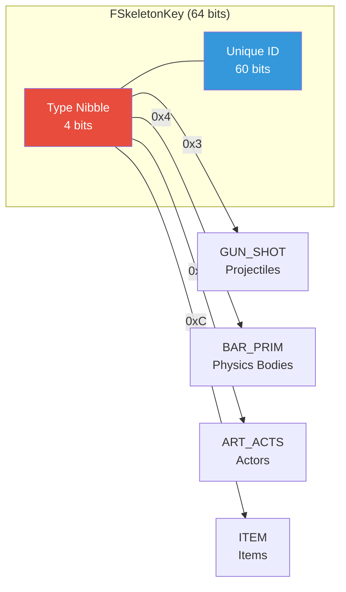
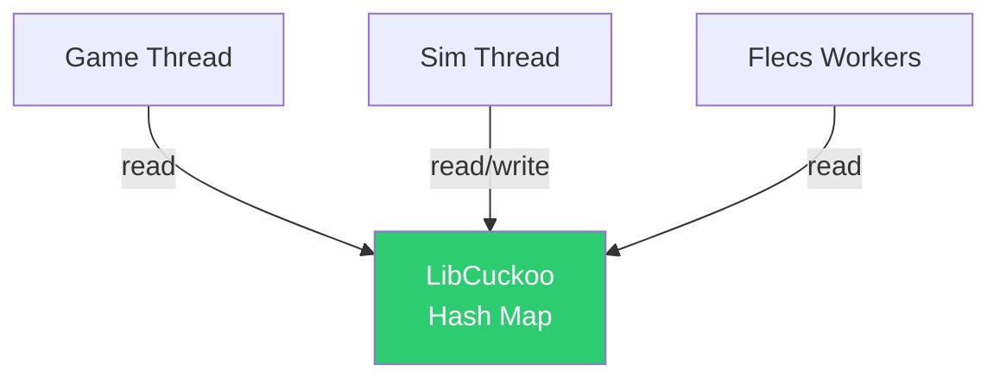
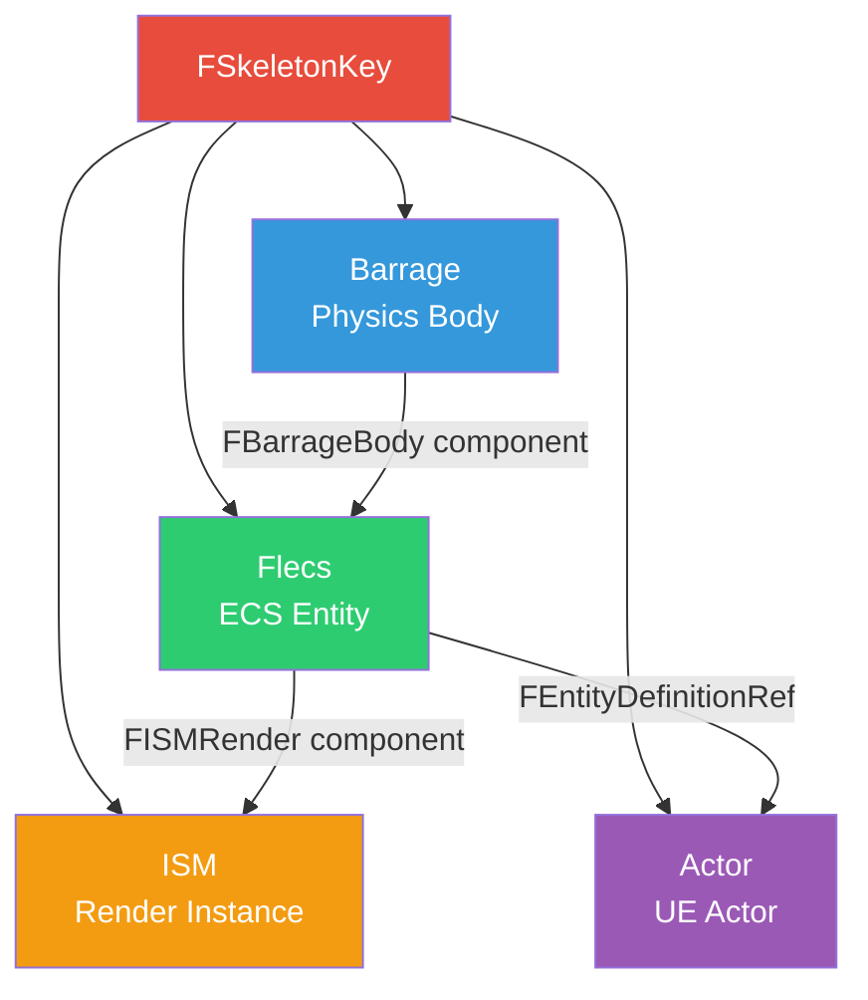

# SkeletonKey Plugin

The **SkeletonKey** plugin provides FatumGame's universal entity identification system — a typed 64-bit ID that serves as the primary key across all subsystems: Barrage physics, Flecs ECS, actor tracking, items, and weapons.

## FSkeletonKey

`FSkeletonKey` is a 64-bit identifier where the **high nibble** (top 4 bits) encodes the entity type. This allows O(1) type checking without any table lookup.

```cpp
USTRUCT(BlueprintType)
struct FSkeletonKey
{
    GENERATED_BODY()

    uint64 Key = 0;

    // Type is encoded in the high nibble
    uint8 GetType() const { return (Key >> 60) & 0xF; }
    bool IsValid() const { return Key != 0; }
};
```

### Type Nibbles

| Nibble | Hex | Type Constant | Description |
|--------|-----|---------------|-------------|
| 3 | `0x3` | `GUN_SHOT` | Projectiles (bullets, rockets, grenades) |
| 4 | `0x4` | `BAR_PRIM` | Barrage primitives (general physics bodies) |
| 5 | `0x5` | `ART_ACTS` | Actors (UE actors tracked by Artillery) |
| 12 | `0xC` | `ITEM` | Items (inventory items, pickups) |

### Key Structure

```
┌─────────┬──────────────────────────────────────────────────────────────┐
│ 63 - 60 │ 59 - 0                                                      │
│ (4 bits) │ (60 bits)                                                   │
│  Type    │  Unique ID                                                  │
│ Nibble   │                                                             │
└─────────┴──────────────────────────────────────────────────────────────┘
```



### Usage Examples

```cpp
// Check if a key represents a projectile
if (Key.GetType() == SFIX_GUN_SHOT)
{
    // Handle projectile-specific logic
}

// Validate before use
check(Key.IsValid());

// Compare keys
if (KeyA == KeyB)
{
    // Same entity
}
```

---

## ISkeletonLord Interface

`ISkeletonLord` is the interface implemented by any subsystem that manages SkeletonKey-tracked entities. It provides the contract for key generation and entity lifecycle management.

```cpp
class ISkeletonLord
{
public:
    // Generate a new unique key of the given type
    virtual FSkeletonKey GenerateKey(uint8 TypeNibble) = 0;

    // Retrieve the entity/object associated with a key
    virtual void* GetEntityForKey(FSkeletonKey Key) = 0;
};
```

### Implementors

| Subsystem | Key Types Managed |
|-----------|-------------------|
| `UBarrageDispatch` | `BAR_PRIM`, `GUN_SHOT` |
| `UFlecsArtillerySubsystem` | `ART_ACTS`, `ITEM` |

---

## LibCuckoo Lock-Free Hash Map

SkeletonKey lookups use a **libcuckoo concurrent hash map** for thread-safe O(1) access without locks. This is critical because lookups happen on both the simulation thread and game thread simultaneously.

### Why LibCuckoo?

| Requirement | Solution |
|------------|----------|
| Thread-safe reads + writes | Cuckoo hashing with fine-grained striped locks |
| O(1) average lookup | Two hash functions, two candidate positions |
| High throughput under contention | Lock striping (only locks the two candidate buckets) |
| No global lock | Unlike `TMap` + `FCriticalSection` |

### Integration



The hash map is used in:

- **TranslationMapping** (`UBarrageDispatch`): `FSkeletonKey -> FBarragePrimitive*` for bound entities
- **Body tracking**: All physics bodies indexed by key
- **Entity registry**: Quick lookup of Flecs entities by key

### Performance Characteristics

| Operation | Average | Worst Case |
|-----------|---------|------------|
| Lookup | O(1) | O(1) amortized |
| Insert | O(1) | O(N) during resize (rare) |
| Delete | O(1) | O(1) |

!!! info "No Rehashing During Gameplay"
    The hash map is pre-sized at initialization to accommodate the expected entity count. Rehashing (which briefly blocks) should never occur during active gameplay.

---

## Cross-System Usage

SkeletonKeys are the universal glue between FatumGame's subsystems:



### Lookup Patterns by Key Type

| Key Type | Forward Lookup | Reverse Lookup |
|----------|---------------|----------------|
| `BAR_PRIM` | Key -> `GetShapeRef()` -> `FBarragePrimitive*` | `FBarragePrimitive->GetFlecsEntity()` -> Flecs entity |
| `GUN_SHOT` | Key -> `GetShapeRef()` -> `FBarragePrimitive*` | Same as BAR_PRIM |
| `ART_ACTS` | Key -> Actor registry -> `AActor*` | `AActor` stores its key |
| `ITEM` | Key -> Flecs entity via `GetEntityForBarrageKey()` | Entity stores key in `FBarrageBody` |

!!! warning "Pool Bodies and TranslationMapping"
    Pool bodies (e.g., debris from destructible objects) are created via `CreatePrimitive` and exist in body tracking, but are **NOT** in `TranslationMapping` (which is populated by `BindEntityToBarrage`).

    For pool bodies, use `GetShapeRef(Key)->KeyIntoBarrage` instead of `GetBarrageKeyFromSkeletonKey()`.

---

## Summary

| Feature | Detail |
|---------|--------|
| Size | 64 bits |
| Type encoding | High nibble (4 bits) |
| Uniqueness | 60-bit unique ID space (~1.15 quintillion) |
| Thread safety | LibCuckoo lock-free hash map |
| Lookup cost | O(1) average |
| Zero value | Invalid (sentinel) |
