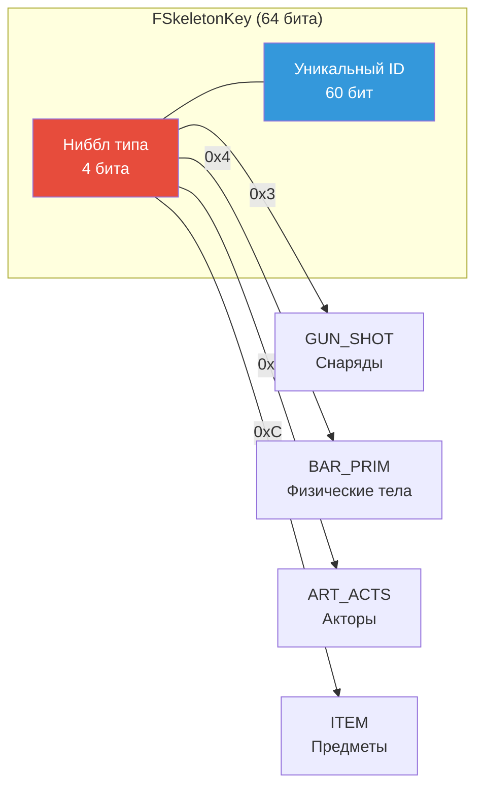
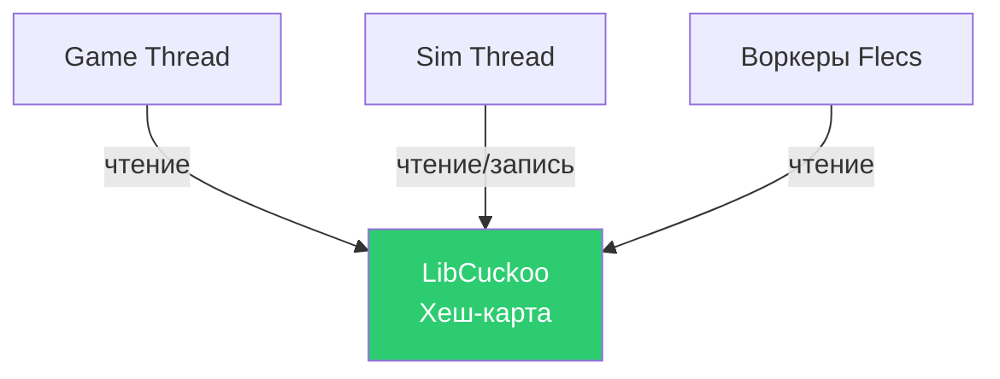
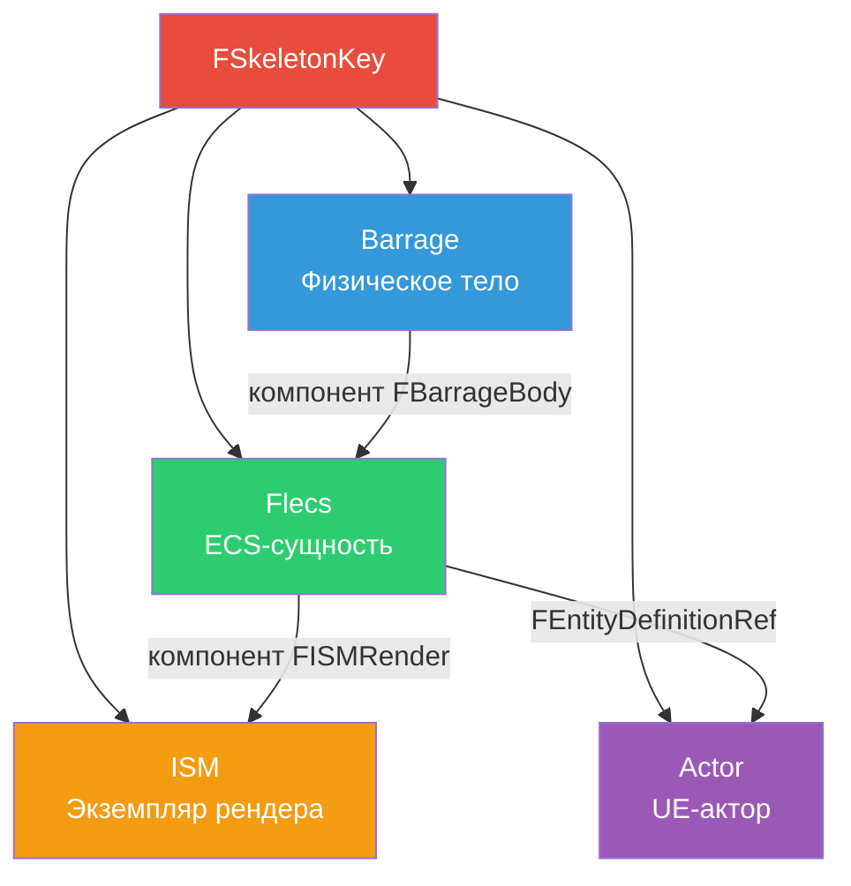

# Плагин SkeletonKey

Плагин **SkeletonKey** предоставляет универсальную систему идентификации сущностей FatumGame -- типизированный 64-битный ID, служащий первичным ключом во всех подсистемах: физика Barrage, Flecs ECS, отслеживание акторов, предметы и оружие.

## FSkeletonKey

`FSkeletonKey` -- 64-битный идентификатор, где **старший ниббл** (верхние 4 бита) кодирует тип сущности. Это позволяет проверять тип за O(1) без обращения к таблицам.

```cpp
USTRUCT(BlueprintType)
struct FSkeletonKey
{
    GENERATED_BODY()

    uint64 Key = 0;

    // Тип закодирован в старшем ниббле
    uint8 GetType() const { return (Key >> 60) & 0xF; }
    bool IsValid() const { return Key != 0; }
};
```

### Нибблы типов

| Ниббл | Hex | Константа типа | Описание |
|-------|-----|----------------|----------|
| 3 | `0x3` | `GUN_SHOT` | Снаряды (пули, ракеты, гранаты) |
| 4 | `0x4` | `BAR_PRIM` | Примитивы Barrage (общие физические тела) |
| 5 | `0x5` | `ART_ACTS` | Акторы (UE-акторы, отслеживаемые Artillery) |
| 12 | `0xC` | `ITEM` | Предметы (предметы инвентаря, подбираемые) |

### Структура ключа

```
┌─────────┬──────────────────────────────────────────────────────────────┐
│ 63 - 60 │ 59 - 0                                                      │
│ (4 бита) │ (60 бит)                                                   │
│  Тип     │  Уникальный ID                                             │
│ Ниббл    │                                                            │
└─────────┴──────────────────────────────────────────────────────────────┘
```



### Примеры использования

```cpp
// Проверить, является ли ключ снарядом
if (Key.GetType() == SFIX_GUN_SHOT)
{
    // Логика, специфичная для снарядов
}

// Валидация перед использованием
check(Key.IsValid());

// Сравнение ключей
if (KeyA == KeyB)
{
    // Одна и та же сущность
}
```

---

## Интерфейс ISkeletonLord

`ISkeletonLord` -- интерфейс, реализуемый любой подсистемой, управляющей сущностями, отслеживаемыми через SkeletonKey. Определяет контракт для генерации ключей и управления жизненным циклом сущностей.

```cpp
class ISkeletonLord
{
public:
    // Сгенерировать новый уникальный ключ данного типа
    virtual FSkeletonKey GenerateKey(uint8 TypeNibble) = 0;

    // Получить сущность/объект по ключу
    virtual void* GetEntityForKey(FSkeletonKey Key) = 0;
};
```

### Реализации

| Подсистема | Управляемые типы ключей |
|-----------|------------------------|
| `UBarrageDispatch` | `BAR_PRIM`, `GUN_SHOT` |
| `UFlecsArtillerySubsystem` | `ART_ACTS`, `ITEM` |

---

## Lock-free хеш-карта LibCuckoo

Поиск по SkeletonKey использует **конкурентную хеш-карту libcuckoo** для потокобезопасного O(1) доступа без блокировок. Это критически важно, потому что поиски происходят одновременно на потоке симуляции и game thread.

### Почему LibCuckoo?

| Требование | Решение |
|-----------|---------|
| Потокобезопасные чтение + запись | Кукушечное хеширование с мелкозернистыми полосатыми блокировками |
| O(1) средний поиск | Две хеш-функции, две позиции-кандидата |
| Высокая пропускная способность при конкуренции | Полосатые блокировки (блокируют только два бакета-кандидата) |
| Без глобальной блокировки | В отличие от `TMap` + `FCriticalSection` |

### Интеграция



Хеш-карта используется в:

- **TranslationMapping** (`UBarrageDispatch`): `FSkeletonKey -> FBarragePrimitive*` для привязанных сущностей
- **Отслеживание тел**: Все физические тела, индексированные по ключу
- **Реестр сущностей**: Быстрый поиск сущностей Flecs по ключу

### Характеристики производительности

| Операция | Среднее | Худший случай |
|----------|---------|--------------|
| Поиск | O(1) | O(1) амортизировано |
| Вставка | O(1) | O(N) при ресайзе (редко) |
| Удаление | O(1) | O(1) |

!!! info "Без рехеширования во время геймплея"
    Хеш-карта предварительно размечена при инициализации для ожидаемого количества сущностей. Рехеширование (которое кратковременно блокирует) не должно происходить во время активного геймплея.

---

## Межсистемное использование

SkeletonKey -- универсальный связующий элемент между подсистемами FatumGame:



### Паттерны поиска по типу ключа

| Тип ключа | Прямой поиск | Обратный поиск |
|-----------|-------------|---------------|
| `BAR_PRIM` | Key -> `GetShapeRef()` -> `FBarragePrimitive*` | `FBarragePrimitive->GetFlecsEntity()` -> сущность Flecs |
| `GUN_SHOT` | Key -> `GetShapeRef()` -> `FBarragePrimitive*` | Как BAR_PRIM |
| `ART_ACTS` | Key -> Реестр акторов -> `AActor*` | `AActor` хранит свой ключ |
| `ITEM` | Key -> сущность Flecs через `GetEntityForBarrageKey()` | Сущность хранит ключ в `FBarrageBody` |

!!! warning "Тела пула и TranslationMapping"
    Тела пула (например, обломки разрушаемых объектов) создаются через `CreatePrimitive` и существуют в отслеживании тел, но **НЕ** в `TranslationMapping` (который заполняется через `BindEntityToBarrage`).

    Для тел пула используйте `GetShapeRef(Key)->KeyIntoBarrage` вместо `GetBarrageKeyFromSkeletonKey()`.

---

## Сводка

| Характеристика | Деталь |
|---------------|--------|
| Размер | 64 бита |
| Кодирование типа | Старший ниббл (4 бита) |
| Уникальность | 60-битное пространство ID (~1.15 квинтиллиона) |
| Потокобезопасность | Lock-free хеш-карта LibCuckoo |
| Стоимость поиска | O(1) в среднем |
| Нулевое значение | Невалидное (дозорное) |
