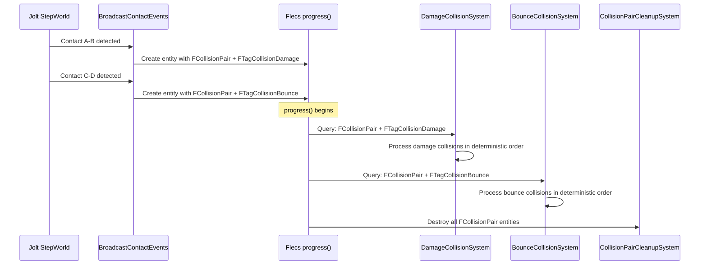

# Why Collision Pair Entities

This document explains why FatumGame creates a Flecs entity for each collision pair instead of processing physics contacts directly in callbacks.

---

## The Problem: Physics Contacts Arrive in Physics Order

Jolt physics reports contacts as they are detected during the broad phase and narrow phase. The order is determined by the spatial hash, body pair sorting, and island processing -- not by gameplay priority.

In a direct-callback model:

```cpp
// Direct callback approach (NOT what we do)
void OnContact(BodyA, BodyB)
{
    if (IsDamage(BodyA, BodyB)) ProcessDamage(BodyA, BodyB);
    else if (IsBounce(BodyA, BodyB)) ProcessBounce(BodyA, BodyB);
    else if (IsPickup(BodyA, BodyB)) ProcessPickup(BodyA, BodyB);
    // ...
}
```

This has several problems:

| Problem | Description |
|---------|-------------|
| **Non-deterministic order** | Contacts arrive in physics spatial order, not gameplay order. Damage before bounce? Bounce before pickup? Depends on body positions. |
| **Mixed concerns** | One callback handles all collision types. Each new type adds another branch. |
| **No multi-tag support** | A collision that is both "damage" and "destructible" requires special-case logic in the callback. |
| **No filtering** | Cannot efficiently query "all damage collisions this tick" without storing them somewhere. |
| **Threading issues** | Contact callbacks run during `StepWorld()`. Flecs mutations during physics step cause data races. |

---

## The Solution: Entity-Per-Collision-Pair

FatumGame creates a **temporary Flecs entity** for each collision detected by Jolt. The entity carries the collision data and classification tags. Domain-specific systems then process collisions by querying for their tags.



### The FCollisionPair Component

```cpp
USTRUCT()
struct FCollisionPair
{
    GENERATED_BODY()

    UPROPERTY()
    FSkeletonKey BodyA = 0;

    UPROPERTY()
    FSkeletonKey BodyB = 0;

    UPROPERTY()
    FVector ContactPoint = FVector::ZeroVector;

    UPROPERTY()
    FVector ContactNormal = FVector::ZeroVector;
};
```

### Classification Tags

Each collision pair gets one or more tags based on the body types involved:

| Tag | Meaning | Processed By |
|-----|---------|-------------|
| `FTagCollisionDamage` | Projectile hit a damageable entity | DamageCollisionSystem |
| `FTagCollisionBounce` | Projectile hit a surface (bounce) | BounceCollisionSystem |
| `FTagCollisionPickup` | Character overlapped a pickupable item | PickupCollisionSystem |
| `FTagCollisionDestructible` | Something hit a destructible object | DestructibleCollisionSystem |

---

## Benefits

### Deterministic Processing

Systems execute in a fixed order (defined by the pipeline). All damage collisions are processed before all bounce collisions, regardless of the spatial order in which Jolt detected them.

```
Physics contact order (spatial):    Bounce, Damage, Pickup, Damage, Bounce
System processing order (pipeline): Damage, Damage, Bounce, Bounce, Pickup
```

This makes behavior predictable and debuggable.

### Multi-Tag Support

A single collision can carry multiple tags. For example, a projectile hitting a destructible object might be both `FTagCollisionDamage` and `FTagCollisionDestructible`. Both systems process it independently.

```cpp
// BroadcastContactEvents classifies the collision
CollisionEntity.add<FTagCollisionDamage>();        // Damage system will process
CollisionEntity.add<FTagCollisionDestructible>();   // Destructible system will also process
```

No special-case code needed. Each system queries its own tag and processes independently.

### Natural Flecs Query Filtering

Each system queries only the collisions it cares about:

```cpp
// DamageCollisionSystem: only sees damage collisions
World.system<FCollisionPair>("DamageCollision")
    .with<FTagCollisionDamage>()
    .each([](flecs::entity E, FCollisionPair& Pair)
    {
        // Process damage -- only damage-tagged pairs reach here
    });

// BounceCollisionSystem: only sees bounce collisions
World.system<FCollisionPair>("BounceCollision")
    .with<FTagCollisionBounce>()
    .each([](flecs::entity E, FCollisionPair& Pair)
    {
        // Process bounce -- only bounce-tagged pairs reach here
    });
```

Adding a new collision type requires:

1. Define a new tag (`FTagCollisionMyType`)
2. Add classification logic in `BroadcastContactEvents`
3. Write a new system that queries the tag
4. Register it before `CollisionPairCleanupSystem`

No existing code is modified.

### Thread Safety

Contacts are detected during `StepWorld()` (Jolt physics), but processing happens during `progress()` (Flecs systems). The collision pair entities act as a natural buffer:

```
StepWorld()                    → Jolt detects contacts
BroadcastContactEvents()       → Creates FCollisionPair entities (between StepWorld and progress)
progress()                     → Systems process pairs safely (no physics mutation)
CollisionPairCleanupSystem()   → Destroys all pairs (clean slate for next tick)
```

---

## Alternatives Considered

### Direct Callbacks (Rejected)

Process collisions immediately in the Jolt contact callback.

| Pros | Cons |
|------|------|
| No intermediate entities | Non-deterministic order |
| Slightly less memory | Threading issues (callback runs during StepWorld) |
| | Mixed concerns in one function |
| | Cannot multi-tag |
| | Cannot query "all collisions of type X" |

### Shared Buffer per Type (Rejected)

Maintain a `TArray<FCollisionData>` per collision type (one for damage, one for bounce, etc.).

| Pros | Cons |
|------|------|
| Simple data structure | Parallel arrays diverge from ECS pattern |
| | Multi-tag requires duplicating data across arrays |
| | Systems need custom iteration (not Flecs queries) |
| | Cleanup requires manual array clearing |

### Per-Domain Queues (Rejected)

Each domain (weapon, destructible, item) owns its own collision queue.

| Pros | Cons |
|------|------|
| Domain isolation | Collision classification logic scattered across domains |
| | No central view of all collisions |
| | Cross-domain collisions require special handling |
| | Harder to enforce processing order |

---

## Critical Rule

!!! danger "CollisionPairCleanupSystem must be the LAST system"
    All collision pair entities are destroyed by `CollisionPairCleanupSystem`. Every system that processes collisions must run before it. Registering a collision system after cleanup means it never sees any collisions.

The current system order for collision processing:

```
4. DamageCollisionSystem
5. BounceCollisionSystem
6. PickupCollisionSystem
7. DestructibleCollisionSystem
   ...
13. CollisionPairCleanupSystem  ← ALWAYS LAST
```
