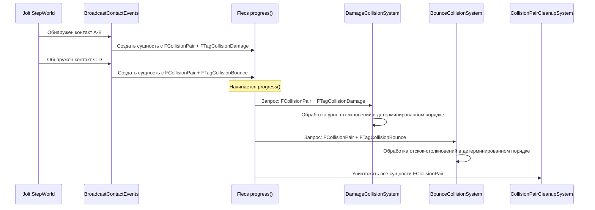

# Почему сущности пар столкновений

Этот документ объясняет, почему FatumGame создаёт сущность Flecs для каждой пары столкновений вместо прямой обработки физических контактов в callback-ах.

---

## Проблема: физические контакты приходят в порядке физики

Jolt Physics сообщает о контактах по мере их обнаружения во время широкой и узкой фаз. Порядок определяется пространственным хешем, сортировкой пар тел и обработкой островов -- а не приоритетом геймплея.

В модели прямых callback-ов:

```cpp
// Подход прямых callback-ов (НЕ то, что мы делаем)
void OnContact(BodyA, BodyB)
{
    if (IsDamage(BodyA, BodyB)) ProcessDamage(BodyA, BodyB);
    else if (IsBounce(BodyA, BodyB)) ProcessBounce(BodyA, BodyB);
    else if (IsPickup(BodyA, BodyB)) ProcessPickup(BodyA, BodyB);
    // ...
}
```

У этого несколько проблем:

| Проблема | Описание |
|----------|----------|
| **Недетерминированный порядок** | Контакты приходят в пространственном порядке физики, не в игровом. Урон перед отскоком? Отскок перед подбором? Зависит от позиций тел. |
| **Смешение ответственности** | Один callback обрабатывает все типы столкновений. Каждый новый тип добавляет ветвление. |
| **Нет поддержки мультитегов** | Столкновение, которое одновременно "урон" и "разрушаемое", требует специальной логики. |
| **Нет фильтрации** | Нельзя эффективно запросить "все урон-столкновения этого тика" без хранения. |
| **Проблемы потоков** | Callback-и контактов выполняются во время `StepWorld()`. Мутации Flecs во время физического шага -- гонки данных. |

---

## Решение: сущность на пару столкновений

FatumGame создаёт **временную сущность Flecs** для каждого столкновения, обнаруженного Jolt. Сущность несёт данные столкновения и теги классификации. Доменно-специфичные системы затем обрабатывают столкновения, запрашивая свои теги.



### Компонент FCollisionPair

```cpp
USTRUCT()
struct FCollisionPair
{
    GENERATED_BODY()

    UPROPERTY()
    FSkeletonKey BodyA = 0;

    UPROPERTY()
    FSkeletonKey BodyB = 0;

    UPROPERTY()
    FVector ContactPoint = FVector::ZeroVector;

    UPROPERTY()
    FVector ContactNormal = FVector::ZeroVector;
};
```

### Теги классификации

Каждая пара столкновений получает один или несколько тегов на основе типов вовлечённых тел:

| Тег | Значение | Обрабатывается |
|-----|----------|---------------|
| `FTagCollisionDamage` | Снаряд попал в повреждаемую сущность | DamageCollisionSystem |
| `FTagCollisionBounce` | Снаряд попал в поверхность (отскок) | BounceCollisionSystem |
| `FTagCollisionPickup` | Персонаж перекрыл подбираемый предмет | PickupCollisionSystem |
| `FTagCollisionDestructible` | Что-то ударило разрушаемый объект | DestructibleCollisionSystem |

---

## Выгоды

### Детерминированная обработка

Системы выполняются в фиксированном порядке (определённом пайплайном). Все урон-столкновения обрабатываются до всех отскок-столкновений, независимо от пространственного порядка обнаружения Jolt.

```
Порядок физических контактов (пространственный): Отскок, Урон, Подбор, Урон, Отскок
Порядок обработки систем (пайплайн):            Урон, Урон, Отскок, Отскок, Подбор
```

Это делает поведение предсказуемым и отлаживаемым.

### Поддержка мультитегов

Одно столкновение может нести несколько тегов. Например, снаряд, попавший в разрушаемый объект, может быть одновременно `FTagCollisionDamage` и `FTagCollisionDestructible`. Обе системы обрабатывают его независимо.

```cpp
// BroadcastContactEvents классифицирует столкновение
CollisionEntity.add<FTagCollisionDamage>();        // Система урона обработает
CollisionEntity.add<FTagCollisionDestructible>();   // Система разрушаемых тоже обработает
```

Нет специального кода. Каждая система запрашивает свой тег и обрабатывает независимо.

### Естественная фильтрация запросами Flecs

Каждая система запрашивает только интересующие её столкновения:

```cpp
// DamageCollisionSystem: видит только урон-столкновения
World.system<FCollisionPair>("DamageCollision")
    .with<FTagCollisionDamage>()
    .each([](flecs::entity E, FCollisionPair& Pair)
    {
        // Обработка урона -- только пары с тегом урона попадают сюда
    });

// BounceCollisionSystem: видит только отскок-столкновения
World.system<FCollisionPair>("BounceCollision")
    .with<FTagCollisionBounce>()
    .each([](flecs::entity E, FCollisionPair& Pair)
    {
        // Обработка отскока -- только пары с тегом отскока попадают сюда
    });
```

Добавление нового типа столкновений требует:

1. Определить новый тег (`FTagCollisionMyType`)
2. Добавить логику классификации в `BroadcastContactEvents`
3. Написать новую систему, запрашивающую тег
4. Зарегистрировать её до `CollisionPairCleanupSystem`

Существующий код не модифицируется.

### Потокобезопасность

Контакты обнаруживаются во время `StepWorld()` (физика Jolt), но обработка происходит во время `progress()` (системы Flecs). Сущности пар столкновений служат естественным буфером:

```
StepWorld()                    → Jolt обнаруживает контакты
BroadcastContactEvents()       → Создаёт сущности FCollisionPair (между StepWorld и progress)
progress()                     → Системы безопасно обрабатывают пары (нет мутации физики)
CollisionPairCleanupSystem()   → Уничтожает все пары (чистый лист для следующего тика)
```

---

## Рассмотренные альтернативы

### Прямые callback-и (отклонено)

Обработка столкновений непосредственно в callback-е контакта Jolt.

| Плюсы | Минусы |
|-------|--------|
| Нет промежуточных сущностей | Недетерминированный порядок |
| Чуть меньше памяти | Проблемы потоков (callback во время StepWorld) |
| | Смешение ответственности в одной функции |
| | Нет мультитегов |
| | Нельзя запросить "все столкновения типа X" |

### Общий буфер по типу (отклонено)

Поддерживать `TArray<FCollisionData>` по типу столкновений (один для урона, один для отскока и т.д.).

| Плюсы | Минусы |
|-------|--------|
| Простая структура данных | Параллельные массивы расходятся с ECS-паттерном |
| | Мультитеги требуют дублирования данных между массивами |
| | Системам нужна пользовательская итерация (не запросы Flecs) |
| | Очистка требует ручной очистки массивов |

### Очереди по доменам (отклонено)

Каждый домен (оружие, разрушаемые, предметы) владеет своей очередью столкновений.

| Плюсы | Минусы |
|-------|--------|
| Изоляция доменов | Логика классификации рассеяна по доменам |
| | Нет центрального обзора всех столкновений |
| | Кросс-доменные столкновения требуют специальной обработки |
| | Сложнее обеспечить порядок обработки |

---

## Критическое правило

!!! danger "CollisionPairCleanupSystem должна быть ПОСЛЕДНЕЙ системой"
    Все сущности пар столкновений уничтожаются `CollisionPairCleanupSystem`. Каждая система, обрабатывающая столкновения, должна выполняться до неё. Регистрация системы столкновений после очистки означает, что она никогда не увидит столкновений.

Текущий порядок систем для обработки столкновений:

```
4. DamageCollisionSystem
5. BounceCollisionSystem
6. PickupCollisionSystem
7. DestructibleCollisionSystem
   ...
13. CollisionPairCleanupSystem  ← ВСЕГДА ПОСЛЕДНЯЯ
```
