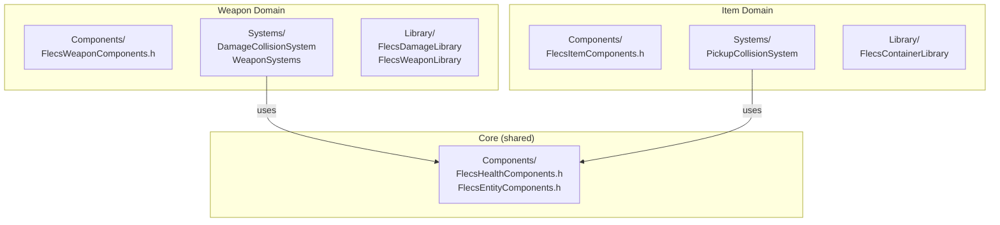

# Why Domain-Based Folder Structure

This document explains why FatumGame uses a vertical domain-based folder layout instead of the flat horizontal structure it started with.

---

## The Problem: Flat Structure Doesn't Scale

FatumGame originally used a flat folder structure under `Source/FatumGame/Flecs/`:

```
Flecs/
  Components/
    FlecsStaticComponents.h      ← ALL static components (800+ lines)
    FlecsInstanceComponents.h    ← ALL instance components (600+ lines)
  Systems/
    FlecsArtillerySubsystem_Systems.cpp  ← ALL systems (2000+ lines)
  Library/
    FlecsDamageLibrary.h
    FlecsContainerLibrary.h
    FlecsWeaponLibrary.h
    FlecsSpawnLibrary.h
  Tags/
    FlecsGameTags.h              ← ALL tags
```

### What Went Wrong

| Problem | Impact |
|---------|--------|
| **Monolithic headers** | `FlecsStaticComponents.h` was included everywhere. Changing one weapon component recompiled all damage, item, and destructible code |
| **Unclear ownership** | Which team member owns `FlecsStaticComponents.h`? Everyone edits it. Merge conflicts are constant |
| **Compilation cascade** | Adding a field to `FWeaponStatic` recompiled every file that includes any static component |
| **Navigation difficulty** | Finding "all weapon code" requires searching across Components/, Systems/, Library/ directories |
| **Growing monolith** | The systems file grew past 2000 lines. Scrolling through unrelated damage code to find weapon code |
| **Include pollution** | Files that need `FHealthStatic` also get `FWeaponStatic`, `FItemStaticData`, `FDoorStatic`, etc. |

---

## The Solution: Vertical Domain-Based Layout

Each gameplay domain (weapon, item, destructible, etc.) owns a self-contained folder with its components, systems, and library:

```
Source/FatumGame/
  Core/            ← Simulation core (shared infrastructure)
    Components/    ← Cross-domain components (Health, Entity, Interaction)
    Private/       ← Subsystem impl, systems registration
    Public/        ← Subsystem headers, game tags
  Weapon/
    Components/    ← FlecsWeaponComponents.h
    Systems/       ← DamageCollisionSystem, WeaponSystems
    Library/       ← FlecsDamageLibrary, FlecsWeaponLibrary
  Item/
    Components/    ← FlecsItemComponents.h
    Systems/       ← PickupCollisionSystem
    Library/       ← FlecsContainerLibrary
  Destructible/
    Components/    ← FlecsDestructibleComponents.h
    Systems/       ← FragmentationSystem, DestructibleCollision
    Library/       ← FlecsConstraintLibrary
  Door/
    Components/    ← FlecsDoorComponents.h
    Systems/       ← DoorSystems
  Movement/
    Components/    ← FlecsMovementComponents.h
    Private/       ← Character movement systems
  Character/
    Private/       ← FlecsCharacter + partial _*.cpp files
    Public/        ← FlecsCharacter.h
  Spawning/
    Private/       ← FlecsEntitySpawner, SpawnerActor
    Library/       ← FlecsSpawnLibrary
  Rendering/
    Private/       ← FlecsRenderManager, FlecsNiagaraManager
  UI/
    Private/       ← Widgets, panels
    Public/        ← Widget headers
  Definitions/     ← ALL Data Assets & Profiles (shared across domains)
  Utils/           ← Shared utilities
  Input/           ← Input configuration
```

---

## Benefits

### Clear Ownership

Each domain folder is a self-contained unit. "All weapon code" is in `Weapon/`. "All item code" is in `Item/`. A developer working on weapons only touches files in `Weapon/` and possibly `Core/`.



### Minimal Header Pollution

A file working with weapons includes only `FlecsWeaponComponents.h`, not every component in the project:

```cpp
// Before (flat structure): includes EVERYTHING
#include "Components/FlecsStaticComponents.h"  // 800+ lines, all domains

// After (domain structure): includes only what's needed
#include "Weapon/Components/FlecsWeaponComponents.h"  // ~100 lines, weapon only
```

### Reduced Recompilation

Changing `FWeaponStatic` only recompiles files that include `FlecsWeaponComponents.h` -- weapon systems and weapon library. Item code, destructible code, and door code are unaffected.

| Change | Flat Structure Recompile | Domain Structure Recompile |
|--------|--------------------------|---------------------------|
| Add field to `FWeaponStatic` | ~40 files (everything includes FlecsStaticComponents.h) | ~8 files (weapon domain only) |
| Add field to `FItemStaticData` | ~40 files | ~6 files (item domain only) |
| Add new `FDoorStatic` | ~40 files | ~4 files (door domain only) |

### Domain Isolation

Domains can evolve independently. Adding a new component to the destructible system does not risk breaking weapon code, because weapon code does not include destructible headers.

### Scalability

Adding a new domain (e.g., `Vehicle/`) means creating a new folder with its own components, systems, and library. No existing files are modified. No monolithic headers grow larger.

---

## What Lives Where

### Core (Shared Infrastructure)

Components and systems that multiple domains depend on:

| Header | Contents | Used By |
|--------|----------|---------|
| `FlecsHealthComponents.h` | `FHealthStatic`, `FHealthInstance`, `FDamageHit`, `FPendingDamage` | Weapon, Destructible, Character |
| `FlecsEntityComponents.h` | `FEntityDefinitionRef`, `FLootStatic`, `FFocusCameraOverride` | Spawning, Interaction, UI |
| `FlecsInteractionComponents.h` | `FInteractionStatic`, `FInteractionInstance` | Interaction, Item, Door |
| `FlecsGameTags.h` | All `FTag*` types | Everything |

### Domain Folders

Each domain owns components specific to its gameplay:

| Domain | Components | Key Systems |
|--------|------------|-------------|
| `Weapon/` | `FWeaponStatic`, `FWeaponInstance`, `FAimDirection`, `FEquippedBy` | WeaponTickSystem, WeaponReloadSystem, WeaponFireSystem, DamageCollisionSystem |
| `Item/` | `FItemStaticData`, `FContainerStatic`, `FItemInstance`, `FContainerInstance`, `FContainedIn` | PickupCollisionSystem |
| `Destructible/` | `FDestructibleStatic`, `FDebrisInstance`, `FFragmentationData` | ConstraintBreakSystem, FragmentationSystem, DebrisLifetimeSystem |
| `Door/` | `FDoorStatic`, `FDoorInstance` | DoorSystems |

### Definitions (Shared Data Assets)

All data asset classes live in `Definitions/` because they are cross-domain by nature -- a `UFlecsEntityDefinition` references profiles from multiple domains:

```
Definitions/
  FlecsEntityDefinition.h     ← References PhysicsProfile, RenderProfile, etc.
  FlecsPhysicsProfile.h
  FlecsRenderProfile.h
  FlecsHealthProfile.h
  FlecsDamageProfile.h
  FlecsProjectileProfile.h
  FlecsWeaponProfile.h
  FlecsContainerProfile.h
  FlecsInteractionProfile.h
  FlecsDestructibleProfile.h
  ...
```

---

## Migration Notes

The project was migrated from the flat structure to the domain-based structure. Key changes:

1. **Monolithic `FlecsStaticComponents.h`** was split into 6 domain component headers
2. **Monolithic `FlecsArtillerySubsystem_Systems.cpp`** was split into domain sub-methods: `SetupDamageCollisionSystems()`, `SetupPickupCollisionSystems()`, `SetupDestructibleCollisionSystems()`
3. **All Data Assets** were consolidated into `Definitions/`
4. **All utilities** were consolidated into `Utils/`
5. **Blueprint libraries** moved from `Flecs/Library/` to `<Domain>/Library/`

!!! warning "Include path updates"
    After migration, all includes must use the new domain-relative paths:
    ```cpp
    // Old
    #include "Flecs/Components/FlecsStaticComponents.h"

    // New
    #include "Weapon/Components/FlecsWeaponComponents.h"
    #include "Core/Components/FlecsHealthComponents.h"
    ```

---

## Rules for New Code

1. **New domain?** Create a new folder under `Source/FatumGame/` with `Components/`, `Systems/`, and optionally `Library/` subdirectories.

2. **New component?** Add it to the domain's component header (e.g., `Weapon/Components/FlecsWeaponComponents.h`). If it is used by multiple domains, add it to `Core/Components/`.

3. **New system?** Add it to the domain's systems file or to a new `_Domain.cpp` partial of the subsystem. Register it in the correct position in the execution order.

4. **New profile/data asset?** Add it to `Definitions/`.

5. **Cross-domain dependency?** If domain A needs a component from domain B, consider whether that component should move to `Core/`. Do not create circular dependencies between domain folders.
