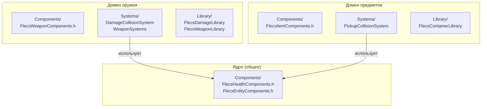

# Почему доменная структура папок

Этот документ объясняет, почему FatumGame использует вертикальную доменную раскладку папок вместо плоской горизонтальной структуры, с которой начинался проект.

---

## Проблема: плоская структура не масштабируется

FatumGame изначально использовал плоскую структуру папок под `Source/FatumGame/Flecs/`:

```
Flecs/
  Components/
    FlecsStaticComponents.h      ← ВСЕ статические компоненты (800+ строк)
    FlecsInstanceComponents.h    ← ВСЕ instance-компоненты (600+ строк)
  Systems/
    FlecsArtillerySubsystem_Systems.cpp  ← ВСЕ системы (2000+ строк)
  Library/
    FlecsDamageLibrary.h
    FlecsContainerLibrary.h
    FlecsWeaponLibrary.h
    FlecsSpawnLibrary.h
  Tags/
    FlecsGameTags.h              ← ВСЕ теги
```

### Что пошло не так

| Проблема | Последствия |
|----------|-----------|
| **Монолитные заголовки** | `FlecsStaticComponents.h` включался везде. Изменение одного компонента оружия перекомпилировало весь код урона, предметов и разрушаемых |
| **Неясная ответственность** | Кто владеет `FlecsStaticComponents.h`? Все его редактируют. Конфликты слияния постоянны |
| **Каскадная компиляция** | Добавление поля в `FWeaponStatic` перекомпилировало каждый файл, включающий любой статический компонент |
| **Сложность навигации** | Поиск "весь код оружия" требует поиска по директориям Components/, Systems/, Library/ |
| **Растущий монолит** | Файл систем вырос за 2000 строк. Прокрутка через несвязанный код урона в поисках кода оружия |
| **Загрязнение включений** | Файлы, которым нужен `FHealthStatic`, получают также `FWeaponStatic`, `FItemStaticData`, `FDoorStatic` и т.д. |

---

## Решение: вертикальная доменная раскладка

Каждый игровой домен (оружие, предметы, разрушаемые и т.д.) владеет самодостаточной папкой со своими компонентами, системами и библиотекой:

```
Source/FatumGame/
  Core/            ← Ядро симуляции (общая инфраструктура)
    Components/    ← Кросс-доменные компоненты (Health, Entity, Interaction)
    Private/       ← Реализация подсистемы, регистрация систем
    Public/        ← Заголовки подсистемы, игровые теги
  Weapon/
    Components/    ← FlecsWeaponComponents.h
    Systems/       ← DamageCollisionSystem, WeaponSystems
    Library/       ← FlecsDamageLibrary, FlecsWeaponLibrary
  Item/
    Components/    ← FlecsItemComponents.h
    Systems/       ← PickupCollisionSystem
    Library/       ← FlecsContainerLibrary
  Destructible/
    Components/    ← FlecsDestructibleComponents.h
    Systems/       ← FragmentationSystem, DestructibleCollision
    Library/       ← FlecsConstraintLibrary
  Door/
    Components/    ← FlecsDoorComponents.h
    Systems/       ← DoorSystems
  Movement/
    Components/    ← FlecsMovementComponents.h
    Private/       ← Системы движения персонажа
  Character/
    Private/       ← FlecsCharacter + частичные _*.cpp файлы
    Public/        ← FlecsCharacter.h
  Spawning/
    Private/       ← FlecsEntitySpawner, SpawnerActor
    Library/       ← FlecsSpawnLibrary
  Rendering/
    Private/       ← FlecsRenderManager, FlecsNiagaraManager
  UI/
    Private/       ← Виджеты, панели
    Public/        ← Заголовки виджетов
  Definitions/     ← ВСЕ Data Assets и профили (общие для доменов)
  Utils/           ← Общие утилиты
  Input/           ← Конфигурация ввода
```

---

## Выгоды

### Чёткая ответственность

Каждая доменная папка -- самодостаточная единица. "Весь код оружия" в `Weapon/`. "Весь код предметов" в `Item/`. Разработчик, работающий над оружием, трогает только файлы в `Weapon/` и возможно `Core/`.



### Минимальное загрязнение заголовков

Файл, работающий с оружием, включает только `FlecsWeaponComponents.h`, а не каждый компонент проекта:

```cpp
// До (плоская структура): включает ВСЁ
#include "Components/FlecsStaticComponents.h"  // 800+ строк, все домены

// После (доменная структура): включает только нужное
#include "Weapon/Components/FlecsWeaponComponents.h"  // ~100 строк, только оружие
```

### Уменьшенная перекомпиляция

Изменение `FWeaponStatic` перекомпилирует только файлы, включающие `FlecsWeaponComponents.h` -- системы и библиотеку оружия. Код предметов, разрушаемых и дверей не затронут.

| Изменение | Перекомпиляция плоской | Перекомпиляция доменной |
|-----------|----------------------|----------------------|
| Добавить поле в `FWeaponStatic` | ~40 файлов (всё включает FlecsStaticComponents.h) | ~8 файлов (только домен оружия) |
| Добавить поле в `FItemStaticData` | ~40 файлов | ~6 файлов (только домен предметов) |
| Добавить новый `FDoorStatic` | ~40 файлов | ~4 файла (только домен дверей) |

### Изоляция доменов

Домены могут развиваться независимо. Добавление нового компонента в систему разрушаемых не рискует сломать код оружия, потому что код оружия не включает заголовки разрушаемых.

### Масштабируемость

Добавление нового домена (напр., `Vehicle/`) означает создание новой папки со своими компонентами, системами и библиотекой. Существующие файлы не модифицируются. Монолитные заголовки не растут.

---

## Что где находится

### Core (общая инфраструктура)

Компоненты и системы, от которых зависят несколько доменов:

| Заголовок | Содержимое | Используется |
|-----------|-----------|-------------|
| `FlecsHealthComponents.h` | `FHealthStatic`, `FHealthInstance`, `FDamageHit`, `FPendingDamage` | Weapon, Destructible, Character |
| `FlecsEntityComponents.h` | `FEntityDefinitionRef`, `FLootStatic`, `FFocusCameraOverride` | Spawning, Interaction, UI |
| `FlecsInteractionComponents.h` | `FInteractionStatic`, `FInteractionInstance` | Interaction, Item, Door |
| `FlecsGameTags.h` | Все типы `FTag*` | Всё |

### Доменные папки

Каждый домен владеет компонентами, специфичными для своего геймплея:

| Домен | Компоненты | Ключевые системы |
|-------|-----------|-----------------|
| `Weapon/` | `FWeaponStatic`, `FWeaponInstance`, `FAimDirection`, `FEquippedBy` | WeaponTickSystem, WeaponReloadSystem, WeaponFireSystem, DamageCollisionSystem |
| `Item/` | `FItemStaticData`, `FContainerStatic`, `FItemInstance`, `FContainerInstance`, `FContainedIn` | PickupCollisionSystem |
| `Destructible/` | `FDestructibleStatic`, `FDebrisInstance`, `FFragmentationData` | ConstraintBreakSystem, FragmentationSystem, DebrisLifetimeSystem |
| `Door/` | `FDoorStatic`, `FDoorInstance` | DoorSystems |

### Definitions (общие Data Assets)

Все классы data asset живут в `Definitions/`, потому что они кросс-доменные по природе -- `UFlecsEntityDefinition` ссылается на профили из нескольких доменов:

```
Definitions/
  FlecsEntityDefinition.h     ← Ссылается на PhysicsProfile, RenderProfile и т.д.
  FlecsPhysicsProfile.h
  FlecsRenderProfile.h
  FlecsHealthProfile.h
  FlecsDamageProfile.h
  FlecsProjectileProfile.h
  FlecsWeaponProfile.h
  FlecsContainerProfile.h
  FlecsInteractionProfile.h
  FlecsDestructibleProfile.h
  ...
```

---

## Заметки о миграции

Проект был мигрирован с плоской структуры на доменную. Ключевые изменения:

1. **Монолитный `FlecsStaticComponents.h`** был разделён на 6 доменных заголовков компонентов
2. **Монолитный `FlecsArtillerySubsystem_Systems.cpp`** был разделён на доменные подметоды: `SetupDamageCollisionSystems()`, `SetupPickupCollisionSystems()`, `SetupDestructibleCollisionSystems()`
3. **Все Data Assets** были консолидированы в `Definitions/`
4. **Все утилиты** были консолидированы в `Utils/`
5. **Blueprint-библиотеки** переехали из `Flecs/Library/` в `<Domain>/Library/`

!!! warning "Обновление путей включений"
    После миграции все включения должны использовать новые доменно-относительные пути:
    ```cpp
    // Старый
    #include "Flecs/Components/FlecsStaticComponents.h"

    // Новый
    #include "Weapon/Components/FlecsWeaponComponents.h"
    #include "Core/Components/FlecsHealthComponents.h"
    ```

---

## Правила для нового кода

1. **Новый домен?** Создайте новую папку под `Source/FatumGame/` с подпапками `Components/`, `Systems/` и опционально `Library/`.

2. **Новый компонент?** Добавьте в доменный заголовок компонентов (напр., `Weapon/Components/FlecsWeaponComponents.h`). Если используется несколькими доменами, добавьте в `Core/Components/`.

3. **Новая система?** Добавьте в файл систем домена или в новый `_Domain.cpp` partial подсистемы. Зарегистрируйте в правильной позиции порядка выполнения.

4. **Новый профиль/data asset?** Добавьте в `Definitions/`.

5. **Кросс-доменная зависимость?** Если домен A нуждается в компоненте домена B, рассмотрите, не следует ли этому компоненту переехать в `Core/`. Не создавайте циклических зависимостей между доменными папками.
