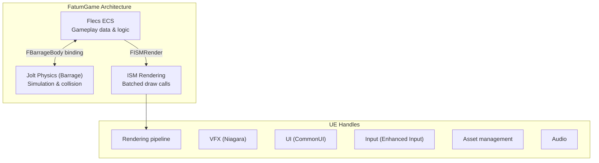

# Why ECS + Custom Physics

This document explains why FatumGame uses Flecs ECS and Jolt Physics instead of Unreal Engine's built-in actor/component model and Chaos physics.

---

## The Problem: UE Actors Don't Scale

Unreal Engine's `AActor` + `UActorComponent` model is designed for heavyweight gameplay objects -- characters, vehicles, interactive props. Each actor carries significant overhead:

### Per-Actor Costs

| Cost | Description |
|------|-------------|
| **Garbage Collection** | Every UObject is tracked by the GC. Thousands of actors cause GC spikes (10-50ms) |
| **Tick overhead** | Each ticking actor is registered in the tick manager. O(N) dispatch per frame |
| **Component hierarchy** | Transform propagation, attachment, component iteration |
| **Replication overhead** | Net relevancy checks even for non-replicated actors |
| **Memory fragmentation** | Actors are heap-allocated individually; cache-hostile access patterns |

For a game with dozens of actors, this is fine. For a game with **thousands of simultaneous projectiles, destructible fragments, items, and physics objects**, it is not viable.

### Chaos Physics Limitations

UE's Chaos physics is tightly coupled to the actor model:

- Physics bodies require a `UPrimitiveComponent`
- Collision callbacks go through the UE delegate system (allocation per callback)
- No clean way to run physics on a dedicated thread independent of game tick
- Query API is designed for actor-based results

---

## The Solution: Flecs + Jolt + ISM

FatumGame replaces UE's gameplay infrastructure with three specialized systems:



### Flecs ECS: Data-Oriented Gameplay

| Feature | Benefit |
|---------|---------|
| **Archetypes** | Entities with the same component set are stored contiguously in memory. Iterating 10,000 entities with `[FHealthInstance, FProjectileInstance]` is a single linear memory scan |
| **Prefab inheritance** | Static data (MaxHP, Damage) is shared via IsA. 10,000 bullets share one `FDamageStatic` instance |
| **Zero GC** | Flecs entities are not UObjects. No garbage collection, no GC spikes, no weak pointer overhead |
| **O(1) queries** | Component presence is checked via archetype bitmask, not runtime casts |
| **Parallel systems** | Flecs automatically parallelizes systems with non-overlapping component access |

### Jolt Physics (via Barrage): Fast Deterministic Simulation

| Feature | Benefit |
|---------|---------|
| **60 Hz dedicated thread** | Physics runs at a fixed rate regardless of GPU framerate |
| **Lock-free API** | Barrage wraps Jolt with thread-safe primitives (no mutex contention) |
| **Efficient broad phase** | Jolt's broad phase handles tens of thousands of bodies |
| **Layer-based collision** | O(1) collision filtering via object layers instead of collision channels |

### ISM Rendering: One Draw Call Per Mesh Type

| Feature | Benefit |
|---------|---------|
| **Instanced rendering** | All entities sharing a mesh + material combo are rendered in a single draw call |
| **No GC pressure** | ISM instances are integer indices, not UObjects |
| **Millions of instances** | GPU instancing scales to hardware limits |

---

## Benefits in Practice

### Entity Count

| Entity Type | Typical Count | Actor-Based Cost | ECS Cost |
|-------------|---------------|------------------|----------|
| Projectiles | 500-2,000 | 500 actors + GC = unplayable | 2,000 ECS entities = trivial |
| Destructible fragments | 100-500 per object | Would require actor pooling | Natural ECS lifecycle |
| Items on ground | 50-200 | Manageable but wasteful | Zero overhead |
| Total gameplay entities | 1,000-5,000 | GC death spiral | Smooth 60 FPS |

### Memory Layout

```
UE Actor model (cache-hostile):
  Actor A → [vtable] → [Transform] → [Health comp ptr] → [heap alloc] → ...
  Actor B → [vtable] → [Transform] → [Health comp ptr] → [heap alloc] → ...
  (pointer chasing, cache misses on every entity)

Flecs archetype (cache-friendly):
  [FHealthInstance A, FHealthInstance B, FHealthInstance C, ...]  ← contiguous
  [FProjectileInstance A, FProjectileInstance B, ...]             ← contiguous
  (linear scan, prefetcher-friendly)
```

---

## The Tradeoff

This architecture is not free. The costs are real and must be understood:

| Tradeoff | Impact | Mitigation |
|----------|--------|------------|
| **No UE editor integration for gameplay entities** | Cannot select, inspect, or transform ECS entities in the level editor | Data Assets for configuration; AFlecsEntitySpawner for placement |
| **Custom tooling required** | No Blueprint visual scripting for ECS logic | Blueprint libraries (UFlecsXxxLibrary) for common operations |
| **Threading complexity** | Cross-thread communication requires lock-free primitives | Well-defined patterns (EnqueueCommand, atomics, MPSC queues) |
| **No built-in networking** | Flecs entities don't replicate automatically | Custom replication (future work) |
| **No physics debugging in editor** | Jolt bodies are invisible to UE's physics debugger | Custom debug rendering (Barrage debug draw) |
| **Learning curve** | Developers must learn ECS patterns, Flecs API, and the threading model | This documentation |

---

## When to Use What

| Use Case | System |
|----------|--------|
| Player character (one-off, needs camera, input, animation) | `AActor` (AFlecsCharacter) + Flecs bridge |
| Projectiles (thousands, simple lifecycle) | Flecs entity + Barrage body + ISM |
| Destructible fragments (hundreds, short-lived) | Flecs entity + Barrage pool body + ISM |
| Items and containers (data-heavy, queryable) | Flecs entity |
| UI widgets | UE CommonUI (UUserWidget) |
| VFX | UE Niagara |
| Level geometry | UE actors (static meshes, BSP) |
| Skeletal mesh characters | UE actor with Flecs bridge (AFlecsCharacter) |
