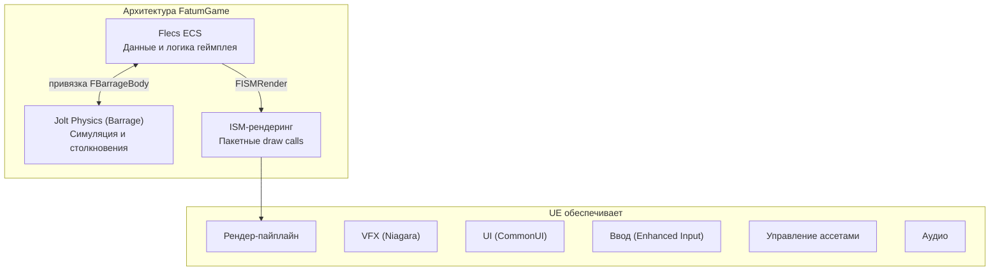

# Почему ECS + пользовательская физика

Этот документ объясняет, почему FatumGame использует Flecs ECS и Jolt Physics вместо встроенной модели акторов/компонентов и физики Chaos Unreal Engine.

---

## Проблема: акторы UE не масштабируются

Модель `AActor` + `UActorComponent` Unreal Engine разработана для тяжеловесных игровых объектов -- персонажей, транспорта, интерактивных пропсов. Каждый актор несёт значительные накладные расходы:

### Стоимость на один актор

| Стоимость | Описание |
|-----------|----------|
| **Сборка мусора** | Каждый UObject отслеживается GC. Тысячи акторов вызывают всплески GC (10-50мс) |
| **Overhead тика** | Каждый тикающий актор регистрируется в менеджере тиков. O(N) диспатч на кадр |
| **Иерархия компонентов** | Распространение трансформов, прикрепление, итерация компонентов |
| **Overhead репликации** | Проверки net relevancy даже для нереплицируемых акторов |
| **Фрагментация памяти** | Акторы аллоцируются индивидуально в куче; кеш-враждебные паттерны доступа |

Для игры с десятками акторов это нормально. Для игры с **тысячами одновременных снарядов, фрагментов разрушения, предметов и физических объектов** это не жизнеспособно.

### Ограничения физики Chaos

Физика Chaos UE тесно связана с моделью акторов:

- Физические тела требуют `UPrimitiveComponent`
- Callback-и столкновений идут через систему делегатов UE (аллокация на callback)
- Нет чистого способа запустить физику на выделенном потоке независимо от game tick
- API запросов рассчитан на результаты на основе акторов

---

## Решение: Flecs + Jolt + ISM

FatumGame заменяет инфраструктуру геймплея UE тремя специализированными системами:



### Flecs ECS: data-ориентированный геймплей

| Возможность | Выгода |
|-------------|--------|
| **Архетипы** | Сущности с одинаковым набором компонентов хранятся непрерывно в памяти. Итерация 10,000 сущностей с `[FHealthInstance, FProjectileInstance]` -- один линейный проход по памяти |
| **Наследование prefab** | Статические данные (MaxHP, Damage) общие через IsA. 10,000 пуль разделяют один экземпляр `FDamageStatic` |
| **Нулевой GC** | Сущности Flecs -- не UObject. Нет сборки мусора, нет всплесков GC, нет overhead weak pointer |
| **Запросы O(1)** | Наличие компонента проверяется через битовую маску архетипа, не через runtime cast |
| **Параллельные системы** | Flecs автоматически распараллеливает системы с непересекающимся доступом к компонентам |

### Jolt Physics (через Barrage): быстрая детерминированная симуляция

| Возможность | Выгода |
|-------------|--------|
| **Выделенный поток 60 Гц** | Физика работает с фиксированной частотой независимо от FPS GPU |
| **Lock-free API** | Barrage оборачивает Jolt потокобезопасными примитивами (без конкуренции мьютексов) |
| **Эффективная широкая фаза** | Широкая фаза Jolt справляется с десятками тысяч тел |
| **Фильтрация по слоям** | Фильтрация столкновений O(1) через слои объектов вместо каналов коллизии |

### ISM-рендеринг: один draw call на тип меша

| Возможность | Выгода |
|-------------|--------|
| **Instanced-рендеринг** | Все сущности с одним мешом + материалом рендерятся за один draw call |
| **Нет давления GC** | ISM-экземпляры -- целочисленные индексы, не UObject |
| **Миллионы экземпляров** | GPU instancing масштабируется до пределов оборудования |

---

## Выгоды на практике

### Количество сущностей

| Тип сущности | Типичное кол-во | Стоимость на акторах | Стоимость ECS |
|-------------|----------------|---------------------|--------------|
| Снаряды | 500-2,000 | 500 акторов + GC = неиграбельно | 2,000 ECS-сущностей = тривиально |
| Фрагменты разрушений | 100-500 на объект | Потребовал бы пулинг акторов | Естественный жизненный цикл ECS |
| Предметы на земле | 50-200 | Управляемо, но расточительно | Нулевой overhead |
| Всего игровых сущностей | 1,000-5,000 | Спираль смерти GC | Плавные 60 FPS |

### Раскладка памяти

```
Модель акторов UE (кеш-враждебная):
  Actor A → [vtable] → [Transform] → [Health comp ptr] → [heap alloc] → ...
  Actor B → [vtable] → [Transform] → [Health comp ptr] → [heap alloc] → ...
  (гонка за указателями, промахи кеша на каждой сущности)

Архетип Flecs (кеш-дружественный):
  [FHealthInstance A, FHealthInstance B, FHealthInstance C, ...]  ← непрерывно
  [FProjectileInstance A, FProjectileInstance B, ...]             ← непрерывно
  (линейный проход, дружественный к prefetcher)
```

---

## Компромисс

Эта архитектура не бесплатна. Издержки реальны и должны быть поняты:

| Компромисс | Влияние | Смягчение |
|-----------|--------|-----------|
| **Нет интеграции с редактором UE для игровых сущностей** | Нельзя выделять, инспектировать или трансформировать ECS-сущности в редакторе уровня | Data Assets для конфигурации; AFlecsEntitySpawner для размещения |
| **Требуется пользовательский инструментарий** | Нет визуального скриптинга Blueprint для ECS-логики | Blueprint-библиотеки (UFlecsXxxLibrary) для типовых операций |
| **Сложность потоков** | Межпоточная коммуникация требует lock-free примитивов | Чётко определённые паттерны (EnqueueCommand, atomics, MPSC-очереди) |
| **Нет встроенного сетевого кода** | Сущности Flecs не реплицируются автоматически | Пользовательская репликация (будущая работа) |
| **Нет отладки физики в редакторе** | Тела Jolt невидимы для отладчика физики UE | Пользовательский отладочный рендеринг (Barrage debug draw) |
| **Кривая обучения** | Разработчики должны изучить паттерны ECS, Flecs API и модель потоков | Эта документация |

---

## Когда что использовать

| Случай использования | Система |
|---------------------|---------|
| Персонаж игрока (единичный, нужна камера, ввод, анимация) | `AActor` (AFlecsCharacter) + мост Flecs |
| Снаряды (тысячи, простой жизненный цикл) | Сущность Flecs + тело Barrage + ISM |
| Фрагменты разрушений (сотни, короткоживущие) | Сущность Flecs + тело из пула Barrage + ISM |
| Предметы и контейнеры (много данных, запрашиваемые) | Сущность Flecs |
| UI-виджеты | UE CommonUI (UUserWidget) |
| VFX | UE Niagara |
| Геометрия уровня | Акторы UE (статические меши, BSP) |
| Скелетные персонажи | Актор UE с мостом Flecs (AFlecsCharacter) |
