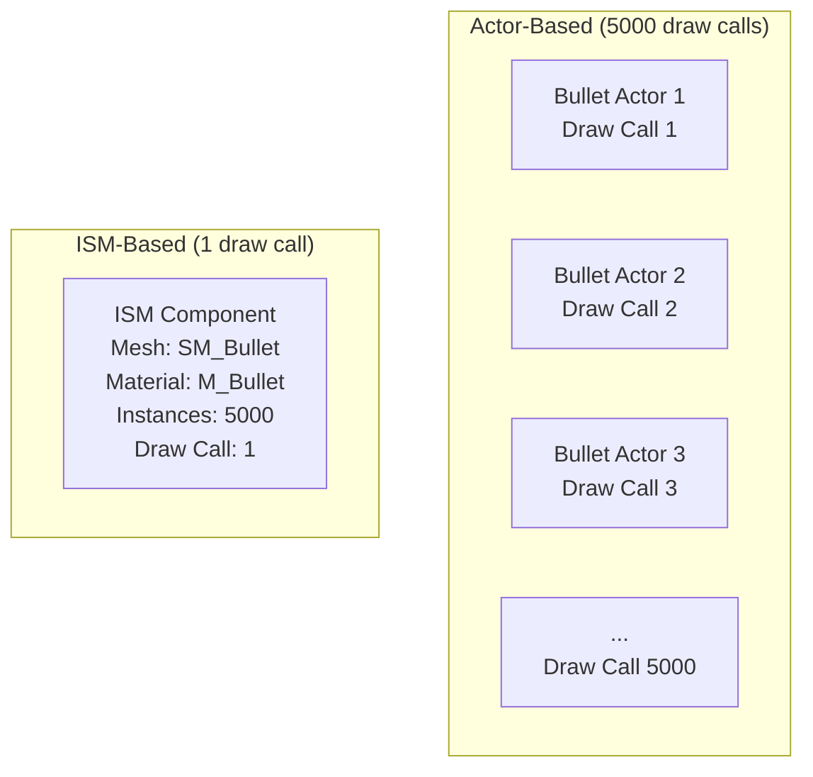
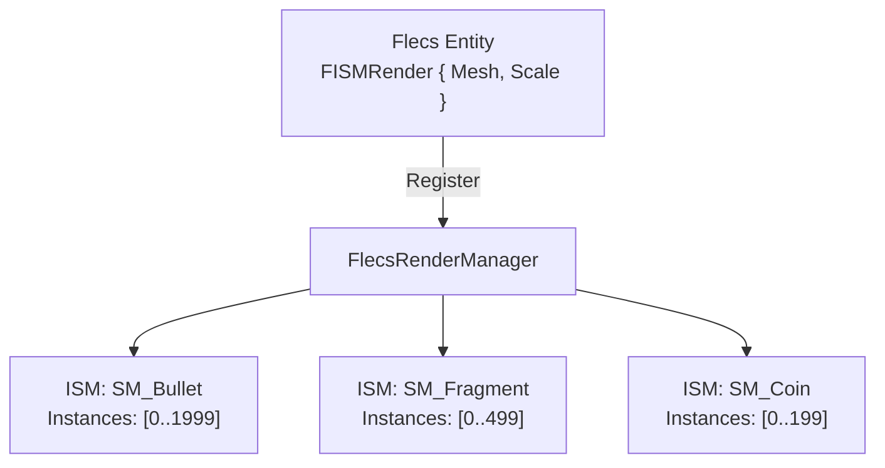

# Why ISM Rendering

This document explains why FatumGame uses Instanced Static Meshes (ISM) for rendering ECS entities instead of individual actor-based mesh components.

---

## The Problem: One Actor = One Draw Call

In standard Unreal Engine, each visible actor with a mesh component generates at least one draw call. For a game with thousands of simultaneous entities, this becomes the primary bottleneck.

### Draw Call Costs

| Entity Count | Draw Calls (Actor-Based) | GPU Cost | Result |
|--------------|--------------------------|----------|--------|
| 100 | 100 | Minimal | Fine |
| 500 | 500 | Moderate | Noticeable on mid-range hardware |
| 2,000 | 2,000 | Heavy | GPU-bound, 30 FPS |
| 5,000 | 5,000 | Extreme | Unplayable |

Each draw call involves:

- **CPU overhead:** State setup, shader binding, buffer binding, draw command submission
- **GPU overhead:** State transitions between draw calls
- **GC overhead:** Each `UStaticMeshComponent` is a UObject tracked by garbage collection
- **Memory:** Per-component transform, bounds, visibility, LOD state

### The Real Bottleneck

Draw calls are not the rendering of triangles -- modern GPUs handle millions of triangles easily. The bottleneck is the **CPU-side overhead per draw call** and the **GPU state transitions between them**. Reducing draw calls from 5,000 to 50 can transform an unplayable game into a smooth one, even though the total triangle count is identical.

---

## The Solution: Instanced Static Meshes

ISM batches all instances of the same mesh + material combination into a **single draw call**. The GPU renders all instances in one pass using per-instance transform data.



### How It Works in FatumGame

1. **Entity spawn:** When a Flecs entity with `FISMRender` is created, the render manager adds an ISM instance (an integer index) to the appropriate ISM component (one per mesh + material combo).

2. **Per-tick update:** The `UpdateTransforms()` function reads physics positions from Barrage, interpolates between previous and current states, and writes the transform array to the ISM component.

3. **Entity destroy:** The ISM instance index is removed (swapped with the last instance for O(1) removal).

```cpp
// FISMRender on a Flecs entity
USTRUCT()
struct FISMRender
{
    GENERATED_BODY()

    UPROPERTY()
    UStaticMesh* Mesh = nullptr;

    UPROPERTY()
    FVector Scale = FVector::OneVector;

    // Runtime: ISM instance index (assigned by render manager)
    int32 InstanceIndex = INDEX_NONE;
};
```

---

## Benefits

### Draw Call Reduction

| Mesh Type | Instance Count | Actor Draw Calls | ISM Draw Calls |
|-----------|---------------|------------------|----------------|
| Bullet | 2,000 | 2,000 | 1 |
| Grenade fragment | 500 | 500 | 1 |
| Item (coin) | 200 | 200 | 1 |
| Crate | 50 | 50 | 1 |
| **Total** | **2,750** | **2,750** | **4** |

That is a **687x reduction** in draw calls.

### Zero GC Pressure

ISM instances are integer indices into a transform array. They are not UObjects. Creating or destroying 1,000 ISM instances has zero impact on garbage collection.

| Operation | Actor-Based | ISM-Based |
|-----------|-------------|-----------|
| Create 1000 entities | 1000 NewObject calls + GC registration | 1000 array insertions |
| Destroy 1000 entities | 1000 GC candidates + potential GC spike | 1000 array removals |
| Per-frame GC scan | Scans all 1000 UObjects | Scans nothing |

### GPU Instancing Efficiency

Modern GPUs are designed for instanced rendering. The hardware fetches per-instance data (transform, color) from a buffer and applies it automatically. The GPU does not care whether it is rendering 1 instance or 10,000 -- the cost scales with total triangle count, not instance count.

---

## The Tradeoff

### No Per-Entity Materials

All instances of an ISM share the same material. You cannot tint one bullet red and another blue without splitting them into separate ISM components (separate draw calls).

!!! note "Mitigation"
    For the common cases (damage indicators, team colors), use per-instance custom data or world-position-based material effects. Material Parameter Collections can provide global state (e.g., time dilation visual effect) without per-instance cost.

### No Per-Entity LOD

ISM components share a single LOD setting. Individual instances cannot have independent LOD levels.

!!! note "Mitigation"
    Most ECS entities (projectiles, fragments, items) are small and use simple meshes that do not benefit from LOD. Characters (which need LOD) use traditional skeletal mesh actors, not ISM.

### Custom Interpolation Required

Because ISM instances are not actors, they do not benefit from UE's built-in movement interpolation. FatumGame implements its own interpolation:

```
Sim Thread (60 Hz):  PrevPos ──── CurrPos ──── NextPos
                        │            │
Game Thread (Xfps):     └─ Alpha ────┘
                        Lerp(PrevPos, CurrPos, Alpha)
```

Each ISM instance stores previous and current positions. The game thread computes an interpolation alpha from sim thread timing atomics and lerps between them.

!!! warning "First-frame snap"
    Newly spawned entities must set `Prev = Curr = SpawnPosition` to avoid interpolating from the origin. This is handled by the `bJustSpawned` flag.

### No Per-Entity Collision Visualization in Editor

ISM instances are invisible to UE's physics debug visualization. Collision bodies exist only in Jolt.

!!! note "Mitigation"
    Barrage debug draw provides custom collision visualization when enabled.

---

## Architecture: Render Manager

The `FlecsRenderManager` owns all ISM components and manages the mapping between Flecs entities and ISM instances:



The render manager:

1. Creates ISM components on demand (one per unique mesh + material)
2. Assigns instance indices to entities
3. Updates all transforms each frame from interpolated physics positions
4. Removes instances when entities are destroyed

Sim-thread entity creation communicates with the game-thread render manager via MPSC queues (`PendingProjectileSpawns`, `PendingFragmentSpawns`), ensuring thread safety.
