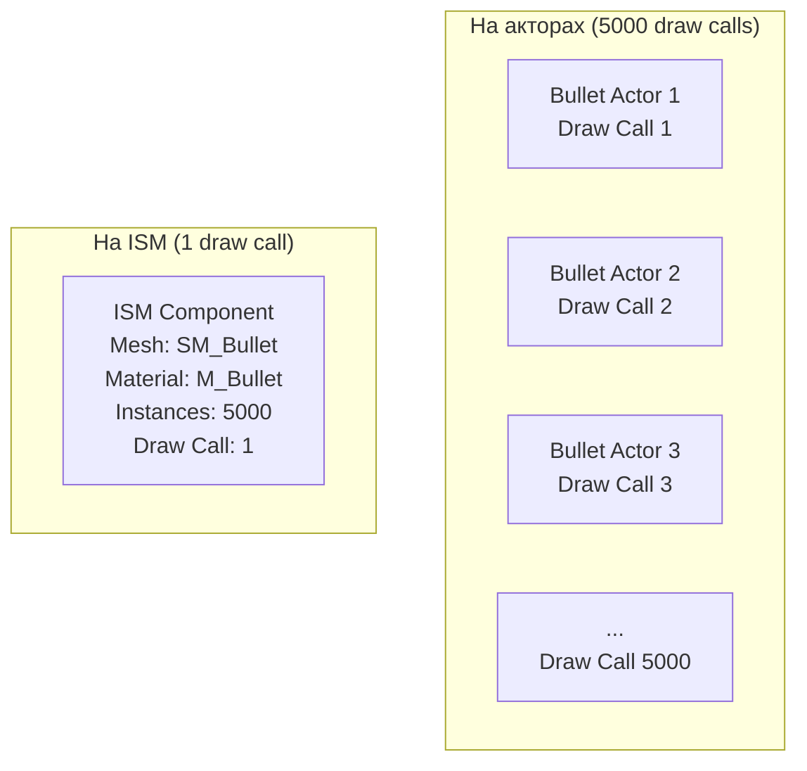
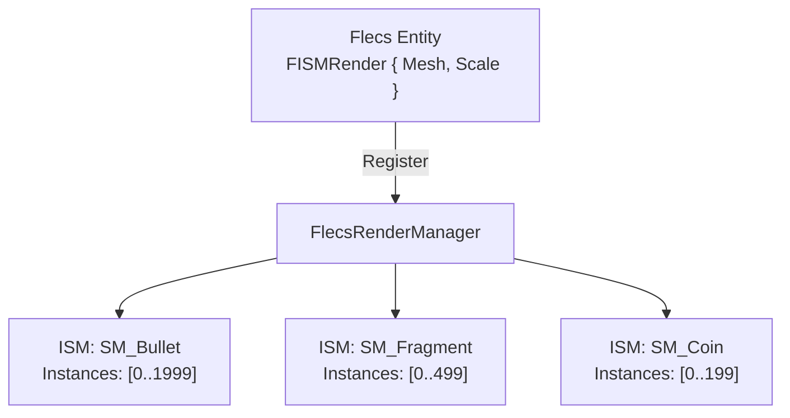

# Почему ISM-рендеринг

Этот документ объясняет, почему FatumGame использует Instanced Static Meshes (ISM) для рендеринга ECS-сущностей вместо индивидуальных меш-компонентов на основе акторов.

---

## Проблема: один актор = один draw call

В стандартном Unreal Engine каждый видимый актор с меш-компонентом генерирует минимум один draw call. Для игры с тысячами одновременных сущностей это становится основным узким местом.

### Стоимость draw calls

| Кол-во сущностей | Draw calls (на акторах) | Нагрузка GPU | Результат |
|-----------------|------------------------|-------------|---------|
| 100 | 100 | Минимальная | Нормально |
| 500 | 500 | Средняя | Заметно на среднем оборудовании |
| 2,000 | 2,000 | Тяжёлая | GPU-bound, 30 FPS |
| 5,000 | 5,000 | Экстремальная | Неиграбельно |

Каждый draw call включает:

- **Overhead CPU:** Настройка состояния, привязка шейдеров, привязка буферов, отправка команды рисования
- **Overhead GPU:** Переключения состояния между draw calls
- **Overhead GC:** Каждый `UStaticMeshComponent` -- UObject, отслеживаемый сборщиком мусора
- **Память:** Трансформ, bounds, видимость, состояние LOD на каждый компонент

### Реальное узкое место

Draw calls -- это не рендеринг треугольников: современные GPU легко обрабатывают миллионы треугольников. Узкое место -- **CPU-overhead на draw call** и **переключения состояния GPU между ними**. Уменьшение draw calls с 5,000 до 50 может превратить неиграбельную игру в плавную, хотя общее количество треугольников идентично.

---

## Решение: Instanced Static Meshes

ISM объединяет все экземпляры одной комбинации меш + материал в **один draw call**. GPU рендерит все экземпляры за один проход, используя per-instance данные трансформов.



### Как это работает в FatumGame

1. **Спавн сущности:** Когда создаётся сущность Flecs с `FISMRender`, менеджер рендера добавляет ISM-экземпляр (целочисленный индекс) к соответствующему ISM-компоненту (по одному на комбинацию меш + материал).

2. **Потиковое обновление:** Функция `UpdateTransforms()` читает физические позиции из Barrage, интерполирует между предыдущим и текущим состояниями и записывает массив трансформов в ISM-компонент.

3. **Уничтожение сущности:** ISM-индекс экземпляра удаляется (заменяется последним экземпляром для O(1) удаления).

```cpp
// FISMRender на сущности Flecs
USTRUCT()
struct FISMRender
{
    GENERATED_BODY()

    UPROPERTY()
    UStaticMesh* Mesh = nullptr;

    UPROPERTY()
    FVector Scale = FVector::OneVector;

    // Runtime: ISM-индекс экземпляра (назначается менеджером рендера)
    int32 InstanceIndex = INDEX_NONE;
};
```

---

## Выгоды

### Уменьшение draw calls

| Тип меша | Кол-во экземпляров | Draw calls на акторах | Draw calls ISM |
|---------|-------------------|---------------------|---------------|
| Пуля | 2,000 | 2,000 | 1 |
| Фрагмент гранаты | 500 | 500 | 1 |
| Предмет (монета) | 200 | 200 | 1 |
| Ящик | 50 | 50 | 1 |
| **Итого** | **2,750** | **2,750** | **4** |

Это **уменьшение draw calls в 687 раз**.

### Нулевое давление GC

ISM-экземпляры -- целочисленные индексы в массиве трансформов. Они не UObject. Создание или уничтожение 1,000 ISM-экземпляров имеет нулевое влияние на сборку мусора.

| Операция | На акторах | На ISM |
|----------|-----------|--------|
| Создать 1000 сущностей | 1000 вызовов NewObject + регистрация GC | 1000 вставок в массив |
| Уничтожить 1000 сущностей | 1000 кандидатов GC + возможный всплеск GC | 1000 удалений из массива |
| Сканирование GC на кадр | Сканирует все 1000 UObject | Не сканирует ничего |

### Эффективность GPU instancing

Современные GPU разработаны для instanced-рендеринга. Оборудование автоматически загружает per-instance данные (трансформ, цвет) из буфера и применяет их. GPU не важно, рендерит ли он 1 экземпляр или 10,000 -- стоимость масштабируется с общим количеством треугольников, не с количеством экземпляров.

---

## Компромисс

### Нет per-entity материалов

Все экземпляры ISM разделяют один материал. Нельзя покрасить одну пулю красной, а другую синей без разделения на отдельные ISM-компоненты (отдельные draw calls).

!!! note "Смягчение"
    Для типовых случаев (индикаторы урона, цвета команд) используйте per-instance custom data или эффекты материала на основе мировой позиции. Material Parameter Collections могут предоставить глобальное состояние (напр., визуальный эффект замедления) без per-instance стоимости.

### Нет per-entity LOD

ISM-компоненты разделяют одну настройку LOD. Отдельные экземпляры не могут иметь независимые уровни LOD.

!!! note "Смягчение"
    Большинство ECS-сущностей (снаряды, фрагменты, предметы) малы и используют простые меши, не нуждающиеся в LOD. Персонажи (которым нужен LOD) используют традиционные скелетные меш-акторы, не ISM.

### Требуется пользовательская интерполяция

Поскольку ISM-экземпляры -- не акторы, они не пользуются встроенной интерполяцией движения UE. FatumGame реализует собственную интерполяцию:

```
Sim Thread (60 Гц):  PrevPos ──── CurrPos ──── NextPos
                        │            │
Game Thread (Xfps):     └─ Alpha ────┘
                        Lerp(PrevPos, CurrPos, Alpha)
```

Каждый ISM-экземпляр хранит предыдущую и текущую позиции. Game thread вычисляет альфу интерполяции из atomics тайминга sim thread и линейно интерполирует между ними.

!!! warning "Snap первого кадра"
    Только что заспавненные сущности должны установить `Prev = Curr = SpawnPosition`, чтобы избежать интерполяции от начала координат. Это обрабатывается флагом `bJustSpawned`.

### Нет визуализации коллизий per-entity в редакторе

ISM-экземпляры невидимы для отладочной визуализации физики UE. Тела коллизий существуют только в Jolt.

!!! note "Смягчение"
    Barrage debug draw предоставляет пользовательскую визуализацию коллизий при включении.

---

## Архитектура: менеджер рендера

`FlecsRenderManager` владеет всеми ISM-компонентами и управляет маппингом между сущностями Flecs и ISM-экземплярами:



Менеджер рендера:

1. Создаёт ISM-компоненты по запросу (по одному на уникальный меш + материал)
2. Назначает индексы экземпляров сущностям
3. Обновляет все трансформы каждый кадр из интерполированных физических позиций
4. Удаляет экземпляры при уничтожении сущностей

Создание сущностей на sim thread коммуницирует с менеджером рендера на game thread через MPSC-очереди (`PendingProjectileSpawns`, `PendingFragmentSpawns`), обеспечивая потокобезопасность.
