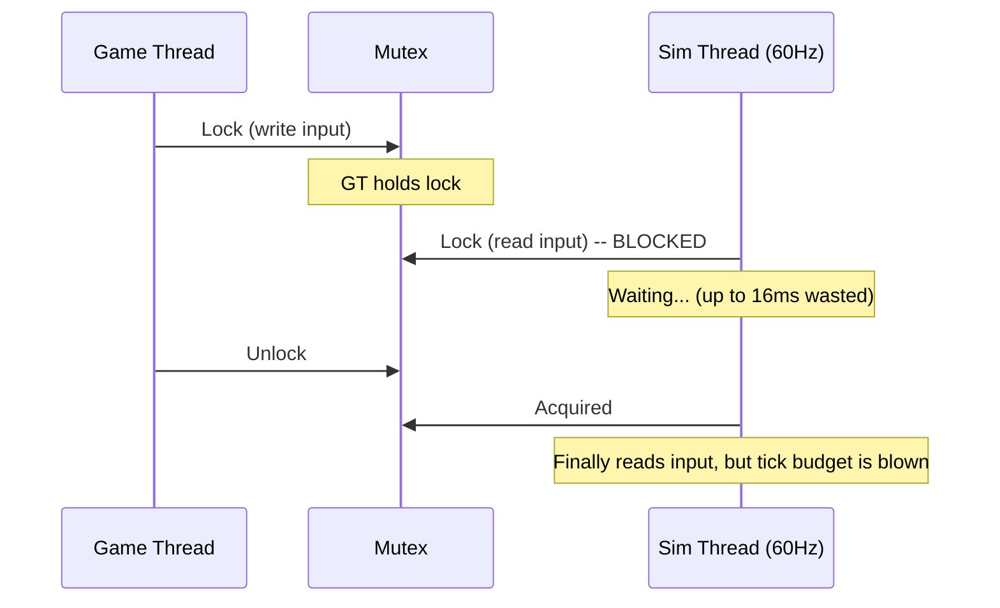
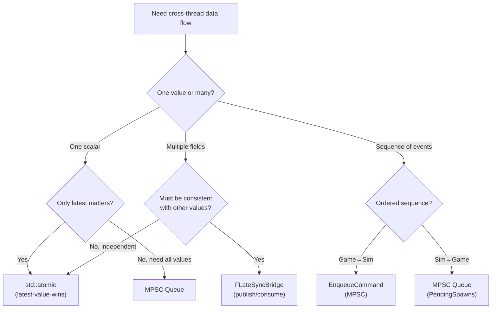

# Why Lock-Free Communication

This document explains why FatumGame uses lock-free primitives (atomics, MPSC queues, latest-value-wins bridges) instead of mutexes for cross-thread communication.

---

## The Problem: Mutex Contention Between Asymmetric Threads

FatumGame has two primary threads with different timing characteristics:

| Thread | Frequency | Timing | Budget |
|--------|-----------|--------|--------|
| **Sim Thread** | Fixed 60 Hz | 16.67 ms per tick | Must never miss a tick |
| **Game Thread** | Variable (30-200+ Hz) | Frame-dependent | Can vary with GPU load |

A mutex-based approach creates contention:



### Why Mutexes Are Problematic Here

| Problem | Description |
|---------|-------------|
| **Priority inversion** | The 60 Hz sim thread can be blocked by the variable-rate game thread. A GPU spike causing a long game frame blocks the sim thread for the duration |
| **Deadlock risk** | Multiple mutexes (physics, ECS, rendering) create ordering requirements. One mistake = deadlock |
| **Unpredictable latency** | Lock acquisition time depends on the other thread's hold time. This is incompatible with a fixed 60 Hz tick |
| **Convoy effect** | Under contention, threads pile up waiting. With 60 Hz real-time requirements, even brief convoys cause missed ticks |
| **Context switch overhead** | A blocked thread yields its timeslice. The OS scheduler may not wake it promptly (10-15 ms worst case on Windows) |

!!! danger "A single missed sim tick causes visible physics jitter"
    At 60 Hz, a missed tick means the next tick processes 33.3 ms of physics instead of 16.67 ms. Fast projectiles skip forward. Character movement stutters. Constraint solvers lose stability.

---

## The Solution: Lock-Free Primitives

FatumGame uses five lock-free primitives, each matched to a specific data flow pattern:

### 1. std::atomic -- Latest-Value-Wins

For scalar values where only the most recent value matters:

```cpp
// Game thread: writes every frame
InputMoveX.store(StickValue, std::memory_order_relaxed);

// Sim thread: reads once per tick
float MoveX = InputMoveX.load(std::memory_order_relaxed);
```

**Properties:**

- Zero contention -- no thread ever waits
- No ordering guarantee between independent atomics (but that is fine for independent values)
- Intermediate values may be lost (game thread writes at 144 Hz, sim reads at 60 Hz -- ~84 writes are "lost" per second)

**Used for:** Input values, time dilation scale, sim tick counters, published time scale.

### 2. MPSC Queue -- Ordered, Many Writers, One Reader

For sequences of commands or events that must be processed in order:

```cpp
// Game thread: enqueue commands (multiple callers OK)
CommandQueue.Enqueue([](UFlecsArtillerySubsystem* Sub) {
    // Executed on sim thread
});

// Sim thread: drain all commands at start of tick
TFunction<void(UFlecsArtillerySubsystem*)> Cmd;
while (CommandQueue.Dequeue(Cmd))
{
    Cmd(this);
}
```

**Properties:**

- Lock-free (CAS-based enqueue)
- FIFO ordering preserved
- Multiple producers (game thread, UI thread) safe
- Single consumer (sim thread) processes all in one pass

**Used for:** `EnqueueCommand` (game -> sim mutations), `PendingProjectileSpawns` (sim -> game ISM), `PendingFragmentSpawns` (sim -> game debris).

### 3. FLateSyncBridge -- Multi-Field Consistent Snapshot

For groups of related values that must be read as a consistent set:

```cpp
// Game thread: write all fields, then publish
Bridge.AimDirX.store(Dir.X);
Bridge.AimDirY.store(Dir.Y);
Bridge.AimDirZ.store(Dir.Z);
Bridge.MuzzleX.store(Pos.X);
Bridge.Publish();  // Fence: "all above are consistent"

// Sim thread: consume only after Publish
if (Bridge.HasNewData())
{
    FVector AimDir(Bridge.AimDirX.load(), ...);
    FVector Muzzle(Bridge.MuzzleX.load(), ...);
    // Guaranteed consistent snapshot
}
```

**Properties:**

- No mutex, no contention
- Consistency guarantee: sim thread reads either all-old or all-new values
- Publish is an atomic flag (release/acquire semantics)

**Used for:** Aim direction + muzzle position (6 floats that must be consistent).

### 4. FSimStateCache -- Sim -> Game State Reads

For game-thread code (UI) that needs to read simulation state:

```cpp
// Sim thread: update cache in systems
Cache->SetHealth(EntityId, CurrentHP, MaxHP);

// Game thread: read cached values for UI
float HP, MaxHP;
Cache->GetHealth(EntityId, HP, MaxHP);
```

**Properties:**

- Lock-free reads and writes
- Latest-value-wins semantics (UI always shows most recent state)
- No ordering between different entities' data

**Used for:** Health bars, ammo counters, entity status displays.

### 5. Atomic Barriers -- Lifecycle Coordination

For shutdown synchronization (the one case where "wait" is acceptable):

```cpp
// Deinitialize
bDeinitializing.store(true, std::memory_order_release);
while (bInArtilleryTick.load(std::memory_order_acquire))
{
    FPlatformProcess::Yield();
}
// Safe: sim thread has exited
```

**Properties:**

- Only used at shutdown (not on hot path)
- Spin-wait is acceptable because it happens exactly once per PIE session
- Release/acquire ordering ensures all sim thread writes are visible before cleanup

---

## Benefits

### Zero Contention on Hot Paths

Every per-frame and per-tick operation is wait-free:

| Operation | Frequency | Wait Time |
|-----------|-----------|-----------|
| Input write (game thread) | Per frame (30-200 Hz) | 0 (atomic store) |
| Input read (sim thread) | Per tick (60 Hz) | 0 (atomic load) |
| Command enqueue | Per event | 0 (CAS, no spin in practice) |
| Command drain | Per tick | 0 (sequential dequeue) |
| ISM transform update | Per frame | 0 (reads from prev/curr arrays) |

### No Deadlocks

Lock-free primitives cannot deadlock. There are no locks to acquire in wrong order. The only "blocking" operation is the shutdown spin-wait, which has a single writer and single reader.

### Predictable Latency

| Primitive | Maximum Latency |
|-----------|----------------|
| Atomic (latest-value-wins) | 1 sim tick (16.67 ms) |
| MPSC queue (EnqueueCommand) | 1 sim tick (16.67 ms) |
| FLateSyncBridge | 1 sim tick (16.67 ms) |
| FSimStateCache | 1 game frame (variable) |

Latency is bounded by the tick rate, not by contention.

---

## The Tradeoff

### Code Complexity

Lock-free code is harder to write correctly and harder to reason about than mutex-protected code:

| Challenge | Description |
|-----------|-------------|
| **Memory ordering** | Must choose correct `memory_order_*` for each atomic operation |
| **ABA problem** | CAS-based queues must handle value recycling (our MPSC implementation avoids this) |
| **Tearing** | Structs larger than the atomic width cannot be atomically updated (hence FLateSyncBridge for multi-field data) |
| **Debugging** | Data races in lock-free code are intermittent and hard to reproduce |
| **Stale reads** | Latest-value-wins means the sim thread may read a value from 1 frame ago (acceptable for input, not for multi-field consistency) |

### Ordering Subtleties

Independent atomics have no ordering relationship. If the game thread writes `A` then `B`, the sim thread may see `B`'s new value but `A`'s old value.

```cpp
// WRONG: Two atomics that must be consistent
MuzzleX.store(100.f);   // Game thread writes
MuzzleY.store(200.f);
// Sim thread might read MuzzleX=100 (new) and MuzzleY=0 (old)

// RIGHT: Use FLateSyncBridge with Publish() fence
Bridge.MuzzleX.store(100.f);
Bridge.MuzzleY.store(200.f);
Bridge.Publish();  // Release fence: all above visible after this
```

!!! warning "Rule of thumb"
    If two values must be read as a consistent pair, they CANNOT be independent atomics. Use `FLateSyncBridge` or pack them into a single atomic (e.g., packed int32 pairs).

---

## Choosing the Right Primitive



| If you need... | Use... | Example |
|----------------|--------|---------|
| Send a scalar to sim thread | `std::atomic` | Input axes, time scale |
| Read a scalar from sim thread | `std::atomic` or `FSimStateCache` | Tick count, health for UI |
| Send a consistent group of values | `FLateSyncBridge` | Aim direction + muzzle position |
| Send a command/mutation | `EnqueueCommand` | Apply damage, spawn entity |
| Send ordered events to game thread | MPSC queue | Projectile spawn visuals |
| Coordinate shutdown | Atomic barriers | `bDeinitializing` + `bInArtilleryTick` |
