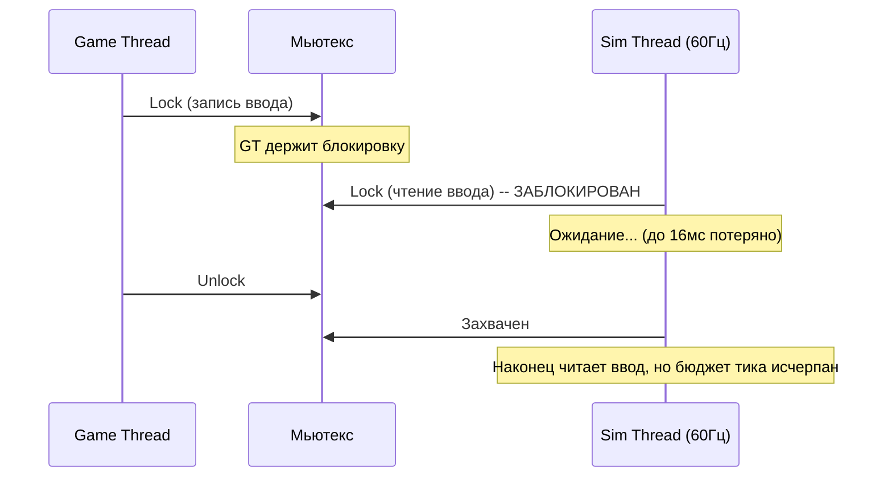
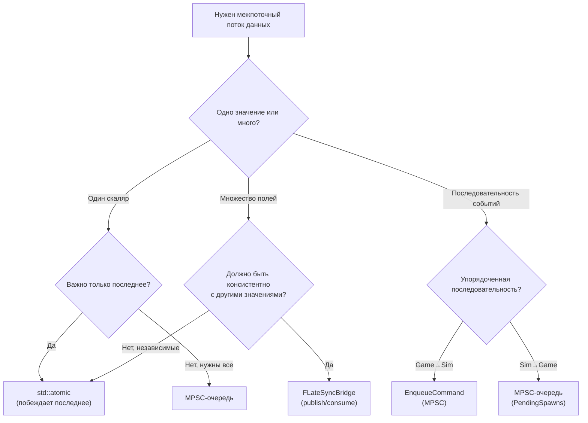

# Почему lock-free коммуникация

Этот документ объясняет, почему FatumGame использует lock-free примитивы (atomics, MPSC-очереди, мосты с семантикой последнего значения) вместо мьютексов для межпоточной коммуникации.

---

## Проблема: конкуренция мьютексов между асимметричными потоками

FatumGame имеет два основных потока с различными временными характеристиками:

| Поток | Частота | Тайминг | Бюджет |
|-------|---------|---------|--------|
| **Sim Thread** | Фиксированная 60 Гц | 16.67 мс на тик | Не должен пропускать тик |
| **Game Thread** | Переменная (30-200+ Гц) | Зависит от кадра | Может варьироваться с нагрузкой GPU |

Подход на мьютексах создаёт конкуренцию:



### Почему мьютексы проблематичны

| Проблема | Описание |
|----------|----------|
| **Инверсия приоритета** | 60 Гц sim thread может быть заблокирован переменным game thread. Всплеск GPU с длинным игровым кадром блокирует sim thread на его длительность |
| **Риск дедлока** | Несколько мьютексов (физика, ECS, рендеринг) создают требования к порядку. Одна ошибка = дедлок |
| **Непредсказуемая задержка** | Время захвата блокировки зависит от времени удержания другим потоком. Несовместимо с фиксированным тиком 60 Гц |
| **Эффект конвоя** | При конкуренции потоки скапливаются в ожидании. При требованиях реального времени 60 Гц даже короткие конвои вызывают пропуск тиков |
| **Overhead переключения контекста** | Заблокированный поток отдаёт свой timeslice. Планировщик ОС может не разбудить его оперативно (до 10-15 мс в худшем случае на Windows) |

!!! danger "Один пропущенный тик симуляции вызывает видимое дрожание физики"
    При 60 Гц пропущенный тик означает, что следующий обрабатывает 33.3 мс физики вместо 16.67 мс. Быстрые снаряды перескакивают. Движение персонажа заикается. Солверы констрейнтов теряют стабильность.

---

## Решение: lock-free примитивы

FatumGame использует пять lock-free примитивов, каждый подобранный под конкретный паттерн потока данных:

### 1. std::atomic -- побеждает последнее значение

Для скалярных значений, где важно только самое последнее:

```cpp
// Game thread: пишет каждый кадр
InputMoveX.store(StickValue, std::memory_order_relaxed);

// Sim thread: читает один раз за тик
float MoveX = InputMoveX.load(std::memory_order_relaxed);
```

**Свойства:**

- Нулевая конкуренция -- ни один поток никогда не ждёт
- Нет гарантии упорядочения между независимыми atomics (но это нормально для независимых значений)
- Промежуточные значения могут быть потеряны (game thread пишет на 144 Гц, sim читает на 60 Гц -- ~84 записи "теряются" в секунду)

**Используется для:** Значения ввода, масштаб замедления времени, счётчики тиков, опубликованный масштаб времени.

### 2. MPSC-очередь -- упорядоченная, много писателей, один читатель

Для последовательностей команд или событий, которые должны обрабатываться по порядку:

```cpp
// Game thread: ставить команды в очередь (множество вызывающих -- ОК)
CommandQueue.Enqueue([](UFlecsArtillerySubsystem* Sub) {
    // Выполняется на sim thread
});

// Sim thread: дренировать все команды в начале тика
TFunction<void(UFlecsArtillerySubsystem*)> Cmd;
while (CommandQueue.Dequeue(Cmd))
{
    Cmd(this);
}
```

**Свойства:**

- Lock-free (CAS-основанная постановка в очередь)
- Порядок FIFO сохраняется
- Множество продюсеров (game thread, UI thread) безопасно
- Единственный потребитель (sim thread) обрабатывает всё за один проход

**Используется для:** `EnqueueCommand` (мутации game -> sim), `PendingProjectileSpawns` (sim -> game ISM), `PendingFragmentSpawns` (sim -> game обломки).

### 3. FLateSyncBridge -- консистентный снимок множества полей

Для групп связанных значений, которые должны читаться как консистентный набор:

```cpp
// Game thread: записать все поля, затем опубликовать
Bridge.AimDirX.store(Dir.X);
Bridge.AimDirY.store(Dir.Y);
Bridge.AimDirZ.store(Dir.Z);
Bridge.MuzzleX.store(Pos.X);
Bridge.Publish();  // Fence: "всё выше консистентно"

// Sim thread: потреблять только после Publish
if (Bridge.HasNewData())
{
    FVector AimDir(Bridge.AimDirX.load(), ...);
    FVector Muzzle(Bridge.MuzzleX.load(), ...);
    // Гарантированно консистентный снимок
}
```

**Свойства:**

- Нет мьютекса, нет конкуренции
- Гарантия консистентности: sim thread читает либо все-старые, либо все-новые значения
- Publish -- атомарный флаг (семантика release/acquire)

**Используется для:** Направление прицеливания + позиция дульного среза (6 float, которые должны быть консистентными).

### 4. FSimStateCache -- чтения состояния Sim -> Game

Для кода game thread (UI), которому нужно читать состояние симуляции:

```cpp
// Sim thread: обновление кеша в системах
Cache->SetHealth(EntityId, CurrentHP, MaxHP);

// Game thread: чтение кешированных значений для UI
float HP, MaxHP;
Cache->GetHealth(EntityId, HP, MaxHP);
```

**Свойства:**

- Lock-free чтения и записи
- Семантика последнего значения (UI всегда показывает самое свежее состояние)
- Нет упорядочения между данными разных сущностей

**Используется для:** Полоски здоровья, счётчики патронов, отображение статуса сущностей.

### 5. Атомарные барьеры -- координация жизненного цикла

Для синхронизации завершения (единственный случай, где "ожидание" приемлемо):

```cpp
// Деинициализация
bDeinitializing.store(true, std::memory_order_release);
while (bInArtilleryTick.load(std::memory_order_acquire))
{
    FPlatformProcess::Yield();
}
// Безопасно: sim thread вышел
```

**Свойства:**

- Используется только при завершении (не на горячем пути)
- Spin-wait приемлем, так как происходит ровно один раз за PIE-сессию
- Упорядочение release/acquire гарантирует видимость всех записей sim thread до очистки

---

## Выгоды

### Нулевая конкуренция на горячих путях

Каждая операция на каждый кадр и каждый тик -- wait-free:

| Операция | Частота | Время ожидания |
|----------|---------|---------------|
| Запись ввода (game thread) | Каждый кадр (30-200 Гц) | 0 (atomic store) |
| Чтение ввода (sim thread) | Каждый тик (60 Гц) | 0 (atomic load) |
| Постановка команды в очередь | На событие | 0 (CAS, без spin на практике) |
| Дренирование команд | Каждый тик | 0 (последовательный dequeue) |
| Обновление трансформов ISM | Каждый кадр | 0 (чтение из массивов prev/curr) |

### Нет дедлоков

Lock-free примитивы не могут создать дедлок. Нет блокировок для захвата в неправильном порядке. Единственная "блокирующая" операция -- spin-wait при завершении, у которого один писатель и один читатель.

### Предсказуемая задержка

| Примитив | Максимальная задержка |
|----------|---------------------|
| Atomic (побеждает последнее) | 1 тик симуляции (16.67 мс) |
| MPSC-очередь (EnqueueCommand) | 1 тик симуляции (16.67 мс) |
| FLateSyncBridge | 1 тик симуляции (16.67 мс) |
| FSimStateCache | 1 game frame (переменный) |

Задержка ограничена тик-рейтом, не конкуренцией.

---

## Компромисс

### Сложность кода

Lock-free код сложнее в написании и понимании, чем код с мьютексами:

| Вызов | Описание |
|-------|----------|
| **Упорядочение памяти** | Необходимо выбирать правильный `memory_order_*` для каждой атомарной операции |
| **Проблема ABA** | CAS-очереди должны обрабатывать переиспользование значений (наша MPSC-реализация избегает этого) |
| **Разрыв** | Структуры больше ширины atomic нельзя обновить атомарно (отсюда FLateSyncBridge для многополевых данных) |
| **Отладка** | Гонки данных в lock-free коде периодические и трудновоспроизводимые |
| **Устаревшие чтения** | Семантика последнего значения означает, что sim thread может прочитать значение из предыдущего кадра (приемлемо для ввода, не для многополевой консистентности) |

### Тонкости упорядочения

Независимые atomics не имеют взаимосвязи упорядочения. Если game thread записывает `A`, затем `B`, sim thread может увидеть новое значение `B`, но старое значение `A`.

```cpp
// НЕПРАВИЛЬНО: Два atomic, которые должны быть консистентными
MuzzleX.store(100.f);   // Game thread пишет
MuzzleY.store(200.f);
// Sim thread может прочитать MuzzleX=100 (новое) и MuzzleY=0 (старое)

// ПРАВИЛЬНО: Используйте FLateSyncBridge с Publish() fence
Bridge.MuzzleX.store(100.f);
Bridge.MuzzleY.store(200.f);
Bridge.Publish();  // Release fence: всё выше видимо после этого
```

!!! warning "Правило большого пальца"
    Если два значения должны читаться как консистентная пара, они НЕ МОГУТ быть независимыми atomics. Используйте `FLateSyncBridge` или упакуйте их в один atomic (напр., упакованные пары int32).

---

## Выбор правильного примитива



| Если нужно... | Используйте... | Пример |
|--------------|---------------|--------|
| Отправить скаляр в sim thread | `std::atomic` | Оси ввода, масштаб времени |
| Прочитать скаляр из sim thread | `std::atomic` или `FSimStateCache` | Счётчик тиков, здоровье для UI |
| Отправить консистентную группу значений | `FLateSyncBridge` | Направление прицеливания + позиция дульного среза |
| Отправить команду/мутацию | `EnqueueCommand` | Нанести урон, создать сущность |
| Отправить упорядоченные события на game thread | MPSC-очередь | Визуал спавна снарядов |
| Координация завершения | Атомарные барьеры | `bDeinitializing` + `bInArtilleryTick` |
