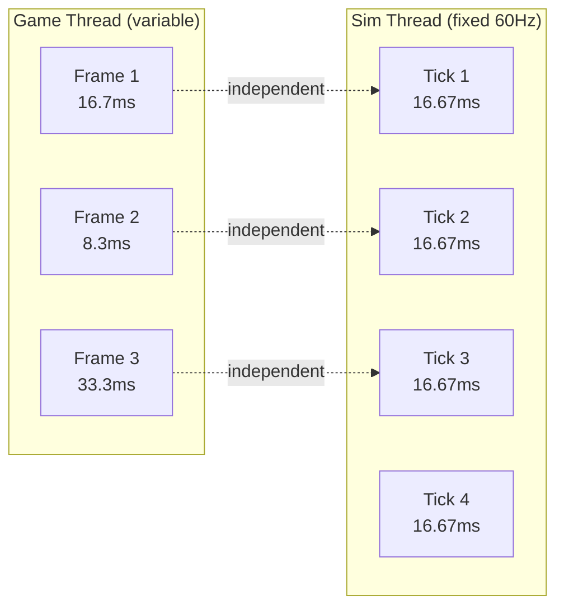

# Why a Dedicated Simulation Thread

This document explains why FatumGame runs physics and gameplay logic on a dedicated 60 Hz thread separate from UE's game thread.

---

## The Problem: UE Tick Rate is Tied to Framerate

In a standard Unreal Engine project, physics and gameplay logic run on the game thread, ticked once per rendered frame. This creates several problems:

### Variable Tick Rate

| GPU Load | Framerate | Tick DeltaTime | Physics Steps/Second |
|----------|-----------|----------------|----------------------|
| Light | 144 FPS | 6.9 ms | 144 |
| Medium | 60 FPS | 16.7 ms | 60 |
| Heavy | 30 FPS | 33.3 ms | 30 |
| Spike | 15 FPS | 66.7 ms | 15 |

At 30 FPS, physics runs at half the resolution of 60 FPS. At 15 FPS during a GPU spike, physics runs at a quarter resolution. This causes:

- **Tunneling:** Fast projectiles pass through thin walls at low tick rates
- **Inconsistent gameplay:** A player with a better GPU has more precise physics simulation
- **Jitter:** Variable DeltaTime causes visible position jitter, especially for fast-moving objects

### UE's Sub-Stepping is Not Enough

Unreal's physics sub-stepping can partially address this, but:

- Sub-stepping is still bound to the game thread (blocks rendering)
- Each sub-step is a full physics step (expensive)
- Gameplay logic (Flecs systems) would need to know about sub-steps
- No clean separation of concerns

---

## The Solution: Dedicated 60 Hz Simulation Thread

FatumGame runs a `FSimulationWorker` thread that ticks at a fixed 60 Hz, independent of the game thread's framerate.



### What Runs on the Sim Thread

| Component | Frequency | Purpose |
|-----------|-----------|---------|
| **Jolt Physics** (StepWorld) | 60 Hz | Collision detection, contact resolution, body integration |
| **Flecs ECS** (progress) | 60 Hz | All gameplay systems (damage, weapons, items, death) |
| **Character Physics** (PrepareCharacterStep) | 60 Hz | Locomotion, jump, gravity |
| **Collision Events** (BroadcastContactEvents) | 60 Hz | Create FCollisionPair entities from Jolt contacts |

### What Stays on the Game Thread

| Component | Frequency | Purpose |
|-----------|-----------|---------|
| **ISM Transform Updates** | Per frame | Interpolated rendering |
| **Niagara VFX** | Per frame | Visual effects |
| **UI Updates** | Per frame | HUD, inventory, menus |
| **Input Processing** | Per frame | Read input, write to atomics |
| **Camera** | Per frame | Camera follow, shake |

---

## Benefits

### Deterministic Physics

Every physics step uses the same DeltaTime (16.67 ms at 60 Hz). This means:

- **No tunneling** at low framerates -- projectiles always step at 60 Hz
- **Consistent gameplay** regardless of hardware -- a 30 FPS player and a 144 FPS player experience the same physics
- **Reproducible behavior** -- same inputs produce same physics results (given same DT)

### Frame-Rate Independent Gameplay

```
GPU spike: game thread drops to 20 FPS
  → Sim thread continues at 60 Hz
  → Physics and gameplay are unaffected
  → Player sees fewer rendered frames but gameplay is smooth

GPU idle: game thread runs at 200 FPS
  → Sim thread still runs at 60 Hz
  → Render interpolation makes it look smooth at 200 FPS
  → No wasted physics computation
```

### Render Interpolation

The game thread interpolates between sim thread states to produce smooth visuals at any framerate:

```
Sim Thread:  Tick N ─────── Tick N+1 ─────── Tick N+2
               │                │                 │
               ▼                ▼                 ▼
             PrevPos          CurrPos           NextPos

Game Thread: ├──Frame──┼──Frame──┼──Frame──┼──Frame──┤
             Alpha=0.3  Alpha=0.7  Alpha=0.2  Alpha=0.6
             Lerp(Prev,Curr)   Lerp(Curr,Next)
```

The result: visually smooth motion at any framerate, with physically correct simulation at a fixed rate.

### Time Dilation

A fixed-rate sim thread makes time dilation straightforward:

```cpp
// DilatedDT = RealDT * TimeScale
// At TimeScale = 0.5: physics runs at "half speed" but still 60 ticks/second
// Each tick advances the simulation by 8.33ms of game time instead of 16.67ms
```

This is cleaner than trying to manipulate UE's variable DeltaTime, where time dilation interacts unpredictably with sub-stepping and tick groups.

---

## The Tradeoff

### Cross-Thread Complexity

The sim thread cannot directly access game thread objects, and vice versa. All communication must go through lock-free primitives:

| Primitive | Direction | Use Case |
|-----------|-----------|----------|
| `EnqueueCommand` | Game -> Sim | Mutations (damage, spawn, state changes) |
| Atomics | Either | Scalar values (input, time scale) |
| `FLateSyncBridge` | Game -> Sim | Multi-field consistent data (aim) |
| MPSC queues | Sim -> Game | Ordered events (spawn visuals) |
| `FSimStateCache` | Sim -> Game | State reads (health, ammo for UI) |

### One-Tick Latency

Input from the game thread reaches the sim thread on the next sim tick (up to 16.67 ms latency). This is mitigated by:

- Reading input atomics at the **start** of each sim tick (minimal latency)
- Render interpolation hides the visual latency
- For a 60 Hz sim, the maximum added latency (16.67 ms) is below human perception threshold

### Debugging Complexity

Two threads running concurrently makes debugging harder:

- Data races manifest as intermittent bugs
- Stack traces may show sim thread state when the bug is on the game thread
- Must use thread-safe logging

!!! note "Mitigation"
    Strict discipline: all cross-thread access goes through the five defined primitives (see [Threading Rules](../guidelines/threading-rules.md)). No exceptions. This makes races structural (detectable by code review) rather than runtime.

---

## Sim Thread Execution Order

For reference, the sim thread executes in this exact order every tick:

```
1. DrainCommandQueue()         ← Execute game-thread commands
2. PrepareCharacterStep()      ← Character physics from input atomics
3. StackUp()                   ← Kinematic body updates
4. StepWorld(DilatedDT)        ← Jolt physics step
5. BroadcastContactEvents()    ← Create FCollisionPair entities
6. ApplyLateSyncBuffers()      ← Write bridge data to Flecs
7. progress(DilatedDT)         ← Flecs system execution
```

This order is intentional and must not be changed without architectural review.
