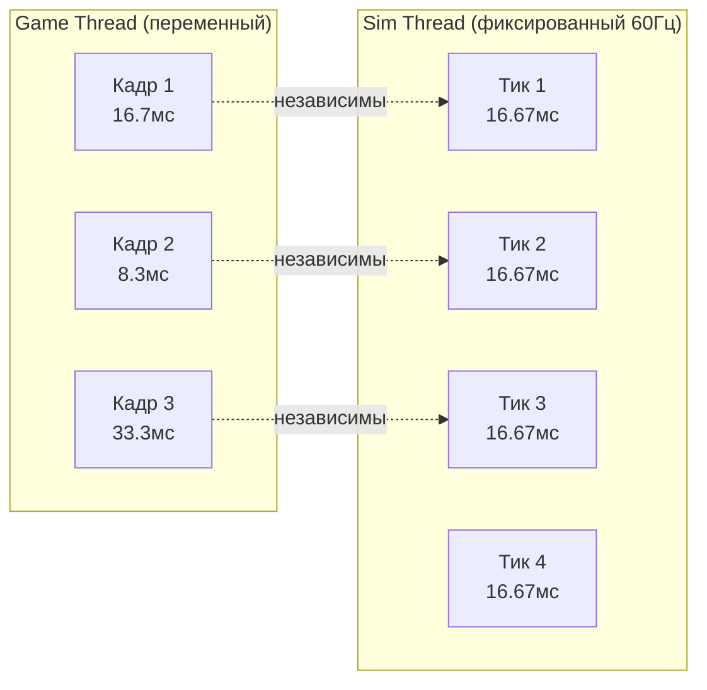

# Почему выделенный поток симуляции

Этот документ объясняет, почему FatumGame запускает физику и игровую логику на выделенном потоке 60 Гц, отдельном от game thread UE.

---

## Проблема: тик-рейт UE привязан к фреймрейту

В стандартном проекте Unreal Engine физика и игровая логика работают на game thread, тикая один раз на отрендеренный кадр. Это создаёт несколько проблем:

### Переменный тик-рейт

| Нагрузка GPU | Фреймрейт | DeltaTime тика | Шагов физики/секунду |
|-------------|-----------|----------------|----------------------|
| Лёгкая | 144 FPS | 6.9 мс | 144 |
| Средняя | 60 FPS | 16.7 мс | 60 |
| Тяжёлая | 30 FPS | 33.3 мс | 30 |
| Всплеск | 15 FPS | 66.7 мс | 15 |

При 30 FPS физика работает на половине разрешения от 60 FPS. При 15 FPS во время всплеска GPU -- на четверти. Это вызывает:

- **Туннелирование:** Быстрые снаряды проходят сквозь тонкие стены при низком тик-рейте
- **Непоследовательный геймплей:** Игрок с лучшим GPU имеет более точную физическую симуляцию
- **Дрожание:** Переменный DeltaTime вызывает видимое дрожание позиций, особенно для быстрых объектов

### Sub-stepping UE недостаточен

Sub-stepping физики Unreal частично решает это, но:

- Sub-stepping всё ещё привязан к game thread (блокирует рендеринг)
- Каждый подшаг -- полный физический шаг (дорого)
- Игровая логика (системы Flecs) должна была бы знать о подшагах
- Нет чёткого разделения ответственности

---

## Решение: выделенный поток симуляции 60 Гц

FatumGame запускает поток `FSimulationWorker`, тикающий с фиксированной частотой 60 Гц, независимо от фреймрейта game thread.



### Что работает на sim thread

| Компонент | Частота | Назначение |
|-----------|---------|-----------|
| **Jolt Physics** (StepWorld) | 60 Гц | Обнаружение столкновений, разрешение контактов, интеграция тел |
| **Flecs ECS** (progress) | 60 Гц | Все игровые системы (урон, оружие, предметы, смерть) |
| **Физика персонажа** (PrepareCharacterStep) | 60 Гц | Движение, прыжок, гравитация |
| **События столкновений** (BroadcastContactEvents) | 60 Гц | Создание сущностей FCollisionPair из контактов Jolt |

### Что остаётся на game thread

| Компонент | Частота | Назначение |
|-----------|---------|-----------|
| **Обновление трансформов ISM** | Каждый кадр | Интерполированный рендеринг |
| **VFX Niagara** | Каждый кадр | Визуальные эффекты |
| **Обновления UI** | Каждый кадр | HUD, инвентарь, меню |
| **Обработка ввода** | Каждый кадр | Чтение ввода, запись в atomics |
| **Камера** | Каждый кадр | Следование камеры, тряска |

---

## Выгоды

### Детерминированная физика

Каждый физический шаг использует одинаковый DeltaTime (16.67 мс при 60 Гц). Это означает:

- **Нет туннелирования** при низком фреймрейте -- снаряды всегда шагают на 60 Гц
- **Консистентный геймплей** независимо от оборудования -- игрок на 30 FPS и игрок на 144 FPS испытывают одинаковую физику
- **Воспроизводимое поведение** -- одинаковые входные данные дают одинаковые результаты физики (при одном DT)

### Независимость геймплея от фреймрейта

```
Всплеск GPU: game thread падает до 20 FPS
  → Sim thread продолжает на 60 Гц
  → Физика и геймплей не затронуты
  → Игрок видит меньше отрендеренных кадров, но геймплей плавный

GPU простаивает: game thread работает на 200 FPS
  → Sim thread всё равно работает на 60 Гц
  → Интерполяция рендера делает визуал плавным на 200 FPS
  → Нет траты вычислений физики
```

### Интерполяция рендера

Game thread интерполирует между состояниями sim thread для плавного визуала при любом фреймрейте:

```
Sim Thread:  Тик N ─────── Тик N+1 ─────── Тик N+2
               │                │                 │
               ▼                ▼                 ▼
             PrevPos          CurrPos           NextPos

Game Thread: ├──Кадр──┼──Кадр──┼──Кадр──┼──Кадр──┤
             Alpha=0.3  Alpha=0.7  Alpha=0.2  Alpha=0.6
             Lerp(Prev,Curr)   Lerp(Curr,Next)
```

Результат: визуально плавное движение при любом фреймрейте с физически корректной симуляцией на фиксированной частоте.

### Замедление времени

Фиксированный sim thread делает замедление времени простым:

```cpp
// DilatedDT = RealDT * TimeScale
// При TimeScale = 0.5: физика работает "на половинной скорости", но всё ещё 60 тиков/секунду
// Каждый тик продвигает симуляцию на 8.33мс игрового времени вместо 16.67мс
```

Это чище, чем попытки манипулировать переменным DeltaTime UE, где замедление времени непредсказуемо взаимодействует с sub-stepping и tick groups.

---

## Компромисс

### Межпоточная сложность

Sim thread не может напрямую обращаться к объектам game thread, и наоборот. Вся коммуникация должна идти через lock-free примитивы:

| Примитив | Направление | Случай использования |
|----------|------------|---------------------|
| `EnqueueCommand` | Game -> Sim | Мутации (урон, спавн, изменения состояния) |
| Atomics | Любое | Скалярные значения (ввод, масштаб времени) |
| `FLateSyncBridge` | Game -> Sim | Консистентные данные нескольких полей (прицеливание) |
| MPSC-очереди | Sim -> Game | Упорядоченные события (визуал спавна) |
| `FSimStateCache` | Sim -> Game | Чтения состояния (здоровье, боезапас для UI) |

### Задержка в один тик

Ввод с game thread достигает sim thread на следующем тике (до 16.67 мс задержки). Это смягчается:

- Чтением atomics ввода в **начале** каждого тика (минимальная задержка)
- Интерполяция рендера скрывает визуальную задержку
- Для 60 Гц симуляции максимальная добавленная задержка (16.67 мс) ниже порога восприятия человеком

### Сложность отладки

Два потока, работающих одновременно, затрудняют отладку:

- Гонки данных проявляются как периодические баги
- Стек-трейсы могут показывать состояние sim thread, когда баг на game thread
- Необходимо потокобезопасное логирование

!!! note "Смягчение"
    Строгая дисциплина: весь межпоточный доступ идёт через пять определённых примитивов (см. [Правила потоков](../guidelines/threading-rules.md)). Без исключений. Это делает гонки структурными (обнаруживаемыми при код-ревью), а не рантаймовыми.

---

## Порядок выполнения sim thread

Для справки, sim thread выполняется в точном порядке каждый тик:

```
1. DrainCommandQueue()         ← Выполнение команд game thread
2. PrepareCharacterStep()      ← Физика персонажа из atomics ввода
3. StackUp()                   ← Обновление кинематических тел
4. StepWorld(DilatedDT)        ← Шаг физики Jolt
5. BroadcastContactEvents()    ← Создание сущностей FCollisionPair
6. ApplyLateSyncBuffers()      ← Запись данных моста в Flecs
7. progress(DilatedDT)         ← Выполнение систем Flecs
```

Этот порядок намеренный и не должен меняться без архитектурного ревью.
