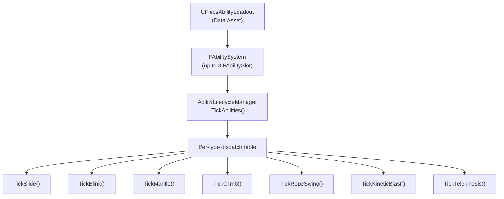

# Ability System

> Abilities are ECS-driven, simulation-thread systems. Each character has up to 8 ability slots managed by `FAbilitySystem`. Abilities consume resources, have charges and cooldowns, and execute per-type tick functions.

---

## Architecture



---

## Components

### FAbilitySystem (Per-Character)

```cpp
struct FAbilitySystem
{
    uint8 ActiveMask;          // Bitmask of active slots
    int32 SlotCount;           // Number of configured slots
    FAbilitySlot Slots[8];     // Fixed array, max 8 abilities
};
```

### FAbilitySlot

| Field | Type | Description |
|-------|------|-------------|
| `TypeId` | `EAbilityTypeId` | Ability type (Slide, Blink, Mantle, etc.) |
| `Phase` | `EAbilityPhase` | Current phase (Inactive, Activating, Active, Deactivating) |
| `PhaseTimer` | `float` | Timer for current phase |
| `Charges` | `int32` | Available charges |
| `MaxCharges` | `int32` | Maximum charges |
| `RechargeTimer` | `float` | Time until next charge regeneration |
| `CooldownTimer` | `float` | Cooldown remaining |
| `ActivationCost` | `FAbilityCostEntry` | Resource cost to activate |
| `SustainCost` | `FAbilityCostEntry` | Resource cost per second while active |
| `ConfigData` | `uint8[32]` | Per-type configuration blob |

### EAbilityTypeId

| ID | Ability | Input |
|----|---------|-------|
| `Slide` | Speed slide | Crouch + Sprint + Ground |
| `Blink` | Teleport dash | Ability1 (hold for targeting) |
| `Mantle` | Vault/climb ledge | Automatic (forward trace) |
| `KineticBlast` | Explosive force push | Ability2 |
| `Telekinesis` | Hold and throw objects | Ability3 (hold) |
| `Climb` | Wall/surface climb | Automatic (forward trace) |
| `RopeSwing` | Rope swing | Automatic (camera trace) |

---

## Lifecycle Manager

`AbilityLifecycleManager::TickAbilities()` is called from `PrepareCharacterStep()` each sim tick:

```
For each slot in FAbilitySystem:
    1. Tick cooldown/recharge timers
    2. Check activation conditions:
       - Input active (from atomics)
       - Charges > 0
       - CooldownTimer <= 0
       - Resources sufficient (FResourcePool)
    3. If activated: consume charge, deduct resource cost, set Phase = Active
    4. Dispatch to per-type tick function
    5. If sustain cost: deduct resource per DT
    6. If resources depleted or input released: begin deactivation
    7. Tick phase timer for phase transitions
```

---

## Resource System

### FResourcePool

| Field | Type | Description |
|-------|------|-------------|
| `ResourceType` | `EResourceType` | Mana, Stamina, Energy, Rage |
| `CurrentValue` | `float` | Current resource amount |
| `MaxValue` | `float` | Maximum resource |
| `RegenRate` | `float` | Regeneration per second |
| `RegenDelay` | `float` | Delay after spending before regen starts |
| `RegenDelayRemaining` | `float` | Current delay countdown |

### EResourceType

| Type | Typical Use |
|------|-------------|
| `Mana` | Blink, Telekinesis |
| `Stamina` | Sprint, Slide, Mantle |
| `Energy` | KineticBlast |
| `Rage` | (Reserved for combat abilities) |

### Cost Definition

```cpp
struct FAbilityCostEntry
{
    EResourceType ResourceType;
    float Amount;
};
```

---

## Per-Type Abilities

### Slide

- **Activation:** Crouch held + Sprint + OnGround + speed > threshold
- **Behavior:** Locked direction, decelerating speed, crouch capsule
- **Exit:** Speed below threshold, jump, or max duration
- **State atomic:** `SlideActiveAtomic` → game thread camera tilt

### Blink

- **Activation:** Ability1 press (instant) or hold (targeting mode)
- **Hold targeting:** Camera SphereCast, valid destination highlight, time dilation (`BlinkTargeting`)
- **Execute:** Teleport to target position, snap to floor, consume charge
- **Charges:** Configurable max, recharge over time

### Mantle / Vault

- **Detection:** `FLedgeDetector::Detect()` — forward SphereCast
- **Vault:** Short obstacles — quick hop-over animation
- **Mantle:** Taller obstacles — multi-phase (rising, reaching, landing)
- **State atomic:** `MantleActive` + `MantleType`

### Climb

- **Detection:** Forward SphereCast for `FTagClimbable` entity
- **Behavior:** Move along `FClimbableStatic.ClimbDirection` at `ClimbSpeed`
- **Exit:** Reach top (AABB bounds check) → `TopExitVelocity`, or look away > `DetachAngle`
- **State atomic:** `ClimbActive`

### Rope Swing

- **Detection:** Camera SphereCast for `FTagSwingable` entity
- **Behavior:** Creates Jolt distance constraint from hand to attach point
- **Input:** Forward = apply swing force, Jump = detach
- **Visual:** `FRopeVisualRenderer` renders spline from hand to anchor
- **State atomic:** `SwingActive` via `RopeVisualAtomics`

### Kinetic Blast

- **Activation:** Ability2 press
- **Behavior:** Cone impulse from character position via `UConeImpulse`
- **Effect:** Pushes all Barrage bodies within cone radius and angle

### Telekinesis

- **Activation:** Ability3 hold on target entity
- **Behavior:** Holds entity at fixed distance from camera using Jolt constraint
- **Release:** Apply launch velocity in aim direction
- **Tag:** `FTagTelekinesisHeld` on grabbed entity

---

## Data Assets

### UFlecsAbilityDefinition

Per-ability configuration:

| Field | Description |
|-------|-------------|
| `AbilityName` | Display name |
| `AbilityType` | EAbilityType mapping |
| `StartingCharges` | Initial charges |
| `MaxCharges` | Maximum charges |
| `RechargeRate` | Seconds per charge regeneration |
| `CooldownDuration` | Cooldown between uses |
| `bAlwaysTick` | Tick even when inactive (for passive effects) |
| `bExclusive` | Only one exclusive ability active at a time |
| `ActivationCosts` | `TArray<FAbilityCostDefinition>` |
| `SustainCosts` | `TArray<FAbilityCostDefinition>` |
| `DeactivationRefund` | Resources refunded on early cancel |

### UFlecsAbilityLoadout

Ordered array of `UFlecsAbilityDefinition*` — defines which abilities a character has and in which slots.

### UFlecsResourcePoolProfile

Array of `FResourcePoolDefinition` — defines max/starting/regen for each resource type a character has.
