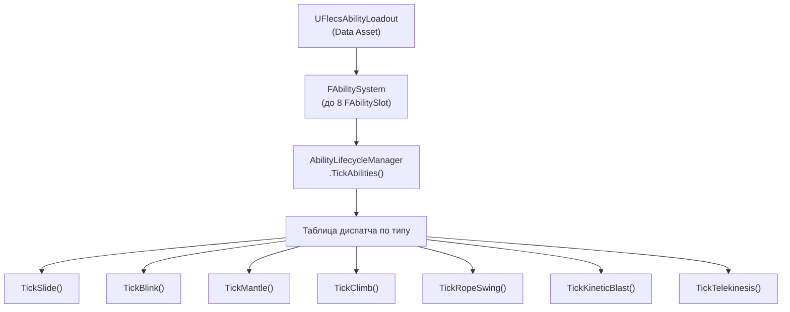

# Система способностей

> Способности реализованы как ECS-системы на sim thread. У каждого персонажа до 8 слотов способностей, управляемых `FAbilitySystem`. Способности потребляют ресурсы, имеют заряды и кулдауны, и выполняют тик-функции по типу.

---

## Архитектура



---

## Компоненты

### FAbilitySystem (Per-Character)

```cpp
struct FAbilitySystem
{
    uint8 ActiveMask;          // Битовая маска активных слотов
    int32 SlotCount;           // Количество настроенных слотов
    FAbilitySlot Slots[8];     // Фиксированный массив, максимум 8 способностей
};
```

### FAbilitySlot

| Поле | Тип | Описание |
|------|-----|----------|
| `TypeId` | `EAbilityTypeId` | Тип способности (Slide, Blink, Mantle и т.д.) |
| `Phase` | `EAbilityPhase` | Текущая фаза (Inactive, Activating, Active, Deactivating) |
| `PhaseTimer` | `float` | Таймер текущей фазы |
| `Charges` | `int32` | Доступные заряды |
| `MaxCharges` | `int32` | Максимальное количество зарядов |
| `RechargeTimer` | `float` | Время до следующей регенерации заряда |
| `CooldownTimer` | `float` | Оставшийся кулдаун |
| `ActivationCost` | `FAbilityCostEntry` | Стоимость ресурса для активации |
| `SustainCost` | `FAbilityCostEntry` | Стоимость ресурса в секунду при активности |
| `ConfigData` | `uint8[32]` | Конфигурационный блоб по типу |

### EAbilityTypeId

| ID | Способность | Ввод |
|----|-------------|------|
| `Slide` | Скольжение | Присед + Спринт + Земля |
| `Blink` | Телепортация | Ability1 (удержание для прицеливания) |
| `Mantle` | Карабканье/перепрыг | Автоматически (forward trace) |
| `KineticBlast` | Взрывная силовая волна | Ability2 |
| `Telekinesis` | Удержание и бросок объектов | Ability3 (удержание) |
| `Climb` | Лазание по стенам/поверхностям | Автоматически (forward trace) |
| `RopeSwing` | Качание на верёвке | Автоматически (camera trace) |

---

## Менеджер жизненного цикла

`AbilityLifecycleManager::TickAbilities()` вызывается из `PrepareCharacterStep()` каждый тик симуляции:

```
Для каждого слота в FAbilitySystem:
    1. Тик таймеров кулдауна/перезарядки
    2. Проверка условий активации:
       - Ввод активен (из атомиков)
       - Заряды > 0
       - CooldownTimer <= 0
       - Ресурсов достаточно (FResourcePool)
    3. Если активирована: расход заряда, вычет стоимости ресурса, Phase = Active
    4. Диспатч к тик-функции по типу
    5. Если есть sustain cost: вычет ресурса за DT
    6. Если ресурсы истощены или ввод отпущен: начало деактивации
    7. Тик таймера фазы для переходов
```

---

## Система ресурсов

### FResourcePool

| Поле | Тип | Описание |
|------|-----|----------|
| `ResourceType` | `EResourceType` | Mana, Stamina, Energy, Rage |
| `CurrentValue` | `float` | Текущее количество ресурса |
| `MaxValue` | `float` | Максимум ресурса |
| `RegenRate` | `float` | Регенерация в секунду |
| `RegenDelay` | `float` | Задержка после траты перед началом регенерации |
| `RegenDelayRemaining` | `float` | Текущий обратный отсчёт задержки |

### EResourceType

| Тип | Типичное применение |
|-----|---------------------|
| `Mana` | Blink, Telekinesis |
| `Stamina` | Спринт, скольжение, карабканье |
| `Energy` | KineticBlast |
| `Rage` | (Зарезервировано для боевых способностей) |

### Определение стоимости

```cpp
struct FAbilityCostEntry
{
    EResourceType ResourceType;
    float Amount;
};
```

---

## Способности по типам

### Скольжение

- **Активация:** Присед удерживается + Спринт + На земле + скорость > порога
- **Поведение:** Фиксированное направление, замедляющаяся скорость, капсула приседа
- **Выход:** Скорость ниже порога, прыжок или максимальная длительность
- **Атомик состояния:** `SlideActiveAtomic` → наклон камеры на game thread

### Blink

- **Активация:** Нажатие Ability1 (мгновенно) или удержание (режим прицеливания)
- **Прицеливание удержанием:** Camera SphereCast, подсветка допустимой точки назначения, замедление времени (`BlinkTargeting`)
- **Выполнение:** Телепортация к целевой позиции, привязка к полу, расход заряда
- **Заряды:** Настраиваемый максимум, восстановление со временем

### Карабканье / Перепрыг

- **Обнаружение:** `FLedgeDetector::Detect()` — forward SphereCast
- **Vault:** Низкие препятствия — быстрый перепрыг
- **Mantle:** Высокие препятствия — многофазный подъём (rising, reaching, landing)
- **Атомик состояния:** `MantleActive` + `MantleType`

### Лазание

- **Обнаружение:** Forward SphereCast для entity с `FTagClimbable`
- **Поведение:** Движение вдоль `FClimbableStatic.ClimbDirection` со скоростью `ClimbSpeed`
- **Выход:** Достигнута вершина (проверка AABB bounds) → `TopExitVelocity`, или взгляд в сторону > `DetachAngle`
- **Атомик состояния:** `ClimbActive`

### Качание на верёвке

- **Обнаружение:** Camera SphereCast для entity с `FTagSwingable`
- **Поведение:** Создаётся Jolt distance constraint от руки к точке крепления
- **Ввод:** Вперёд = сила раскачивания, Прыжок = отсоединение
- **Визуал:** `FRopeVisualRenderer` рисует сплайн от руки до якоря
- **Атомик состояния:** `SwingActive` через `RopeVisualAtomics`

### Кинетический взрыв

- **Активация:** Нажатие Ability2
- **Поведение:** Конический импульс из позиции персонажа через `UConeImpulse`
- **Эффект:** Отталкивает все тела Barrage в пределах радиуса и угла конуса

### Телекинез

- **Активация:** Удержание Ability3 на целевой сущности
- **Поведение:** Удержание сущности на фиксированной дистанции от камеры с помощью Jolt constraint
- **Отпускание:** Применение скорости запуска в направлении прицеливания
- **Тег:** `FTagTelekinesisHeld` на захваченной сущности

---

## Data Assets

### UFlecsAbilityDefinition

Конфигурация отдельной способности:

| Поле | Описание |
|------|----------|
| `AbilityName` | Отображаемое имя |
| `AbilityType` | Соответствие EAbilityType |
| `StartingCharges` | Начальные заряды |
| `MaxCharges` | Максимальные заряды |
| `RechargeRate` | Секунды на регенерацию заряда |
| `CooldownDuration` | Кулдаун между использованиями |
| `bAlwaysTick` | Тик даже в неактивном состоянии (для пассивных эффектов) |
| `bExclusive` | Только одна эксклюзивная способность активна одновременно |
| `ActivationCosts` | `TArray<FAbilityCostDefinition>` |
| `SustainCosts` | `TArray<FAbilityCostDefinition>` |
| `DeactivationRefund` | Ресурсы, возвращаемые при досрочной отмене |

### UFlecsAbilityLoadout

Упорядоченный массив `UFlecsAbilityDefinition*` — определяет, какие способности имеет персонаж и в каких слотах.

### UFlecsResourcePoolProfile

Массив `FResourcePoolDefinition` — определяет максимум/начальное значение/регенерацию для каждого типа ресурсов персонажа.
