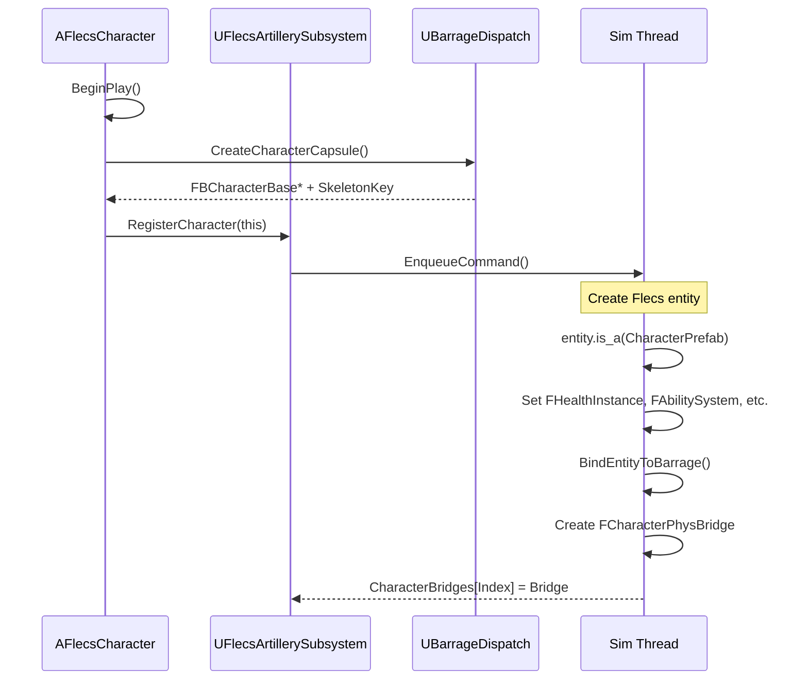
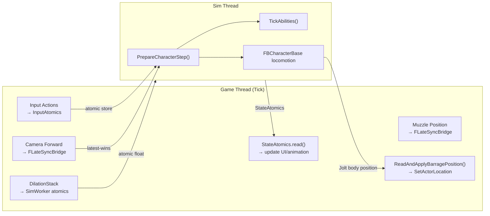
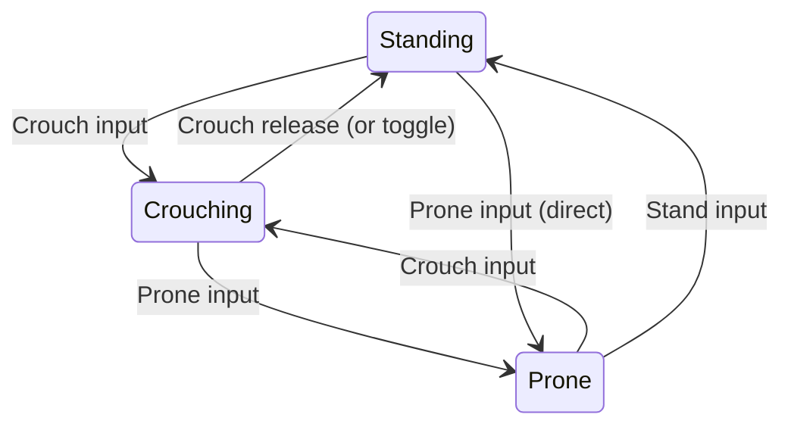

# Character System

> `AFlecsCharacter` is the central player/NPC actor. It bridges UE's game thread (camera, input, UI) with the Flecs/Barrage simulation thread. Its implementation is split across 14 `.cpp` files by concern.

---

## Class Overview

`AFlecsCharacter` extends `ACharacter` and manages:

- Barrage physics capsule (`FBCharacterBase`)
- Flecs entity registration (health, movement, abilities, weapon)
- Input capture → atomic transport → sim thread
- Camera control, ADS, recoil
- Interaction state machine
- Inventory and loot UI
- Time dilation stack

---

## File Split

| File | Responsibility |
|------|---------------|
| `FlecsCharacter.cpp` | Construction, `BeginPlay`, `EndPlay`, `Tick`, init helpers |
| `FlecsCharacter_Physics.cpp` | `ReadAndApplyBarragePosition()`, VInterpTo smoothing |
| `FlecsCharacter_Input.cpp` | Enhanced Input binding, input tag routing |
| `FlecsCharacter_Combat.cpp` | Fire/reload input, aim direction computation |
| `FlecsCharacter_ADS.cpp` | Aim-down-sights spring, FOV transition, sight anchor |
| `FlecsCharacter_Recoil.cpp` | Visual recoil: kick, shake, pattern, weapon motion |
| `FlecsCharacter_Interaction.cpp` | Full interaction state machine (5 states) |
| `FlecsCharacter_UI.cpp` | HUD wiring, `FSimStateCache` reads, message publishing |
| `FlecsCharacter_Test.cpp` | Debug spawn/destroy commands |
| `FlecsCharacter_WeaponCollision.cpp` | Weapon collision avoidance traces |
| `FlecsCharacter_WeaponMotion.cpp` | Walk bob, strafe tilt, landing impact, sprint pose |
| `FlecsCharacter_RopeVisual.cpp` | Rope swing visual rendering |
| `FatumMovementComponent.cpp` | Custom CMC with posture integration |
| `FPostureStateMachine.cpp` | Stand/Crouch/Prone transitions |

---

## Initialization Flow



---

## FCharacterPhysBridge

Lives on the sim thread (`UFlecsArtillerySubsystem::CharacterBridges`). One per registered character.

| Field | Type | Purpose |
|-------|------|---------|
| `CachedBody` | `TSharedPtr<FBarragePrimitive>` | Direct Jolt body access |
| `InputAtomics` | `FCharacterInputAtomics` | Game → Sim input (atomics) |
| `StateAtomics` | `FCharacterStateAtomics` | Sim → Game state (atomics) |
| `Entity` | `flecs::entity` | Character's Flecs entity |
| `CachedFBChar` | `FBCharacterBase*` | Barrage character controller |
| `BaseGravityJoltY` | `float` | Lazy-captured gravity for VelocityScale |
| `RopeVisualAtomics` | `FRopeVisualAtomics` | Rope visual start/end positions |
| `SlideActiveAtomic` | `TSharedPtr<std::atomic<bool>>` | Slide state shared with game thread |

---

## Per-Tick Data Flow



---

## Position Readback

`ReadAndApplyBarragePosition()` in `FlecsCharacter_Physics.cpp`:

1. Read Jolt position directly via `FBarragePrimitive::GetPosition()`
2. New sim tick detection: if `SimTickCount` changed, shift `Prev = Curr, Curr = JoltPos`
3. Lerp: `LerpPos = Lerp(Prev, Curr, Alpha)` where Alpha from `ComputeFreshAlpha()`
4. Snap on first frame: `bJustSpawned → Prev = Curr = LerpPos = JoltPos`
5. VInterpTo smoothing: `SmoothedPos = VInterpTo(SmoothedPos, LerpPos, DT, Speed)`
6. `SetActorLocation(SmoothedPos)`

Runs in `TG_PrePhysics` — before `CameraManager` — so the camera always uses the current frame's position.

---

## Input Transport

`FCharacterInputAtomics` is a struct of atomic floats and bools:

| Atomic | Written By | Read By |
|--------|-----------|---------|
| `DirX`, `DirZ` | Input Action (Move) | `PrepareCharacterStep` → locomotion |
| `CamLocX/Y/Z` | Camera component | `PrepareCharacterStep` → aim |
| `CamDirX/Y/Z` | Camera forward | `PrepareCharacterStep` → aim |
| `JumpPressed` | Input Action (Jump) | `PrepareCharacterStep` → jump |
| `CrouchHeld` | Input Action (Crouch) | `PrepareCharacterStep` → posture |
| `Sprinting` | Input Action (Sprint) | `PrepareCharacterStep` → speed |
| `BlinkHeld` | Input Action (Ability1) | Blink ability tick |
| `Ability2Pressed` | Input Action (Ability2) | KineticBlast ability |
| `TelekinesisHeld` | Input Action (Ability3) | Telekinesis ability |

Each field uses `store(value, memory_order_relaxed)` on the game thread and `load(memory_order_relaxed)` on the sim thread. Relaxed ordering is safe because each atomic is independent and latest-value-wins.

---

## Posture State Machine

`FPostureStateMachine` manages stand/crouch/prone with animated transitions:



- Eye height interpolation during transitions
- Capsule size changes communicated to Jolt via `FBCharacterBase`
- `bCrouchIsToggle` / `bProneIsToggle` options from `UFlecsMovementProfile`

---

## Ability Integration

`FAbilitySystem` (Flecs component) stores up to 8 `FAbilitySlot` entries. `PrepareCharacterStep` dispatches to `AbilityLifecycleManager::TickAbilities()`:

```
For each active slot:
    Read input atomics (BlinkHeld, Ability2Pressed, etc.)
    Check activation conditions (charges, cooldowns, resource costs)
    Dispatch to per-type tick function:
        TickSlide(), TickBlink(), TickMantle(), TickClimb(),
        TickRopeSwing(), TickKineticBlast(), TickTelekinesis()
    Write state atomics (SlideActive, MantleActive, etc.)
```

See [Ability System](ability-system.md) for full details.

---

## Test Mode

Debug properties for testing entity spawning:

| Property | Purpose |
|----------|---------|
| `TestContainerDefinition` | Container entity to spawn (E key) |
| `TestItemDefinition` | Item to add to container (E key) |
| `TestEntityDefinition` | Generic entity to spawn (E key, if no container) |

**Controls:**
- **E** — Spawn container/item/entity
- **F** — Destroy last spawned / remove all items
