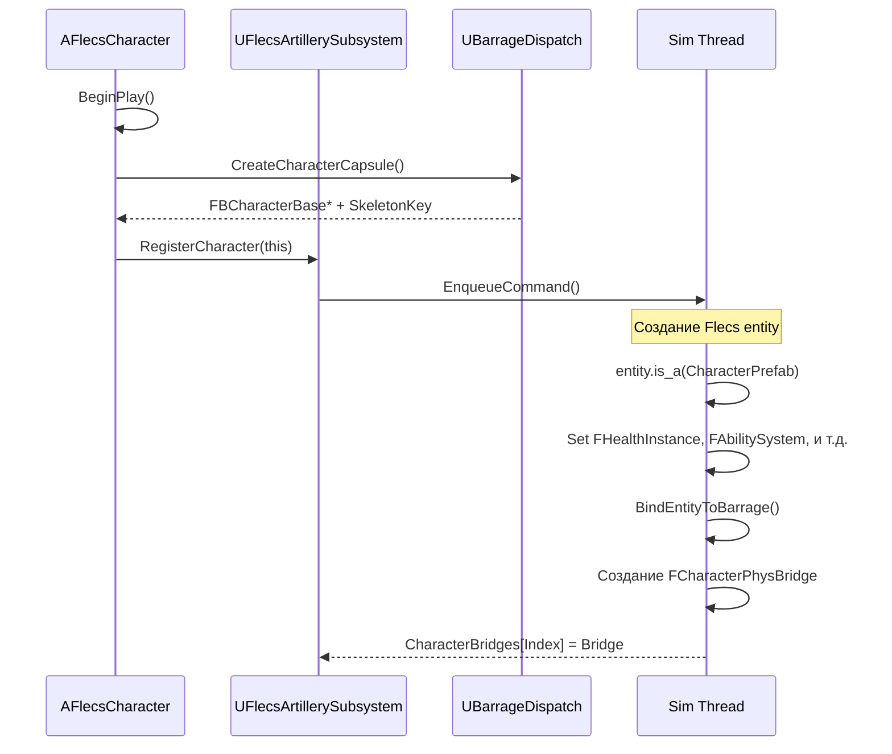
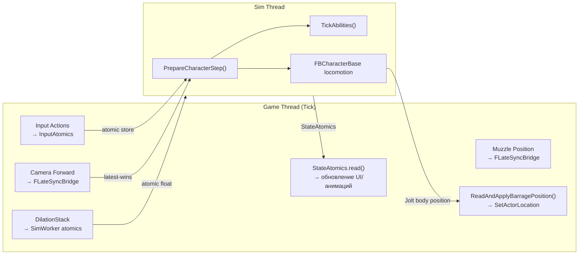
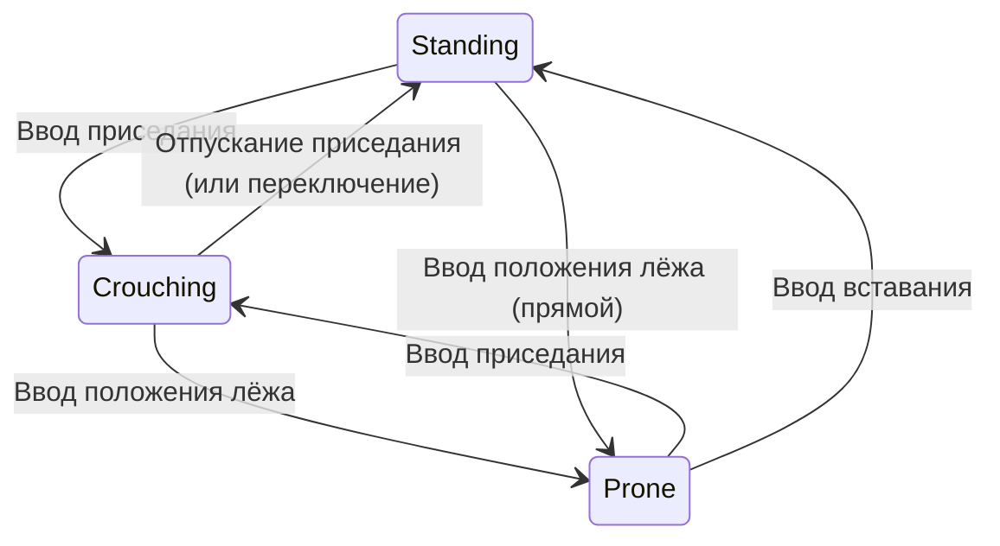

# Система персонажа

> `AFlecsCharacter` — центральный актор игрока/NPC. Он связывает game thread UE (камера, ввод, UI) с потоком симуляции Flecs/Barrage. Реализация разделена на 14 `.cpp`-файлов по зонам ответственности.

---

## Обзор класса

`AFlecsCharacter` наследуется от `ACharacter` и управляет:

- Физической капсулой Barrage (`FBCharacterBase`)
- Регистрацией Flecs entity (здоровье, движение, способности, оружие)
- Захватом ввода → атомарная передача → sim thread
- Управлением камерой, ADS, отдачей
- Конечным автоматом взаимодействия
- Инвентарём и UI лута
- Стеком замедления времени

---

## Разделение файлов

| Файл | Ответственность |
|------|----------------|
| `FlecsCharacter.cpp` | Конструктор, `BeginPlay`, `EndPlay`, `Tick`, вспомогательные функции инициализации |
| `FlecsCharacter_Physics.cpp` | `ReadAndApplyBarragePosition()`, сглаживание VInterpTo |
| `FlecsCharacter_Input.cpp` | Привязка Enhanced Input, маршрутизация input-тегов |
| `FlecsCharacter_Combat.cpp` | Ввод стрельбы/перезарядки, вычисление направления прицеливания |
| `FlecsCharacter_ADS.cpp` | Пружина прицеливания, переход FOV, якорь прицела |
| `FlecsCharacter_Recoil.cpp` | Визуальная отдача: kick, тряска, паттерн, движение оружия |
| `FlecsCharacter_Interaction.cpp` | Полный конечный автомат взаимодействия (5 состояний) |
| `FlecsCharacter_UI.cpp` | Подключение HUD, чтение `FSimStateCache`, публикация сообщений |
| `FlecsCharacter_Test.cpp` | Отладочные команды спавна/уничтожения |
| `FlecsCharacter_WeaponCollision.cpp` | Трейсы для предотвращения столкновений оружия |
| `FlecsCharacter_WeaponMotion.cpp` | Покачивание при ходьбе, наклон при стрейфе, удар при приземлении, поза спринта |
| `FlecsCharacter_RopeVisual.cpp` | Визуальный рендер верёвки |
| `FatumMovementComponent.cpp` | Пользовательский CMC с интеграцией поз |
| `FPostureStateMachine.cpp` | Переходы стоя/присед/лёжа |

---

## Поток инициализации



---

## FCharacterPhysBridge

Живёт на sim thread (`UFlecsArtillerySubsystem::CharacterBridges`). Один на каждого зарегистрированного персонажа.

| Поле | Тип | Назначение |
|------|-----|-----------|
| `CachedBody` | `TSharedPtr<FBarragePrimitive>` | Прямой доступ к Jolt body |
| `InputAtomics` | `FCharacterInputAtomics` | Game → Sim ввод (атомики) |
| `StateAtomics` | `FCharacterStateAtomics` | Sim → Game состояние (атомики) |
| `Entity` | `flecs::entity` | Flecs entity персонажа |
| `CachedFBChar` | `FBCharacterBase*` | Контроллер персонажа Barrage |
| `BaseGravityJoltY` | `float` | Лениво захваченная гравитация для VelocityScale |
| `RopeVisualAtomics` | `FRopeVisualAtomics` | Позиции начала/конца верёвки для визуала |
| `SlideActiveAtomic` | `TSharedPtr<std::atomic<bool>>` | Состояние скольжения, разделяемое с game thread |

---

## Поток данных за тик



---

## Считывание позиции

`ReadAndApplyBarragePosition()` в `FlecsCharacter_Physics.cpp`:

1. Чтение позиции Jolt напрямую через `FBarragePrimitive::GetPosition()`
2. Обнаружение нового тика симуляции: если `SimTickCount` изменился, сдвиг `Prev = Curr, Curr = JoltPos`
3. Интерполяция: `LerpPos = Lerp(Prev, Curr, Alpha)`, где Alpha из `ComputeFreshAlpha()`
4. Привязка на первом кадре: `bJustSpawned → Prev = Curr = LerpPos = JoltPos`
5. Сглаживание VInterpTo: `SmoothedPos = VInterpTo(SmoothedPos, LerpPos, DT, Speed)`
6. `SetActorLocation(SmoothedPos)`

Выполняется в `TG_PrePhysics` — до `CameraManager` — чтобы камера всегда использовала позицию текущего кадра.

---

## Транспорт ввода

`FCharacterInputAtomics` — структура из атомарных float и bool:

| Атомик | Записывается | Читается |
|--------|-------------|----------|
| `DirX`, `DirZ` | Input Action (Move) | `PrepareCharacterStep` → перемещение |
| `CamLocX/Y/Z` | Компонент камеры | `PrepareCharacterStep` → прицеливание |
| `CamDirX/Y/Z` | Camera forward | `PrepareCharacterStep` → прицеливание |
| `JumpPressed` | Input Action (Jump) | `PrepareCharacterStep` → прыжок |
| `CrouchHeld` | Input Action (Crouch) | `PrepareCharacterStep` → поза |
| `Sprinting` | Input Action (Sprint) | `PrepareCharacterStep` → скорость |
| `BlinkHeld` | Input Action (Ability1) | Тик способности Blink |
| `Ability2Pressed` | Input Action (Ability2) | Способность KineticBlast |
| `TelekinesisHeld` | Input Action (Ability3) | Способность Telekinesis |

Каждое поле использует `store(value, memory_order_relaxed)` на game thread и `load(memory_order_relaxed)` на sim thread. Relaxed ordering безопасен, так как каждый атомик независим и работает по принципу "побеждает последнее значение".

---

## Конечный автомат поз

`FPostureStateMachine` управляет переходами стоя/присед/лёжа с анимированными переходами:



- Интерполяция высоты глаз во время переходов
- Изменения размера капсулы передаются в Jolt через `FBCharacterBase`
- Опции `bCrouchIsToggle` / `bProneIsToggle` из `UFlecsMovementProfile`

---

## Интеграция способностей

`FAbilitySystem` (компонент Flecs) хранит до 8 записей `FAbilitySlot`. `PrepareCharacterStep` диспатчит в `AbilityLifecycleManager::TickAbilities()`:

```
Для каждого активного слота:
    Чтение input atomics (BlinkHeld, Ability2Pressed, и т.д.)
    Проверка условий активации (заряды, кулдауны, стоимость ресурсов)
    Диспатч к тик-функции по типу:
        TickSlide(), TickBlink(), TickMantle(), TickClimb(),
        TickRopeSwing(), TickKineticBlast(), TickTelekinesis()
    Запись state atomics (SlideActive, MantleActive, и т.д.)
```

Подробности в разделе [Система способностей](ability-system.md).

---

## Тестовый режим

Отладочные свойства для тестирования спавна сущностей:

| Свойство | Назначение |
|----------|-----------|
| `TestContainerDefinition` | Контейнер для спавна (клавиша E) |
| `TestItemDefinition` | Предмет для добавления в контейнер (клавиша E) |
| `TestEntityDefinition` | Обычная сущность для спавна (клавиша E, если контейнер не задан) |

**Управление:**
- **E** — Спавн контейнера/предмета/сущности
- **F** — Уничтожить последний заспавненный / удалить все предметы
