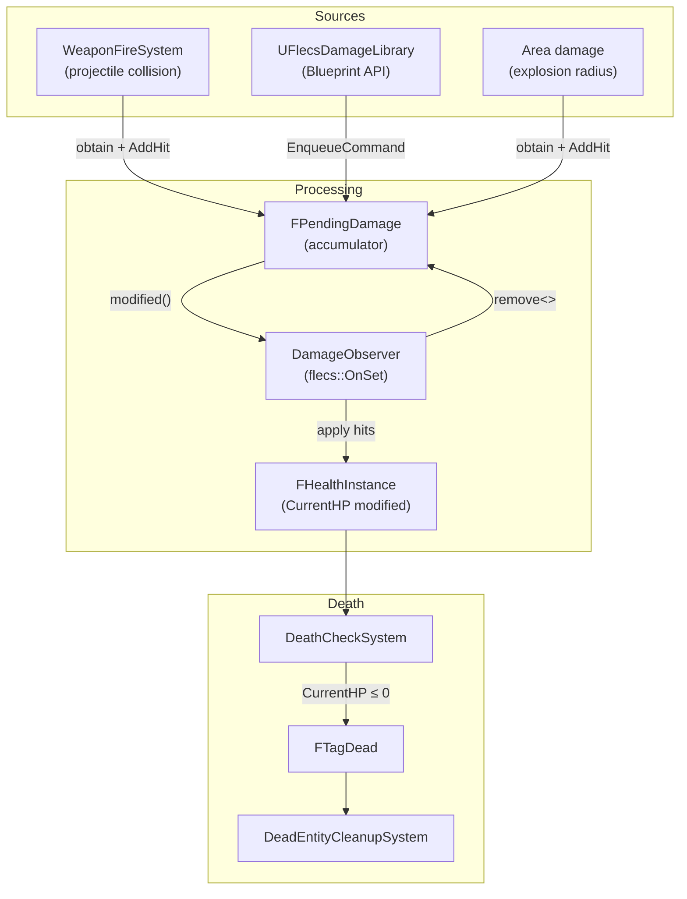

# Damage System

> Damage flows from sources (projectile collisions, Blueprint API calls, area effects) through a pending-damage accumulator to a reactive observer that modifies health. Death is checked separately, ensuring all damage in a tick is processed before any entity dies.

---

## Flow



---

## Components

### FDamageStatic (Prefab)

Set on the damage source (projectile, weapon):

| Field | Type | Description |
|-------|------|-------------|
| `Damage` | `float` | Base damage per hit |
| `DamageType` | `FGameplayTag` | Damage classification |
| `CriticalMultiplier` | `float` | Crit damage multiplier |
| `CriticalChance` | `float` | Chance to crit `[0, 1]` |
| `bAreaDamage` | `bool` | Apply damage in radius |
| `AreaRadius` | `float` | Radius (cm) if area damage |
| `AreaFalloff` | `float` | Damage falloff exponent |
| `bDestroyOnHit` | `bool` | Destroy source on contact |
| `bCanHitSameTargetMultipleTimes` | `bool` | Allow multi-hit |
| `MultiHitCooldown` | `float` | Cooldown between multi-hits |

### FHealthStatic (Prefab)

Set on the damage target:

| Field | Type | Description |
|-------|------|-------------|
| `MaxHealth` | `float` | Maximum HP |
| `Armor` | `float` | Damage reduction `[0, 1]` |
| `RegenPerSecond` | `float` | HP regeneration rate |
| `RegenDelay` | `float` | Delay before regen starts after taking damage |
| `InvulnerabilityTime` | `float` | I-frames after taking damage |
| `bDestroyOnDeath` | `bool` | Auto-destroy on death |

### FHealthInstance (Per-Entity)

| Field | Type | Description |
|-------|------|-------------|
| `CurrentHP` | `float` | Current health points |
| `RegenAccumulator` | `float` | Accumulated partial regen |

### FPendingDamage (Transient)

Accumulates damage hits during a tick. Removed after processing.

```cpp
struct FPendingDamage
{
    TArray<FDamageHit> Hits;

    void AddHit(const FDamageHit& Hit) { Hits.Add(Hit); }
};

struct FDamageHit
{
    float Damage;
    FGameplayTag DamageType;
    bool bIgnoreArmor;
    bool bAreaDamage;
    float AreaRadius;
};
```

---

## DamageCollisionSystem

Processes `FTagCollisionDamage` collision pairs:

```cpp
// For each collision pair with FTagCollisionDamage
auto* DamageStatic = Projectile.get<FDamageStatic>();  // From prefab
auto* EquippedBy = Projectile.try_get<FEquippedBy>();

// Self-damage prevention
if (EquippedBy && EquippedBy->OwnerEntityId == TargetEntityId)
    return;  // Skip — don't damage owner

// Accumulate hit
Target.obtain<FPendingDamage>().AddHit({
    .Damage = DamageStatic->Damage,
    .DamageType = DamageStatic->DamageType
});
Target.modified<FPendingDamage>();  // Triggers DamageObserver

// Kill non-bouncing projectile
if (DamageStatic->bDestroyOnHit && !Projectile.has<FTagCollisionBounce>())
    Projectile.add<FTagDead>();
```

---

## DamageObserver

The only reactive observer in the project. Fires immediately when `FPendingDamage` is set or modified:

```cpp
World.observer<FPendingDamage>("DamageObserver")
    .event(flecs::OnSet)
    .each([](flecs::entity E, FPendingDamage& Pending)
    {
        auto* Health = E.try_get_mut<FHealthInstance>();
        if (!Health) return;

        const auto* Static = E.get<FHealthStatic>();  // From prefab

        for (const FDamageHit& Hit : Pending.Hits)
        {
            float Effective = Hit.bIgnoreArmor
                ? Hit.Damage
                : Hit.Damage * (1.f - Static->Armor);

            Health->CurrentHP -= Effective;
        }

        E.remove<FPendingDamage>();  // Clean up after processing
    });
```

!!! note "Why an Observer?"
    Damage must be applied in the same tick it arrives, before `DeathCheckSystem` runs. A scheduled system would depend on execution order relative to collision systems. An `OnSet` observer guarantees immediate processing whenever `modified<FPendingDamage>()` is called.

---

## DeathCheckSystem

Runs after all collision and damage systems:

```cpp
// Queries all entities with FHealthInstance but without FTagDead
World.system<FHealthInstance>("DeathCheckSystem")
    .without<FTagDead>()
    .each([](flecs::entity E, FHealthInstance& Health)
    {
        if (Health.CurrentHP <= 0.f)
            E.add<FTagDead>();
    });
```

---

## DeadEntityCleanupSystem

Processes all entities with `FTagDead`:

1. **TombstoneBody** — Safe physics body destruction:
   ```cpp
   Prim->ClearFlecsEntity();                              // Clear reverse binding
   BarrageDispatch->SetBodyObjectLayer(Key, DEBRIS);      // Instant collision disable
   BarrageDispatch->SuggestTombstone(Prim);               // Deferred destroy (~19s)
   ```

2. **CleanupConstraints** — Break and remove any Jolt constraints attached to this body

3. **CleanupRenderAndVFX** — Remove ISM instance, spawn death Niagara effect at `FDeathContactPoint` (stored at collision time, not current body position)

4. **TryReleaseToPool** — If `FTagDebrisFragment`, return the body to `FDebrisPool` instead of tombstoning

5. **entity.destruct()** — Remove from Flecs world

---

## Blueprint API

All Blueprint functions use `EnqueueCommand` for thread safety:

```cpp
// Apply damage (game thread safe)
UFlecsDamageLibrary::ApplyDamageByBarrageKey(World, TargetKey, 25.f);

// Apply typed damage, optionally ignoring armor
UFlecsDamageLibrary::ApplyDamageWithType(World, TargetKey, 50.f, DamageTag, bIgnoreArmor);

// Heal
UFlecsDamageLibrary::HealEntityByBarrageKey(World, TargetKey, 30.f);

// Instant kill (bypasses damage, directly adds FTagDead)
UFlecsDamageLibrary::KillEntityByBarrageKey(World, TargetKey);

// Query (reads from FSimStateCache — no ECS access needed)
float HP = UFlecsDamageLibrary::GetEntityHealth(World, TargetKey);
float MaxHP = UFlecsDamageLibrary::GetEntityMaxHealth(World, TargetKey);
bool Alive = UFlecsDamageLibrary::IsEntityAlive(World, TargetKey);
```

---

## Death VFX Positioning

!!! warning "Physics Body Bounces Away"
    After `StepWorld()`, a killed entity's physics body may have bounced or moved from the impact point. Using `GetPosition()` for death VFX produces incorrect results.

    **Solution:** `FDeathContactPoint` is stored at collision time in `OnBarrageContact()` — the exact world position of the Jolt contact. `DeadEntityCleanupSystem` reads this for Niagara effect placement.
