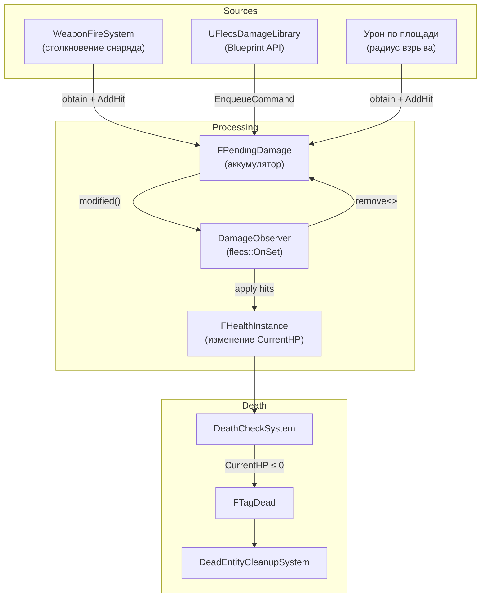

# Система урона

> Урон поступает из источников (столкновения снарядов, вызовы Blueprint API, эффекты по площади) через аккумулятор ожидающего урона к реактивному наблюдателю, который изменяет здоровье. Смерть проверяется отдельно, что гарантирует обработку всего урона за тик до смерти любой сущности.

---

## Поток



---

## Компоненты

### FDamageStatic (Prefab)

Устанавливается на источнике урона (снаряд, оружие):

| Поле | Тип | Описание |
|------|-----|----------|
| `Damage` | `float` | Базовый урон за попадание |
| `DamageType` | `FGameplayTag` | Классификация урона |
| `CriticalMultiplier` | `float` | Множитель критического урона |
| `CriticalChance` | `float` | Шанс крита `[0, 1]` |
| `bAreaDamage` | `bool` | Наносить урон по площади |
| `AreaRadius` | `float` | Радиус (см) при урон по площади |
| `AreaFalloff` | `float` | Экспонента затухания урона |
| `bDestroyOnHit` | `bool` | Уничтожить источник при контакте |
| `bCanHitSameTargetMultipleTimes` | `bool` | Разрешить множественные попадания |
| `MultiHitCooldown` | `float` | Кулдаун между множественными попаданиями |

### FHealthStatic (Prefab)

Устанавливается на цели урона:

| Поле | Тип | Описание |
|------|-----|----------|
| `MaxHealth` | `float` | Максимальное HP |
| `Armor` | `float` | Снижение урона `[0, 1]` |
| `RegenPerSecond` | `float` | Скорость регенерации HP |
| `RegenDelay` | `float` | Задержка перед началом регенерации после получения урона |
| `InvulnerabilityTime` | `float` | Неуязвимость после получения урона |
| `bDestroyOnDeath` | `bool` | Автоматическое уничтожение при смерти |

### FHealthInstance (Per-Entity)

| Поле | Тип | Описание |
|------|-----|----------|
| `CurrentHP` | `float` | Текущее здоровье |
| `RegenAccumulator` | `float` | Накопленная частичная регенерация |

### FPendingDamage (Транзиентный)

Накапливает попадания урона в течение тика. Удаляется после обработки.

```cpp
struct FPendingDamage
{
    TArray<FDamageHit> Hits;

    void AddHit(const FDamageHit& Hit) { Hits.Add(Hit); }
};

struct FDamageHit
{
    float Damage;
    FGameplayTag DamageType;
    bool bIgnoreArmor;
    bool bAreaDamage;
    float AreaRadius;
};
```

---

## DamageCollisionSystem

Обрабатывает коллизионные пары с тегом `FTagCollisionDamage`:

```cpp
// Для каждой коллизионной пары с FTagCollisionDamage
auto* DamageStatic = Projectile.get<FDamageStatic>();  // Из prefab
auto* EquippedBy = Projectile.try_get<FEquippedBy>();

// Предотвращение самоповреждения
if (EquippedBy && EquippedBy->OwnerEntityId == TargetEntityId)
    return;  // Пропуск — не наносим урон владельцу

// Накопление попадания
Target.obtain<FPendingDamage>().AddHit({
    .Damage = DamageStatic->Damage,
    .DamageType = DamageStatic->DamageType
});
Target.modified<FPendingDamage>();  // Запускает DamageObserver

// Уничтожение неотскакивающего снаряда
if (DamageStatic->bDestroyOnHit && !Projectile.has<FTagCollisionBounce>())
    Projectile.add<FTagDead>();
```

---

## DamageObserver

Единственный реактивный наблюдатель в проекте. Срабатывает немедленно при установке или изменении `FPendingDamage`:

```cpp
World.observer<FPendingDamage>("DamageObserver")
    .event(flecs::OnSet)
    .each([](flecs::entity E, FPendingDamage& Pending)
    {
        auto* Health = E.try_get_mut<FHealthInstance>();
        if (!Health) return;

        const auto* Static = E.get<FHealthStatic>();  // Из prefab

        for (const FDamageHit& Hit : Pending.Hits)
        {
            float Effective = Hit.bIgnoreArmor
                ? Hit.Damage
                : Hit.Damage * (1.f - Static->Armor);

            Health->CurrentHP -= Effective;
        }

        E.remove<FPendingDamage>();  // Очистка после обработки
    });
```

!!! note "Почему Observer?"
    Урон должен быть применён в том же тике, в котором он поступил, до запуска `DeathCheckSystem`. Запланированная система зависела бы от порядка выполнения относительно систем столкновений. Observer с событием `OnSet` гарантирует немедленную обработку при каждом вызове `modified<FPendingDamage>()`.

---

## DeathCheckSystem

Выполняется после всех систем столкновений и урона:

```cpp
// Запрашивает все entity с FHealthInstance, но без FTagDead
World.system<FHealthInstance>("DeathCheckSystem")
    .without<FTagDead>()
    .each([](flecs::entity E, FHealthInstance& Health)
    {
        if (Health.CurrentHP <= 0.f)
            E.add<FTagDead>();
    });
```

---

## DeadEntityCleanupSystem

Обрабатывает все entity с тегом `FTagDead`:

1. **TombstoneBody** — Безопасное уничтожение физического тела:
   ```cpp
   Prim->ClearFlecsEntity();                              // Очистка обратной привязки
   BarrageDispatch->SetBodyObjectLayer(Key, DEBRIS);      // Мгновенное отключение коллизий
   BarrageDispatch->SuggestTombstone(Prim);               // Отложенное уничтожение (~19с)
   ```

2. **CleanupConstraints** — Разрыв и удаление всех Jolt constraints, привязанных к этому телу

3. **CleanupRenderAndVFX** — Удаление ISM-инстанса, запуск эффекта смерти Niagara в точке `FDeathContactPoint` (сохранённой в момент столкновения, а не текущей позиции тела)

4. **TryReleaseToPool** — Если `FTagDebrisFragment`, возврат тела в `FDebrisPool` вместо tombstoning

5. **entity.destruct()** — Удаление из мира Flecs

---

## Blueprint API

Все Blueprint-функции используют `EnqueueCommand` для потокобезопасности:

```cpp
// Нанести урон (безопасно из game thread)
UFlecsDamageLibrary::ApplyDamageByBarrageKey(World, TargetKey, 25.f);

// Нанести типизированный урон, опционально игнорируя броню
UFlecsDamageLibrary::ApplyDamageWithType(World, TargetKey, 50.f, DamageTag, bIgnoreArmor);

// Исцеление
UFlecsDamageLibrary::HealEntityByBarrageKey(World, TargetKey, 30.f);

// Мгновенное убийство (обходит урон, напрямую добавляет FTagDead)
UFlecsDamageLibrary::KillEntityByBarrageKey(World, TargetKey);

// Запросы (читают из FSimStateCache — доступ к ECS не требуется)
float HP = UFlecsDamageLibrary::GetEntityHealth(World, TargetKey);
float MaxHP = UFlecsDamageLibrary::GetEntityMaxHealth(World, TargetKey);
bool Alive = UFlecsDamageLibrary::IsEntityAlive(World, TargetKey);
```

---

## Позиционирование VFX смерти

!!! warning "Физическое тело отскакивает"
    После `StepWorld()` физическое тело убитой сущности могло отскочить или сместиться от точки удара. Использование `GetPosition()` для VFX смерти даёт некорректные результаты.

    **Решение:** `FDeathContactPoint` сохраняется в момент столкновения в `OnBarrageContact()` — точная мировая позиция контакта Jolt. `DeadEntityCleanupSystem` читает её для размещения эффекта Niagara.
