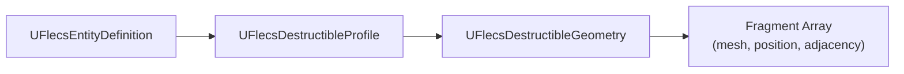
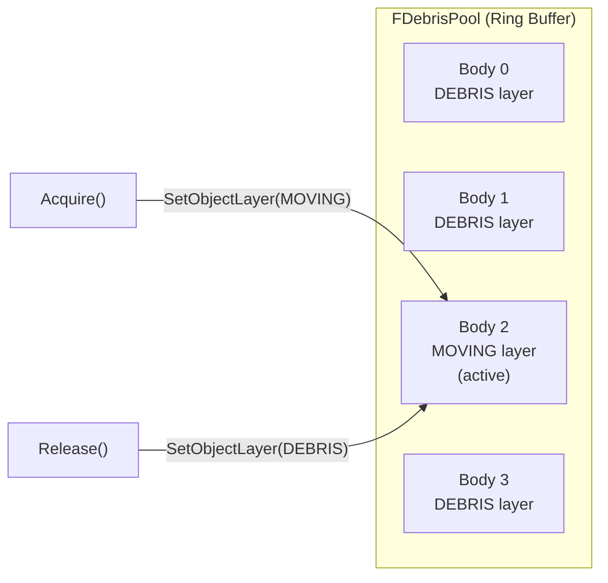
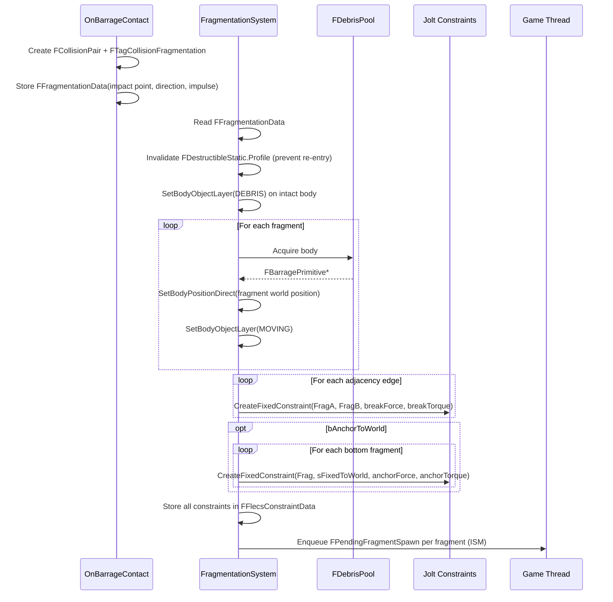
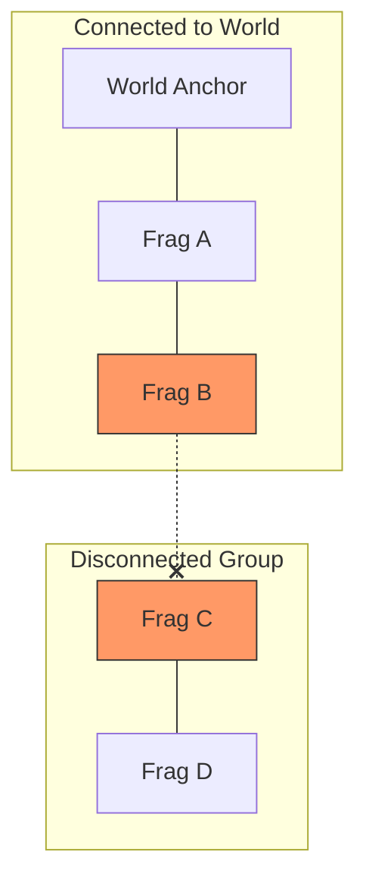

# Destructible System

> Destructible objects fragment into physics-simulated debris connected by breakable Jolt constraints. Pre-allocated body pools eliminate runtime allocation. Bottom fragments anchor to the world via constraints, and BFS detects when groups lose connection to their anchors.

---

## Three-Asset Chain

| Asset | Purpose |
|-------|---------|
| `UFlecsEntityDefinition` | Master entity definition — references the destructible profile |
| `UFlecsDestructibleProfile` | Physics parameters: constraint forces, masses, anchor settings |
| `UFlecsDestructibleGeometry` | Per-fragment data: meshes, local transforms, adjacency graph |

### UFlecsDestructibleProfile

| Field | Type | Description |
|-------|------|-------------|
| `Geometry` | `UFlecsDestructibleGeometry*` | Fragment geometry asset |
| `DefaultFragmentDefinition` | `UFlecsEntityDefinition*` | EntityDef for spawned fragments |
| `ConstraintBreakForce` | `float` | Force to break fragment-to-fragment constraint |
| `ConstraintBreakTorque` | `float` | Torque to break fragment-to-fragment constraint |
| `ConstrainedMassKg` | `float` | Fragment mass while constrained (heavy = resists hits) |
| `FragmentMassKg` | `float` | Fragment mass after freeing (`FreeMassKg`) |
| `ImpulseMultiplier` | `float` | Impact impulse scaling |
| `FragmentationForceThreshold` | `float` | Minimum impact force to trigger fragmentation |
| `bAnchorToWorld` | `bool` | Enable world anchor constraints |
| `AnchorBreakForce` | `float` | Force to break world anchor |
| `AnchorBreakTorque` | `float` | Torque to break world anchor |
| `bAutoDestroyDebris` | `bool` | Auto-despawn fragments after lifetime |
| `DebrisLifetime` | `float` | Seconds before auto-despawn |
| `PrewarmPoolSize` | `int32` | Bodies to pre-allocate in debris pool |

### UFlecsDestructibleGeometry

Contains an array of fragment definitions, each with:
- Mesh (`UStaticMesh*`)
- Local transform (position + rotation relative to intact object)
- Half-extents (for box collider)
- Adjacency list (indices of neighboring fragments)

!!! info "Adjacency Generation"
    Click **"Generate Adjacency From Proximity"** in the editor on the geometry asset. This auto-builds adjacency edges between fragments whose bounding boxes are within a proximity threshold.

---

## FDebrisPool

Pre-allocated body pool eliminates runtime Jolt body allocation:

- **Pre-allocation:** `OnWorldBeginPlay` creates `PrewarmPoolSize` dynamic box bodies in DEBRIS layer (dormant)
- **Acquire:** Returns a body, moves it to MOVING layer, positions it via `SetBodyPositionDirect()`
- **Release:** Returns body to pool, moves to DEBRIS layer (instant collision disable)
- **Uniform collider:** All pool bodies use the same box shape. Fragment-specific visual size is stored in `FDebrisInstance` and applied to ISM only.

---

## Fragmentation Sequence

### Key Details

**Immediate body layer change:** The intact body is moved to DEBRIS **immediately**, not via a deferred `FTagDead`. This prevents fragments from spawning inside the still-solid intact body (which causes explosion due to overlap resolution).

**Bottom-layer detection:** Fragments with Z position within ±1cm of the lowest fragment Z are considered "bottom layer" and receive world anchor constraints.

**World anchor:** `Body::sFixedToWorld` — when Barrage receives a null key (KeyIntoBarrage == 0) as the second body, it automatically uses the world anchor body.

**Constrained mass:** While connected to the structure, fragments use `ConstrainedMassKg` (high value — resists individual impacts). When freed: `FreeMassKg = FragmentMassKg` (lighter, physically realistic).

---

## Constraint Break Detection

`ConstraintBreakSystem` runs each tick:

### Pass 1: Poll Jolt

Iterates all `FFlecsConstraintData` components. For each constraint, queries Jolt for break state. Broken constraints are removed from the adjacency list.

### Pass 2: BFS Connectivity

When a constraint breaks, BFS from the affected fragment through remaining constraints to determine if a path to any world anchor still exists:

If a fragment group has **no path to any world anchor**, all fragments in that group are "freed":

1. Set mass to `FreeMassKg` (lighter)
2. Apply queued `PendingImpulse` (from the impact that broke the constraint)
3. Start `DebrisLifetimeSystem` countdown

### Pass 3: Door Constraints

Checks if any door constraint references a destructible that was fragmented. If the door's hinge constraint partner was destroyed, the door is freed.

---

## Fragment ISM Rendering

`FPendingFragmentSpawn` (sim → game MPSC queue):

| Field | Type | Purpose |
|-------|------|---------|
| `Mesh` | `UStaticMesh*` | Fragment mesh |
| `Material` | `UMaterialInterface*` | Fragment material |
| `Position` | `FVector` | World position |
| `Rotation` | `FQuat` | World rotation |
| `BarrageKey` | `FSkeletonKey` | For transform tracking |

Game thread `ProcessPendingFragmentSpawns()` calls `UFlecsRenderManager::AddInstance()` per fragment. Subsequent position updates use the same prev/curr/alpha interpolation as all entities.

---

## Components

| Component | Location | Purpose |
|-----------|----------|---------|
| `FDestructibleStatic` | Prefab | Profile reference, constraint parameters |
| `FDebrisInstance` | Per-fragment entity | LifetimeRemaining, PoolSlotIndex, FreeMassKg, PendingImpulse |
| `FFragmentationData` | Collision pair | ImpactPoint, ImpactDirection, ImpactImpulse |
| `FFlecsConstraintData` | Per-destructible entity | Array of constraint handles + adjacency graph |
| `FTagDestructible` | Tag | Marks entity as destructible |
| `FTagDebrisFragment` | Tag | Marks entity as a debris fragment (for pool return) |
| `FTagCollisionFragmentation` | Collision tag | Routes collision pair to FragmentationSystem |
