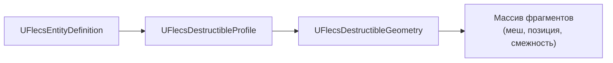
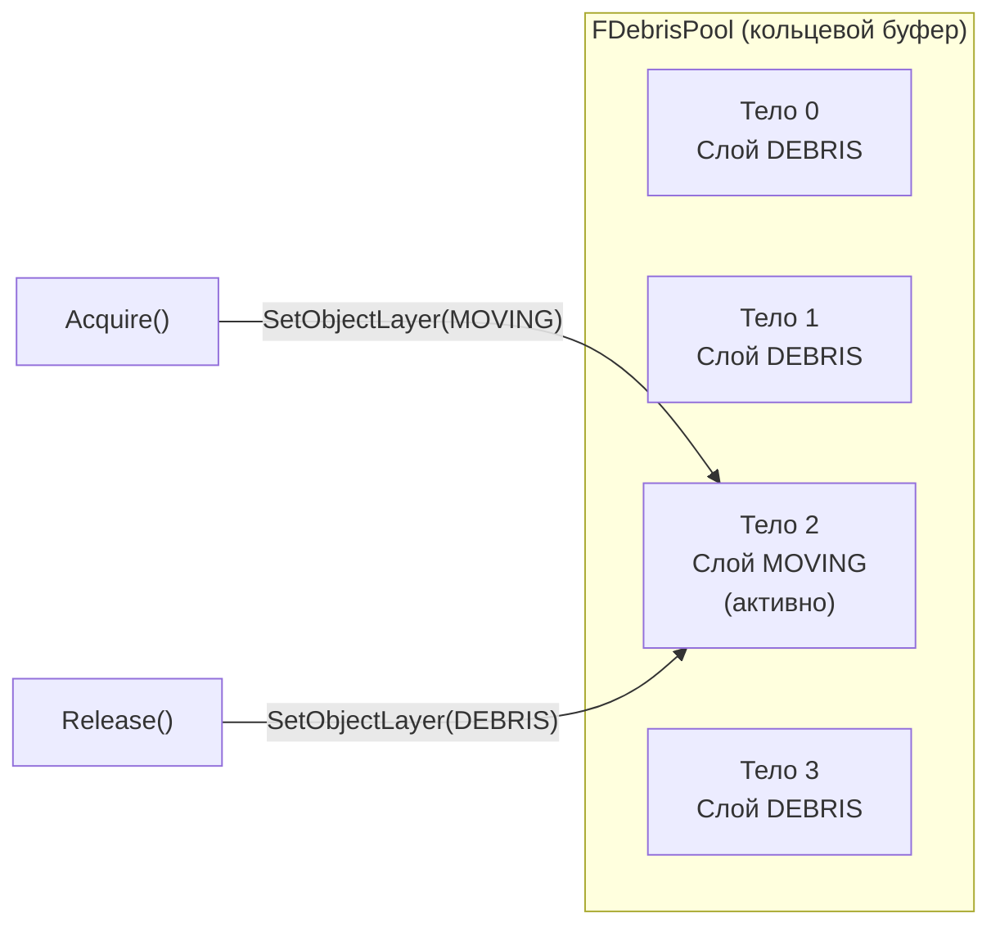
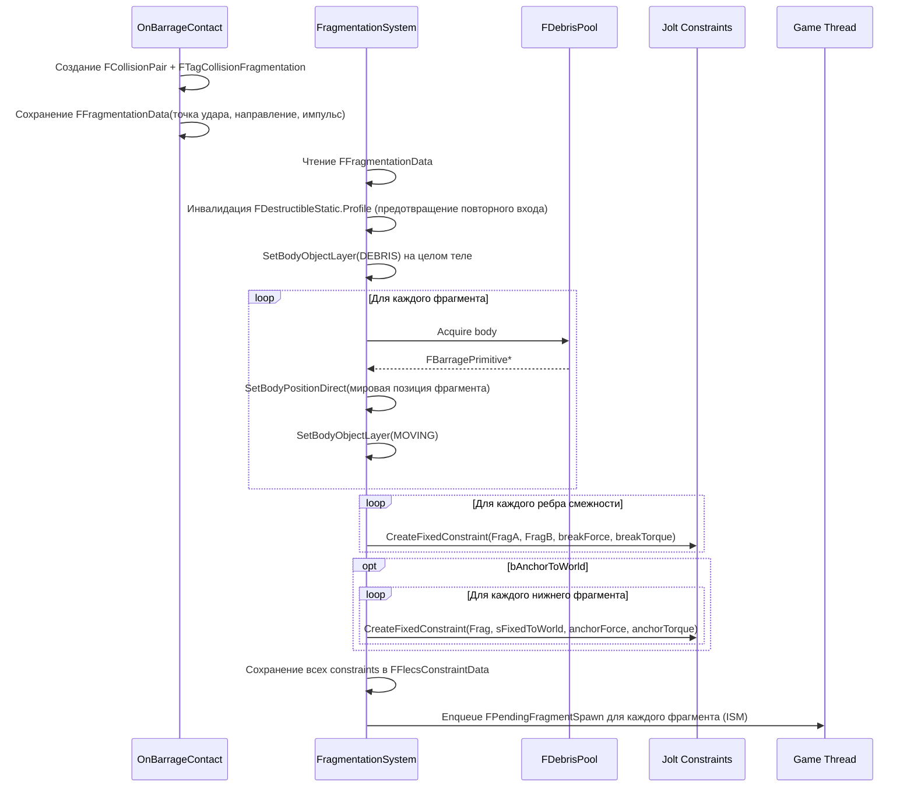
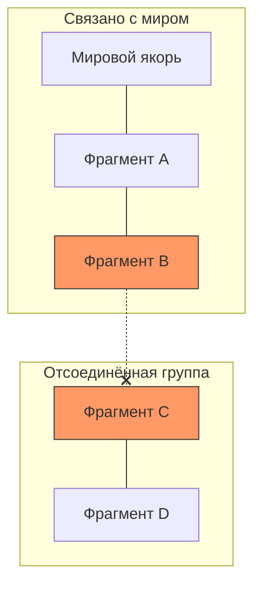

# Система разрушаемых объектов

> Разрушаемые объекты фрагментируются на физически симулируемые обломки, соединённые ломаемыми Jolt constraints. Предварительно выделенные пулы тел устраняют runtime-аллокации. Нижние фрагменты якорятся к миру через constraints, а BFS обнаруживает группы, потерявшие связь с якорями.

---

## Цепочка трёх ассетов

| Ассет | Назначение |
|-------|-----------|
| `UFlecsEntityDefinition` | Главное определение сущности — ссылается на профиль разрушения |
| `UFlecsDestructibleProfile` | Физические параметры: силы constraints, массы, настройки якоря |
| `UFlecsDestructibleGeometry` | Данные по фрагментам: меши, локальные трансформы, граф смежности |

### UFlecsDestructibleProfile

| Поле | Тип | Описание |
|------|-----|----------|
| `Geometry` | `UFlecsDestructibleGeometry*` | Ассет геометрии фрагментов |
| `DefaultFragmentDefinition` | `UFlecsEntityDefinition*` | EntityDef для порождённых фрагментов |
| `ConstraintBreakForce` | `float` | Сила для разрыва constraint между фрагментами |
| `ConstraintBreakTorque` | `float` | Крутящий момент для разрыва constraint между фрагментами |
| `ConstrainedMassKg` | `float` | Масса фрагмента в составе структуры (тяжёлая = сопротивляется ударам) |
| `FragmentMassKg` | `float` | Масса фрагмента после освобождения (`FreeMassKg`) |
| `ImpulseMultiplier` | `float` | Масштабирование импульса удара |
| `FragmentationForceThreshold` | `float` | Минимальная сила удара для запуска фрагментации |
| `bAnchorToWorld` | `bool` | Включить якорные constraints к миру |
| `AnchorBreakForce` | `float` | Сила для разрыва мирового якоря |
| `AnchorBreakTorque` | `float` | Крутящий момент для разрыва мирового якоря |
| `bAutoDestroyDebris` | `bool` | Автоудаление фрагментов по истечении времени жизни |
| `DebrisLifetime` | `float` | Секунды до автоудаления |
| `PrewarmPoolSize` | `int32` | Количество предварительно выделенных тел в пуле обломков |

### UFlecsDestructibleGeometry

Содержит массив определений фрагментов, каждое с:
- Меш (`UStaticMesh*`)
- Локальный трансформ (позиция + вращение относительно целого объекта)
- Полуразмеры (для бокс-коллайдера)
- Список смежности (индексы соседних фрагментов)

!!! info "Генерация смежности"
    Нажмите **"Generate Adjacency From Proximity"** в редакторе на ассете геометрии. Это автоматически строит рёбра смежности между фрагментами, чьи bounding boxes находятся в пределах порога близости.

---

## FDebrisPool

Предварительно выделенный пул тел устраняет runtime-аллокации тел Jolt:

- **Предварительное выделение:** `OnWorldBeginPlay` создаёт `PrewarmPoolSize` динамических бокс-тел на слое DEBRIS (спящие)
- **Acquire:** Возвращает тело, переводит на слой MOVING, позиционирует через `SetBodyPositionDirect()`
- **Release:** Возвращает тело в пул, переводит на слой DEBRIS (мгновенное отключение коллизий)
- **Единый коллайдер:** Все тела пула используют одну и ту же бокс-форму. Визуальный размер фрагмента хранится в `FDebrisInstance` и применяется только к ISM.

---

## Последовательность фрагментации

### Ключевые детали

**Немедленная смена слоя тела:** Целое тело переводится на DEBRIS **немедленно**, а не через отложенный `FTagDead`. Это предотвращает появление фрагментов внутри ещё твёрдого целого тела (что вызывает взрыв из-за разрешения перекрытий).

**Определение нижнего слоя:** Фрагменты с Z-позицией в пределах +-1 см от минимального Z фрагмента считаются "нижним слоем" и получают якорные constraints к миру.

**Мировой якорь:** `Body::sFixedToWorld` — когда Barrage получает нулевой ключ (KeyIntoBarrage == 0) в качестве второго тела, автоматически используется тело мирового якоря.

**Масса в составе структуры:** Пока фрагменты соединены со структурой, они используют `ConstrainedMassKg` (высокое значение — сопротивляются отдельным ударам). После освобождения: `FreeMassKg = FragmentMassKg` (легче, физически реалистичнее).

---

## Обнаружение разрыва Constraints

`ConstraintBreakSystem` выполняется каждый тик:

### Проход 1: Опрос Jolt

Итерация по всем компонентам `FFlecsConstraintData`. Для каждого constraint запрашивается состояние разрыва у Jolt. Разорванные constraints удаляются из списка смежности.

### Проход 2: BFS-связность

При разрыве constraint выполняется BFS от затронутого фрагмента по оставшимся constraints для определения наличия пути к любому мировому якорю:

Если группа фрагментов **не имеет пути ни к одному мировому якорю**, все фрагменты в этой группе "освобождаются":

1. Установка массы в `FreeMassKg` (легче)
2. Применение отложенного `PendingImpulse` (от удара, разорвавшего constraint)
3. Запуск обратного отсчёта `DebrisLifetimeSystem`

### Проход 3: Constraints дверей

Проверяет, ссылается ли какой-либо constraint двери на разрушенный разрушаемый объект. Если партнёр шарнирного constraint двери был уничтожен, дверь освобождается.

---

## ISM-рендеринг фрагментов

`FPendingFragmentSpawn` (sim → game MPSC-очередь):

| Поле | Тип | Назначение |
|------|-----|-----------|
| `Mesh` | `UStaticMesh*` | Меш фрагмента |
| `Material` | `UMaterialInterface*` | Материал фрагмента |
| `Position` | `FVector` | Мировая позиция |
| `Rotation` | `FQuat` | Мировое вращение |
| `BarrageKey` | `FSkeletonKey` | Для отслеживания трансформа |

Game thread `ProcessPendingFragmentSpawns()` вызывает `UFlecsRenderManager::AddInstance()` для каждого фрагмента. Последующие обновления позиции используют ту же интерполяцию prev/curr/alpha, что и все entity.

---

## Компоненты

| Компонент | Расположение | Назначение |
|-----------|-------------|-----------|
| `FDestructibleStatic` | Prefab | Ссылка на профиль, параметры constraints |
| `FDebrisInstance` | Per-fragment entity | LifetimeRemaining, PoolSlotIndex, FreeMassKg, PendingImpulse |
| `FFragmentationData` | Collision pair | ImpactPoint, ImpactDirection, ImpactImpulse |
| `FPendingFragmentation` | Временный (per-entity) | ImpactPoint, ImpactDirection, ImpactImpulse (устанавливается ApplyExplosion) |
| `FFlecsConstraintData` | Per-destructible entity | Массив хэндлов constraints + граф смежности |
| `FTagDestructible` | Tag | Отмечает entity как разрушаемую |
| `FTagDebrisFragment` | Tag | Отмечает entity как фрагмент обломков (для возврата в пул) |
| `FTagCollisionFragmentation` | Collision tag | Направляет collision pair в FragmentationSystem |
